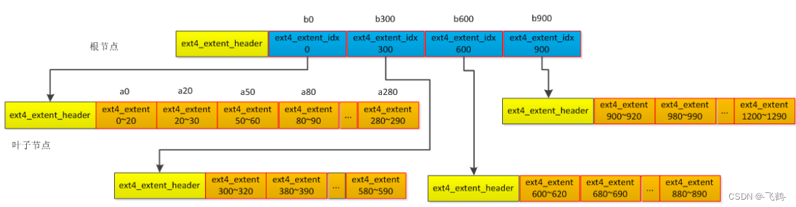

## 1 磁盘布局

### 2 sparse_super

#### 2.1 sparse_super特性
效果为：超级块和GDT备份只出现在3，5，7的幂
按照226组块，如果开启该特性，超级块和GDT只会出现在：组块0(主超级块)，1，3，5，7，9，21，27，49，81，125组块中，除主超级块其余皆为备份

### 3 Block Group
Block Group Descriptor


### 4 数据块位图和inode位图
数据块位图跟踪块组中数据块使用情况。Inode位图跟踪块组中Inode使用情况。每个位图一个数据块，每一位用0或1表示一个块组中数据块或inode表中inode的使用情况

Blockbitmap包含了超级块等使用情况，即使用了就是1，(1288+108+7=1111)
下图为定位到的BB的块然后dump出来，查看一下。

与上图对照，是一致的，free block从1111开始 即使用的是0-1110

### 5 Inode表
Inode表中存储的就是inode的信息。Inode的大小是在超级块中的s_inode_size字段决定。


**<font color="yellow">inode编号从1开始，对于inode为17的文件，偏移位置为(17-1) * s_inode_size</font>**


i_extra_isize：超出128部分的长度，包括该字段 现阶段该值一般都为32 也就是说ext4的inode实际使用的长度为128+32=160，总大小256
如果开启inline_data特性，未使用的部分会填充数据
```c
struct ext4_inode {
    /* File mode */
	#define EXT4_S_IXOTH 0x1  //(Others may execute)
	#define EXT4_S_IWOTH 0x2  //(Others may write)
	#define EXT4_S_IROTH 0x4  // Others may read)
	
	#define EXT4_S_IXGRP 0x8   //(Group members may execute)
	#define EXT4_S_IWGRP 0x10  //(Group members may write)
	#define EXT4_S_IRGRP 0x20  //(Group members may read)
	
	#define EXT4_S_IXUSR 0x40   //(Owner may execute)
	#define EXT4_S_IWUSR 0x80   //(Owner may write)
	#define EXT4_S_IRUSR 0x100  //(Owner may read)
	
	#define EXT4_S_ISVTX 0x200  //(Sticky bit)
	#define EXT4_S_ISGID 0x400  //(Set GID)
	#define EXT4_S_ISUID 0x800  //(Set UID)
	
	/* These are mutually-exclusive file types: */
	#define EXT4_S_IFIFO 0x1000   //(FIFO)
	#define EXT4_S_IFCHR 0x2000   //(Character device)
	#define EXT4_S_IFDIR 0x4000   //(Directory)
	#define EXT4_S_IFBLK 0x6000   //(Block device)
	#define EXT4_S_IFREG 0x8000   //(Regular file)
	#define EXT4_S_IFLNK 0xA000   //(Symbolic link)
	#define EXT4_S_IFSOCK 0xC000  //(Socket)
    __le16 i_mode;        /* File mode 文件的类型和权限*/
    
    __le16 i_uid;         /* Low 16 bits of Owner Uid */
    __le32 i_size_lo;     /* Size in bytes 该inode对应的文件的大小*/
    __le32 i_atime;       /* Access time */
    __le32 i_ctime;       /* Inode Change time */
    __le32 i_mtime;       /* Modification time */
    __le32 i_dtime;       /* Deletion Time */
    __le16 i_gid;         /* Low 16 bits of Group Id */
    __le16 i_links_count; /* Links count 硬连接数 */
    __le32 i_blocks_lo;   /* Blocks count */

    /* 看上面宏定义规定的flag状态 */
    __le32 i_flags; /* File flags */
    union {
        struct {
            __le32 l_i_version;
        } linux1;
        struct {
            __u32 h_i_translator;
        } hurd1;
        struct {
            __u32 m_i_reserved1;
        } masix1;
    } osd1;                        /* OS dependent 1 */
    __le32 i_block[EXT4_N_BLOCKS]; /* Pointers to blocks 后面祥讲*/
    __le32 i_generation;           /* File version (for NFS) */
    __le32 i_file_acl_lo;          /* File ACL */
    __le32 i_size_high;
    __le32 i_obso_faddr; /* Obsoleted fragment address */
    union {
        struct {
            __le16 l_i_blocks_high; /* were l_i_reserved1 */
            __le16 l_i_file_acl_high;
            __le16 l_i_uid_high;    /* these 2 fields */
            __le16 l_i_gid_high;    /* were reserved2[0] */
            __le16 l_i_checksum_lo; /* crc32c(uuid+inum+inode) LE */
            __le16 l_i_reserved;
        } linux2;
        struct {
            __le16 h_i_reserved1; /* Obsoleted fragment number/size which are removed in ext4 */
            __u16 h_i_mode_high;
            __u16 h_i_uid_high;
            __u16 h_i_gid_high;
            __u32 h_i_author;
        } hurd2;
        struct {
            __le16 h_i_reserved1; /* Obsoleted fragment number/size which are removed in ext4 */
            __le16 m_i_file_acl_high;
            __u32 m_i_reserved2[2];
        } masix2;
    } osd2; /* OS dependent 2 */
    __le16 i_extra_isize;
    __le16 i_checksum_hi;  /* crc32c(uuid+inum+inode) BE */
    __le32 i_ctime_extra;  /* extra Change time      (nsec << 2 | epoch) */
    __le32 i_mtime_extra;  /* extra Modification time(nsec << 2 | epoch) */
    __le32 i_atime_extra;  /* extra Access time      (nsec << 2 | epoch) */
    __le32 i_crtime;       /* File Creation time */
    __le32 i_crtime_extra; /* extra FileCreationtime (nsec << 2 | epoch) */
    __le32 i_version_hi;   /* high 32 bits for 64-bit version */
    __le32 i_projid;       /* Project ID */
};

```
第1-11个inode有特殊用途
```text
    Inode号    用途
    0      不存在0号inode
    1      损坏数据块链表
    2      根目录
    3      User quota. 用户quota索引
    4      Group quota. 组quota索引
    5      Boot loader
    6      Undelete directory. 未删除的目录
    7      预留的块组描述符inode. (用于调整inode数目)
    8      日志inode
    9      The "exclude" inode, for snapshots(?)
    10     Replica inode, used for some non-upstream feature?
    11     第一个非预留的inode，通常是lost+found目录

```

#### 5.1 数据索引
Inode中有个 数组__le32 i_block[15]，该数组中，前12个是直接索引，后面三个分别是一级索引、二级索引和三级索引。这种方式不仅实现起来较为复杂，而且在面对大文件的时候效率较为低下，且会浪费很多的间接块以存储映射关系

extent特性为ext4新增特性, 开启该特性后：在inode节点中的60byte存放1个Header和4个Entry
Inode Table结构体上存放着4个ext4_extent，每个ext4_extent结构体对应1个BG(1个Block的Bit总共有4096 * 8)的32768个Block，32768 * 4KB=128MB。4个ext4_extent对应4个BG，总共512MB。除去元文件信息，剩余的数据信息480MB左右。
```c
struct ext4_extent_header {
    __le16 eh_magic;      /* probably will support different formats */
    __le16 eh_entries;    /* number of valid entries */
    __le16 eh_max;        /* capacity of store in entries */
    __le16 eh_depth;      /* has tree real underlying blocks? */
    __le32 eh_generation; /* generation of the tree */
};
struct ext4_extent {
    __le32 ee_block;    /* first logical block extent covers */
    __le16 ee_len;      /* number of blocks covered by extent */
    __le16 ee_start_hi; /* high 16 bits of physical block */
    __le32 ee_start_lo; /* low 32 bits of physical block */
};
struct ext4_extent_idx {
    __le32 ei_block;   /* index covers logical blocks from 'block' */
    __le32 ei_leaf_lo; /* pointer to the physical block of the next *
                        * level. leaf or next index could be there */
    __le16 ei_leaf_hi; /* high 16 bits of physical block */
    __u16 ei_unused;
};

/*注意， eh_depth表示下边还有几层extent，也可理解为当前所造的层级，见ext4_ext_split函数对eh_depth的操作*/
```

超过480MB的文件则会启用树形结构，Inode Table上则存放ext4_extent_idx，其指向Data Block。Data Block上记录ext4_extent信息，一个块占用4KB，除去12byte的Header其他全都用来存储ext4_extent，共可以存储：（4096 - 12）/ 12 = 340 个ext4_exten，算下来可以存储 340 * 128M = 42.5G,4个Data Block则是170GB。添加一级索引就可以描述170GB文件，一般情况都够用。


#### 5.2根目录解析
从inode table中读取2号inode的block信息

读取Inode Table

根据ext4_extent获取ee_start_hi=0x2426，此Block对应根目录的内容。
```c
struct ext4_extent {
    __le32 ee_block;    /* first logical block extent covers */
    __le16 ee_len;      /* number of blocks covered by extent */
    __le16 ee_start_hi; /* high 16 bits of physical block */
    __le32 ee_start_lo; /* low 32 bits of physical block */
};
```
获取根目录信息

```c
struct ext4_dir_entry_2 {
    __le32 inode;   /* Inode number */
    __le16 rec_len; /* Directory entry length */
    __u8 name_len;  /* Name length */
    __u8 file_type;
    char name[EXT4_NAME_LEN]; /* File name */
};
```
`EXT4_NAME_LEN`大小为255，但在磁盘存储时候不会预留255字节，而是通过rec_len成员决定ext4_dir_entry_2结构体大小

#### 5.3 哈希目录加速
上面我们提出了一个问题，那就是对于大目录，如何提升查询性能。在Ext4文件系统中实现了一个名为目录索引的特性，通过索引可以极大的提升性能
在Ext4文件系统中这个索引是通过一个成为哈希树（多叉树）的方式实现的，其中Key为文件名的哈希值，而Value则是具体的数据位置（磁盘块位置）。由于Key是有序的，因此查找非常方便，也就是可以通过文件名快速的找到ext4_dir_entry_2，然后可以找到inode信息。
如图9是关于哈希树的一个简单示意图，例如其中hash1和hash2之间的值的文件名都存储在hash1所指向的块中，而hash2和hash3之间的内容则存储在hash2存储的块中，以此类推。当然，这里给出的是一个一层的哈希树，实际上可以是二层。

xt2的惯例，树的根总是在目录文件的第一个数据块中。“.”和“..”目录项必须出现在第一个数据块的开头。因而这两个目录项在数据块的开头存放两个struct ext4_dir_entry_2结构，且它们不存到树中。根结点的其他部分包含树的元数据，最后一个hash->block map查找到htree中更低的节点。如果dx_root.info.indirect_levels不为0，那么htree有两层；htree根结点的map指向的数据块是一个内部节点，由一个minor hash索引。Htree中的内部节点的minor_hash->block map之后包含一个零化的(zeroed out) structext4_dir_entry_2找到叶子节点。叶子节点包括一个线性的struct ext4_dir_entry_2数组；所有这些项都哈希到相同的值。如果发生溢出，目录项简单地溢出到下一个叶子节点，哈希的least-significant位（内部节点的map）做相应设置。

以htree的方式遍历目录，计算要查找的目录文件名称的哈希值，然后使用哈希值找到对应的数据块号。如果树是flat，该数据块是目录项的线性数组，因而可被搜索到；否则，计算文件名称的minor hash，并使用minor hash查找相应的第三个数据块号。第三个数据块是目录项线性数组。


可以通过debugfs工具查看目录的哈希树信息，如图10为本文构造的目录的哈希树树根内容。其中Entry #0就是一个哈希项的内容，其中包括哈希值（Key）和指向的逻辑地址（Value）


我们结合Ext4文件系统的数据结构可以将哈希树调整为图11所示。从这个图上可以看出inode节点并没有任何变化，而是其中i_block指针发生了变化。这里从原来的Extent B树变成了现在的哈希树。


```C
//Htree的根
struct dx_root
{
	__le32 inode; 		//struct fake_dirent dot;
	__le16 rec_len;		//struct fake_dirent dot;
	u8 name_len;		//struct fake_dirent dot;
	u8 file_type;		//struct fake_dirent dot;
	char dot_name[4];
	__le32 inode;		//struct fake_dirent dotdot;
	__le16 rec_len;		//struct fake_dirent dotdot;
	u8 name_len;		//struct fake_dirent dotdot;
	u8 file_type;		//struct fake_dirent dotdot;
	char dotdot_name[4];
	struct dx_root_info
	{
		__le32 reserved_zero;
		u8 hash_version;
		u8 info_length; /* 8 */
		u8 indirect_levels;
		u8 unused_flags;
	}
	info;
	struct dx_entry	entries[0];
};
//Htree的内部节点： struct dx_node
struct dx_node
{
	__le32 inode; 		//struct fake_dirent fake;
	__le16 rec_len;		//struct fake_dirent fake;
	u8 name_len;		//struct fake_dirent fake;
	u8 file_type;		//struct fake_dirent fake;
	struct dx_entry	entries[0];
};
//Htree 树根和节点中都存在的 Hashmap： struct dx_entry
struct dx_entry
{
	__le32 hash;
	__le32 block;
};

```

通过文件夹inode找到struct dx_root所在的block

读出block 2646的数据

可以看到hash值和block

注意，struct dx_root所在的block为2646，hash值0x08198174所在的block为24，物理block为2646+24=2670

