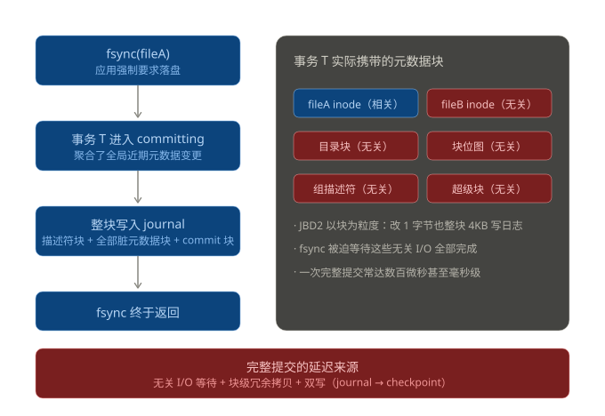
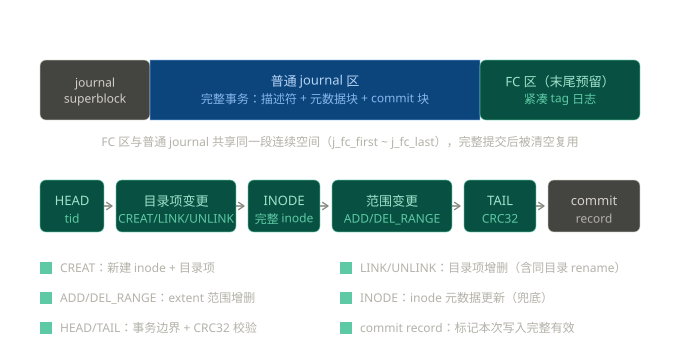
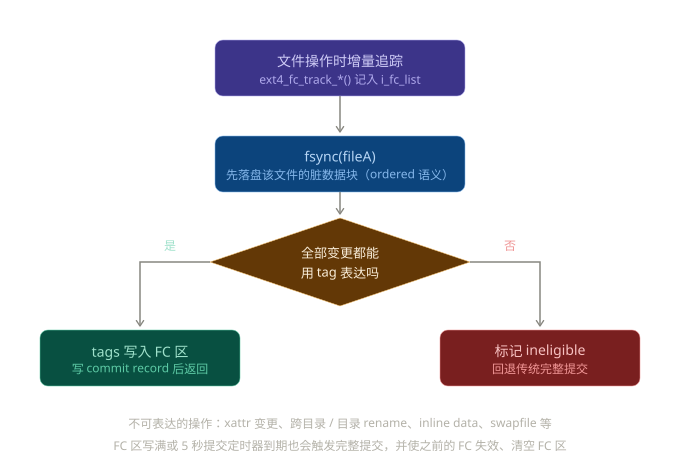
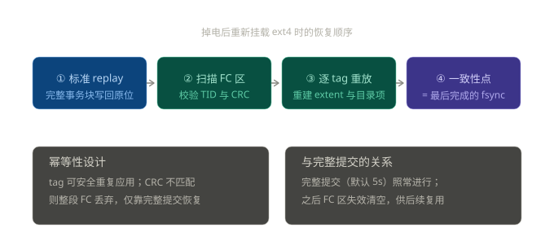
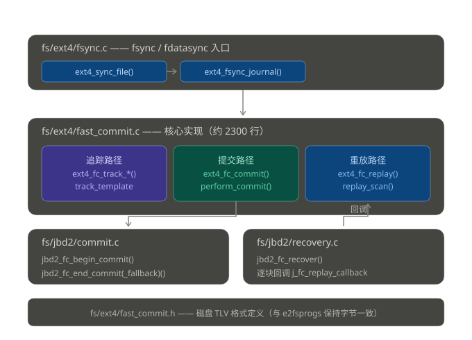
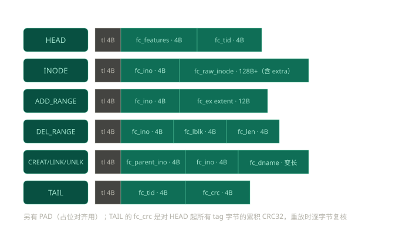
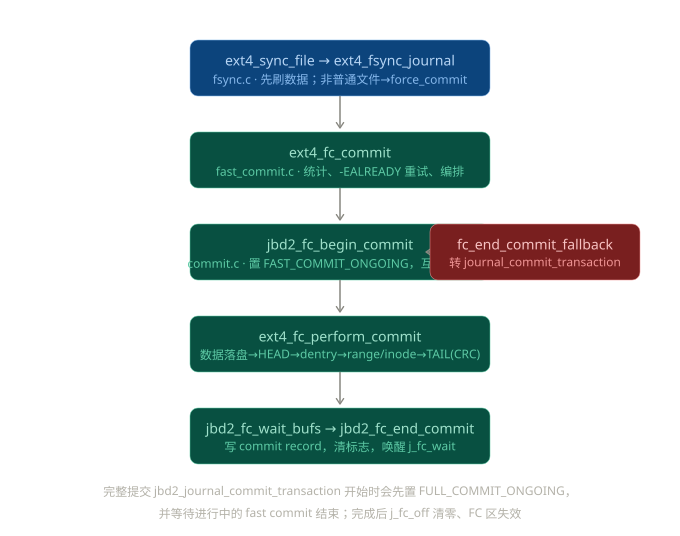
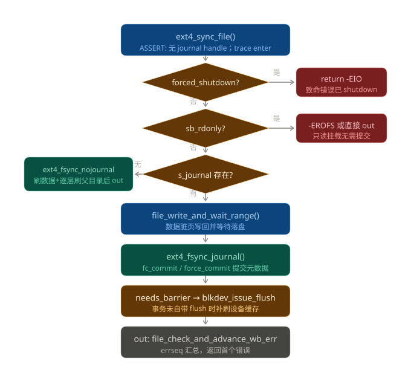
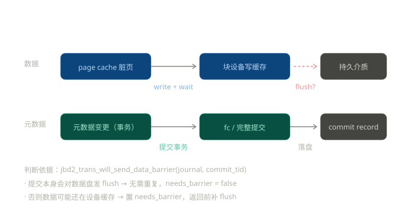
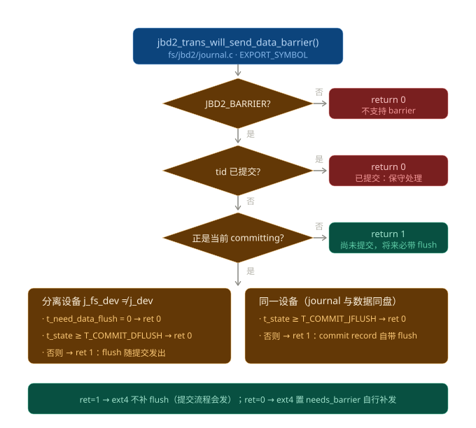

# ext4 Fast Commit 与 fsync 路径深度解析

> 基于 Linux v6.6 LTS 内核源码（全部代码片段经原文核实）　·　整理日期：2026 年 7 月 25 日

**目录**

- [第一部分　ext4 Fast Commit 的原理与过程](#第一部分ext4-fast-commit-的原理与过程)
- [第二部分　ext4 Fast Commit 源代码解析](#第二部分ext4-fast-commit-源代码解析)
- [第三部分　ext4_sync_file 函数完整解析](#第三部分ext4_sync_file-函数完整解析)
- [第四部分　jbd2_trans_will_send_data_barrier 解析](#第四部分jbd2_trans_will_send_data_barrier-解析)

---

## 第一部分　ext4 Fast Commit 的原理与过程

### 1.1 背景：fsync 为什么慢

ext4 默认的 `data=ordered` 模式下，一次 `fsync()` 会触发 JBD2 对当前事务做**完整提交**。JBD2 的两个特点决定了它的代价：

- **事务粒度粗**：一个事务聚合了全系统这段时间内所有进程的元数据变更。你对 fileA 调用 fsync，却要把整个事务（包括 fileB、fileC 等完全无关的脏元数据）全部刷进 journal 才能返回；
- **块粒度日志**：JBD2 按块记录——哪怕一个 4KB 的元数据块只改了 1 字节，也整块拷贝进 journal；之后 checkpoint 还要再写一遍到最终位置（双写）。

fsync 因此引发大量**无关 I/O**，这正是 fast commit 要消除的东西。



*图 1　传统完整提交的流程与延迟来源*

### 1.2 核心思想：从“物理块日志”到“逻辑增量日志”

Fast commit（内核 5.10 引入，作者 Harshad Shirwadkar / Google，思路源自 USENIX'17 的 iJournaling 论文）的关键洞察是：**很多被写进 journal 的元数据块，其实是可以推导出来的**。比如给一个 inode 新增了一个 extent，那么 inode 表、块位图、组描述符、超级块里对应的改动，全部可以由“这个 inode + 这段 extent 范围”重算出来——根本没有必要把它们整块拷进日志。

所以 fast commit 不拷块，只记**文件级的最小变更描述（tag）**。这些 tag 写在 journal 末尾预留的一小段 **FC 区**里（与普通 journal 共享同一块连续磁盘空间）。一次 fast commit 写入的字节序列大致是：`HEAD(tid) → 若干 tag → TAIL(CRC32) → commit record`，体量通常是**几百字节级**，而不是完整提交的若干 4KB 块。



*图 2　JBD2 journal 布局与一次 fast commit 的 tag 字节序列*

### 1.3 提交过程：fsync 时内核做了什么

**① 操作时的增量追踪**：ext4 在执行文件操作时，通过 `ext4_fc_track_*()` 系列函数把逻辑变更实时记录到内存中——目录项变更进入文件系统的 dentry 追踪队列，extent 变更挂到 inode 的 `i_fc_list` 上。这一步几乎零成本，只改内存。

**② fsync 时的提交**（`ext4_sync_file → jbd2_fc_commit → ext4_fc_commit`）：先把该 inode 被追踪范围内的**脏数据块**提交并等待落盘——保持 data=ordered 语义；然后把内存里追踪到的变更序列化成 tag 流，一次小 I/O 写入 FC 区；最后 JBD2 写一个 commit record，标记这次 fast commit 完整有效，fsync 返回。整个过程**只携带这一个文件相关的变更**，不等事务里其他人的 I/O，这是延迟下降的根本原因。

**③ 回退**：不是所有操作都能用 tag 表达。xattr 变更、跨目录 rename、目录 rename、inline data、swapfile、resize、内存不足等情况会把文件系统标记为 ineligible，退回传统完整提交。FC 区写满、或 JBD2 每 5 秒的提交定时器到期，也会触发完整提交——**一次完整提交会使之前所有 fast commit 失效并清空 FC 区**，然后 fast commit 又可以继续使用。两条路径是协作而非替代关系。



*图 3　fast commit 的提交流程与回退分支*

### 1.4 崩溃恢复：两段式重放

掉电重启后先做**标准 JBD2 replay**（把最后一个完整提交之前的事务块写回原位），再做 **FC 重放**：扫描 FC 区，找到 HEAD、校验事务 ID 和 TAIL 的 CRC32，然后**逐 tag 幂等重放**——ADD_RANGE 重建 extent、CREAT 重建 inode 和目录项、UNLINK 移除目录项……重放过程中，位图、组描述符等派生结构被现场重新计算，这正是提交时可以不记它们的原因。tag 设计成幂等的：同一个 tag 重复应用多少次结果都一样；如果 CRC 校验失败，整段 FC 记录直接丢弃，文件系统回退到上一个完整提交的状态，依然一致。

值得注意的**语义变化**：完整提交时代，fsync(fileA) 会“顺带”把同一事务里其他文件的元数据也持久化；而 fast commit **只保证被 fsync 的文件本身**（以及维持它一致所需的目录项）的持久性。这完全符合 POSIX 的 fsync 语义，只是不再提供那种“意外的附带持久化”。



*图 4　崩溃恢复的两段式重放*

### 1.5 总结对比与实际使用

| 维度 | 传统完整提交 | Fast Commit |
|---|---|---|
| 记录粒度 | 块级（4KB 整块拷贝） | 文件级逻辑增量（tag，几十字节/条） |
| 提交范围 | 整个事务（含无关文件） | 仅本次 fsync 相关的变更 |
| 单次写入量 | 多个元数据块 + commit 块 | 通常百字节级 tag 流 + commit record |
| 触发时机 | fsync / 5s 定时器 / 日志满 | fsync（可表达时） |
| 持久化保证 | 整个事务原子持久 | 仅保证被 fsync 的文件（符合 POSIX） |
| 恢复方式 | 块级重放 | 完整提交重放 + tag 幂等重放 |

```bash
# 格式化时开启（较新发行版默认已开启）
mkfs.ext4 -O fast_commit /dev/sdXn
# 或对已有文件系统开启
tune2fs -O fast_commit /dev/sdXn
# 确认特性已启用
tune2fs -l /dev/sdXn | grep "Filesystem features"
# 查看 fast commit 与回退统计（ineligible 原因计数）
cat /proc/fs/jbd2/sdXn-8/fc_info
```

**效果与适用场景**：补丁作者在 ordered 模式基准测试中报告写性能提升最高约 103%，fsync 密集型负载受益最大——典型如 NFS 服务器、数据库 commit、消息队列等。它优化的是“提交延迟”，不是普通读写带宽。一句话概括原理：**把“为整个事务抄写全部脏元数据块”变成“只为这一个文件记下可重放的逻辑变更”**，用恢复时的重算换取提交时的极短路径。

---

## 第二部分　ext4 Fast Commit 源代码解析

本部分代码均取自 **Linux v6.6 LTS** 原文。主体实现在 `fs/ext4/fast_commit.c`（约 2300 行），JBD2 侧配合在 `fs/jbd2/commit.c` 与 `recovery.c`。



*图 5　fast commit 源码地图*

### 2.1 磁盘格式：TLV 编码（fast_commit.h）

FC 区里存的不是块，而是一条 **TLV（Tag-Length-Value）序列**。每个条目以 4 字节的 `ext4_fc_tl` 开头，后面跟着该 tag 专属的 value 结构（全部小端）。该头文件与 `e2fsprogs/lib/ext2fs/fast_commit.h` 保持字节一致，使 e2fsck 能离线重放 FC 区。

```c
/* fast_commit.h —— 磁盘格式的总头 */
struct ext4_fc_tl {
	__le16 fc_tag;		/* EXT4_FC_TAG_* */
	__le16 fc_len;		/* 后面 value 的字节数 */
};

struct ext4_fc_head  { __le32 fc_features; __le32 fc_tid; };      /* HEAD: 事务起点 */
struct ext4_fc_tail  { __le32 fc_tid;      __le32 fc_crc; };      /* TAIL: 校验终点 */
struct ext4_fc_inode { __le32 fc_ino; __u8 fc_raw_inode[]; };     /* INODE: 裸 inode */
struct ext4_fc_add_range { __le32 fc_ino; __u8 fc_ex[12]; };      /* 12B = ext4_extent */
struct ext4_fc_del_range { __le32 fc_ino; __le32 fc_lblk; __le32 fc_len; };
struct ext4_fc_dentry_info { __le32 fc_parent_ino; __le32 fc_ino; __u8 fc_dname[]; };
```



*图 6　各 tag 的磁盘字节布局*

### 2.2 提交路径源码走读

`ext4_fc_commit()` 是主编排函数，骨架清楚地展示三条出路——**跳过、回退、执行**：

```c
int ext4_fc_commit(journal_t *journal, tid_t commit_tid)
{
	if (!test_opt2(sb, JOURNAL_FAST_COMMIT))
		return jbd2_complete_transaction(journal, commit_tid); /* 未开启→完整提交 */
restart_fc:
	ret = jbd2_fc_begin_commit(journal, commit_tid);
	if (ret == -EALREADY) {
		/* 该 tid 已被其他 fsync 提交过：必要时等待重试，否则直接跳过 */
		if (atomic_read(&sbi->s_fc_subtid) <= subtid &&
			commit_tid > journal->j_commit_sequence)
			goto restart_fc;
		ext4_fc_update_stats(sb, EXT4_FC_STATUS_SKIPPED, ...);
		return 0;
	} else if (ret) {
		return jbd2_complete_transaction(journal, commit_tid);
	}
	if (ext4_test_mount_flag(sb, EXT4_MF_FC_INELIGIBLE))
		goto fallback;
	ret = ext4_fc_perform_commit(journal);     /* 真正的写 tag 流程 */
	if (ret < 0) goto fallback;
	ret = jbd2_fc_wait_bufs(journal, nblks);   /* 等 FC 区写盘完成 */
	atomic_inc(&sbi->s_fc_subtid);
	ret = jbd2_fc_end_commit(journal);         /* 写 commit record，释放屏障 */
	...
fallback:
	return jbd2_fc_end_commit_fallback(journal); /* 清理并转完整提交 */
}
```

核心工作在 `ext4_fc_perform_commit()`。顺序非常关键——**数据先于元数据**（保持 ordered 语义）、HEAD 只在每个 tid 的第一个 fast commit 写一次、CREAT 之前先写 INODE（让恢复侧能先建匿名 inode 再挂目录项）：

```c
static int ext4_fc_perform_commit(journal_t *journal)
{
	u32 crc = 0;

	ret = ext4_fc_submit_inode_data_all(journal);  /* 提交 FC_Q_MAIN 队列中所有 inode 的脏数据 */
	ret = ext4_fc_wait_inode_data_all(journal);    /* 等待数据 I/O 完成 */
	if (journal->j_fs_dev != journal->j_dev)
		blkdev_issue_flush(journal->j_fs_dev);   /* 日志在独立设备时先 flush 数据盘 */

	if (sbi->s_fc_bytes == 0) {                    /* 本 tid 的第一个 fast commit */
		head.fc_tid = cpu_to_le32(...->t_tid);
		ext4_fc_add_tlv(sb, EXT4_FC_TAG_HEAD, sizeof(head), (u8 *)&head, &crc);
	}

	ret = ext4_fc_commit_dentry_updates(journal, &crc);  /* 先写目录项 tag */
	list_for_each_entry(iter, &sbi->s_fc_q[FC_Q_MAIN], i_fc_list) {
		/* 再逐 inode：先范围变更，后裸 inode */
		ret = ext4_fc_write_inode_data(inode, &crc);   /* ADD_RANGE/DEL_RANGE */
		ret = ext4_fc_write_inode(inode, &crc);        /* INODE（裸拷贝） */
	}
	ret = ext4_fc_write_tail(sb, crc);             /* TAIL: tid + 累积 CRC32 */
}
```

最值得细看的是 `ext4_fc_write_inode_data()`：**追踪阶段只记逻辑块区间，提交时才用 `ext4_map_blocks()` 现场反查实际映射**——洞（已释放）写 DEL_RANGE，有映射的按真实物理块组装 12 字节 `ext4_extent` 写 ADD_RANGE。这正是“只记最小增量、其余现场推导”思想的代码体现：

```c
	while (cur_lblk_off <= new_blk_size) {
		map.m_lblk = cur_lblk_off;
		ret = ext4_map_blocks(NULL, inode, &map, 0);   /* 现场反查映射 */
		if (ret == 0) {
			/* 逻辑块无映射 → DEL_RANGE */
			ext4_fc_add_tlv(inode->i_sb, EXT4_FC_TAG_DEL_RANGE, ...);
		} else {
			/* 有映射 → 组装 ext4_extent，写 ADD_RANGE */
			ex->ee_block = cpu_to_le32(map.m_lblk);
			ex->ee_len   = cpu_to_le16(map.m_len);
			ext4_ext_store_pblock(ex, map.m_pblk);
			if (map.m_flags & EXT4_MAP_UNWRITTEN)
				ext4_ext_mark_unwritten(ex);   /* 保留未初始化标记 */
			ext4_fc_add_tlv(inode->i_sb, EXT4_FC_TAG_ADD_RANGE, ...);
		}
	}
```



*图 7　fast commit 提交调用链*

### 2.3 追踪机制：ext4_fc_track_template 与队列设计

所有 `ext4_fc_track_*()` 都汇聚到 `ext4_fc_track_template()`，它有三个关键设计：

```c
static int ext4_fc_track_template(handle_t *handle, struct inode *inode,
		int (*__fc_track_fn)(struct inode *, void *, bool),
		void *args, int enqueue)
{
	tid = handle->h_transaction->t_tid;
	mutex_lock(&ei->i_fc_lock);
	if (tid == ei->i_sync_tid) {
		update = true;			/* 同一事务内再次变更：合并更新 */
	} else {
		ext4_fc_reset_inode(inode);	/* 新事务：重置追踪状态 */
		ei->i_sync_tid = tid;
	}
	ret = __fc_track_fn(inode, args, update);
	mutex_unlock(&ei->i_fc_lock);

	if (enqueue) {
		spin_lock(&sbi->s_fc_lock);
		if (list_empty(&ei->i_fc_list))
			list_add_tail(&ei->i_fc_list,
				(j_flags & (JBD2_FULL_COMMIT_ONGOING |
					    JBD2_FAST_COMMIT_ONGOING)) ?
				&sbi->s_fc_q[FC_Q_STAGING] :	/* 有提交在进行→暂存队列 */
				&sbi->s_fc_q[FC_Q_MAIN]);	/* 否则进主队列 */
		spin_unlock(&sbi->s_fc_lock);
	}
}
```

- **update 语义**：`__track_range()` 据此把多次写入合并成一个连续逻辑区间（min(start) / max(end)），只存 `i_fc_lblk_start/len` 两个字段，内存开销恒定；
- **双队列（MAIN/STAGING）**：提交进行中到达的新追踪挂到 STAGING，避免把“属于下一个事务”的变更混进正在写的 FC 区；目录项队列 `s_fc_dentry_q[]` 同理；
- **并发互斥**：提交侧先给 inode 置 `EXT4_STATE_FC_COMMITTING` 并等待 `i_fc_updates` 归零才开始刷数据；VFS 回调在改 inode 前后调用 `ext4_fc_start_update/stop_update` 增减该计数。inode 被驱逐时 `ext4_fc_del()` 把它摘出队列，并清掉还没 fsync 的 CREAT 记录；
- **ineligible 记账**：`ext4_fc_mark_ineligible()` 置挂载标志、记录 tid，并按原因累加 `s_fc_stats.fc_ineligible_reason_count[]`——就是 `/proc/fs/jbd2/<dev>/fc_info` 里的分类计数。

### 2.4 恢复路径：两阶段重放

挂载时 `jbd2_fc_recover()` 先跑标准 journal 重放，再从 `j_fc_first` 逐块读 FC 区，每块回调 `ext4_fc_replay()`，分 **PASS_SCAN** 和 **PASS_REPLAY** 两个阶段。SCAN 阶段只做校验、不做修改：逐 tag 检查长度合法性、累积 CRC，遇到 TAIL 时核对 tid 与 CRC：

```c
case EXT4_FC_TAG_TAIL:
	state->fc_crc = ext4_chksum(sbi, state->fc_crc, cur,
			EXT4_FC_TAG_BASE_LEN + offsetof(struct ext4_fc_tail, fc_crc));
	if (le32_to_cpu(tail.fc_tid) == expected_tid &&
	    le32_to_cpu(tail.fc_crc) == state->fc_crc) {
		state->fc_replay_num_tags = state->fc_cur_tag;  /* 这批 tag 可信 */
		state->fc_regions_valid = state->fc_regions_used;
	} else {
		ret = state->fc_replay_num_tags ? JBD2_FC_REPLAY_STOP : -EFSBADCRC;
	}
```

同时它把 ADD_RANGE 的物理区间记进 `fc_regions`——重放期间块分配器会通过 `ext4_fc_replay_check_excluded()` 避开这些“已被 FC 声明占用”的块。先完整校验、再动手重放的两阶段设计，保证了“重放到一半再掉电”也能安全重来。REPLAY 阶段是一个干净的 dispatch 表：

```c
switch (tl.fc_tag) {
case EXT4_FC_TAG_LINK:      ret = ext4_fc_replay_link(sb, &tl, val);      break;
case EXT4_FC_TAG_UNLINK:    ret = ext4_fc_replay_unlink(sb, &tl, val);    break;
case EXT4_FC_TAG_ADD_RANGE: ret = ext4_fc_replay_add_range(sb, &tl, val); break;
case EXT4_FC_TAG_CREAT:     ret = ext4_fc_replay_create(sb, &tl, val);    break;
case EXT4_FC_TAG_DEL_RANGE: ret = ext4_fc_replay_del_range(sb, &tl, val); break;
case EXT4_FC_TAG_INODE:     ret = ext4_fc_replay_inode(sb, &tl, val);     break;
case EXT4_FC_TAG_PAD: case EXT4_FC_TAG_TAIL: case EXT4_FC_TAG_HEAD:       break;
}
```

几个 handler 里的幂等处理很典型：link 容忍 `-EEXIST`、unlink 容忍 `-ENOENT`。`ext4_fc_replay_inode()` 拷贝裸 inode 时**跳过 i_block 字段**（extent 留给后续 ADD_RANGE 重建），并重置 extent header。`ext4_fc_replay_add_range()` 对每段逻辑块分三种情况：未映射 → 插入 extent；已映射但物理块变了 → 更新 extent 并把旧块临时标记为空闲；仅状态变化（unwritten→written）→ 原地切换。全部 tag 重放完后，`ext4_fc_set_bitmaps_and_counters()` 遍历所有被修改过的 inode，按最终 extent 树把实际在用的块重新标记为已分配——**位图这块“推导出来的元数据”，就是这样在恢复时被重算的**。

### 2.5 调试手段与阅读路线

- 统计：`struct ext4_fc_stats` 暴露在 `/proc/fs/jbd2/<dev>/fc_info`（提交数、回退数、10 种 ineligible 原因计数、平均提交时间）；
- tracepoint：`trace_ext4_fc_commit_start / fc_track_* / fc_replay*`，可用 perf / tracefs 逐 tag 观察；
- 阅读顺序建议：`fast_commit.h`（TLV 格式）→ `fsync.c` 入口 → track_template → ext4_fc_commit → perform_commit → replay_scan → replay handlers → set_bitmaps_and_counters → 最后回到 jbd2 的 commit.c / recovery.c 理解分工。

---

## 第三部分　ext4_sync_file 函数完整解析

`ext4_sync_file()` 注册在 `ext4_file_operations`（和目录的 `ext4_dir_operations`）的 `.fsync` 上，由 `fsync() / fdatasync() / msync(MS_SYNC)` 经 `vfs_fsync_range()` 调入。全文不到 60 行，按七个阶段拆解（v6.6 原文）：



*图 8　ext4_sync_file 控制流*

### 3.1 函数全文

```c
int ext4_sync_file(struct file *file, loff_t start, loff_t end, int datasync)
{
	int ret = 0, err;
	bool needs_barrier = false;
	struct inode *inode = file->f_mapping->host;

	if (unlikely(ext4_forced_shutdown(inode->i_sb)))
		return -EIO;

	ASSERT(ext4_journal_current_handle() == NULL);

	trace_ext4_sync_file_enter(file, datasync);

	if (sb_rdonly(inode->i_sb)) {
		/* Make sure that we read updated s_ext4_flags value */
		smp_rmb();
		if (ext4_forced_shutdown(inode->i_sb))
			ret = -EROFS;
		goto out;
	}

	if (!EXT4_SB(inode->i_sb)->s_journal) {
		ret = ext4_fsync_nojournal(file, start, end, datasync,
					   &needs_barrier);
		if (needs_barrier)
			goto issue_flush;
		goto out;
	}

	ret = file_write_and_wait_range(file, start, end);
	if (ret)
		goto out;

	/*
	 *  The caller's filemap_fdatawrite()/wait will sync the data.
	 *  Metadata is in the journal, we wait for proper transaction to
	 *  commit here.
	 */
	ret = ext4_fsync_journal(inode, datasync, &needs_barrier);

issue_flush:
	if (needs_barrier) {
		err = blkdev_issue_flush(inode->i_sb->s_bdev);
		if (!ret)
			ret = err;
	}
out:
	err = file_check_and_advance_wb_err(file);
	if (ret == 0)
		ret = err;
	trace_ext4_sync_file_exit(inode, ret);
	return ret;
}
```

### 3.2 七阶段逐段拆解

**① 致命错误快速失败**：ext4 遇到不可恢复的内部错误后置 `EXT4_FLAGS_SHUTDOWN`，此后所有 fsync 直接 `-EIO`，不再做任何 I/O——避免在已损坏的状态上继续写。

**② 句柄断言**：fsync 等待事务提交时可能睡眠；如果调用方自己还持有 journal handle，就会演变成“等自己提交”的死锁。VFS 保证调用 `.fsync` 时不持句柄，这里用断言兜底。

**③ 只读分支**：只读挂载下没有脏数据可刷，直接跳去错误汇总；但仍要复查 shutdown（返回 `-EROFS`）。`smp_rmb()` 保证跨 CPU 读到最新的标志位。

**④ 无 journal 分支**：`ext4_fsync_nojournal()` 刷数据和 buffer 元数据，然后 `ext4_sync_parent()` 沿 dentry **逐层向上刷父目录**（新建文件带 EXT4_STATE_NEWENTRY 标记；没有 journal 保护时，光刷文件本身没用——崩溃后找不到目录项等于文件丢失）：

```c
while (ext4_test_inode_state(inode, EXT4_STATE_NEWENTRY)) {
	ext4_clear_inode_state(inode, EXT4_STATE_NEWENTRY);
	next = dget_parent(dentry);
	...
	ret = sync_mapping_buffers(inode->i_mapping);	/* 刷父目录块 */
	ret = sync_inode_metadata(inode, 1);		/* 刷父目录 inode */
	inode = dentry->d_inode;
}
```

**⑤ 数据阶段**：`file_write_and_wait_range()` = `filemap_fdatawrite_range()` + `filemap_fdatawait_range()`，先把范围内脏页提交写回，再等待全部完成。注意这一步**只保证数据到了块设备层**（可能在磁盘控制器缓存里），最终耐久性由后面的 flush 兜底。

**⑥ 元数据提交阶段**：`ext4_fsync_journal()` 的三个决策：

- `commit_tid = datasync ? ei->i_datasync_tid : ei->i_sync_tid` —— **fdatasync 的优化就在这一行**：`i_datasync_tid` 只追踪“影响数据读取”的最后一个事务，纯元数据变更（atime、chmod）不更新它；
- `!S_ISREG → ext4_force_commit()` —— 目录和特殊文件不走 fast commit；
- barrier 判断（见 3.3）后调 `ext4_fc_commit()`——优先 fast commit，内部不可行时自动回退完整提交。

**⑦ flush 与错误汇总**：两个易忽略的细节——`ret / err` 双变量模式保证返回失败链上最早的那个原因；`file_check_and_advance_wb_err()` 是内核 errseq 机制：数据页异步写回的 I/O 错误记录在位图 errseq 计数上，这里“消费”掉并上报一次——所以 **write() 成功、fsync() 报 EIO 是正常且设计如此的行为**。

### 3.3 needs_barrier 的来龙去脉

数据耐久性有一条隐藏鸿沟：`file_write_and_wait_range()` 只把数据送到**块设备写缓存**，从缓存到介质还需要一次 flush。而元数据走的是 journal 提交，提交动作本身会不会顺带 flush 数据盘，取决于事务内容。若提交流程自己会向数据盘发 flush，ext4 不重复发；否则（典型：fast commit 只写了 FC 区那点 tag，数据盘没人 flush）置 `needs_barrier`，提交完成后统一 `blkdev_issue_flush()`，把设备缓存里的数据压到介质。



*图 9　数据与元数据双通道的 flush 衔接*

### 3.4 分支速查表

| 情形 | 路径 | 返回 |
|---|---|---|
| 文件系统已 shutdown | 直接失败 | -EIO |
| 只读挂载 | 跳过刷写，复查 shutdown | -EROFS 或 0 |
| 无 journal | 刷数据 + ext4_sync_parent 逐层刷父目录 | 0 / I/O 错误 |
| 有 journal，非普通文件 | ext4_force_commit 完整提交 | 0 / 错误 |
| 有 journal，普通文件 | 数据写回 → ext4_fc_commit（可回退完整提交） | 0 / 错误 |
| 任意路径存在设备缓存隐患 | 补 blkdev_issue_flush | 叠加首个错误 |

---

## 第四部分　jbd2_trans_will_send_data_barrier 解析

### 4.1 精确语义

该函数位于 `fs/jbd2/journal.c`（`EXPORT_SYMBOL`），是 ext4 判断“这次提交会不会顺带把数据盘 flush 了”的查询接口。官方注释写得很精确：

> Return 1 if a given transaction has not yet sent barrier request connected with a transaction commit. **If 0 is returned, transaction may or may not have sent the barrier.** Used to avoid sending barrier twice in common cases.
>
> 返回 1 表示“还没发、将要发”；返回 0 的真实含义是“不确定”，调用方必须按“可能没发”来兜底。整体设计哲学：**正确性靠“不确定就补发”，性能靠“确定会发就跳过”**。

### 4.2 函数全文与四道门

```c
int jbd2_trans_will_send_data_barrier(journal_t *journal, tid_t tid)
{
	int ret = 0;
	transaction_t *commit_trans;

	if (!(journal->j_flags & JBD2_BARRIER))
		return 0;					/* ① 不支持 barrier → 谈不上"将发送" */
	read_lock(&journal->j_state_lock);
	/* Transaction already committed? */
	if (tid_geq(journal->j_commit_sequence, tid))
		goto out;					/* ② 已提交 → 0：信息已销毁，保守处理 */
	commit_trans = journal->j_committing_transaction;
	if (!commit_trans || commit_trans->t_tid != tid) {
		ret = 1;					/* ③ 尚未开始提交 → 1：将来提交必带 flush */
		goto out;
	}
	if (journal->j_fs_dev != journal->j_dev) {
		if (!commit_trans->t_need_data_flush ||
		    commit_trans->t_state >= T_COMMIT_DFLUSH)
			goto out;				/* ④a 分离设备：不会发 / 已发 → 0 */
	} else {
		if (commit_trans->t_state >= T_COMMIT_JFLUSH)
			goto out;				/* ④b 同设备：journal flush 已发 → 0 */
	}
	ret = 1;						/* ⑤ 提交进行中且 flush 未发 → 1 */
out:
	read_unlock(&journal->j_state_lock);
	return ret;
}
EXPORT_SYMBOL(jbd2_trans_will_send_data_barrier);
```

- **① JBD2_BARRIER 未开 → 0**：存储栈根本不发 flush，命题不成立；
- **② tid_geq(j_commit_sequence, tid) → 0**：这个 tid 已提交完（tid_geq 处理 32 位回绕），事务结构已销毁——信息丢失即保守；
- **③ 正在提交的不是这个 tid → 1**：最反直觉也最关键的分支。tid 还没轮上提交，那它将来被提交时，提交流程必然完成设备 flush，ext4 搭便车即可。fast commit 场景也命中这里——fc 期间 j_committing_transaction 为 NULL，而 fc 提交自身保证 flush；
- **④ 提交进行中的精确时刻判断**：依赖 JBD2 提交状态机里两个专为此查询设置的状态位（见 4.3）；
- **⑤ 提交进行中且 flush 尚未发出 → 1**：即将到来的 flush 一定排在调用方数据之后，可以覆盖。



*图 10　jbd2_trans_will_send_data_barrier 四道门判定*

### 4.3 与提交状态机的呼应

④ 的两个阈值状态，就是 `fs/jbd2/commit.c` 完整提交中段打的两个“时间戳”（已核实原文）：

```c
	err = journal_finish_inode_data_buffers(journal, commit_transaction); /* 有序数据写完并等待 */
	...
	commit_transaction->t_state = T_COMMIT_DFLUSH;        /* ← 数据 flush 分界点 */

	/* 日志不在文件系统设备上时，写 commit record 前先 flush 数据盘 */
	if (commit_transaction->t_need_data_flush &&
	    (journal->j_fs_dev != journal->j_dev) &&
	    (journal->j_flags & JBD2_BARRIER))
		blkdev_issue_flush(journal->j_fs_dev);

	err = journal_submit_commit_record(...);              /* 写 commit record */
	...
	commit_transaction->t_state = T_COMMIT_JFLUSH;        /* ← journal flush 分界点 */
	...
	err = journal_wait_on_commit_record(journal, cbh);
	if (jbd2_has_feature_async_commit(journal) &&
	    journal->j_flags & JBD2_BARRIER)
		blkdev_issue_flush(journal->j_dev);           /* async commit 后再补 flush */
```

**分离设备**：`t_state >= T_COMMIT_DFLUSH` 意味着那次 fs 设备 flush 已经发出——它可能落在本次 fsync 的数据抵达设备缓存之前，靠不住 → 0；还没到这个状态 → 即将到来的 flush 一定排在数据之后 → 1。`!t_need_data_flush` 则说明这次提交永远不会 flush 数据盘 → 0。**同一设备**：起覆盖作用的是 commit record 写入携带的 flush（REQ_PREFLUSH 或 async commit 等待后的那次 flush），`T_COMMIT_JFLUSH` 是这条路径的分界点，同理判断。

### 4.4 t_need_data_flush 从哪来

在 `fs/jbd2/transaction.c` 挂接有序数据的路径上（已核实原文）：ext4 在 data=ordered 下把有脏数据的 inode（jinode）挂进事务的 `t_inode_list` 时顺手置位——“这个事务欠了数据盘一次 flush”。注释还展示了内核工程细节：只写不清、先判断再写，是为了减少跨核 cacheline 竞争。

```c
	/*
	 * We only ever set this variable to 1 so the test is safe. Since
	 * t_need_data_flush is likely to be set, we do the test to save some
	 * cacheline bouncing
	 */
	if (!transaction->t_need_data_flush)
		transaction->t_need_data_flush = 1;
	...
	jinode->i_transaction = transaction;
	list_add(&jinode->i_list, &transaction->t_inode_list);
```

### 4.5 与 ext4 的闭环

`ext4_fsync_journal` 里 `!jbd2_trans_will_send_data_barrier(...)` 为真才置 `needs_barrier`。返回值 0 的三种情形（不支持 / 已提交 / 已发或不会发）全部落入“ext4 自己补 blkdev_issue_flush”；返回 1 的两种情形（还没提交、或提交尚未过 flush 点）全部可以搭便车。NVMe 时代一次多余 flush 可能让整个存储栈停顿几十微秒，这个小函数就是“每个 fsync 少发一次 flush”的优化核心——**而它敢省略的底气，恰恰来自返回 0 时的无条件保守**。

---

*本文基于 Linux v6.6 LTS 源码整理（torvalds/linux 仓库原文核实）；fast commit 首版见于内核 5.10（Harshad Shirwadkar / Google），设计源自 USENIX ATC'17《iJournaling》论文（Daejun Park, Dongkun Shin）。5.10 → 6.6 的演进要点：ineligible 原因扩充至 10 种、引入 s_fc_subtid 并发计数、STAGING 队列与提交时间统计。*

*参考：LWN「Fast commits for ext4」(Articles/842385)、内核文档 Documentation/filesystems/ext4/journal.rst。*
