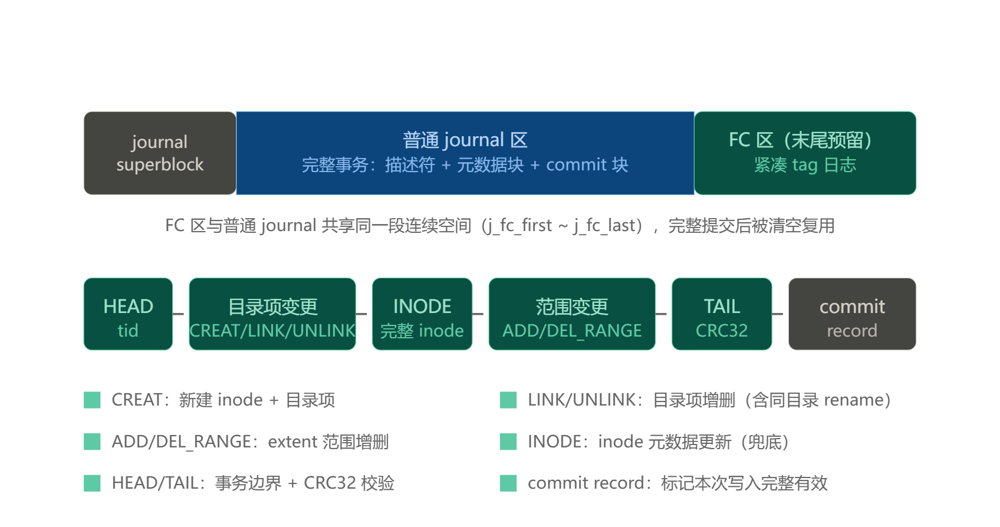
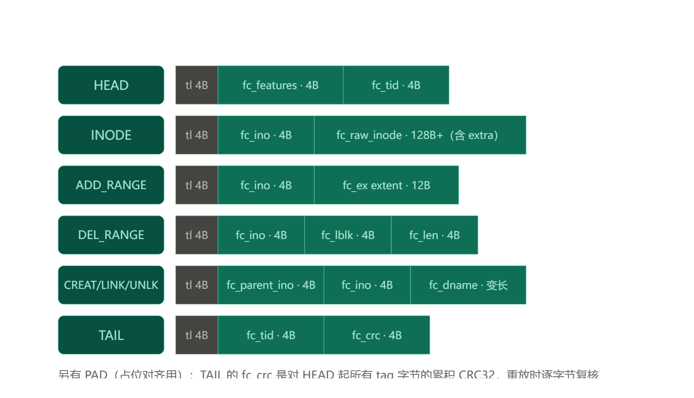

# 1 rename测试

## 1.1 测试脚本

```shell
dd if=/dev/zero of=/tmp/ext4.img bs=1M count=100000
mkfs.ext4 -O fast_commit /tmp/ext4.img
mount -o loop /tmp/ext4.img /mnt/ext4
cd /mnt/ext4

#然和建立个文件test1，用mv重命令为test2
touch test1
mv test1 test2

#sync这个文件
sync test2

#此时可以观察到有fast commit提交记录
cat /proc/fs/ext4/loop10/fc_info
```
## 1.2 原理分析

### 1.2.1 sync与sync test2

* sync是同步目录，sync test2是同步文件
* 执行sync 内核在`ext4_fsync_journal -> if (!S_ISREG(inode->i_mode))`判断成立，走`ext4_force_commit`,强行full commit

### 1.2.2 5秒kjournald2周期提交

* `jbd2_journal_commit_transaction()`函数开头
```c
journal->j_flags |= JBD2_FULL_COMMIT_ONGOING;                 // :409
while (journal->j_flags & JBD2_FAST_COMMIT_ONGOING) { ... }   // :等正在进行的 fc 结束
...
journal->j_fc_off = 0;                                        // :重置 fc 区域偏移

```
看出kjournald2周期提交强制走full commit

### 1.2.3 mv命令后，为什么观察到ext4_sync_file的调用

mv命令后，若不发送sync test2命令，会触发5秒kjournald2周期提交，强制走full commit，但是mv命令过后，观察到有`ext4_sync_file`的调用。抓取函数内核栈后发现是loop设备刷盘导致`ext4_sync_file`调用

```
->clone() by kworker/u512:0 PID = 171589 ret = 0
        vfs_fsync+61
        loop_process_work+723
        loop_rootcg_workfn+27
        process_one_work+431
        worker_thread+447
        kthread+251
        ret_from_fork+698
        ret_from_fork_asm+26

```

## 1.3镜像数据分析





通过`sudo debugfs -R 'stat <8>' /dev/loop10`命令回去inod 8的数据，
```sh
Inode: 8   Type: regular    Mode:  0600   Flags: 0x80000
Generation: 0    Version: 0x00000000:00000000
User:     0   Group:     0   Project:     0   Size: 17039360
File ACL: 0
Links: 1   Blockcount: 33280
Fragment:  Address: 0    Number: 0    Size: 0
 ctime: 0x6a73275d:00000000 -- Wed Aug  5 20:06:53 2026
 atime: 0x6a73275d:00000000 -- Wed Aug  5 20:06:53 2026
 mtime: 0x6a73275d:00000000 -- Wed Aug  5 20:06:53 2026
crtime: 0x6a73275d:00000000 -- Wed Aug  5 20:06:53 2026
Size of extra inode fields: 32
Inode checksum: 0x95122085
EXTENTS:
(0-4159):65536-69695  #逻辑块0-4159，对应物理块65536-69695
```
发命令`sudo bpftrace  -e 'k:jbd2_fc_begin_commit {printf("tid = %d\n", arg1); }'`追踪jbd2_fc_begin_commit的commit_tid

发送命令`sudo mv ext4_fc_test.log2 ext4_fc_test.log1；sync ext4_fc_test.log1`触发fast commit

看到bpftrace打印
`tid = 127`


fast commit 区不是独立区域，而是预留在整个 journal 的末尾一段
```test
j_fc_first (日志相对块号) = s_maxlen - s_num_fc_blks
FC 区物理起始            = 65536 + (s_maxlen - s_num_fc_blks)
FC 区物理结束(含)        = 65536 + s_maxlen - 1 = 69695
```
读取inode8的数据
```test
sudo dd if=/dev/loop10 bs=4096 count=1 skip=$((65536)) | hexdump -C
00000000  c0 3b 39 98 00 00 00 04  00 00 00 00 00 00 10 00  |.;9.............|
00000010  00 00 10 40 00 00 00 01  00 00 00 7c 00 00 00 00  |...@.......|....|
00000020  00 00 00 00 00 00 00 00  00 00 00 32 00 00 00 00  |...........2....|
00000030  c0 fc 14 cc 88 2f 4b 3f  82 5f ef 06 24 45 7a 95  |...../K?._..$Ez.|
00000040  00 00 00 01 00 00 00 00  00 00 00 00 00 00 00 00  |................|
00000050  04 00 00 00 00 00 00 40  00 00 01 db 00 00 00 00  |.......@........|
00000060  00 00 00 00 00 00 00 00  00 00 00 00 00 00 00 00  |................|
*
000000f0  00 00 00 00 00 00 00 00  00 00 00 00 56 28 25 d9  |............V(%.|
00000100  00 00 00 00 00 00 00 00  00 00 00 00 00 00 00 00  |................|
*
00001000

```
其中`s_maxlen（offset = 0x10）= 0x4010 = 4090，s_num_fc_blks（offset = 0x54）= 0x40 = 64`，因此fast commit的起始块号为69633。

读取该处数据

```test
sudo dd if=/dev/loop10 bs=4096 count=1 skip=$((69633)) | hexdump
00000000  09 00 08 00 00 00 00 00  7f 00 00 00 04 00 19 00  |................|
00000010  02 00 00 00 0d 00 00 00  65 78 74 34 5f 66 63 5f  |........ext4_fc_|
00000020  74 65 73 74 2e 6c 6f 67  31 05 00 19 00 02 00 00  |test.log1.......|
00000030  00 0d 00 00 00 65 78 74  34 5f 66 63 5f 74 65 73  |.....ext4_fc_tes|
00000040  74 2e 6c 6f 67 32 06 00  a4 00 0d 00 00 00 a4 81  |t.log2..........|
00000050  00 00 45 43 00 00 6a 29  73 6a d5 0d 84 6a 6a 29  |..EC..j)sj...jj)|
00000060  73 6a 00 00 00 00 00 00  01 00 28 00 00 00 00 00  |sj........(.....|
00000070  08 00 02 00 00 00 0a f3  01 00 04 00 00 00 00 00  |................|
00000080  00 00 00 00 00 00 05 00  00 00 00 84 00 00 00 00  |................|
00000090  00 00 00 00 00 00 00 00  00 00 00 00 00 00 00 00  |................|
*
000000b0  00 00 01 dc 98 85 00 00  00 00 00 00 00 00 00 00  |................|
000000c0  00 00 00 00 00 00 00 00  00 00 f7 cd 00 00 20 00  |.............. .|
000000d0  d9 29 b4 65 0c a3 f4 2e  a4 b7 70 16 98 b7 6a 29  |.).e......p...j)|
000000e0  73 6a 70 16 98 b7 00 00  00 00 00 00 00 00 08 00  |sjp.............|
000000f0  0e 0f 7f 00 00 00 88 cf  14 d3 00 00 00 00 00 00  |................|
00000100  00 00 00 00 00 00 00 00  00 00 00 00 00 00 00 00  |................|
*
00001000

```

① `0x00` HEAD (len 8)
```
09 00 | 08 00 | 00 00 00 00 | 7f 00 00 00
  tag    len     fc_features   fc_tid=127
```

这是一次新 fast commit 的起点，对应运行中的 jbd2 事务 `tid=127`。因为 HEAD 落在块首（0x00），说明上一次提交写到了上一块的末尾 TAIL，本块是全新提交的第一块。

② `0x0c` LINK (len 25) 
```
04 00 | 19 00 | 02 00 00 00 | 0d 00 00 00 | "ext4_fc_test.log1"
  tag    len      parent=2        ino=13        dname(17B)
```
在根目录（inode 2）添加目录项(函数`ext4_fc_add_dentry_tlv`) `"ext4_fc_test.log1"` → 指向 inode 13。

③ `0x29` UNLINK (len 25) 
```
05 00 | 19 00 | 02 00 00 00 | 0d 00 00 00 | "ext4_fc_test.log2"
  tag    len      parent=2        ino=13        dname(17B)
```
在根目录删除目录项(函数`ext4_fc_add_dentry_tlv`) `"ext4_fc_test.log2"`（同样指向 inode 13）。

④ `0x46` INODE (len 164)
```
06 00 | a4 00 | a4 81 00 00 | <160 字节 raw inode>
  tag    len      fc_ino=33204
```
捕获 `inode 33204` 的完整 raw inode（fc_ino 4 字节 + 160 字节 `ext4_inode`）。raw inode 前两字节 `a4 81` = `i_mode = 0x81a4` = `S_IFREG | 0644`（普通文件、权限 0644）。时间戳字段 `0x6a7329xx` 散落在` 0xd0~0xe8`，和 inode 8 dump 里的 `0x6a73275d`（2026-08-05 20:06:53）同属那一刻——说明这些操作就在那次测试里发生。同一事务里另一个文件被记录

⑤ `0xee` 之后：全零（PAD / 本块提交未完）。TAIL（带 `fc_crc``，ext4_fc_write_tail` 写成）在后续 FC 块；recovery 扫到 TAIL 才用 `fc_crc` 校验整段。本块没有出现 ADD_RANGE/DEL_RANGE，说明这一截只含 dentry + inode 元数据改动。
