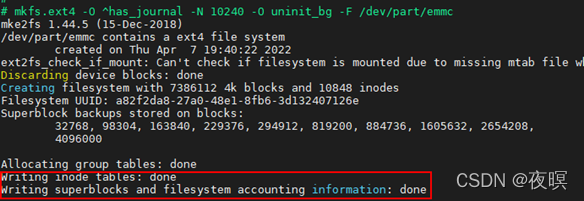
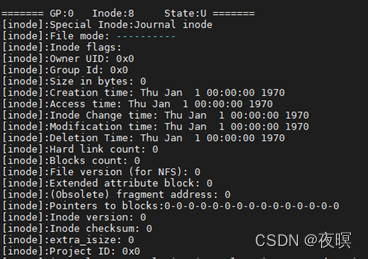
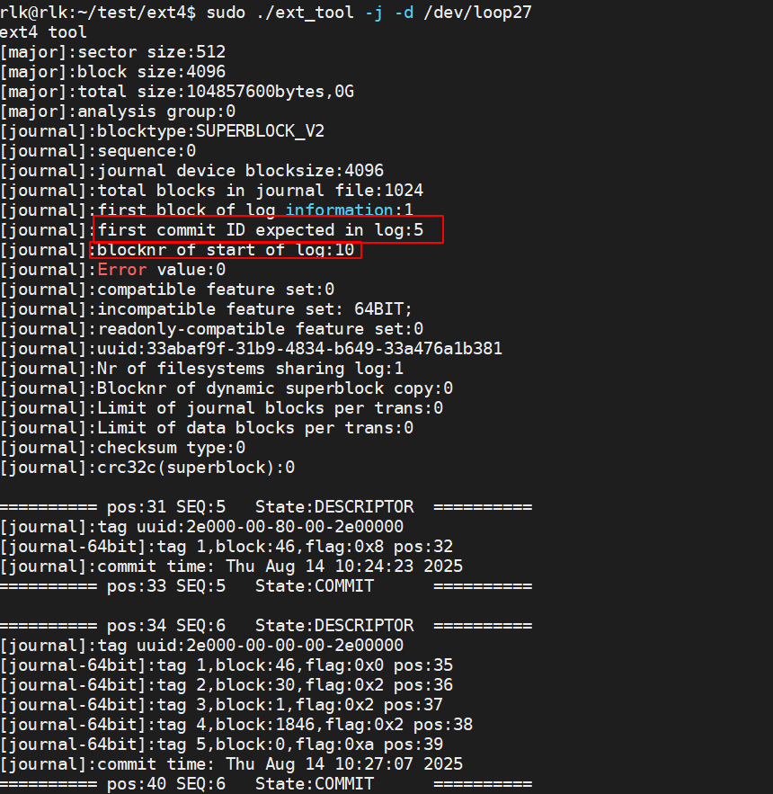
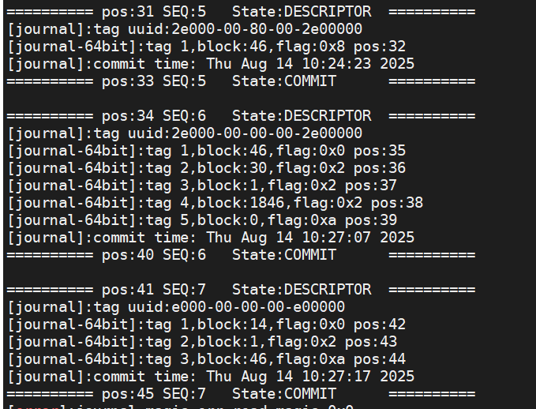

# JBD2日志的三种模式
如果格式化时 –O ^has_journal，则干脆不会创建日志，如下图，没有了创建日志的阶段

特殊节点8的值全部为0，挂载时显示没有日志


对比


日志三种模式
Journal
data=journal模式可靠性最高，提供了完全的数据块和元数据块的日志，所有的数据都会被先写入到日志里，然后再写入磁盘上。在文件系统崩溃的时候，可以通过日志重放，把数据和元数据恢复到一致性的状态。但同时，journal模式性能是三种模式中最差的，因为所有的数据都需要日志来记录。并且该模式不支持delayed allocation(延迟分配)以及O_DIRECT(直接IO)。

ordered（*）
data=ordered模式是ext4文件系统默认日志模式，在该模式下，文件系统只提供元数据的日志，但它逻辑上将与数据更改相关的元数据信息与数据块分组到一个称为事务的单元中。当需要把元数据写入到磁盘上的时候，与元数据关联的数据块会首先写入。也就是数据先落盘，再将元数据的日志刷到磁盘。 在机器crash时，未完成的写操作对应的元数据仍然保存在文件系统日志中，因此文件系统可以通过回滚日志将未完成的写操作清除。所以，在ordered模式下，crash可能会导致在crash时操作的文件损坏，但对于文件系统本身以及其他未操作的文件，是可以确保安全的。一般情况下，ordered模式的性能会略逊色于writeback但是比journal模式要快的多。

Writeback
data=writeback模式下，当元数据提交到日志后，data可以直接被提交到磁盘。即会做元数据日志，数据不做日志，并且不保证数据比元数据先落盘。metadata journal是串行操作，因此采用writeback模式就不会出现由于其他进程写journal，阻塞另一个进程的情况，因此IOPS也能得到提升。writeback是ext4提供的性能最好的模式。不过，尽管writeback模式也能保证文件系统自身的安全性，但是在系统crash时文件数据也更容易丢失和损坏。

# 日志磁盘布局
日志结构为超级块+事务+事务+…，可以将日志除了超级块之外的区域看出环形缓冲区，事务在这个区域循环利用


## 日志超级块
如果不使用journal_dev，且开启日志，日志会自动在某个区块中创建，根据特殊节点8能够找到对应超级块
如下图该日志大小：32768*4096=128M，即使用了一个块组

Commit id代表日志提交从第几个是开始有效的，Start blocknr代表日志从日志区的第几个块开始


## 日志事务结构


同时可以看出，日志有3个extent，分别从物理块20、31、和847开始
```c
//超级块
#define JBD2_DESCRIPTOR_BLOCK 1
#define JBD2_COMMIT_BLOCK 2
#define JBD2_SUPERBLOCK_V1 3
#define JBD2_SUPERBLOCK_V2 4
#define JBD2_REVOKE_BLOCK 5

#define JBD2_MAGIC_NUMBER 0xc03b3998U

typedef struct journal_header_s {
    __be32 h_magic;
    __be32 h_blocktype;
    __be32 h_sequence;
} journal_header_t;

/*
 * The journal superblock.  All fields are in big-endian byte order.
 */
typedef struct journal_superblock_s
{
/* 0x0000 */
	journal_header_t s_header;

/* 0x000C */
	/* Static information describing the journal */
	__be32	s_blocksize;		/* journal device blocksize */
	__be32	s_maxlen;		/* total blocks in journal file */
	__be32	s_first;		/* first block of log information */

/* 0x0018 */
	/* Dynamic information describing the current state of the log */
	__be32	s_sequence;		/* first commit ID expected in log */
	__be32	s_start;		/* blocknr of start of log */

/* 0x0020 */
	/* Error value, as set by jbd2_journal_abort(). */
	__be32	s_errno;

/* 0x0024 */
	/* Remaining fields are only valid in a version-2 superblock */
	__be32	s_feature_compat;	/* compatible feature set */
	__be32	s_feature_incompat;	/* incompatible feature set */
	__be32	s_feature_ro_compat;	/* readonly-compatible feature set */
/* 0x0030 */
	__u8	s_uuid[16];		/* 128-bit uuid for journal */

/* 0x0040 */
	__be32	s_nr_users;		/* Nr of filesystems sharing log */

	__be32	s_dynsuper;		/* Blocknr of dynamic superblock copy*/

/* 0x0048 */
	__be32	s_max_transaction;	/* Limit of journal blocks per trans.*/
	__be32	s_max_trans_data;	/* Limit of data blocks per trans. */

/* 0x0050 */
	__u8	s_checksum_type;	/* checksum type */
	__u8	s_padding2[3];
	__u32	s_padding[42];
	__be32	s_checksum;		/* crc32c(superblock) */

/* 0x0100 */
	__u8	s_users[16*48];		/* ids of all fs'es sharing the log */
/* 0x0400 */
} journal_superblock_t;

```

描述块

```c
typedef struct journal_block_tag_s
{
	__be32		t_blocknr;	/* The on-disk block number */
	__be16		t_checksum;	/* truncated crc32c(uuid+seq+block) */
	__be16		t_flags;	/* See below */
	__be32		t_blocknr_high; /* most-significant high 32bits. */
} journal_block_tag_t;


```

提交块
```c
struct commit_header {
	__be32		h_magic;
	__be32          h_blocktype;
	__be32          h_sequence;
	unsigned char   h_chksum_type;
	unsigned char   h_chksum_size;
	unsigned char 	h_padding[2];
	__be32 		h_chksum[JBD2_CHECKSUM_BYTES];
	__be64		h_commit_sec;
	__be32		h_commit_nsec;
};

```

# 数据块分析

首先从物理块20开始看


看到了超级块和第一个描述块，由于第一个描述块的h_sequence值是2，而first Commit id expected in log是5，所以这个描述块是无用的

记下来看物理块31

看到了h_sequence值为5的描述块，与first Commit id expected in log解析一致，所以后边的所有描述块都有效，继续解析有序描述块

又分别在物理块34、41中解析到了描述块

接下来分析数据块，从第31个block中的tag中解析到，physical block 32存放了 physical block 46的数据 physical block 33中存放了提交块

后边的描述块可以用同样的方法分析。

同时徐主要到，seq5、seq6和seq7都对physical block 46进行了更改，那么seq7会覆盖之前的操作，分别读取physical block 46和physical block 44（seq7中最后修改）接数据看下

看以快出是一致的
根据上述原理，分别读取physical block 35和physical block 32，我们可以查询到physical block 46的修改记录。

同时，更具tag中记录的物理块信息，我们可以推测出ext4罗盘的顺序
