# JBD2日志的三种模式
如果格式化时 –O ^has_journal，则干脆不会创建日志，如下图，没有了创建日志的阶段
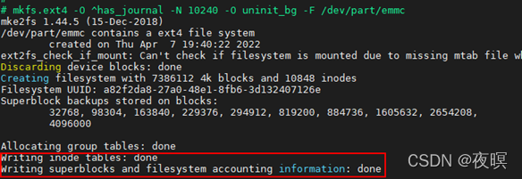
特殊节点8的值全部为0，挂载时显示没有日志
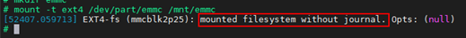
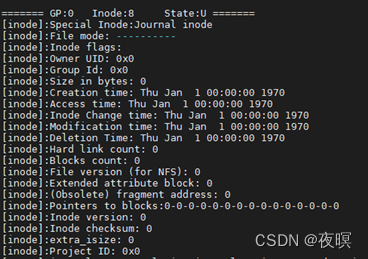
对比
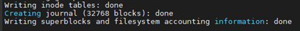

日志三种模式
Journal
data=journal模式可靠性最高，提供了完全的数据块和元数据块的日志，所有的数据都会被先写入到日志里，然后再写入磁盘上。在文件系统崩溃的时候，可以通过日志重放，把数据和元数据恢复到一致性的状态。但同时，journal模式性能是三种模式中最差的，因为所有的数据都需要日志来记录。并且该模式不支持delayed allocation(延迟分配)以及O_DIRECT(直接IO)。

ordered（*）
data=ordered模式是ext4文件系统默认日志模式，在该模式下，文件系统只提供元数据的日志，但它逻辑上将与数据更改相关的元数据信息与数据块分组到一个称为事务的单元中。当需要把元数据写入到磁盘上的时候，与元数据关联的数据块会首先写入。也就是数据先落盘，再将元数据的日志刷到磁盘。 在机器crash时，未完成的写操作对应的元数据仍然保存在文件系统日志中，因此文件系统可以通过回滚日志将未完成的写操作清除。所以，在ordered模式下，crash可能会导致在crash时操作的文件损坏，但对于文件系统本身以及其他未操作的文件，是可以确保安全的。一般情况下，ordered模式的性能会略逊色于writeback但是比journal模式要快的多。

Writeback
data=writeback模式下，当元数据提交到日志后，data可以直接被提交到磁盘。即会做元数据日志，数据不做日志，并且不保证数据比元数据先落盘。metadata journal是串行操作，因此采用writeback模式就不会出现由于其他进程写journal，阻塞另一个进程的情况，因此IOPS也能得到提升。writeback是ext4提供的性能最好的模式。不过，尽管writeback模式也能保证文件系统自身的安全性，但是在系统crash时文件数据也更容易丢失和损坏。

# 日志磁盘布局
日志结构为超级块+事务+事务+…，可以将日志除了超级块之外的区域看出环形缓冲区，事务在这个区域循环利用
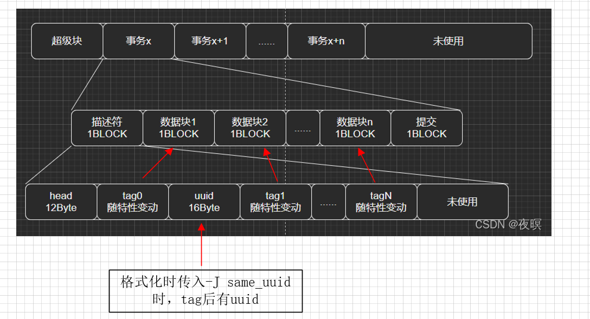

## 日志超级块
如果不使用journal_dev，且开启日志，日志会自动在某个区块中创建，根据特殊节点8能够找到对应超级块
如下图该日志大小：32768*4096=128M，即使用了一个块组
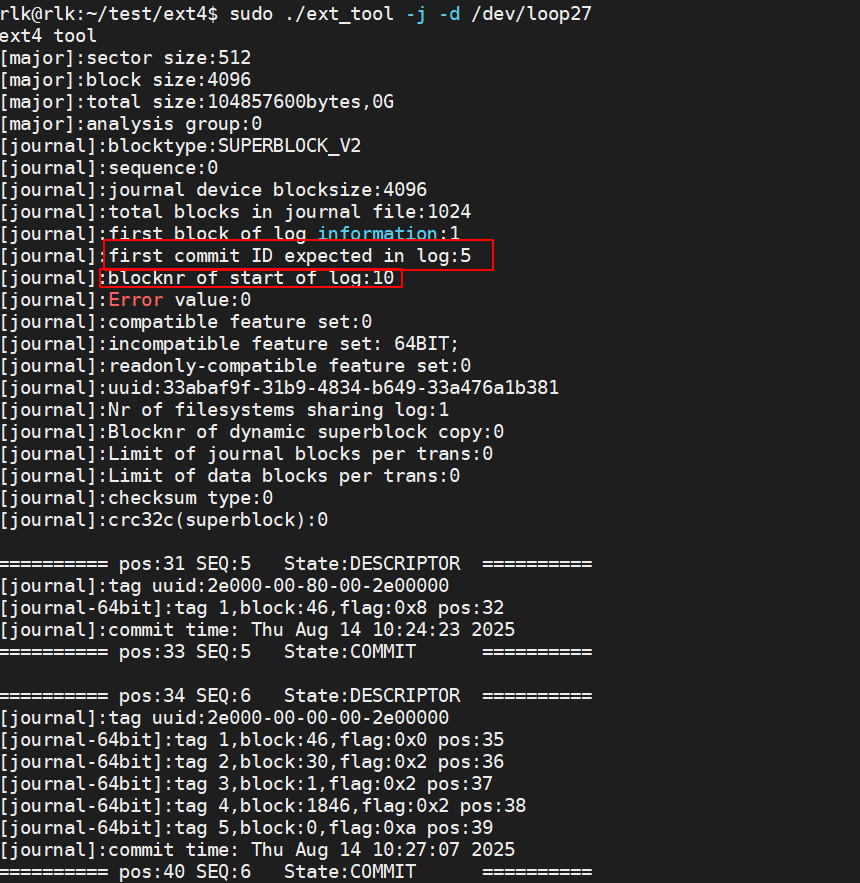
Commit id代表日志提交从第几个是开始有效的，Start blocknr代表日志从日志区的第几个块开始


## 日志事务结构

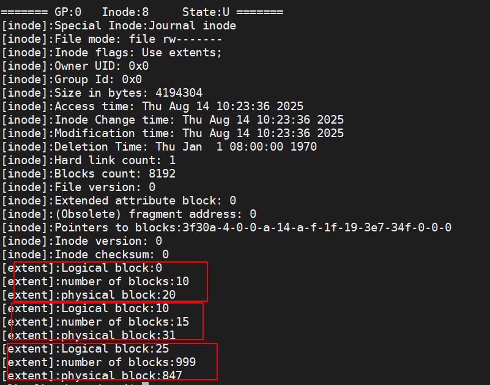

同时可以看出，日志有3个extent，分别从物理块20、31、和847开始
```c
//超级块
#define JBD2_DESCRIPTOR_BLOCK 1
#define JBD2_COMMIT_BLOCK 2
#define JBD2_SUPERBLOCK_V1 3
#define JBD2_SUPERBLOCK_V2 4
#define JBD2_REVOKE_BLOCK 5

#define JBD2_MAGIC_NUMBER 0xc03b3998U

typedef struct journal_header_s {
    __be32 h_magic;
    __be32 h_blocktype;
    __be32 h_sequence;
} journal_header_t;

/*
 * The journal superblock.  All fields are in big-endian byte order.
 */
typedef struct journal_superblock_s
{
/* 0x0000 */
	journal_header_t s_header;

/* 0x000C */
	/* Static information describing the journal */
	__be32	s_blocksize;		/* journal device blocksize */
	__be32	s_maxlen;		/* total blocks in journal file */
	__be32	s_first;		/* first block of log information */

/* 0x0018 */
	/* Dynamic information describing the current state of the log */
	__be32	s_sequence;		/* first commit ID expected in log */
	__be32	s_start;		/* blocknr of start of log */

/* 0x0020 */
	/* Error value, as set by jbd2_journal_abort(). */
	__be32	s_errno;

/* 0x0024 */
	/* Remaining fields are only valid in a version-2 superblock */
	__be32	s_feature_compat;	/* compatible feature set */
	__be32	s_feature_incompat;	/* incompatible feature set */
	__be32	s_feature_ro_compat;	/* readonly-compatible feature set */
/* 0x0030 */
	__u8	s_uuid[16];		/* 128-bit uuid for journal */

/* 0x0040 */
	__be32	s_nr_users;		/* Nr of filesystems sharing log */

	__be32	s_dynsuper;		/* Blocknr of dynamic superblock copy*/

/* 0x0048 */
	__be32	s_max_transaction;	/* Limit of journal blocks per trans.*/
	__be32	s_max_trans_data;	/* Limit of data blocks per trans. */

/* 0x0050 */
	__u8	s_checksum_type;	/* checksum type */
	__u8	s_padding2[3];
	__u32	s_padding[42];
	__be32	s_checksum;		/* crc32c(superblock) */

/* 0x0100 */
	__u8	s_users[16*48];		/* ids of all fs'es sharing the log */
/* 0x0400 */
} journal_superblock_t;

```

描述块
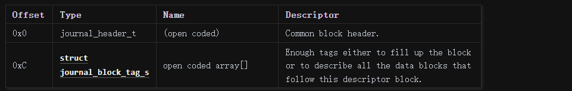
```c
typedef struct journal_block_tag_s
{
	__be32		t_blocknr;	/* The on-disk block number */
	__be16		t_checksum;	/* truncated crc32c(uuid+seq+block) */
	__be16		t_flags;	/* See below */
	__be32		t_blocknr_high; /* most-significant high 32bits. */
} journal_block_tag_t;


```

提交块
```c
struct commit_header {
	__be32		h_magic;
	__be32          h_blocktype;
	__be32          h_sequence;
	unsigned char   h_chksum_type;
	unsigned char   h_chksum_size;
	unsigned char 	h_padding[2];
	__be32 		h_chksum[JBD2_CHECKSUM_BYTES];
	__be64		h_commit_sec;
	__be32		h_commit_nsec;
};

```

# 数据块分析

首先从物理块20开始看
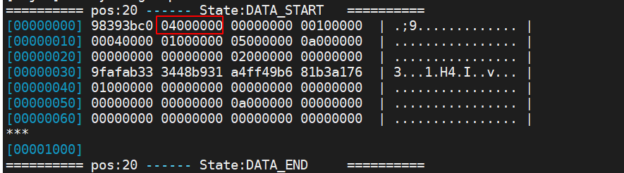
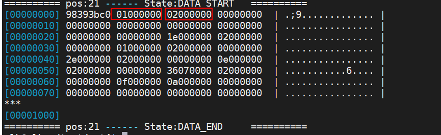

看到了超级块和第一个描述块，由于第一个描述块的h_sequence值是2，而first Commit id expected in log是5，所以这个描述块是无用的

接下来看物理块31
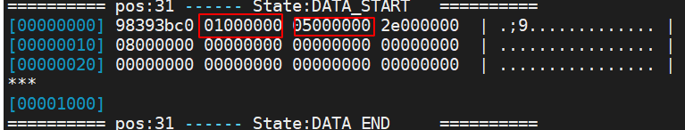
看到了h_sequence值为5的描述块，与first Commit id expected in log解析一致，所以后边的所有描述块都有效，继续解析有序描述块
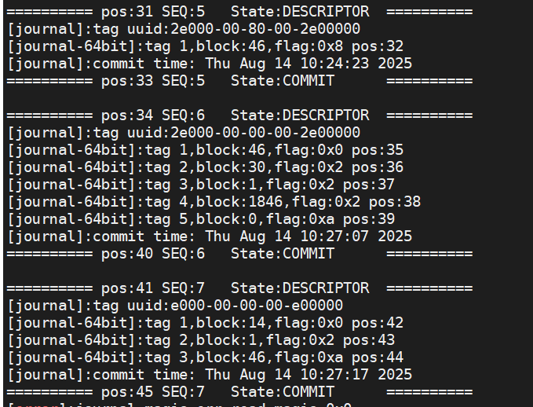
又分别在物理块34、41中解析到了描述块

接下来分析数据块，从第31个block中的tag中解析到，physical block 32存放了 physical block 46的数据 physical block 33中存放了提交块
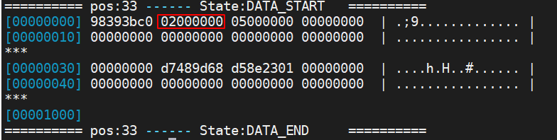
后边的描述块可以用同样的方法分析。

同时徐主要到，seq5、seq6和seq7都对physical block 46进行了更改，那么seq7会覆盖之前的操作，分别读取physical block 46和physical block 44（seq7中最后修改）接数据看下
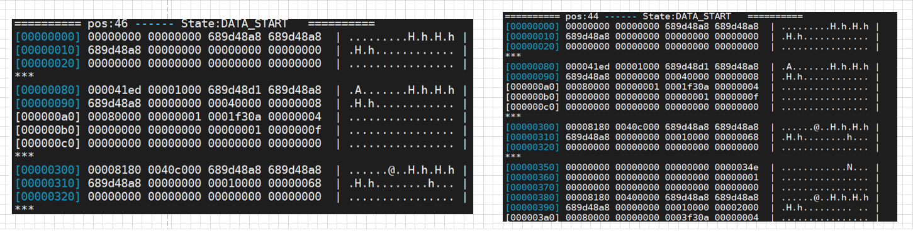
看以快出是一致的
根据上述原理，分别读取physical block 35和physical block 32，我们可以查询到physical block 46的修改记录。

同时，更具tag中记录的物理块信息，我们可以推测出ext4罗盘的顺序
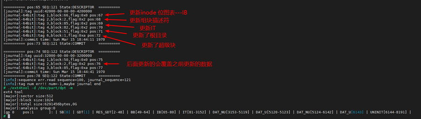


# 日志生成过程

## 概述
jbd2（journal block device 2）是为块存储设计的 wal（预写式日志（Write-Ahead Logging）） 机制，它为要写设备的buffer绑定了一个journal_head，这个journal_head与一个transaction绑定，随着事务状态的转移（运行，生成日志，日志块刷盘，数据块刷盘），journal_head会转移到事务相应的journal队列中（t_buffers、t_shadow_list、t_forget、t_checkpoint_list），其中前三个状态，journal_head与事务是绑定的，第四个状态下，journal_head。当系统crash时，可从superblock记录的最后一次完整刷盘的位置（checkpoint）开始，通过三遍扫描日志块（检查checksum、收集不必恢复的数据块信息、执行数据块恢复），来恢复块设备到最后一个完整commit的事务状态。

## 事务与日志handle
同一个时段内可以有多个线程同时做一些修改，每个线程持有一个journal 的 handle，这个handle可以同时修改几个块的内容，作为一个原子操作，在 handle 修改结束时，触发事务的提交。等所有开启handle的线程的事务均触发提交后，这些事务打包为一个事务提交至日志系统。 

事务是per filesystem的，同一时间最多存在两种类型的事务，running，committing，两个事务不能同时修改磁盘上的日志内容，如果committing事务正在修改，则将它的journal_head的next_transaction置为当前running的事务，在commit结束后，主动转移到 running 事务的队列上。
## 事务状态转移
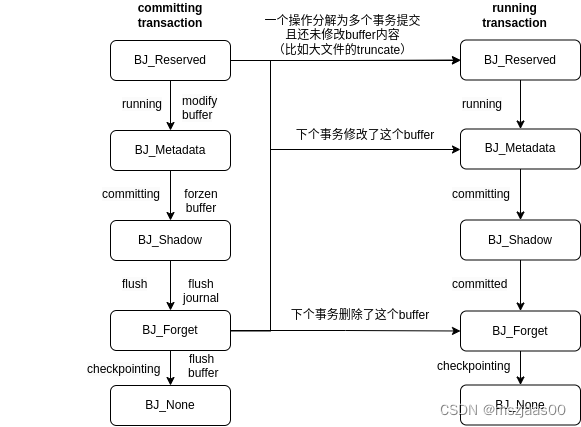
事务状态逻辑上可以分为：运行、生成日志、日志块刷盘、数据块刷盘四种类型（实际状态划分更细，见commit阶段描述）journal_head转移到事务的相应队列为：t_buffers、t_shadow_list、t_forget、t_checkpoint_list

其中前事务三个状态下，journal_head与事务是绑定的，第四个状态下，journal_head虽然还在事务的t_checkpoint_list上，但已与事务解绑定了。

### running阶段（运行）

一个元数据块的buffer在修改前，首先为它生成一个journal_head，获取write权限（do_journal_get_write_access），这时它还没有修改过，将它转移至当前事务的 BJ_Reserve 队列（t_reserved_list），如果全局事务切换后还没开启过新的（j_running_transaction为空）就先要new 一个（jbd2_journal_start）。

接下来该线程从jbd2_journal_start到jbd2_journal_stop之间的所有块修改是一个原子操作，在修改块内容后，将buffer用jbddirty来代替dirty（表示由journal子系统接管，被journal子系统接管的buffer块不能直接刷盘，要等日志commit之后，它才可能进入事务的checkpoint列表，由回写子系统接管），并将journal_head转移至当前事务的BJ_Metadata 队列（t_buffers），如果上一个事务正在提交它，则只是把buffer的j_next_transaction标为当前事务，在上个事务的日志刷盘后，发现j_next_transaction为当前事务，会主动将buffer置于当前事务的BJ_Metadata列表（t_buffers）中。（jbd2_journal_dirty_metadata）。

所谓获取write权限与copy on write过程刚好相反：如果buffer正被committing事务用于生成日志，则需要将此时的数据拷贝一份到journal_head->b_frozen_data上，committing事务生成日志时用的是frozen_data的数据，而非buffer最新的数据（jbd2_journal_write_metadata_buffer）。

* 注意：ext4文件系统在磁盘上有两部分组成，一部分是文件系统的数据区域，（包含文件数据和文件元数据），另一部分是日志区域，同样包含日志的数据和元数据，不能直接刷盘是指不能直接写到数据区域，需要先写到日志区域，然后再由checkpoint机制写到数据区域

### committing阶段（生成日志）

一个事务运行一段时间（JBD2_DEFAULT_MAX_COMMIT_AGE，5秒）后，会切换事务（jbd2_journal_commit_transaction），当然也可以在必要时手工切事务

T_LOCKED：commit首先要将当前running的事务转为committing状态，当然这需要等running事务的所有线程handle都不再运行（jbd2_journal_stop->stop_this_handle）后才会开始提交（jbd2_journal_wait_updates或其它调用jbd2_journal_lock_updates的地方），等待期间新的handle不能start（由j_state_lock保证），这被称为barrier。（与用户设置的JBD2_BARRIER不同，JBD2_BARRIER指在更新checkpoint时需要将设备的缓存刷下去）

commit阶段生成的日志块顺序为：revoke块，normal journal块，commit块，对于异步提交场景，允许commit块与其它块并发刷盘，对于同步提交场景，只有当revoke块与normal journal 块均提交后，才可以提交 commit块。

生成日志的过程可以描述为几步：

１、T_SWITCH：将本事务删除的块号记录为多个revoke块

２、T_FLUSH：ordered 模式下需要等待数据块提交

３、T_COMMIT：生成一个descriptor 块

４、T_COMMIT：从BJ_Metadata 队列（t_buffers）上取一个journal_head，做frozen，并将frozen的数据块内容作为日志块内容刷盘（jbd2_journal_write_metadata_buffer）

５、T_COMMIT：计算这个frozen 块的checksum，作为tag放在descriptor块上

６、T_COMMIT：将journal_head从BJ_Metadata 队列（t_buffers）转移至BJ_Shadow队列（t_shadow_list），同时申请一个buffer_head放到一个临时列表中，这期间下一个事务是拿不到buffer的写权限的，需要等待日志刷盘。

７、T_COMMIT：重复４５６过程，如果tag把descriptor块写满了，就计算descriptor块的checksum放在descriptor的tail上。然后重新开一个descriptor块（即３４５６过程）

８、T_COMMIT_DFLUSH：异步提交场景允许提交commit块，它保存了整体的checksum和事务号

### flush阶段（日志块刷盘）

在日志刷盘后，新的事务的handle就可以接管这个事务的journal_head了，具体如下：

１、T_COMMIT_DFLUSH：将日志刷盘后的journal_head从BJ_Shadow 队列转移至BJ_Forget队列（t_forget）

２、T_COMMIT_DFLUSH：对于同步提交场景，要在所有日志刷盘后才可以提交commit块，它保存了整体的checksum和事务号

３、T_COMMIT_DFLUSH：将BJ_Forget队列（t_forget）的journal_head插入当前事务的t_checkpoint_list队列

４、T_COMMIT_JFLUSH：如果下个事务要修改或删除这个块，则转移至下个事务的BJ_Metadata 队列（t_buffers）或BJ_Forget队列（t_forget）上；如果下个事务要用这个块，但还没做修改，则转移至BJ_Reserve 队列（t_reserved_list）

５、T_COMMIT_JFLUSH：如果下个事务不用这个块了，则将buffer的jbddirty标记清除，改为dirty标记，表示它开始由回写子系统接管；如果下个事务用它，则 jbddirty 标记不会删除，虽然它在当前事务 checkpoint buffer 列表上，但不会将它刷盘，因为它还在被 jbd2 接管，后面还可能会更新或删除（__jbd2_journal_refile_buffer）。

这之后是一些收尾工作：

１、T_COMMIT_JFLUSH：更新统计信息，比如commit用时等

２、T_COMMIT_CALLBACK：ext4会在这个阶段才真正在bitmap里标记free的块真free了，可被下个事务重新分配。

３、T_FINISHED：更新journal相关的全局统计信息

### checkpoint阶段（数据块刷盘）

checkpoint的作用是将已经写日志的buffer块回写到磁盘。checkpoint的触发点主要有２个（jbd2_log_do_checkpoint）：

１、journal 文件的磁盘空间不足，或内存buffer不够用

２、手工调用jbd2_journal_flush时，比如修改了重要的inode或superblock内容时。

也就是说，commit 事务涉及的 buffer 不是马上刷盘的，checkpoint 事务列表中可以包含多个事务。

do checkpoint的过程只会将标记为dirty（由回写子系统接管）的buffer内容刷盘（write_dirty_buffer），如果buffer还标记为jbddirty，表示它还在被journal子系统接管（后面的事务还在修改或删除它），这时直接将它从事务上删除（__jbd2_journal_remove_checkpoint），并更新 checkpoint 的进度（jbd2_cleanup_journal_tail）。这里不用担心掉电的问题，因为重启时recovery机制会从checkpoint进度点开始，根据日志内容将数据块恢复到最后一次提交事务的状态。

* 注意 buffer被journal子系统接管不会刷盘是指不会刷到文件系统的数据区域，而是在被journal子系统接管的状态下会被刷到文系统的日志区域，而后才会由回写子系统接管刷到数据区域

### abort阶段

如果journal运行期间出现错误（尤其是io错误时），可能调用jbd2_journal_abort，这时要将所有未checkpoint的数据刷盘，然后restart journal，根据日志内容将系统恢复到最后一个成功事务的状态。