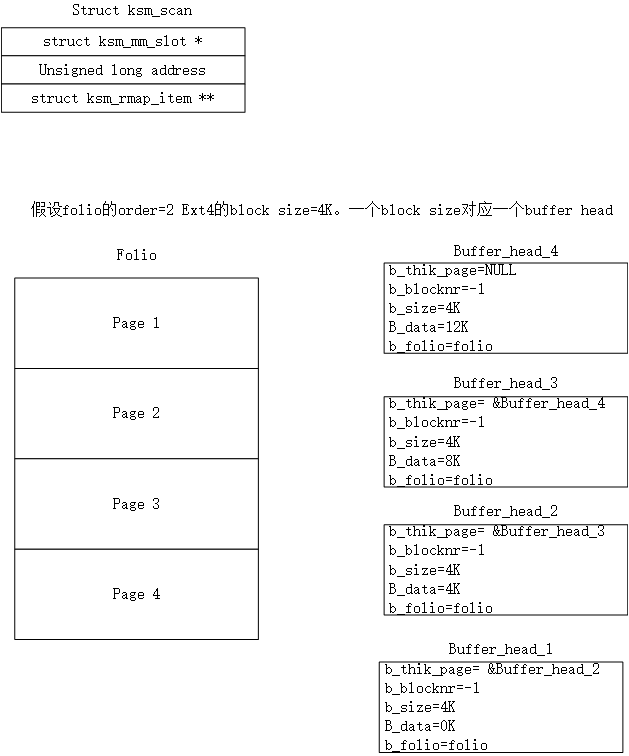

# 前言

## delay alloc模式

写入延迟‌：应用程序执行write()系统调用时，数据仅被写入‌Page Cache内存页缓存‌，此时文件系统‌不立即分配磁盘块‌‌

‌元数据延迟‌：系统暂不建立逻辑块到物理块的映射关系（buffer_head状态保持“未映射”），仅标记需要后续分配‌

‌分配时机‌：
    实际磁盘块分配延迟到以下时机触发：
    脏页比例达到阈值（由vm.dirty_ratio控制）
    定时刷新机制激活
    主动调用sync()或fsync()

通过合并连续写入请求，结合‌mballoc多块分配器‌一次性分配连续物理块‌

| ‌特性      | ‌	‌延迟分配 (Delay Allocation) | 立即分配 (No Delayed Allocation)     |
| :---        | :---- | :--- |
| ‌分配时机      | 数据写入 Page Cache 后‌暂不分配磁盘块‌；实际分配延迟到脏页回写时（如 sync、fsync 或内存压力触发）‌       | 数据写入 Page Cache 时‌立即分配磁盘块‌，建立逻辑块到物理块的映射   |
| ‌碎片控制  | 通过合并连续写入请求，结合 ‌mballoc 多块分配器‌一次性分配连续物理块，显著减少碎片 ‌  | 每次小写入均触发独立分配，易产生磁盘碎片 ‌ |
| CPU 开销 |减少元数据频繁更新，降低 CPU 负载 ‌ | 每次写入均需分配块并更新元数据，CPU 开销较高|
|写入性能|机械硬盘场景下顺序写吞吐量提升 5-10 倍（尤其大文件连续写入）‌|随机写入性能较差，频繁分配导致 I/O 效率低下|  
|数据一致性风险|崩溃时未回写的延迟分配数据可能丢失，依赖 fsync() 保障安全|分配即落盘（元数据），崩溃风险较低但性能牺牲大|


*No Delayed Allocation 与 direct IO区别在于是否经过page cache这一层*


## folio 与 buffer head的关系

### 物理结构关系：页面细分与管理
#### ‌基础单元划分‌
page是物理内存管理的最小单位（通常4KB），用于缓存文件数据或块设备内容‌

buffer_head则描述page内更细粒度的‌磁盘逻辑块‌（如1KB），一个page可包含多个buffer_head（例如4个1KB块）‌

#### 指针互联机制‌
page结构体的private字段指向首个buffer_head‌

buffer_head通过b_this_page形成循环链表，并通过b_page反向关联所属page‌
### 功能映射关系：磁盘与内存的桥梁
#### 磁盘块定位‌
buffer_head记录磁盘逻辑块号（b_blocknr）和块大小（b_size），明确page中某段数据对应的磁盘位置‌

#### 状态同步控制‌
buffer_head跟踪缓冲区的状态（如脏页BH_Dirty、数据有效BH_Uptodate），确保内存与磁盘数据一致性‌

例如写入操作后，buffer_head将page标记为脏，触发回写机制‌
4。
### I/O协同关系：与bio的联动
#### bio的数据载体‌
page是块设备I/O（bio结构）的实际数据载体：
读操作时，磁盘数据通过bio写入page；
写操作时，page数据通过bio写入磁盘‌

#### buffer_head的纽带作用‌
bio发起I/O前需借助buffer_head：
检查数据是否已在page缓存中（避免重复读）；
若需磁盘访问，buffer_head提供磁盘块号生成I/O请求‌



# ext4_da_write_begin
```c

static int ext4_da_write_begin(struct file *file, struct address_space *mapping,
			       loff_t pos, unsigned len,
			       struct folio **foliop, void **fsdata)
{
	int ret, retries = 0;
	struct folio *folio;
	pgoff_t index;
	struct inode *inode = mapping->host;

	if (unlikely(ext4_forced_shutdown(inode->i_sb)))//ext4挂载是否异常
		return -EIO;

	index = pos >> PAGE_SHIFT;

	/*两种情况切换到nodelalloc模式。
		1.磁盘剩余的freeblock不足，先触发回写，仍不足则切到nodelalloc模式
		2.ext4挂载时使用了EXT4_STATE_VERITY_IN_PROGRESS特性
	*/
	if (ext4_nonda_switch(inode->i_sb) || ext4_verity_in_progress(inode)) {
		*fsdata = (void *)FALL_BACK_TO_NONDELALLOC;
		return ext4_write_begin(file, mapping, pos,
					len, foliop, fsdata);
	}
	*fsdata = (void *)0;
	trace_ext4_da_write_begin(inode, pos, len);

	/*INLINE_DATA情况，对于小文件，数据直接存储到inode结构体中
	*/
	if (ext4_test_inode_state(inode, EXT4_STATE_MAY_INLINE_DATA)) {
		ret = ext4_da_write_inline_data_begin(mapping, inode, pos, len,
						      foliop, fsdata);
		if (ret < 0)
			return ret;
		if (ret == 1)
			return 0;
	}

retry:
	folio = __filemap_get_folio(mapping, index, FGP_WRITEBEGIN,
			mapping_gfp_mask(mapping));
	if (IS_ERR(folio))
		return PTR_ERR(folio);

	/*获取folio的buffer head，对每个buffer head分别调用ext4_da_get_block_prep*/
	ret = ext4_block_write_begin(NULL, folio, pos, len,
				     ext4_da_get_block_prep);//下文详解
	if (ret < 0) {
		folio_unlock(folio);
		folio_put(folio);
		/*
		 * block_write_begin may have instantiated a few blocks
		 * outside i_size.  Trim these off again. Don't need
		 * i_size_read because we hold inode lock.
		 */
		if (pos + len > inode->i_size)
			ext4_truncate_failed_write(inode);

		if (ret == -ENOSPC &&
		    ext4_should_retry_alloc(inode->i_sb, &retries))
			goto retry;
		return ret;
	}

	*foliop = folio;
	return ret;
}


int ext4_block_write_begin(handle_t *handle, struct folio *folio,
			   loff_t pos, unsigned len,
			   get_block_t *get_block)
{
	unsigned from = pos & (PAGE_SIZE - 1);
	unsigned to = from + len;
	struct inode *inode = folio->mapping->host;
	unsigned block_start, block_end;
	sector_t block;
	int err = 0;
	unsigned blocksize = inode->i_sb->s_blocksize;
	unsigned bbits;
	struct buffer_head *bh, *head, *wait[2];
	int nr_wait = 0;
	int i;
	bool should_journal_data = ext4_should_journal_data(inode);

	BUG_ON(!folio_test_locked(folio));
	BUG_ON(from > PAGE_SIZE);
	BUG_ON(to > PAGE_SIZE);
	BUG_ON(from > to);

	/*获取对应的buffer head*/
	head = folio_buffers(folio);
	if (!head)
		head = create_empty_buffers(folio, blocksize, 0);
	bbits = ilog2(blocksize);
	/* folio->index存放这个folio在这个文件中的偏移量
	计算得出block在文件中的偏移量*/
	block = (sector_t)folio->index << (PAGE_SHIFT - bbits);

	for (bh = head, block_start = 0; bh != head || !block_start;
	    block++, block_start = block_end, bh = bh->b_this_page) {
		block_end = block_start + blocksize;
		if (block_end <= from || block_start >= to) {//当前block全部长度落在[form,to]区间之外
		[	if (folio_test_uptodate(folio)) {
				set_buffer_uptodate(bh);
			}
			continue;
		}
		if (buffer_new(bh))
			clear_buffer_new(bh);
		if (!buffer_mapped(bh)) {//buffer head还没有映射到磁盘
			WARN_ON(bh->b_size != blocksize);
			err = get_block(inode, block, bh, 1);//ext4_da_get_block_prep 下文详解
			if (err)
				break;
			if (buffer_new(bh)) {//buffer head的操盘映射时新创建的
				/*
				 * We may be zeroing partial buffers or all new
				 * buffers in case of failure. Prepare JBD2 for
				 * that.
				 */
				if (should_journal_data)
					do_journal_get_write_access(handle,
								    inode, bh);
				if (folio_test_uptodate(folio)) {
					/*
					 * Unlike __block_write_begin() we leave
					 * dirtying of new uptodate buffers to
					 * ->write_end() time or
					 * folio_zero_new_buffers().
					 */
					set_buffer_uptodate(bh);
					continue;
				}
				if (block_end > to || block_start < from)//当前block落在[form,to]区间之外的部分清零
					folio_zero_segments(folio, to,
							    block_end,
							    block_start, from);
				continue;
			}
		}
		if (folio_test_uptodate(folio)) {
			set_buffer_uptodate(bh);
			continue;
		}
		if (!buffer_uptodate(bh) && !buffer_delay(bh) &&
		    !buffer_unwritten(bh) &&
		    (block_start < from || block_end > to)) { //当前block部分长度落在[form,to]区间之内
			ext4_read_bh_lock(bh, 0, false);
			wait[nr_wait++] = bh;//部分长度落在[form,to]区间之内的block有且只有2个
		}
	}
	/*
	 * If we issued read requests, let them complete.
	 */
	for (i = 0; i < nr_wait; i++) {
		wait_on_buffer(wait[i]);
		if (!buffer_uptodate(wait[i]))
			err = -EIO;
	}
	if (unlikely(err)) {
		if (should_journal_data)
			ext4_journalled_zero_new_buffers(handle, inode, folio,
							 from, to);
		else
			folio_zero_new_buffers(folio, from, to);
	} else if (fscrypt_inode_uses_fs_layer_crypto(inode)) {
		for (i = 0; i < nr_wait; i++) {
			int err2;

			err2 = fscrypt_decrypt_pagecache_blocks(folio,
						blocksize, bh_offset(wait[i]));
			if (err2) {
				clear_buffer_uptodate(wait[i]);
				err = err2;
			}
		}
	}

	return err;
}

/*
 * This is a special get_block_t callback which is used by
 * ext4_da_write_begin().  It will either return mapped block or
 * reserve space for a single block.
 *
 * For delayed buffer_head we have BH_Mapped, BH_New, BH_Delay set.
 * We also have b_blocknr = -1 and b_bdev initialized properly
 *
 * For unwritten buffer_head we have BH_Mapped, BH_New, BH_Unwritten set.
 * We also have b_blocknr = physicalblock mapping unwritten extent and b_bdev
 * initialized properly.
 */
int ext4_da_get_block_prep(struct inode *inode, sector_t iblock,
			   struct buffer_head *bh, int create)
{
	struct ext4_map_blocks map;
	sector_t invalid_block = ~((sector_t) 0xffff);
	int ret = 0;

	BUG_ON(create == 0);
	BUG_ON(bh->b_size != inode->i_sb->s_blocksize);

	if (invalid_block < ext4_blocks_count(EXT4_SB(inode->i_sb)->s_es))
		invalid_block = ~0;

	map.m_lblk = iblock;
	map.m_len = 1;

	/*
	 * first, we need to know whether the block is allocated already
	 * preallocated blocks are unmapped but should treated
	 * the same as allocated blocks.看这个块是否被映射
	 */
	ret = ext4_da_map_blocks(inode, &map);//下文详解
	if (ret < 0)
		return ret;

	if (map.m_flags & EXT4_MAP_DELAYED) {//extent 延时分配
		map_bh(bh, inode->i_sb, invalid_block);//bh->b_blocknr存放的是起始物理块，初始化为invalid_block
		set_buffer_new(bh);
		set_buffer_delay(bh);
		return 0;
	}

	map_bh(bh, inode->i_sb, map.m_pblk);//非extent 延时分配 
	ext4_update_bh_state(bh, map.m_flags);//根据map.m_flags更新bh->b_state

	if (buffer_unwritten(bh)) {
		/* A delayed write to unwritten bh should be marked
		 * new and mapped.  Mapped ensures that we don't do
		 * get_block multiple times when we write to the same
		 * offset and new ensures that we do proper zero out
		 * for partial write.
		 */
		set_buffer_new(bh);
		set_buffer_mapped(bh);
	}
	return 0;
}

/*
 * Looks up the requested blocks and sets the delalloc extent map.
 * First try to look up for the extent entry that contains the requested
 * blocks in the extent status tree without i_data_sem, then try to look
 * up for the ondisk extent mapping with i_data_sem in read mode,
 * finally hold i_data_sem in write mode, looks up again and add a
 * delalloc extent entry if it still couldn't find any extent. Pass out
 * the mapped extent through @map and return 0 on success.
查找请求的块并设置延迟分配（delalloc）的区段映射。
首先尝试在不持有 i_data_sem 的情况下，于区段状态树中查找包含所请求块的区段条目；
若未找到，则尝试在持有 i_data_sem 读锁的情况下查找磁盘上的区段映射；
最后，在持有 i_data_sem 写锁的情况下再次查找，若仍未找到任何区段，则添加一个延迟分配区段条目。
通过 @map 参数输出映射的区段信息，成功时返回 0。
 */
static int ext4_da_map_blocks(struct inode *inode, struct ext4_map_blocks *map)
{
	struct extent_status es;
	int retval;
#ifdef ES_AGGRESSIVE_TEST
	struct ext4_map_blocks orig_map;

	memcpy(&orig_map, map, sizeof(*map));
#endif

	map->m_flags = 0;
	ext_debug(inode, "max_blocks %u, logical block %lu\n", map->m_len,
		  (unsigned long) map->m_lblk);

	/* Lookup extent status tree firstly */
	if (ext4_es_lookup_extent(inode, map->m_lblk, NULL, &es)) {
		map->m_len = min_t(unsigned int, map->m_len,
				   es.es_len - (map->m_lblk - es.es_lblk));

		if (ext4_es_is_hole(&es))
			goto add_delayed;

found:
		/*
		 * Delayed extent could be allocated by fallocate.
		 * So we need to check it.
		 */
		if (ext4_es_is_delayed(&es)) {
			map->m_flags |= EXT4_MAP_DELAYED;
			return 0;
		}

		map->m_pblk = ext4_es_pblock(&es) + map->m_lblk - es.es_lblk;
		if (ext4_es_is_written(&es))
			map->m_flags |= EXT4_MAP_MAPPED;
		else if (ext4_es_is_unwritten(&es))
			map->m_flags |= EXT4_MAP_UNWRITTEN;
		else
			BUG();

#ifdef ES_AGGRESSIVE_TEST
		ext4_map_blocks_es_recheck(NULL, inode, map, &orig_map, 0);
#endif
		return 0;
	}

	/*
	 * Try to see if we can get the block without requesting a new
	 * file system block.
	 */
	down_read(&EXT4_I(inode)->i_data_sem);
	if (ext4_has_inline_data(inode))
		retval = 0;
	else
		retval = ext4_map_query_blocks(NULL, inode, map);
	up_read(&EXT4_I(inode)->i_data_sem);
	if (retval)
		return retval < 0 ? retval : 0;

add_delayed:
	down_write(&EXT4_I(inode)->i_data_sem);
	/*
	 * Page fault path (ext4_page_mkwrite does not take i_rwsem)
	 * and fallocate path (no folio lock) can race. Make sure we
	 * lookup the extent status tree here again while i_data_sem
	 * is held in write mode, before inserting a new da entry in
	 * the extent status tree.
	 */
	if (ext4_es_lookup_extent(inode, map->m_lblk, NULL, &es)) {
		map->m_len = min_t(unsigned int, map->m_len,
				   es.es_len - (map->m_lblk - es.es_lblk));

		if (!ext4_es_is_hole(&es)) {
			up_write(&EXT4_I(inode)->i_data_sem);
			goto found;
		}
	} else if (!ext4_has_inline_data(inode)) {
		retval = ext4_map_query_blocks(NULL, inode, map);
		if (retval) {
			up_write(&EXT4_I(inode)->i_data_sem);
			return retval < 0 ? retval : 0;
		}
	}

	map->m_flags |= EXT4_MAP_DELAYED;
	retval = ext4_insert_delayed_blocks(inode, map->m_lblk, map->m_len);
	up_write(&EXT4_I(inode)->i_data_sem);

	return retval;
}
```

从代码逻辑看ext4_block_write_begin作用是
1，初始化buffer head，建立buffer head和folio对应关系
2，查询或分配磁盘block，建立与buffer head映射关系
3，记录日志

接下看block的查找过程

```c
/*
 * ext4_es_lookup_extent() looks up an extent in extent status tree.
 *
 * ext4_es_lookup_extent is called by ext4_map_blocks/ext4_da_map_blocks.
 *
 * Return: 1 on found, 0 on not
 */
int ext4_es_lookup_extent(struct inode *inode, ext4_lblk_t lblk,
			  ext4_lblk_t *next_lblk,
			  struct extent_status *es)
{
	struct ext4_es_tree *tree;
	struct ext4_es_stats *stats;
	struct extent_status *es1 = NULL;
	struct rb_node *node;
	int found = 0;

	if (EXT4_SB(inode->i_sb)->s_mount_state & EXT4_FC_REPLAY)//进行日志回溯？
		return 0;

	trace_ext4_es_lookup_extent_enter(inode, lblk);
	es_debug("lookup extent in block %u\n", lblk);

	tree = &EXT4_I(inode)->i_es_tree;
	read_lock(&EXT4_I(inode)->i_es_lock);

	/* find extent in cache firstly */
	es->es_lblk = es->es_len = es->es_pblk = 0;
	es1 = READ_ONCE(tree->cache_es);
	if (es1 && in_range(lblk, es1->es_lblk, es1->es_len)) {
		es_debug("%u cached by [%u/%u)\n",
			 lblk, es1->es_lblk, es1->es_len);
		found = 1;
		goto out;
	}

	node = tree->root.rb_node;
	while (node) {//循环查询红黑树，找到与lblk相等的block
		es1 = rb_entry(node, struct extent_status, rb_node);
		if (lblk < es1->es_lblk)
			node = node->rb_left;
		else if (lblk > ext4_es_end(es1))
			node = node->rb_right;
		else {
			found = 1;
			break;
		}
	}

out:
	stats = &EXT4_SB(inode->i_sb)->s_es_stats;
	if (found) {
		BUG_ON(!es1);
		es->es_lblk = es1->es_lblk;
		es->es_len = es1->es_len;
		es->es_pblk = es1->es_pblk;
		if (!ext4_es_is_referenced(es1))
			ext4_es_set_referenced(es1);
		percpu_counter_inc(&stats->es_stats_cache_hits);//增加extent_status命中计数
		if (next_lblk) {
			node = rb_next(&es1->rb_node);
			if (node) {
				es1 = rb_entry(node, struct extent_status,
					       rb_node);
				*next_lblk = es1->es_lblk;
			} else
				*next_lblk = 0;
		}
	} else {
		percpu_counter_inc(&stats->es_stats_cache_misses);//增加extent_status miss计数
	}

	read_unlock(&EXT4_I(inode)->i_es_lock);

	trace_ext4_es_lookup_extent_exit(inode, es, found);
	return found;
}
```