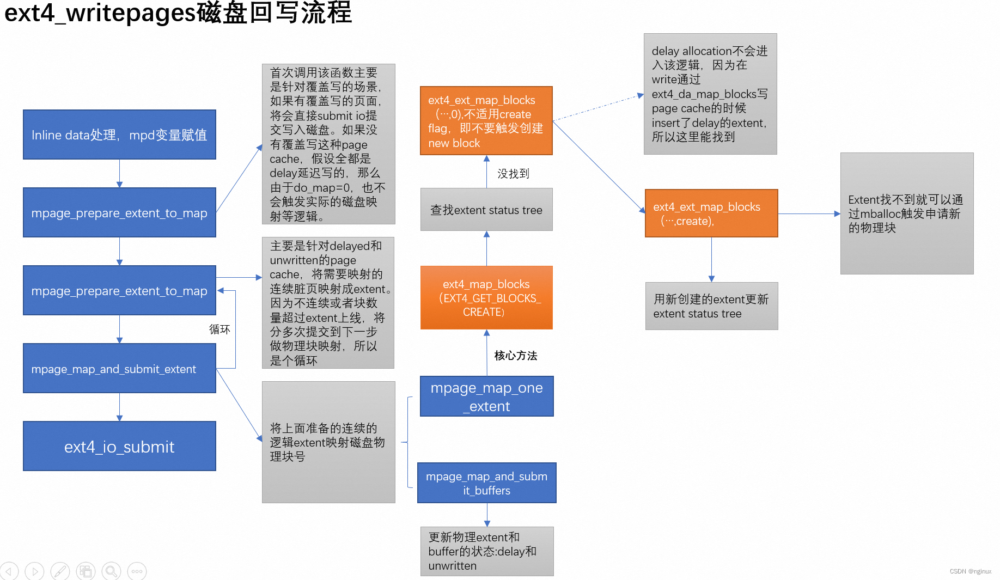

# 前言

## delay alloc模式

写入延迟‌：应用程序执行write()系统调用时，数据仅被写入‌Page Cache内存页缓存‌，此时文件系统‌不立即分配磁盘块‌‌

‌元数据延迟‌：系统暂不建立逻辑块到物理块的映射关系（buffer_head状态保持“未映射”），仅标记需要后续分配‌

‌分配时机‌：
    实际磁盘块分配延迟到以下时机触发：
    脏页比例达到阈值（由vm.dirty_ratio控制）
    定时刷新机制激活
    主动调用sync()或fsync()

通过合并连续写入请求，结合‌mballoc多块分配器‌一次性分配连续物理块‌

| ‌特性      | ‌	‌延迟分配 (Delay Allocation) | 立即分配 (No Delayed Allocation)     |
| :---        | :---- | :--- |
| ‌分配时机      | 数据写入 Page Cache 后‌暂不分配磁盘块‌；实际分配延迟到脏页回写时（如 sync、fsync 或内存压力触发）‌       | 数据写入 Page Cache 时‌立即分配磁盘块‌，建立逻辑块到物理块的映射   |
| ‌碎片控制  | 通过合并连续写入请求，结合 ‌mballoc 多块分配器‌一次性分配连续物理块，显著减少碎片 ‌  | 每次小写入均触发独立分配，易产生磁盘碎片 ‌ |
| CPU 开销 |减少元数据频繁更新，降低 CPU 负载 ‌ | 每次写入均需分配块并更新元数据，CPU 开销较高|
|写入性能|机械硬盘场景下顺序写吞吐量提升 5-10 倍（尤其大文件连续写入）‌|随机写入性能较差，频繁分配导致 I/O 效率低下|  
|数据一致性风险|崩溃时未回写的延迟分配数据可能丢失，依赖 fsync() 保障安全|分配即落盘（元数据），崩溃风险较低但性能牺牲大|


*No Delayed Allocation 与 direct IO区别在于是否经过page cache这一层*


## folio 与 buffer head的关系

### 物理结构关系：页面细分与管理
#### ‌基础单元划分‌
page是物理内存管理的最小单位（通常4KB），用于缓存文件数据或块设备内容‌

buffer_head则描述page内更细粒度的‌磁盘逻辑块‌（如1KB），一个page可包含多个buffer_head（例如4个1KB块）‌

#### 指针互联机制‌
page结构体的private字段指向首个buffer_head‌

buffer_head通过b_this_page形成循环链表，并通过b_page反向关联所属page‌
### 功能映射关系：磁盘与内存的桥梁
#### 磁盘块定位‌
buffer_head记录磁盘逻辑块号（b_blocknr）和块大小（b_size），明确page中某段数据对应的磁盘位置‌

#### 状态同步控制‌
buffer_head跟踪缓冲区的状态（如脏页BH_Dirty、数据有效BH_Uptodate），确保内存与磁盘数据一致性‌

例如写入操作后，buffer_head将page标记为脏，触发回写机制‌
4。
### I/O协同关系：与bio的联动
#### bio的数据载体‌
page是块设备I/O（bio结构）的实际数据载体：
读操作时，磁盘数据通过bio写入page；
写操作时，page数据通过bio写入磁盘‌

#### buffer_head的纽带作用‌
bio发起I/O前需借助buffer_head：
检查数据是否已在page缓存中（避免重复读）；
若需磁盘访问，buffer_head提供磁盘块号生成I/O请求‌


# ext4_da_write_begin

```c

ext4_da_write_begin
	->__filemap_get_folio	//获取写数据的page cache
	->ext4_block_write_begin	/*获取folio的buffer head，对每个buffer head分别调用ext4_da_get_block_prep*/
		->ext4_da_get_block_prep	//返回新建的block或者为单个块预留空间
			->ext4_da_map_blocks	//先在inode缓存(ext4_inode_info->i_es_tree)中查找请求的块,若没有则在磁盘中查找或新建
				->ext4_es_lookup_extent	//在inode缓存(ext4_inode_info->i_es_tree)中查找
				->ext4_map_query_blocks	//black 申请/映射/预申请过程
					->ext4_ext_map_blocks	//遍历extent层级
						->ext4_find_extent	
							->ext4_ext_binsearch_idx	//通过ext4_extent_idx拿掉下一层ext4_extent_idx
							->read_extent_tree_block	//从磁盘中读取下一层ext4_extent_idx所在的block
							->ext4_ext_binsearch		//最终获取到ext4_extent 

ext4_da_do_write_end //标记inode、buffer_head和folio为脏，触发页面回写，更新i_size等元数据
```

```c

static int ext4_da_write_begin(struct file *file, struct address_space *mapping,
			       loff_t pos, unsigned len,
			       struct folio **foliop, void **fsdata)
{
	int ret, retries = 0;
	struct folio *folio;
	pgoff_t index;
	struct inode *inode = mapping->host;

	if (unlikely(ext4_forced_shutdown(inode->i_sb)))//ext4挂载是否异常
		return -EIO;

	index = pos >> PAGE_SHIFT;

	/*两种情况切换到nodelalloc模式。
		1.磁盘剩余的freeblock不足，先触发回写，仍不足则切到nodelalloc模式
		2.ext4挂载时使用了EXT4_STATE_VERITY_IN_PROGRESS特性
	*/
	if (ext4_nonda_switch(inode->i_sb) || ext4_verity_in_progress(inode)) {
		*fsdata = (void *)FALL_BACK_TO_NONDELALLOC;
		return ext4_write_begin(file, mapping, pos,
					len, foliop, fsdata);
	}
	*fsdata = (void *)0;
	trace_ext4_da_write_begin(inode, pos, len);

	/*INLINE_DATA情况，对于小文件，数据直接存储到inode结构体中
	*/
	if (ext4_test_inode_state(inode, EXT4_STATE_MAY_INLINE_DATA)) {
		ret = ext4_da_write_inline_data_begin(mapping, inode, pos, len,
						      foliop, fsdata);
		if (ret < 0)
			return ret;
		if (ret == 1)
			return 0;
	}

retry:
	folio = __filemap_get_folio(mapping, index, FGP_WRITEBEGIN,
			mapping_gfp_mask(mapping));
	if (IS_ERR(folio))
		return PTR_ERR(folio);

	/*获取folio的buffer head，对每个buffer head分别调用ext4_da_get_block_prep*/
	ret = ext4_block_write_begin(NULL, folio, pos, len,
				     ext4_da_get_block_prep);//下文详解
	if (ret < 0) {
		folio_unlock(folio);
		folio_put(folio);
		/*
		 * block_write_begin may have instantiated a few blocks
		 * outside i_size.  Trim these off again. Don't need
		 * i_size_read because we hold inode lock.
		 */
		if (pos + len > inode->i_size)
			ext4_truncate_failed_write(inode);

		if (ret == -ENOSPC &&
		    ext4_should_retry_alloc(inode->i_sb, &retries))
			goto retry;
		return ret;
	}

	*foliop = folio;
	return ret;
}


static int ext4_da_do_write_end(struct address_space *mapping,
			loff_t pos, unsigned len, unsigned copied,
			struct folio *folio)
{
	struct inode *inode = mapping->host;
	loff_t old_size = inode->i_size;
	bool disksize_changed = false;
	loff_t new_i_size, zero_len = 0;
	handle_t *handle;

	if (unlikely(!folio_buffers(folio))) {
		folio_unlock(folio);
		folio_put(folio);
		return -EIO;
	}
	/*
	 * block_write_end() will mark the inode as dirty with I_DIRTY_PAGES
	 * flag, which all that's needed to trigger page writeback.
	 * 标记inode、buffer_head和folio为脏，触发页面回写
	 */
	copied = block_write_end(NULL, mapping, pos, len, copied,
			folio, NULL);
	new_i_size = pos + copied;

	/*
	 * It's important to update i_size while still holding folio lock,
	 * because folio writeout could otherwise come in and zero beyond
	 * i_size.
	 在保持页锁期间更新 i_size 至关重要，否则页回写操作可能会在 i_size 之外的位置填充零值
	 *
	 * Since we are holding inode lock, we are sure i_disksize <=
	 * i_size. We also know that if i_disksize < i_size, there are
	 * delalloc writes pending in the range up to i_size. If the end of
	 * the current write is <= i_size, there's no need to touch
	 * i_disksize since writeback will push i_disksize up to i_size
	 * eventually. If the end of the current write is > i_size and
	 * inside an allocated block which ext4_da_should_update_i_disksize()
	 * checked, we need to update i_disksize here as certain
	 * ext4_writepages() paths not allocating blocks and update i_disksize.
	 * 由于持有 inode 锁，可以确保 i_disksize <= i_size。
	 * 若 i_disksize < i_size，则表明在i_disksize到i_size这段范围的内存有延迟分配的写入操作
	 * 若当前写入的结束位置 <= i_size，则无需修改 i_disksize，因为回写机制最终会将 i_disksize 推升至 i_size。
	 * 若当前写入的结束位置 > i_size 且位于已分配的块内（此情况已由 ext4_da_should_update_i_disksize() 检查）
	 * 则需要在此更新 i_disksize，因为某些 ext4_writepages() 路径不会分配块但会更新 i_disksize。
	 */
	if (new_i_size > inode->i_size) {
		unsigned long end;

		i_size_write(inode, new_i_size);
		end = (new_i_size - 1) & (PAGE_SIZE - 1);
		if (copied && ext4_da_should_update_i_disksize(folio, end)) {
			ext4_update_i_disksize(inode, new_i_size);
			disksize_changed = true;
		}
	}

	folio_unlock(folio);
	folio_put(folio);

	if (pos > old_size) {//写入的位置超过文件原有大小
		pagecache_isize_extended(inode, old_size, pos);
		zero_len = pos - old_size;
	}

	if (!disksize_changed && !zero_len)
		return copied;

	handle = ext4_journal_start(inode, EXT4_HT_INODE, 2);
	if (IS_ERR(handle))
		return PTR_ERR(handle);
	if (zero_len)
		ext4_zero_partial_blocks(handle, inode, old_size, zero_len);
	ext4_mark_inode_dirty(handle, inode);
	ext4_journal_stop(handle);

	return copied;
}

int ext4_block_write_begin(handle_t *handle, struct folio *folio,
			   loff_t pos, unsigned len,
			   get_block_t *get_block)
{
	unsigned from = pos & (PAGE_SIZE - 1);
	unsigned to = from + len;
	struct inode *inode = folio->mapping->host;
	unsigned block_start, block_end;
	sector_t block;
	int err = 0;
	unsigned blocksize = inode->i_sb->s_blocksize;
	unsigned bbits;
	struct buffer_head *bh, *head, *wait[2];
	int nr_wait = 0;
	int i;
	bool should_journal_data = ext4_should_journal_data(inode);

	BUG_ON(!folio_test_locked(folio));
	BUG_ON(from > PAGE_SIZE);
	BUG_ON(to > PAGE_SIZE);
	BUG_ON(from > to);

	/*获取对应的buffer head*/
	head = folio_buffers(folio);
	if (!head)
		head = create_empty_buffers(folio, blocksize, 0);
	bbits = ilog2(blocksize);
	/* folio->index存放这个folio在这个文件中的偏移量
	计算得出block在文件中的偏移量*/
	block = (sector_t)folio->index << (PAGE_SHIFT - bbits);

	for (bh = head, block_start = 0; bh != head || !block_start;
	    block++, block_start = block_end, bh = bh->b_this_page) {
		block_end = block_start + blocksize;
		if (block_end <= from || block_start >= to) {//当前block全部长度落在[form,to]区间之外
		[	if (folio_test_uptodate(folio)) {
				set_buffer_uptodate(bh);
			}
			continue;
		}
		if (buffer_new(bh))
			clear_buffer_new(bh);
		if (!buffer_mapped(bh)) {//buffer head还没有映射到磁盘
			WARN_ON(bh->b_size != blocksize);
			err = get_block(inode, block, bh, 1);//ext4_da_get_block_prep 下文详解
			if (err)
				break;
			if (buffer_new(bh)) {//buffer head的操盘映射时新创建的
				/*
				 * We may be zeroing partial buffers or all new
				 * buffers in case of failure. Prepare JBD2 for
				 * that.
				 */
				if (should_journal_data)
					do_journal_get_write_access(handle,
								    inode, bh);
				if (folio_test_uptodate(folio)) {
					/*
					 * Unlike __block_write_begin() we leave
					 * dirtying of new uptodate buffers to
					 * ->write_end() time or
					 * folio_zero_new_buffers().
					 */
					set_buffer_uptodate(bh);
					continue;
				}
				if (block_end > to || block_start < from)//当前block落在[form,to]区间之外的部分清零
					folio_zero_segments(folio, to,
							    block_end,
							    block_start, from);
				continue;
			}
		}
		if (folio_test_uptodate(folio)) {
			set_buffer_uptodate(bh);
			continue;
		}
		if (!buffer_uptodate(bh) && !buffer_delay(bh) &&
		    !buffer_unwritten(bh) &&
		    (block_start < from || block_end > to)) { //当前block部分长度落在[form,to]区间之内
			ext4_read_bh_lock(bh, 0, false);
			wait[nr_wait++] = bh;//部分长度落在[form,to]区间之内的block有且只有2个
		}
	}
	/*
	 * If we issued read requests, let them complete.
	 */
	for (i = 0; i < nr_wait; i++) {
		wait_on_buffer(wait[i]);
		if (!buffer_uptodate(wait[i]))
			err = -EIO;
	}
	if (unlikely(err)) {
		if (should_journal_data)
			ext4_journalled_zero_new_buffers(handle, inode, folio,
							 from, to);
		else
			folio_zero_new_buffers(folio, from, to);
	} else if (fscrypt_inode_uses_fs_layer_crypto(inode)) {
		for (i = 0; i < nr_wait; i++) {
			int err2;

			err2 = fscrypt_decrypt_pagecache_blocks(folio,
						blocksize, bh_offset(wait[i]));
			if (err2) {
				clear_buffer_uptodate(wait[i]);
				err = err2;
			}
		}
	}

	return err;
}

/*
 * This is a special get_block_t callback which is used by
 * ext4_da_write_begin().  It will either return mapped block or
 * reserve space for a single block.
 *
 * For delayed buffer_head we have BH_Mapped, BH_New, BH_Delay set.
 * We also have b_blocknr = -1 and b_bdev initialized properly
 *
 * For unwritten buffer_head we have BH_Mapped, BH_New, BH_Unwritten set.
 * We also have b_blocknr = physicalblock mapping unwritten extent and b_bdev
 * initialized properly.
 */
int ext4_da_get_block_prep(struct inode *inode, sector_t iblock,
			   struct buffer_head *bh, int create)
{
	struct ext4_map_blocks map;
	sector_t invalid_block = ~((sector_t) 0xffff);
	int ret = 0;

	BUG_ON(create == 0);
	BUG_ON(bh->b_size != inode->i_sb->s_blocksize);

	if (invalid_block < ext4_blocks_count(EXT4_SB(inode->i_sb)->s_es))
		invalid_block = ~0;

	map.m_lblk = iblock;
	map.m_len = 1;

	/*
	 * first, we need to know whether the block is allocated already
	 * preallocated blocks are unmapped but should treated
	 * the same as allocated blocks.看这个块是否被映射
	 */
	ret = ext4_da_map_blocks(inode, &map);//下文详解
	if (ret < 0)
		return ret;

	if (map.m_flags & EXT4_MAP_DELAYED) {//extent 延时分配
		map_bh(bh, inode->i_sb, invalid_block);//bh->b_blocknr存放的是起始物理块，初始化为invalid_block
		set_buffer_new(bh);
		set_buffer_delay(bh);
		return 0;
	}

	map_bh(bh, inode->i_sb, map.m_pblk);//非extent 延时分配 
	ext4_update_bh_state(bh, map.m_flags);//根据map.m_flags更新bh->b_state

	if (buffer_unwritten(bh)) {
		/* A delayed write to unwritten bh should be marked
		 * new and mapped.  Mapped ensures that we don't do
		 * get_block multiple times when we write to the same
		 * offset and new ensures that we do proper zero out
		 * for partial write.
		 */
		set_buffer_new(bh);
		set_buffer_mapped(bh);
	}
	return 0;
}

/*
 * Looks up the requested blocks and sets the delalloc extent map.
 * First try to look up for the extent entry that contains the requested
 * blocks in the extent status tree without i_data_sem, then try to look
 * up for the ondisk extent mapping with i_data_sem in read mode,
 * finally hold i_data_sem in write mode, looks up again and add a
 * delalloc extent entry if it still couldn't find any extent. Pass out
 * the mapped extent through @map and return 0 on success.
查找请求的块并设置延迟分配（delalloc）的区段映射。
首先尝试在不持有 i_data_sem 的情况下，于区段状态树中查找包含所请求块的区段条目；
若未找到，则尝试在持有 i_data_sem 读锁的情况下查找磁盘上的区段映射；
最后，在持有 i_data_sem 写锁的情况下再次查找，若仍未找到任何区段，则添加一个延迟分配区段条目。
通过 @map 参数输出映射的区段信息，成功时返回 0。
 */
static int ext4_da_map_blocks(struct inode *inode, struct ext4_map_blocks *map)
{
	struct extent_status es;
	int retval;
#ifdef ES_AGGRESSIVE_TEST
	struct ext4_map_blocks orig_map;

	memcpy(&orig_map, map, sizeof(*map));
#endif

	map->m_flags = 0;
	ext_debug(inode, "max_blocks %u, logical block %lu\n", map->m_len,
		  (unsigned long) map->m_lblk);

	/* Lookup extent status tree firstly */
	if (ext4_es_lookup_extent(inode, map->m_lblk, NULL, &es)) {
		map->m_len = min_t(unsigned int, map->m_len,
				   es.es_len - (map->m_lblk - es.es_lblk));

		if (ext4_es_is_hole(&es))
			goto add_delayed;

found:
		/*
		 * Delayed extent could be allocated by fallocate.
		 * So we need to check it.
		 */
		if (ext4_es_is_delayed(&es)) {
			map->m_flags |= EXT4_MAP_DELAYED;
			return 0;
		}

		map->m_pblk = ext4_es_pblock(&es) + map->m_lblk - es.es_lblk;
		if (ext4_es_is_written(&es))
			map->m_flags |= EXT4_MAP_MAPPED;
		else if (ext4_es_is_unwritten(&es))
			map->m_flags |= EXT4_MAP_UNWRITTEN;
		else
			BUG();

#ifdef ES_AGGRESSIVE_TEST
		ext4_map_blocks_es_recheck(NULL, inode, map, &orig_map, 0);
#endif
		return 0;
	}

	/*
	 * Try to see if we can get the block without requesting a new
	 * file system block.
	 */
	down_read(&EXT4_I(inode)->i_data_sem);
	if (ext4_has_inline_data(inode))
		retval = 0;
	else
		retval = ext4_map_query_blocks(NULL, inode, map);
	up_read(&EXT4_I(inode)->i_data_sem);
	if (retval)
		return retval < 0 ? retval : 0;

add_delayed:
	down_write(&EXT4_I(inode)->i_data_sem);
	/*
	 * Page fault path (ext4_page_mkwrite does not take i_rwsem)
	 * and fallocate path (no folio lock) can race. Make sure we
	 * lookup the extent status tree here again while i_data_sem
	 * is held in write mode, before inserting a new da entry in
	 * the extent status tree.
	 */
	if (ext4_es_lookup_extent(inode, map->m_lblk, NULL, &es)) {
		map->m_len = min_t(unsigned int, map->m_len,
				   es.es_len - (map->m_lblk - es.es_lblk));

		if (!ext4_es_is_hole(&es)) {
			up_write(&EXT4_I(inode)->i_data_sem);
			goto found;
		}
	} else if (!ext4_has_inline_data(inode)) {
		retval = ext4_map_query_blocks(NULL, inode, map);
		if (retval) {
			up_write(&EXT4_I(inode)->i_data_sem);
			return retval < 0 ? retval : 0;
		}
	}

	map->m_flags |= EXT4_MAP_DELAYED;
	retval = ext4_insert_delayed_blocks(inode, map->m_lblk, map->m_len);
	up_write(&EXT4_I(inode)->i_data_sem);

	return retval;
}
```

从代码逻辑看ext4_block_write_begin作用是
1，初始化buffer head，建立buffer head和folio对应关系
2，查询或分配磁盘block，建立与buffer head映射关系
3，记录日志

接下看block的查找过程

```c
/*
 * ext4_es_lookup_extent() looks up an extent in extent status tree.
 *
 * ext4_es_lookup_extent is called by ext4_map_blocks/ext4_da_map_blocks.
 *
 * Return: 1 on found, 0 on not
 */
int ext4_es_lookup_extent(struct inode *inode, ext4_lblk_t lblk,
			  ext4_lblk_t *next_lblk,
			  struct extent_status *es)
{
	struct ext4_es_tree *tree;
	struct ext4_es_stats *stats;
	struct extent_status *es1 = NULL;
	struct rb_node *node;
	int found = 0;

	if (EXT4_SB(inode->i_sb)->s_mount_state & EXT4_FC_REPLAY)//进行日志回溯？
		return 0;

	trace_ext4_es_lookup_extent_enter(inode, lblk);
	es_debug("lookup extent in block %u\n", lblk);

	tree = &EXT4_I(inode)->i_es_tree;
	read_lock(&EXT4_I(inode)->i_es_lock);

	/* find extent in cache firstly */
	es->es_lblk = es->es_len = es->es_pblk = 0;
	es1 = READ_ONCE(tree->cache_es);
	if (es1 && in_range(lblk, es1->es_lblk, es1->es_len)) {
		es_debug("%u cached by [%u/%u)\n",
			 lblk, es1->es_lblk, es1->es_len);
		found = 1;
		goto out;
	}

	node = tree->root.rb_node;
	while (node) {//循环查询红黑树，找到与lblk相等的block
		es1 = rb_entry(node, struct extent_status, rb_node);
		if (lblk < es1->es_lblk)
			node = node->rb_left;
		else if (lblk > ext4_es_end(es1))
			node = node->rb_right;
		else {
			found = 1;
			break;
		}
	}

out:
	stats = &EXT4_SB(inode->i_sb)->s_es_stats;
	if (found) {
		BUG_ON(!es1);
		es->es_lblk = es1->es_lblk;
		es->es_len = es1->es_len;
		es->es_pblk = es1->es_pblk;
		if (!ext4_es_is_referenced(es1))
			ext4_es_set_referenced(es1);
		percpu_counter_inc(&stats->es_stats_cache_hits);//增加extent_status命中计数
		if (next_lblk) {
			node = rb_next(&es1->rb_node);
			if (node) {
				es1 = rb_entry(node, struct extent_status,
					       rb_node);
				*next_lblk = es1->es_lblk;
			} else
				*next_lblk = 0;
		}
	} else {
		percpu_counter_inc(&stats->es_stats_cache_misses);//增加extent_status miss计数
	}

	read_unlock(&EXT4_I(inode)->i_es_lock);

	trace_ext4_es_lookup_extent_exit(inode, es, found);
	return found;
}
```


# 后台回写

## writeback_control数据结构
```c

/*
 * A control structure which tells the writeback code what to do.  These are
 * always on the stack, and hence need no locking.  They are always initialised
 * in a manner such that unspecified fields are set to zero.
 */
struct writeback_control {
	long nr_to_write;		/* Write this many pages, and decrement
					   this for each page written */
	long pages_skipped;		/* Pages which were not written */
 
	/*
	 * For a_ops->writepages(): if start or end are non-zero then this is
	 * a hint that the filesystem need only write out the pages inside that
	 * byterange.  The byte at `end' is included in the writeout request.
	 */
	loff_t range_start;
	loff_t range_end;
 
	enum writeback_sync_modes sync_mode;
 
	unsigned for_kupdate:1;		/* A kupdate writeback */
	unsigned for_background:1;	/* A background writeback */
	unsigned tagged_writepages:1;	/* tag-and-write to avoid livelock */
	unsigned for_reclaim:1;		/* Invoked from the page allocator */
	unsigned range_cyclic:1;	/* range_start is cyclic */
	unsigned for_sync:1;		/* sync(2) WB_SYNC_ALL writeback */
 
	/*
	 * When writeback IOs are bounced through async layers, only the
	 * initial synchronous phase should be accounted towards inode
	 * cgroup ownership arbitration to avoid confusion.  Later stages
	 * can set the following flag to disable the accounting.
	 */
	unsigned no_cgroup_owner:1;
 
	unsigned punt_to_cgroup:1;	/* cgrp punting, see __REQ_CGROUP_PUNT */
 
    ...
};

```
* sync_mode字段
```c
/*
 * fs/fs-writeback.c
 */
enum writeback_sync_modes {
	WB_SYNC_NONE,	/* Don't wait on anything */
	WB_SYNC_ALL,	/* Wait on every mapping */
};
```
源码备注很清晰，WB_SYNC_NONE : 不需要等待数据真正落盘返回，WB_SYNC_ALL需要等待数据落盘完成返回，sync调用使用。

* range_cyclic  字段

值为 1 表示当前任务的回写范围为整个 inode，并且从上次完成的位置作为起始位置进行循环回写。值为 0 则根据 struct writeback_control wbc 的 range_start 以及 range_end 作为回写的范围。
```c
static int ext4_writepages(struct address_space *mapping,
               struct writeback_control *wbc) {
    ...
    if (wbc->range_cyclic) {
        writeback_index = mapping->writeback_index;
        if (writeback_index)
            cycled = 0;
        mpd.first_page = writeback_index;
        mpd.last_page = -1;
    } else {
        mpd.first_page = wbc->range_start >> PAGE_SHIFT;
        mpd.last_page = wbc->range_end >> PAGE_SHIFT;
    }
    ...
}
```
* for_update字段

值为 1 表示当前任务是定期回写任务，用于回写已经至脏超过指定时间的脏页。通过get_nr_dirty_pages获取回写的page数量。

```c
static long wb_check_old_data_flush(struct bdi_writeback *wb)
{
    unsigned long expired;
    long nr_pages;
 
    /*
     * When set to zero, disable periodic writeback
     */
    if (!dirty_writeback_interval)
        return 0;
 
    expired = wb->last_old_flush +
            msecs_to_jiffies(dirty_writeback_interval * 10);
    if (time_before(jiffies, expired))
        return 0;
 
    wb->last_old_flush = jiffies;
    nr_pages = get_nr_dirty_pages();
 
    if (nr_pages) {
        struct wb_writeback_work work = {
            .nr_pages   = nr_pages,
            .sync_mode  = WB_SYNC_NONE,
            .for_kupdate    = 1,
            .range_cyclic   = 1,
            .reason     = WB_REASON_PERIODIC,
        };
 
        return wb_writeback(wb, &work);
    }
 
    return 0;
}
```
* for_background 字段

值为 1 表示当前任务是阈值回写任务，当脏页比例超过阈值后才会触发。
```c
static long wb_check_background_flush(struct bdi_writeback *wb)
{
    if (wb_over_bg_thresh(wb)) {
 
        struct wb_writeback_work work = {
            .nr_pages   = LONG_MAX,
            .sync_mode  = WB_SYNC_NONE,
            .for_background = 1,
            .range_cyclic   = 1,
            .reason     = WB_REASON_BACKGROUND,                                                                                                                          
        };
 
        return wb_writeback(wb, &work);
    }
 
    return 0;
}
```
* for_sync字段

值为 1 表示当前任务是阈值回写任务 sync 系统调用手动触发的回写任务。
```c
/**
 * sync_inodes_sb   -   sync sb inode pages
 * @sb: the superblock
 *
 * This function writes and waits on any dirty inode belonging to this
 * super_block.
 */
void sync_inodes_sb(struct super_block *sb)
{
    DEFINE_WB_COMPLETION_ONSTACK(done);
    struct wb_writeback_work work = {
        .sb     = sb,
        .sync_mode  = WB_SYNC_ALL,
        .nr_pages   = LONG_MAX,
        .range_cyclic   = 0,
        .done       = &done,
        .reason     = WB_REASON_SYNC,
        .for_sync   = 1,                                                                                                                                                 
    };
    ...
 
    wait_sb_inodes(sb);
}
```

* for_reclaim 字段

主要来自mm模块，比如回收page将dirty page回写时设置：
```c
static pageout_t pageout(struct page *page, struct address_space *mapping,
             struct scan_control *sc)
{
    ...
    
    if (clear_page_dirty_for_io(page)) {
        int res;
        struct writeback_control wbc = {
            .sync_mode = WB_SYNC_NONE,
            .nr_to_write = SWAP_CLUSTER_MAX,
            .range_start = 0,
            .range_end = LLONG_MAX,
            .for_reclaim = 1,
        };
    ...
}
```
* nr_to_write 字段

回写的页面数量，注意单位是page。

问题：for_background阈值触发回写时候，wbc中的nr_to_write要回写多少page？

```c
fs/fs-writeback.c中计算而得
static long writeback_chunk_size(struct bdi_writeback *wb,
				 struct wb_writeback_work *work)
{
	long pages;
 
	/*
	 * WB_SYNC_ALL mode does livelock avoidance by syncing dirty
	 * inodes/pages in one big loop. Setting wbc.nr_to_write=LONG_MAX
	 * here avoids calling into writeback_inodes_wb() more than once.
	 *
	 * The intended call sequence for WB_SYNC_ALL writeback is:
	 *
	 *      wb_writeback()
	 *          writeback_sb_inodes()       <== called only once
	 *              write_cache_pages()     <== called once for each inode
	 *                   (quickly) tag currently dirty pages
	 *                   (maybe slowly) sync all tagged pages
	 */
	if (work->sync_mode == WB_SYNC_ALL || work->tagged_writepages)
		pages = LONG_MAX;
	else {
		pages = min(wb->avg_write_bandwidth / 2,
			    global_wb_domain.dirty_limit / DIRTY_SCOPE);
		pages = min(pages, work->nr_pages);
		pages = round_down(pages + MIN_WRITEBACK_PAGES,
				   MIN_WRITEBACK_PAGES);
	}
 
	return pages;
}
```

* tagged_writepages
  
回写标记为PAGECACHE_TAG_TOWRITE的页。

```c
/*
 * Delayed allocation stuff
 */
struct mpage_da_data {
	struct inode *inode;
	struct writeback_control *wbc;
 
	pgoff_t first_page;	/* The first page to write */
	pgoff_t next_page;	/* Current page to examine */
	pgoff_t last_page;	/* Last page to examine */
	/*
	 * Extent to map - this can be after first_page because that can be
	 * fully mapped. We somewhat abuse m_flags to store whether the extent
	 * is delalloc or unwritten.
	 */
	struct ext4_map_blocks map;
	struct ext4_io_submit io_submit;	/* IO submission data */
	unsigned int do_map:1;
	unsigned int scanned_until_end:1;
};
```

inode : address_space->host对应的文件inode
wbc：即上文提到的writeback_control，记录writeback的信息
first_page : 回写的第一个页面
next_page : 正在操作回写（examine)的page。
last_page :最后一个操作回写的page
map : 存储文件逻辑块号和磁盘物理块号的映射
scanned_until_end：是否达到文件末尾

* ext4_map_blocks数据结构

```c
struct ext4_map_blocks {
	ext4_fsblk_t m_pblk; // 物理块号，相对于文件系统而言的
	ext4_lblk_t m_lblk; // 逻辑块号，相对于文件的
	unsigned int m_len; // 长度，单位为文件块
	unsigned int m_flags; // 映射关系的各种标记，参考EXT4_MAP_NEW附近的宏定义
};
```
物理块号：ext4文件系统默认将磁盘划分为4K的块，每一个4K的block有一个物理块号，物理块号从0开始，由于文件系统系统的磁盘空间可能是个分区，因此通用块层根据下发的物理块号计算真正的磁盘的sector(512B一般）时要加上分区的sector偏移。

逻辑块号：逻辑块号是相对于文件而言的，对于上层应用来说文件的内容是连续的，而实际的物理存储块号可能不连续，也可以把文件以4K为一个单位分割，比0-4K-1范围的文件的逻辑块号为0，依次类推增加。

extent status tree
ext4在内存中为每个文件维护一颗extent status tree，起初这树的名字是delay extent tree，是为了区分delay extent。ext4的delay allocation特性，真正分配physical block是推迟到page cache writeback时候进行，这里面临一个问题，根据ext4理论篇文章我们知道，extent tree是存储在磁盘上的，启用delay allocation特性的时候没有为写入的数据分配physical block，那么自然文件磁盘的extent tree没有更新。此时如果要区分文件的一个extent，到底是delay allocation的，还是hole，就只能去看文件的address space中有没有该extent对应的page cache，这种实现会有很多问题，所以在内存维护了extent status tree，dealloc的时候，write routine不会为写入数据分配physical block，但是会往extent status tree中插入一个delay extent status.

除了维护delay extent status之外，将磁盘的extent status缓存到内存中，也能加快extent status的查询速度，因而文件的extent status tree除了维护delay extent status之外，实际上还是磁盘中的extent tree的映像。

每个ext4 inode都维护一颗extent status tree，实际上是一个rbtree，其中所有extent status按照logical block number排序。
```c
struct ext4_inode_info {
    /* extents status tree */
    struct ext4_es_tree i_es_tree;
    ...
}
struct ext4_es_tree {
    struct rb_root root;
    struct extent_status *cache_es; /* recently accessed extent */
};
```
* extent status

extent status tree中的每个节点就是一个extent status,每个extent status实际上就是磁盘上一个extent的缓存。
```c
struct extent_status {
    struct rb_node rb_node;
    ext4_lblk_t es_lblk;    /* first logical block extent covers */
    ext4_lblk_t es_len; /* length of extent in block */
    ext4_fsblk_t es_pblk;   /* first physical block */
};
```
extent status分为几种类型，分别是written/unwritten/delay/hole/referenced，@es_pblk高位存储extent status 类型：
```c
enum {
    ES_WRITTEN_B,
    ES_UNWRITTEN_B,
    ES_DELAYED_B,
    ES_HOLE_B,
    ES_REFERENCED_B,
    ES_FLAGS
};
```

delay

delay extent status描述delay allocation对应的extent，此时es_lblk/es_len有效，而es_pblk无效，如果上文提到delay allocation开启时，write routine写入page cache时不会分配physical block，而是往extent status tree中添加一个delay extent status中：

```c
fs/ext4/inode.c : ext4_da_map_blocks

add_delayed:
	down_write(&EXT4_I(inode)->i_data_sem);
	/*
	 * Page fault path (ext4_page_mkwrite does not take i_rwsem)
	 * and fallocate path (no folio lock) can race. Make sure we
	 * lookup the extent status tree here again while i_data_sem
	 * is held in write mode, before inserting a new da entry in
	 * the extent status tree.
	 */
	if (ext4_es_lookup_extent(inode, map->m_lblk, NULL, &es)) {
		map->m_len = min_t(unsigned int, map->m_len,
				   es.es_len - (map->m_lblk - es.es_lblk));

		if (!ext4_es_is_hole(&es)) {
			up_write(&EXT4_I(inode)->i_data_sem);
			goto found;
		}
	} else if (!ext4_has_inline_data(inode)) {
		retval = ext4_map_query_blocks(NULL, inode, map);
		if (retval) {
			up_write(&EXT4_I(inode)->i_data_sem);
			return retval < 0 ? retval : 0;
		}
	}

	map->m_flags |= EXT4_MAP_DELAYED;
	retval = ext4_insert_delayed_blocks(inode, map->m_lblk, map->m_len);
	up_write(&EXT4_I(inode)->i_data_sem);

	return retval;
```
hole

hole extent status描述文件的一个hole，此时es_lblk/es_len有效，而es_pblk字段无效。在extent lookup过程中，读取磁盘的extent tree后，如果发现传入的logical block number没有对应的extent，就会往extent status tree中插入一个hole extent status。

written

written extent status就是平常所说的磁盘中存储的extent tree在内存中缓存，此时es_lblk/es_len/es_pblk均有效。

unwritten

unwritten extent status也是磁盘中存储的extent tree的内存中的缓存，但是和written extent status的区别在于，unwritten extent status主要用户描述fallocate syscall分配的extent。

为了满足对于fallocate预分配的磁盘空间执行读操作英翻返回0的定义，一种实现时对预分配的physical block做填0处理，但是这种操作很低效，ext4中的实现是在extent tree中区分written/unwritten extent，written extent就是映射通过正常的写操作分配的physical tree,而unwritten extent则是映射通过fallocate预分配的physical block，这样read遇到unwritten extent可以返回0.

ext4中使用ee_len的最高bit来区分written/unwritten

@ee_len 是一个 16 bit 的数据，其最高 bit 来用于区分 written/unwritten extent

@ee_len 的值小于等于 0x8000 表示 written extent，也就是说最高 bit 为 0、或者最高 bit 为 1 但是其余 bit 都为 0 的情况下，表示 written extent，也就是说 written extent 最大为 0x8000 个 block 大小，即 block size 为 4KB 时，written extent 最大为 128MB 大小
@ee_len 的值大于 0x8000 表示 unwritten extent
因而 unwritten extent status 实际上也是磁盘中存储的 unwritten extent 在内存中的缓存，此时 @es_lblk/es_len/es_pblk 都是有效的


## 回写函数

```c
ext4_do_writepages
	->mpage_prepare_extent_to_map//第一次调用
		->mpage_process_page_bufs
			->mpage_submit_folio
				->mpage_submit_folio
				->ext4_bio_write_folio
					->clear_buffer_dirty	//前清除buffer head脏标记
					->__folio_start_writeback	
						->folio_test_set_writeback//设置folio writeback标记
					->io_submit_add_bh//将buffer head添加到BIO
	->ext4_io_submit//发出IO请求
	->mpage_prepare_extent_to_map//第二次调用
		->mpage_submit_folio
	or	->mpage_process_page_bufs
			->mpage_add_bh_to_extent
				->map->m_len++;//表示将当前buffer head添加到这个externt中
	->mpage_map_and_submit_extent

/*用于将mapping指向的page cache缓存写回磁盘，这个中间很重要的过程是delay allcation特性要做一些合并逻辑，
尽量合并连续的块请求。*/
static int ext4_do_writepages(struct mpage_da_data *mpd)
{
	struct writeback_control *wbc = mpd->wbc;
	pgoff_t	writeback_index = 0;
	long nr_to_write = wbc->nr_to_write;
	int range_whole = 0;
	int cycled = 1;
	handle_t *handle = NULL;
	struct inode *inode = mpd->inode;
	struct address_space *mapping = inode->i_mapping;
	int needed_blocks, rsv_blocks = 0, ret = 0;
	struct ext4_sb_info *sbi = EXT4_SB(mapping->host->i_sb);
	struct blk_plug plug;
	bool give_up_on_write = false;

	trace_ext4_writepages(inode, wbc);

	/*
	 * No pages to write? This is mainly a kludge to avoid starting
	 * a transaction for special inodes like journal inode on last iput()
	 * because that could violate lock ordering on umount
	 */
	if (!mapping->nrpages || !mapping_tagged(mapping, PAGECACHE_TAG_DIRTY))
		goto out_writepages;

	/*
	 * If the filesystem has aborted, it is read-only, so return
	 * right away instead of dumping stack traces later on that
	 * will obscure the real source of the problem.  We test
	 * fs shutdown state instead of sb->s_flag's SB_RDONLY because
	 * the latter could be true if the filesystem is mounted
	 * read-only, and in that case, ext4_writepages should
	 * *never* be called, so if that ever happens, we would want
	 * the stack trace.
	 */
	if (unlikely(ext4_forced_shutdown(mapping->host->i_sb))) {
		ret = -EROFS;
		goto out_writepages;
	}

	/*
	 * If we have inline data and arrive here, it means that
	 * we will soon create the block for the 1st page, so
	 * we'd better clear the inline data here.
	 */
	if (ext4_has_inline_data(inode)) {
		/* Just inode will be modified... */
		handle = ext4_journal_start(inode, EXT4_HT_INODE, 1);
		if (IS_ERR(handle)) {
			ret = PTR_ERR(handle);
			goto out_writepages;
		}
		BUG_ON(ext4_test_inode_state(inode,
				EXT4_STATE_MAY_INLINE_DATA));
		ext4_destroy_inline_data(handle, inode);
		ext4_journal_stop(handle);
	}

	/*
	 * data=journal mode does not do delalloc so we just need to writeout /
	 * journal already mapped buffers. On the other hand we need to commit
	 * transaction to make data stable. We expect all the data to be
	 * already in the journal (the only exception are DMA pinned pages
	 * dirtied behind our back) so we commit transaction here and run the
	 * writeback loop to checkpoint them. The checkpointing is not actually
	 * necessary to make data persistent *but* quite a few places (extent
	 * shifting operations, fsverity, ...) depend on being able to drop
	 * pagecache pages after calling filemap_write_and_wait() and for that
	 * checkpointing needs to happen.
	 */
	if (ext4_should_journal_data(inode)) {
		mpd->can_map = 0;
		if (wbc->sync_mode == WB_SYNC_ALL)
			ext4_fc_commit(sbi->s_journal,
				       EXT4_I(inode)->i_datasync_tid);
	}
	mpd->journalled_more_data = 0;

	if (ext4_should_dioread_nolock(inode)) {
		/*
		 * We may need to convert up to one extent per block in
		 * the page and we may dirty the inode.
		 */
		rsv_blocks = 1 + ext4_chunk_trans_blocks(inode,
						PAGE_SIZE >> inode->i_blkbits);
	}

	if (wbc->range_start == 0 && wbc->range_end == LLONG_MAX)
		range_whole = 1;
	/* 值为 1 表示当前任务的回写范围为整个 inode，并且从上次完成的位置作为起始位置进行循环回写。
	 * 值为 0 则根据 struct writeback_control wbc 的 range_start 以及 range_end 作为回写的范围*/
	if (wbc->range_cyclic) {
		writeback_index = mapping->writeback_index;
		if (writeback_index)
			cycled = 0;
		mpd->first_page = writeback_index;
		mpd->last_page = -1;
	} else {
		mpd->first_page = wbc->range_start >> PAGE_SHIFT;
		mpd->last_page = wbc->range_end >> PAGE_SHIFT;
	}

	ext4_io_submit_init(&mpd->io_submit, wbc);
retry:
	/* 如果是主动sync调用(WB_SYNC_ALL等待数据真正落盘完成)或者wbc设置了tagged_writepages，将first-last范围的cache
     * 页面修改成PAGECACHE_TAG_TOWRITE TAG，意味着需要回写（还没开始，开始会写的是PAGECACHE_TAG_WRITEBACK）*/
	if (wbc->sync_mode == WB_SYNC_ALL || wbc->tagged_writepages)
		tag_pages_for_writeback(mapping, mpd->first_page,
					mpd->last_page);
	//涉及块设备层的知识,主要作用是将做bio合并，构造出request,提升io效率。
	blk_start_plug(&plug);

	/*
	 * First writeback pages that don't need mapping - we can avoid
	 * starting a transaction unnecessarily and also avoid being blocked
	 * in the block layer on device congestion while having transaction
	 * started.
	 */
	mpd->do_map = 0;
	mpd->scanned_until_end = 0;
	mpd->io_submit.io_end = ext4_init_io_end(inode, GFP_KERNEL);
	if (!mpd->io_submit.io_end) {
		ret = -ENOMEM;
		goto unplug;
	}
	/* do_map = 0, 只针对覆盖写场景的buffer_mapped的page回写，
	 * 这种场景下由于已经映射过物理块号，合完extent直接提交IO*/
	ret = mpage_prepare_extent_to_map(mpd);
	/* Unlock pages we didn't use */
	mpage_release_unused_pages(mpd, false);
	/* Submit prepared bio */
	ext4_io_submit(&mpd->io_submit);
	ext4_put_io_end_defer(mpd->io_submit.io_end);
	mpd->io_submit.io_end = NULL;
	if (ret < 0)
		goto unplug;

	while (!mpd->scanned_until_end && wbc->nr_to_write > 0) {
		/* For each extent of pages we use new io_end */
		mpd->io_submit.io_end = ext4_init_io_end(inode, GFP_KERNEL);
		if (!mpd->io_submit.io_end) {
			ret = -ENOMEM;
			break;
		}

		WARN_ON_ONCE(!mpd->can_map);
		/*
		 * We have two constraints: We find one extent to map and we
		 * must always write out whole page (makes a difference when
		 * blocksize < pagesize) so that we don't block on IO when we
		 * try to write out the rest of the page. Journalled mode is
		 * not supported by delalloc.
		 */
		BUG_ON(ext4_should_journal_data(inode));
		needed_blocks = ext4_da_writepages_trans_blocks(inode);

		/* start a new transaction */
		handle = ext4_journal_start_with_reserve(inode,
				EXT4_HT_WRITE_PAGE, needed_blocks, rsv_blocks);
		if (IS_ERR(handle)) {
			ret = PTR_ERR(handle);
			ext4_msg(inode->i_sb, KERN_CRIT, "%s: jbd2_start: "
			       "%ld pages, ino %lu; err %d", __func__,
				wbc->nr_to_write, inode->i_ino, ret);
			/* Release allocated io_end */
			ext4_put_io_end(mpd->io_submit.io_end);
			mpd->io_submit.io_end = NULL;
			break;
		}
		mpd->do_map = 1;

		trace_ext4_da_write_pages(inode, mpd->first_page, wbc);
		/*do_map = 1,针对buffer_delay延迟回写的场景,,寻找逻辑块连续的buffer，做成一个extern*/
		ret = mpage_prepare_extent_to_map(mpd);
		if (!ret && mpd->map.m_len)
			ret = mpage_map_and_submit_extent(handle, mpd,
					&give_up_on_write);//为mpage_prepare_extent_to_map做好的一个extern映射物理块，提交回写IO请求
		/*
		 * Caution: If the handle is synchronous,
		 * ext4_journal_stop() can wait for transaction commit
		 * to finish which may depend on writeback of pages to
		 * complete or on page lock to be released.  In that
		 * case, we have to wait until after we have
		 * submitted all the IO, released page locks we hold,
		 * and dropped io_end reference (for extent conversion
		 * to be able to complete) before stopping the handle.
		 */
		if (!ext4_handle_valid(handle) || handle->h_sync == 0) {
			ext4_journal_stop(handle);
			handle = NULL;
			mpd->do_map = 0;
		}
		/* Unlock pages we didn't use */
		mpage_release_unused_pages(mpd, give_up_on_write);
		/* Submit prepared bio */
		ext4_io_submit(&mpd->io_submit);

		/*
		 * Drop our io_end reference we got from init. We have
		 * to be careful and use deferred io_end finishing if
		 * we are still holding the transaction as we can
		 * release the last reference to io_end which may end
		 * up doing unwritten extent conversion.
		 */
		if (handle) {
			ext4_put_io_end_defer(mpd->io_submit.io_end);
			ext4_journal_stop(handle);
		} else
			ext4_put_io_end(mpd->io_submit.io_end);
		mpd->io_submit.io_end = NULL;

		if (ret == -ENOSPC && sbi->s_journal) {
			/*
			 * Commit the transaction which would
			 * free blocks released in the transaction
			 * and try again
			 */
			jbd2_journal_force_commit_nested(sbi->s_journal);
			ret = 0;
			continue;
		}
		/* Fatal error - ENOMEM, EIO... */
		if (ret)
			break;
	}
unplug:
	blk_finish_plug(&plug);
	if (!ret && !cycled && wbc->nr_to_write > 0) {
		cycled = 1;
		mpd->last_page = writeback_index - 1;
		mpd->first_page = 0;
		goto retry;
	}

	/* Update index */
	if (wbc->range_cyclic || (range_whole && wbc->nr_to_write > 0))
		/*
		 * Set the writeback_index so that range_cyclic
		 * mode will write it back later
		 */
		mapping->writeback_index = mpd->first_page;

out_writepages:
	trace_ext4_writepages_result(inode, wbc, ret,
				     nr_to_write - wbc->nr_to_write);
	return ret;
}


/*
 * mpage_prepare_extent_to_map - find & lock contiguous range of dirty pages
 * 				 needing mapping, submit mapped pages
 *
 * @mpd - where to look for pages
 *
 * Walk dirty pages in the mapping. If they are fully mapped, submit them for
 * IO immediately. If we cannot map blocks, we submit just already mapped
 * buffers in the page for IO and keep page dirty. When we can map blocks and
 * we find a page which isn't mapped we start accumulating extent of buffers
 * underlying these pages that needs mapping (formed by either delayed or
 * unwritten buffers). We also lock the pages containing these buffers. The
 * extent found is returned in @mpd structure (starting at mpd->lblk with
 * length mpd->len blocks).
 *
 * Note that this function can attach bios to one io_end structure which are
 * neither logically nor physically contiguous. Although it may seem as an
 * unnecessary complication, it is actually inevitable in blocksize < pagesize
 * case as we need to track IO to all buffers underlying a page in one io_end.
 */
static int mpage_prepare_extent_to_map(struct mpage_da_data *mpd)
{
	struct address_space *mapping = mpd->inode->i_mapping;
	struct folio_batch fbatch;
	unsigned int nr_folios;
	pgoff_t index = mpd->first_page;
	pgoff_t end = mpd->last_page;
	xa_mark_t tag;
	int i, err = 0;
	int blkbits = mpd->inode->i_blkbits;
	ext4_lblk_t lblk;
	struct buffer_head *head;
	handle_t *handle = NULL;
	int bpp = ext4_journal_blocks_per_page(mpd->inode);

	if (mpd->wbc->sync_mode == WB_SYNC_ALL || mpd->wbc->tagged_writepages)
		tag = PAGECACHE_TAG_TOWRITE;
	else
		tag = PAGECACHE_TAG_DIRTY;

	mpd->map.m_len = 0;//刚开始做extent
	mpd->next_page = index;
	if (ext4_should_journal_data(mpd->inode)) {
		handle = ext4_journal_start(mpd->inode, EXT4_HT_WRITE_PAGE,
					    bpp);
		if (IS_ERR(handle))
			return PTR_ERR(handle);
	}
	folio_batch_init(&fbatch);
	while (index <= end) {
		nr_folios = filemap_get_folios_tag(mapping, &index, end,
				tag, &fbatch);
		if (nr_folios == 0)
			break;

		for (i = 0; i < nr_folios; i++) {
			struct folio *folio = fbatch.folios[i];

			/*
			 * Accumulated enough dirty pages? This doesn't apply
			 * to WB_SYNC_ALL mode. For integrity sync we have to
			 * keep going because someone may be concurrently
			 * dirtying pages, and we might have synced a lot of
			 * newly appeared dirty pages, but have not synced all
			 * of the old dirty pages.
			 */
			if (mpd->wbc->sync_mode == WB_SYNC_NONE &&
			    mpd->wbc->nr_to_write <=
			    mpd->map.m_len >> (PAGE_SHIFT - blkbits))
				goto out;

			/* If we can't merge this page, we are done. 
			 * 当前的folio和添加已添加的buffer_head不连续，完成一个extent的页面添加，跳出
			 * 此时scanned_until_end还等于0，ext4_do_writepages中的while循环条件成立*/
			if (mpd->map.m_len > 0 && mpd->next_page != folio->index)
				goto out;

			if (handle) {
				err = ext4_journal_ensure_credits(handle, bpp,
								  0);
				if (err < 0)
					goto out;
			}

			folio_lock(folio);
			/*
			 * If the page is no longer dirty, or its mapping no
			 * longer corresponds to inode we are writing (which
			 * means it has been truncated or invalidated), or the
			 * page is already under writeback and we are not doing
			 * a data integrity writeback, skip the page
			 */
			if (!folio_test_dirty(folio) ||
			    (folio_test_writeback(folio) &&
			     (mpd->wbc->sync_mode == WB_SYNC_NONE)) ||
			    unlikely(folio->mapping != mapping)) {
				folio_unlock(folio);
				continue;
			}

			folio_wait_writeback(folio);
			BUG_ON(folio_test_writeback(folio));

			/*
			 * Should never happen but for buggy code in
			 * other subsystems that call
			 * set_page_dirty() without properly warning
			 * the file system first.  See [1] for more
			 * information.
			 *
			 * [1] https://lore.kernel.org/linux-mm/20180103100430.GE4911@quack2.suse.cz
			 */
			if (!folio_buffers(folio)) {
				ext4_warning_inode(mpd->inode, "page %lu does not have buffers attached", folio->index);
				folio_clear_dirty(folio);
				folio_unlock(folio);
				continue;
			}

			if (mpd->map.m_len == 0)//刚开始做extent，还没有添加页面
				mpd->first_page = folio->index;
			mpd->next_page = folio_next_index(folio);
			/*
			 * Writeout when we cannot modify metadata is simple.
			 * Just submit the page. For data=journal mode we
			 * first handle writeout of the page for checkpoint and
			 * only after that handle delayed page dirtying. This
			 * makes sure current data is checkpointed to the final
			 * location before possibly journalling it again which
			 * is desirable when the page is frequently dirtied
			 * through a pin.
			 */
			if (!mpd->can_map) {
				err = mpage_submit_folio(mpd, folio);
				if (err < 0)
					goto out;
				/* Pending dirtying of journalled data? */
				if (folio_test_checked(folio)) {
					err = mpage_journal_page_buffers(handle,
						mpd, folio);
					if (err < 0)
						goto out;
					mpd->journalled_more_data = 1;
				}
				mpage_folio_done(mpd, folio);
			} else {
				/* Add all dirty buffers to mpd */
				lblk = ((ext4_lblk_t)folio->index) <<
					(PAGE_SHIFT - blkbits);
				head = folio_buffers(folio);
				err = mpage_process_page_bufs(mpd, head, head,
						lblk);//若buffer_head是连续的，mpd->map.m_len会+1，表示添加到这个extern中，
				if (err <= 0)
					goto out;
				err = 0;
			}
		}
		folio_batch_release(&fbatch);
		cond_resched();
	}
	mpd->scanned_until_end = 1;//经过多次ext4_do_writepages的while，遍历到文件末尾
	if (handle)
		ext4_journal_stop(handle);
	return 0;
out:
	folio_batch_release(&fbatch);
	if (handle)
		ext4_journal_stop(handle);
	return err;
}


/*
 * mpage_process_page_bufs - submit page buffers for IO or add them to extent
 *
 * @mpd - extent of blocks for mapping
 * @head - the first buffer in the page
 * @bh - buffer we should start processing from
 * @lblk - logical number of the block in the file corresponding to @bh
 *
 * Walk through page buffers from @bh upto @head (exclusive) and either submit
 * the page for IO if all buffers in this page were mapped and there's no
 * accumulated extent of buffers to map or add buffers in the page to the
 * extent of buffers to map. The function returns 1 if the caller can continue
 * by processing the next page, 0 if it should stop adding buffers to the
 * extent to map because we cannot extend it anymore. It can also return value
 * < 0 in case of error during IO submission.
 */
static int mpage_process_page_bufs(struct mpage_da_data *mpd,
				   struct buffer_head *head,
				   struct buffer_head *bh,
				   ext4_lblk_t lblk)
{
	struct inode *inode = mpd->inode;
	int err;
	ext4_lblk_t blocks = (i_size_read(inode) + i_blocksize(inode) - 1)
							>> inode->i_blkbits;//文件边界

	if (ext4_verity_in_progress(inode))
		blocks = EXT_MAX_BLOCKS;

	do {
		BUG_ON(buffer_locked(bh));

		/* 超过边界或者mpage_add_bh_to_extent返回0
		 * 首次调用 mpage_prepare_extent_to_map处理覆盖写dirty page：
		 * do_map = 0,会一直循环寻找可以合并的连续page cache，
		 * 如果mpage_process_page_bufs返回0，代码停止将page cache继续向extent添加；
		 * 返回1表示继续寻找后续的page cache看是否能添加到extent中。
		 * mpage_add_bh_to_extent返回true， mpage_process_page_bufs进入mpd->map.m_len ==0，
		 * 然后mpage_submit_page将buffer head添加到BIO。*/
		if (lblk >= blocks || !mpage_add_bh_to_extent(mpd, lblk, bh)) {
			/* Found extent to map? */
			if (mpd->map.m_len)
				return 0;
			/* Buffer needs mapping and handle is not started? */
			if (!mpd->do_map)
				return 0;
			/* Everything mapped so far and we hit EOF */
			break;
		}
	} while (lblk++, (bh = bh->b_this_page) != head);//超过文件边界或这个folio里的bh轮训完
	/* So far everything mapped? Submit the page for IO. */
	if (mpd->map.m_len == 0) {
		err = mpage_submit_folio(mpd, head->b_folio);
		if (err < 0)
			return err;
		mpage_folio_done(mpd, head->b_folio);
	}
	if (lblk >= blocks) {
		mpd->scanned_until_end = 1;
		return 0;
	}
	return 1;
}


/*
 * mpage_add_bh_to_extent - try to add bh to extent of blocks to map
 *
 * @mpd - extent of blocks
 * @lblk - logical number of the block in the file
 * @bh - buffer head we want to add to the extent
 *
 * The function is used to collect contig. blocks in the same state. If the
 * buffer doesn't require mapping for writeback and we haven't started the
 * extent of buffers to map yet, the function returns 'true' immediately - the
 * caller can write the buffer right away. Otherwise the function returns true
 * if the block has been added to the extent, false if the block couldn't be
 * added.
 */
static bool mpage_add_bh_to_extent(struct mpage_da_data *mpd, ext4_lblk_t lblk,
				   struct buffer_head *bh)
{
	struct ext4_map_blocks *map = &mpd->map;

	/* Buffer that doesn't need mapping for writeback? */
	if (!buffer_dirty(bh) || !buffer_mapped(bh) ||
	    (!buffer_delay(bh) && !buffer_unwritten(bh))) {
		/* So far no extent to map => we write the buffer right away 
		 * 首次调用， 假设现在有覆盖写场景的dirty page，其状态会是：buffer_dirty和buffer_mapped, 
		 * !buffer_delay和！buffer_unwritten。代码逻辑进入mpage_add_bh_to_extent中，
		 * 会走到map->m_len ==0 返回true。*/
		if (map->m_len == 0)
			return true;
		return false;
	}

	/* First block in the extent? */
	if (map->m_len == 0) {
		/* We cannot map unless handle is started... */
		if (!mpd->do_map)
			return false;
		map->m_lblk = lblk;
		map->m_len = 1;
		map->m_flags = bh->b_state & BH_FLAGS;
		return true;
	}

	/* Don't go larger than mballoc is willing to allocate */
	if (map->m_len >= MAX_WRITEPAGES_EXTENT_LEN)
		return false;

	/* Can we merge the block to our big extent? */
	if (lblk == map->m_lblk + map->m_len &&
	    (bh->b_state & BH_FLAGS) == map->m_flags) {
		map->m_len++;
		return true;
	}
	return false;
}
```