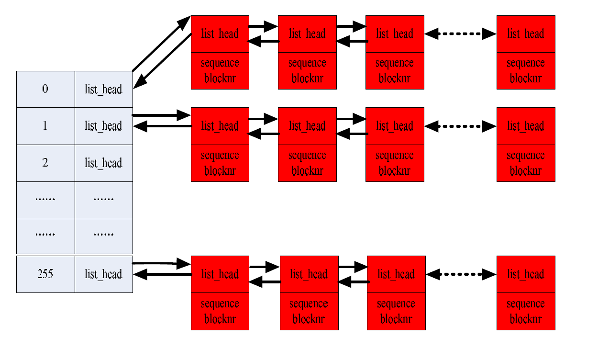

# 问题

## linux内核JBD2日志jh->b_frozen_data与jh->bcommitted_data的区别、什么时候一致、什么时候不一致？

# 基本函数

## ext4_journal_start

```c

ext4_journal_start
    ->__ext4_journal_start
        ->__ext4_journal_start_sb
            ->ext4_journal_check_start
            ->jbd2__journal_start   //journal_start 的主要作用是取得一个原子操作描述符 handle_t，如果当前进程已经有一个，则直接返回；否则，需要新创建一个
                ->start_this_handle //start_this_handle 的主要作用是将该 handle 与当前正在运行的 transaction 相关联，如果没有正在运行的 transaction，则创建一个新的，并将其设置为正在运行的 


handle_t *jbd2__journal_start(journal_t *journal, int nblocks, int rsv_blocks,
			      int revoke_records, gfp_t gfp_mask,
			      unsigned int type, unsigned int line_no)
{
	handle_t *handle = journal_current_handle();
	int err;

	if (!journal)
		return ERR_PTR(-EROFS);

	if (handle) {
		J_ASSERT(handle->h_transaction->t_journal == journal);
		handle->h_ref++;
		return handle;
	}
    /*nblocks 是向日志申请 nblocks 个缓冲区的空间，
    也表明该原子操作预期将修改nblocks 个缓冲区。*/
	nblocks += DIV_ROUND_UP(revoke_records,
				journal->j_revoke_records_per_block);
	handle = new_handle(nblocks);//申请handle结构体
	if (!handle)
		return ERR_PTR(-ENOMEM);
	if (rsv_blocks) {
		handle_t *rsv_handle;

		rsv_handle = new_handle(rsv_blocks);
		if (!rsv_handle) {
			jbd2_free_handle(handle);
			return ERR_PTR(-ENOMEM);
		}
		rsv_handle->h_reserved = 1;
		rsv_handle->h_journal = journal;
		handle->h_rsv_handle = rsv_handle;
	}
	handle->h_revoke_credits = revoke_records;

	err = start_this_handle(journal, handle, gfp_mask);//与transaction建立关联
	if (err < 0) {
		if (handle->h_rsv_handle)
			jbd2_free_handle(handle->h_rsv_handle);
		jbd2_free_handle(handle);
		return ERR_PTR(err);
	}
	handle->h_type = type;
	handle->h_line_no = line_no;
	trace_jbd2_handle_start(journal->j_fs_dev->bd_dev,
				handle->h_transaction->t_tid, type,
				line_no, nblocks);

	return handle;
}


/*
 * start_this_handle: Given a handle, deal with any locking or stalling
 * needed to make sure that there is enough journal space for the handle
 * to begin.  Attach the handle to a transaction and set up the
 * transaction's buffer credits.
 */

static int start_this_handle(journal_t *journal, handle_t *handle,
			     gfp_t gfp_mask)
{
	transaction_t	*transaction, *new_transaction = NULL;
	int		blocks = handle->h_total_credits;
	int		rsv_blocks = 0;
	unsigned long ts = jiffies;

	if (handle->h_rsv_handle)
		rsv_blocks = handle->h_rsv_handle->h_total_credits;

	/*
	 * Limit the number of reserved credits to 1/2 of maximum transaction
	 * size and limit the number of total credits to not exceed maximum
	 * transaction size per operation.
	 */
	if (rsv_blocks > jbd2_max_user_trans_buffers(journal) / 2 ||
	    rsv_blocks + blocks > jbd2_max_user_trans_buffers(journal)) {
		printk(KERN_ERR "JBD2: %s wants too many credits "
		       "credits:%d rsv_credits:%d max:%d\n",
		       current->comm, blocks, rsv_blocks,
		       jbd2_max_user_trans_buffers(journal));
		WARN_ON(1);
		return -ENOSPC;
	}

alloc_transaction:
	/*
	 * This check is racy but it is just an optimization of allocating new
	 * transaction early if there are high chances we'll need it. If we
	 * guess wrong, we'll retry or free unused transaction.
	 */
	if (!data_race(journal->j_running_transaction)) {
		/*
		 * If __GFP_FS is not present, then we may be being called from
		 * inside the fs writeback layer, so we MUST NOT fail.
		 */
		if ((gfp_mask & __GFP_FS) == 0)
			gfp_mask |= __GFP_NOFAIL;
		new_transaction = kmem_cache_zalloc(transaction_cache,
						    gfp_mask);
		if (!new_transaction)
			return -ENOMEM;
	}

	jbd2_debug(3, "New handle %p going live.\n", handle);

	/*
	 * We need to hold j_state_lock until t_updates has been incremented,
	 * for proper journal barrier handling
	 */
repeat:
	read_lock(&journal->j_state_lock);
	BUG_ON(journal->j_flags & JBD2_UNMOUNT);
	if (is_journal_aborted(journal) ||
	    (journal->j_errno != 0 && !(journal->j_flags & JBD2_ACK_ERR))) {
		read_unlock(&journal->j_state_lock);
		jbd2_journal_free_transaction(new_transaction);
		return -EROFS;
	}

	/*
	 * Wait on the journal's transaction barrier if necessary. Specifically
	 * we allow reserved handles to proceed because otherwise commit could
	 * deadlock on page writeback not being able to complete.
	 */
	if (!handle->h_reserved && journal->j_barrier_count) {
		read_unlock(&journal->j_state_lock);
		wait_event(journal->j_wait_transaction_locked,
				journal->j_barrier_count == 0);
		goto repeat;
	}

	if (!journal->j_running_transaction) {
		read_unlock(&journal->j_state_lock);
		if (!new_transaction)
			goto alloc_transaction;
		write_lock(&journal->j_state_lock);
		if (!journal->j_running_transaction &&
		    (handle->h_reserved || !journal->j_barrier_count)) {
			//初始化new_transaction结构体，同时journal->j_running_transaction = new_transaction
			jbd2_get_transaction(journal, new_transaction);
			new_transaction = NULL;
		}
		write_unlock(&journal->j_state_lock);
		goto repeat;
	}
/*以上代码处理如果没有正在运行的 transaction，则创建一个新的，并将其设置为正在运行的*/

	transaction = journal->j_running_transaction;

	if (!handle->h_reserved) {
		/* We may have dropped j_state_lock - restart in that case */
		/* 查询transaction上的credits是否足够，不够进入等待队列，并返回1。否则返回0*/
		if (add_transaction_credits(journal, blocks, rsv_blocks)) {
			/*
			 * add_transaction_credits releases
			 * j_state_lock on a non-zero return
			 */
			__release(&journal->j_state_lock);
			goto repeat;
		}
	} else {
		/*
		 * We have handle reserved so we are allowed to join T_LOCKED
		 * transaction and we don't have to check for transaction size
		 * and journal space. But we still have to wait while running
		 * transaction is being switched to a committing one as it
		 * won't wait for any handles anymore.
		 */
		if (transaction->t_state == T_SWITCH) {
			wait_transaction_switching(journal);
			goto repeat;
		}
		sub_reserved_credits(journal, blocks);
		handle->h_reserved = 0;
	}

	/* OK, account for the buffers that this operation expects to
	 * use and add the handle to the running transaction.
	 * 初始化handle的结构体长远，完成与running transaction绑定
	 */
	update_t_max_wait(transaction, ts);//最近一次handle加入transaction的时间
	handle->h_transaction = transaction;
	handle->h_requested_credits = blocks;
	handle->h_revoke_credits_requested = handle->h_revoke_credits;
	handle->h_start_jiffies = jiffies;//handle开始的时间
	atomic_inc(&transaction->t_updates);
	atomic_inc(&transaction->t_handle_count);
	jbd2_debug(4, "Handle %p given %d credits (total %d, free %lu)\n",
		  handle, blocks,
		  atomic_read(&transaction->t_outstanding_credits),
		  jbd2_log_space_left(journal));
	read_unlock(&journal->j_state_lock);
	current->journal_info = handle;//handle与当前进程绑定

	rwsem_acquire_read(&journal->j_trans_commit_map, 0, 0, _THIS_IP_);
	jbd2_journal_free_transaction(new_transaction);
	/*
	 * Ensure that no allocations done while the transaction is open are
	 * going to recurse back to the fs layer.
	 */
	 //设置PF_MEMALLOC_NOFS标记到当前进程，返回旧的标记后边恢复
	handle->saved_alloc_context = memalloc_nofs_save();
	return 0;
}
```

## jbd2_journal_stop
```c

/**
 * jbd2_journal_stop() - complete a transaction
 * @handle: transaction to complete.
 *
 * All done for a particular handle.
 *
 * There is not much action needed here.  We just return any remaining
 * buffer credits to the transaction and remove the handle.  The only
 * complication is that we need to start a commit operation if the
 * filesystem is marked for synchronous update.
 *
 * jbd2_journal_stop itself will not usually return an error, but it may
 * do so in unusual circumstances.  In particular, expect it to
 * return -EIO if a jbd2_journal_abort has been executed since the
 * transaction began.
 */
int jbd2_journal_stop(handle_t *handle)
{
	transaction_t *transaction = handle->h_transaction;
	journal_t *journal;
	int err = 0, wait_for_commit = 0;
	tid_t tid;
	pid_t pid;

	if (--handle->h_ref > 0) {
		jbd2_debug(4, "h_ref %d -> %d\n", handle->h_ref + 1,
						 handle->h_ref);
		if (is_handle_aborted(handle))
			return -EIO;
		return 0;
	}
	if (!transaction) {
		/*
		 * Handle is already detached from the transaction so there is
		 * nothing to do other than free the handle.
		 */
		memalloc_nofs_restore(handle->saved_alloc_context);
		goto free_and_exit;
	}
	journal = transaction->t_journal;
	tid = transaction->t_tid;//jbd2_get_transaction()函数中设置

	if (is_handle_aborted(handle))
		err = -EIO;

	jbd2_debug(4, "Handle %p going down\n", handle);
	trace_jbd2_handle_stats(journal->j_fs_dev->bd_dev,
				tid, handle->h_type, handle->h_line_no,
				jiffies - handle->h_start_jiffies,
				handle->h_sync, handle->h_requested_credits,
				(handle->h_requested_credits -
				 handle->h_total_credits));

	/*
	 * Implement synchronous transaction batching.  If the handle
	 * was synchronous, don't force a commit immediately.  Let's
	 * yield and let another thread piggyback onto this
	 * transaction.  Keep doing that while new threads continue to
	 * arrive.  It doesn't cost much - we're about to run a commit
	 * and sleep on IO anyway.  Speeds up many-threaded, many-dir
	 * operations by 30x or more...
	 *
	 * We try and optimize the sleep time against what the
	 * underlying disk can do, instead of having a static sleep
	 * time.  This is useful for the case where our storage is so
	 * fast that it is more optimal to go ahead and force a flush
	 * and wait for the transaction to be committed than it is to
	 * wait for an arbitrary amount of time for new writers to
	 * join the transaction.  We achieve this by measuring how
	 * long it takes to commit a transaction, and compare it with
	 * how long this transaction has been running, and if run time
	 * < commit time then we sleep for the delta and commit.  This
	 * greatly helps super fast disks that would see slowdowns as
	 * more threads started doing fsyncs.
	 *
	 * But don't do this if this process was the most recent one
	 * to perform a synchronous write.  We do this to detect the
	 * case where a single process is doing a stream of sync
	 * writes.  No point in waiting for joiners in that case.
	 *
	 * Setting max_batch_time to 0 disables this completely.
	 * 如果是同步操作，需要等日志commit完成，反正都要等，不如等的时间长一点
	 * 顺便等一下之前积累的commit
	 */
	pid = current->pid;
	if (handle->h_sync && journal->j_last_sync_writer != pid &&
	    journal->j_max_batch_time) {
		u64 commit_time, trans_time;

		journal->j_last_sync_writer = pid;

		read_lock(&journal->j_state_lock);
		commit_time = journal->j_average_commit_time;
		read_unlock(&journal->j_state_lock);

		trans_time = ktime_to_ns(ktime_sub(ktime_get(),
						   transaction->t_start_time));

		commit_time = max_t(u64, commit_time,
				    1000*journal->j_min_batch_time);
		commit_time = min_t(u64, commit_time,
				    1000*journal->j_max_batch_time);

		if (trans_time < commit_time) {
			ktime_t expires = ktime_add_ns(ktime_get(),
						       commit_time);
			set_current_state(TASK_UNINTERRUPTIBLE);
			schedule_hrtimeout(&expires, HRTIMER_MODE_ABS);
		}
	}

	if (handle->h_sync)
		transaction->t_synchronous_commit = 1;

	/*
	 * If the handle is marked SYNC, we need to set another commit
	 * going!  We also want to force a commit if the transaction is too
	 * old now.
	 * 设置同步标记，或者事务存在了很长时间，要强制提交
	 */
	if (handle->h_sync ||
	    time_after_eq(jiffies, transaction->t_expires)) {
		/* Do this even for aborted journals: an abort still
		 * completes the commit thread, it just doesn't write
		 * anything to disk. */

		jbd2_debug(2, "transaction too old, requesting commit for "
					"handle %p\n", handle);
		/* This is non-blocking */
		jbd2_log_start_commit(journal, tid);//唤醒在journal->j_wait_commit上等待的进程

		/*
		 * Special case: JBD2_SYNC synchronous updates require us
		 * to wait for the commit to complete.
		 */
		if (handle->h_sync && !(current->flags & PF_MEMALLOC))
			wait_for_commit = 1;
	}

	/*
	 * Once stop_this_handle() drops t_updates, the transaction could start
	 * committing on us and eventually disappear.  So we must not
	 * dereference transaction pointer again after calling
	 * stop_this_handle().
	 */
	stop_this_handle(handle);

	if (wait_for_commit)
		err = jbd2_log_wait_commit(journal, tid);//等待ID为tid的commit完成

free_and_exit:
	if (handle->h_rsv_handle)
		jbd2_free_handle(handle->h_rsv_handle);
	jbd2_free_handle(handle);
	return err;
}


static void stop_this_handle(handle_t *handle)
{
	transaction_t *transaction = handle->h_transaction;
	journal_t *journal = transaction->t_journal;
	int revokes;

	J_ASSERT(journal_current_handle() == handle);
	J_ASSERT(atomic_read(&transaction->t_updates) > 0);
	current->journal_info = NULL;
	/*
	 * Subtract necessary revoke descriptor blocks from handle credits. We
	 * take care to account only for revoke descriptor blocks the
	 * transaction will really need as large sequences of transactions with
	 * small numbers of revokes are relatively common.
	 */
	revokes = handle->h_revoke_credits_requested - handle->h_revoke_credits;
	if (revokes) {
		int t_revokes, revoke_descriptors;
		int rr_per_blk = journal->j_revoke_records_per_block;

		WARN_ON_ONCE(DIV_ROUND_UP(revokes, rr_per_blk)
				> handle->h_total_credits);
		t_revokes = atomic_add_return(revokes,
				&transaction->t_outstanding_revokes);
		revoke_descriptors =
			DIV_ROUND_UP(t_revokes, rr_per_blk) -
			DIV_ROUND_UP(t_revokes - revokes, rr_per_blk);
		handle->h_total_credits -= revoke_descriptors;
	}
	atomic_sub(handle->h_total_credits,
		   &transaction->t_outstanding_credits);
	if (handle->h_rsv_handle)
		__jbd2_journal_unreserve_handle(handle->h_rsv_handle,
						transaction);//唤醒journal->j_wait_reserved
	if (atomic_dec_and_test(&transaction->t_updates))
		wake_up(&journal->j_wait_updates);//等待handle完成的等待队列

	rwsem_release(&journal->j_trans_commit_map, _THIS_IP_);
	/*
	 * Scope of the GFP_NOFS context is over here and so we can restore the
	 * original alloc context.
	 */
	memalloc_nofs_restore(handle->saved_alloc_context);
}

```
## jbd2_journal_get_create_access
```c


/*
 * When the user wants to journal a newly created buffer_head
 * (ie. getblk() returned a new buffer and we are going to populate it
 * manually rather than reading off disk), then we need to keep the
 * buffer_head locked until it has been completely filled with new
 * data.  In this case, we should be able to make the assertion that
 * the bh is not already part of an existing transaction.
 *
 * The buffer should already be locked by the caller by this point.
 * There is no lock ranking violation: it was a newly created,
 * unlocked buffer beforehand. */

/**
 * jbd2_journal_get_create_access () - notify intent to use newly created bh
 * @handle: transaction to new buffer to
 * @bh: new buffer.
 *
 * Call this if you create a new bh.
 */
int jbd2_journal_get_create_access(handle_t *handle, struct buffer_head *bh)
{
	transaction_t *transaction = handle->h_transaction;
	journal_t *journal;
	struct journal_head *jh = jbd2_journal_add_journal_head(bh);//申请journal_head并与buffer_head关联
	int err;

	jbd2_debug(5, "journal_head %p\n", jh);
	err = -EROFS;
	if (is_handle_aborted(handle))
		goto out;
	journal = transaction->t_journal;
	err = 0;

	JBUFFER_TRACE(jh, "entry");
	/*
	 * The buffer may already belong to this transaction due to pre-zeroing
	 * in the filesystem's new_block code.  It may also be on the previous,
	 * committing transaction's lists, but it HAS to be in Forget state in
	 * that case: the transaction must have deleted the buffer for it to be
	 * reused here.
	 */
	spin_lock(&jh->b_state_lock);
	J_ASSERT_JH(jh, (jh->b_transaction == transaction ||
		jh->b_transaction == NULL ||
		(jh->b_transaction == journal->j_committing_transaction &&
			  jh->b_jlist == BJ_Forget)));

	/*J_ASSERT_JH,条件成立，继续执行后续代码，条件不成立输出崩溃信息*/
	J_ASSERT_JH(jh, jh->b_next_transaction == NULL);
	J_ASSERT_JH(jh, buffer_locked(jh2bh(jh)));

	if (jh->b_transaction == NULL) {//新申请或者已经提交完成的jh
		/*
		 * Previous jbd2_journal_forget() could have left the buffer
		 * with jbddirty bit set because it was being committed. When
		 * the commit finished, we've filed the buffer for
		 * checkpointing and marked it dirty. Now we are reallocating
		 * the buffer so the transaction freeing it must have
		 * committed and so it's safe to clear the dirty bit.
		 */
		clear_buffer_dirty(jh2bh(jh));
		/* first access by this transaction */
		jh->b_modified = 0;

		JBUFFER_TRACE(jh, "file as BJ_Reserved");
		spin_lock(&journal->j_list_lock);
		/*将jh添加到transaction的t_reserved_list列表，表明已被transaction管理，但并未修改
		 * jh->b_jcount计数加1*/
		__jbd2_journal_file_buffer(jh, transaction, BJ_Reserved);
		spin_unlock(&journal->j_list_lock);
	} else if (jh->b_transaction == journal->j_committing_transaction) {//有transaction正在处理jh
		/* first access by this transaction */
		jh->b_modified = 0;

		JBUFFER_TRACE(jh, "set next transaction");
		spin_lock(&journal->j_list_lock);
		jh->b_next_transaction = transaction;//当前的transaction处理完后由handle->h_transaction接着处理
		spin_unlock(&journal->j_list_lock);
	}
	spin_unlock(&jh->b_state_lock);

	/*
	 * akpm: I added this.  ext3_alloc_branch can pick up new indirect
	 * blocks which contain freed but then revoked metadata.  We need
	 * to cancel the revoke in case we end up freeing it yet again
	 * and the reallocating as data - this would cause a second revoke,
	 * which hits an assertion error.
	 */
	JBUFFER_TRACE(jh, "cancelling revoke");
	jbd2_journal_cancel_revoke(handle, jh);// 现在很明显该jh是文件系统需要的了，不应该再被revoke
out:
	jbd2_journal_put_journal_head(jh);
	return err;
}


/*
 * A journal_head is attached to a buffer_head whenever JBD has an
 * interest in the buffer.
 *
 * Whenever a buffer has an attached journal_head, its ->b_state:BH_JBD bit
 * is set.  This bit is tested in core kernel code where we need to take
 * JBD-specific actions.  Testing the zeroness of ->b_private is not reliable
 * there.
 *
 * When a buffer has its BH_JBD bit set, its ->b_count is elevated by one.
 *
 * When a buffer has its BH_JBD bit set it is immune from being released by
 * core kernel code, mainly via ->b_count.
 *
 * A journal_head is detached from its buffer_head when the journal_head's
 * b_jcount reaches zero. Running transaction (b_transaction) and checkpoint
 * transaction (b_cp_transaction) hold their references to b_jcount.
 *
 * Various places in the kernel want to attach a journal_head to a buffer_head
 * _before_ attaching the journal_head to a transaction.  To protect the
 * journal_head in this situation, jbd2_journal_add_journal_head elevates the
 * journal_head's b_jcount refcount by one.  The caller must call
 * jbd2_journal_put_journal_head() to undo this.
 *
 * So the typical usage would be:
 *
 *	(Attach a journal_head if needed.  Increments b_jcount)
 *	struct journal_head *jh = jbd2_journal_add_journal_head(bh);
 *	...
 *      (Get another reference for transaction)
 *	jbd2_journal_grab_journal_head(bh);
 *	jh->b_transaction = xxx;
 *	(Put original reference)
 *	jbd2_journal_put_journal_head(jh);
 */

/*
 * Give a buffer_head a journal_head.
 *
 * May sleep.
 */
struct journal_head *jbd2_journal_add_journal_head(struct buffer_head *bh)
{
	struct journal_head *jh;
	struct journal_head *new_jh = NULL;

repeat:
	if (!buffer_jbd(bh))
		new_jh = journal_alloc_journal_head();

	jbd_lock_bh_journal_head(bh);//bit锁BH_JournalHead
	if (buffer_jbd(bh)) {
		jh = bh2jh(bh);//journal_head = bh->b_private
	} else {
		J_ASSERT_BH(bh,
			(atomic_read(&bh->b_count) > 0) ||
			(bh->b_folio && bh->b_folio->mapping));

		if (!new_jh) {
			jbd_unlock_bh_journal_head(bh);
			goto repeat;
		}

		jh = new_jh;
		new_jh = NULL;		/* We consumed it */
		set_buffer_jbd(bh);//设置BH_JBD位，表示已关联journal_head
		bh->b_private = jh;
		jh->b_bh = bh;
		get_bh(bh);//bh->b_count计数加1
		BUFFER_TRACE(bh, "added journal_head");
	}
	jh->b_jcount++;//计数加1
	jbd_unlock_bh_journal_head(bh);
	if (new_jh)
		journal_free_journal_head(new_jh);
	return bh->b_private;
}
```

## jbd2_journal_get_write_access
```c
jbd2_journal_get_write_access
	->jbd2_journal_add_journal_head
	->do_get_write_access

/*
 * If the buffer is already part of the current transaction, then there
 * is nothing we need to do.  If it is already part of a prior
 * transaction which we are still committing to disk, then we need to
 * make sure that we do not overwrite the old copy: we do copy-out to
 * preserve the copy going to disk.  We also account the buffer against
 * the handle's metadata buffer credits (unless the buffer is already
 * part of the transaction, that is).
 *
 */
static int
do_get_write_access(handle_t *handle, struct journal_head *jh,
			int force_copy)
{
	struct buffer_head *bh;
	transaction_t *transaction = handle->h_transaction;
	journal_t *journal;
	int error;
	char *frozen_buffer = NULL;
	unsigned long start_lock, time_lock;

	journal = transaction->t_journal;

	jbd2_debug(5, "journal_head %p, force_copy %d\n", jh, force_copy);

	JBUFFER_TRACE(jh, "entry");
repeat:
	bh = jh2bh(jh);

	/* @@@ Need to check for errors here at some point. */

 	start_lock = jiffies;
	lock_buffer(bh);
	spin_lock(&jh->b_state_lock);

	/* If it takes too long to lock the buffer, trace it等锁等了好久 */
	time_lock = jbd2_time_diff(start_lock, jiffies);
	if (time_lock > HZ/10)
		trace_jbd2_lock_buffer_stall(bh->b_bdev->bd_dev,
			jiffies_to_msecs(time_lock));

	/* We now hold the buffer lock so it is safe to query the buffer
	 * state.  Is the buffer dirty?
	 *
	 * If so, there are two possibilities.  The buffer may be
	 * non-journaled, and undergoing a quite legitimate writeback.
	 * Otherwise, it is journaled, and we don't expect dirty buffers
	 * in that state (the buffers should be marked JBD_Dirty
	 * instead.)  So either the IO is being done under our own
	 * control and this is a bug, or it's a third party IO such as
	 * dump(8) (which may leave the buffer scheduled for read ---
	 * ie. locked but not dirty) or tune2fs (which may actually have
	 * the buffer dirtied, ugh.)  */
	/* 从数据是否与磁盘一致的角度看，缓冲区可分为dirty与update两种状态。
	 * 纳入jbd管理后，缓冲区的脏状态将由jbd管理。*/
	if (buffer_dirty(bh) && jh->b_transaction) {
		warn_dirty_buffer(bh);
		/*
		 * We need to clean the dirty flag and we must do it under the
		 * buffer lock to be sure we don't race with running write-out.
		 */
		JBUFFER_TRACE(jh, "Journalling dirty buffer");
		clear_buffer_dirty(bh);
		/*
		 * The buffer is going to be added to BJ_Reserved list now and
		 * nothing guarantees jbd2_journal_dirty_metadata() will be
		 * ever called for it. So we need to set jbddirty bit here to
		 * make sure the buffer is dirtied and written out when the
		 * journaling machinery is done with it.
		 */
		set_buffer_jbddirty(bh);
	}

	error = -EROFS;
	if (is_handle_aborted(handle)) {
		spin_unlock(&jh->b_state_lock);
		unlock_buffer(bh);
		goto out;
	}
	error = 0;

	/*
	 * The buffer is already part of this transaction if b_transaction or
	 * b_next_transaction points to it
	 */
	if (jh->b_transaction == transaction ||//已经被当前transaction管理
	    jh->b_next_transaction == transaction) {
		unlock_buffer(bh);
		goto done;
	}

	/*
	 * this is the first time this transaction is touching this buffer,
	 * reset the modified flag
	 */
	jh->b_modified = 0;

	/*
	 * If the buffer is not journaled right now, we need to make sure it
	 * doesn't get written to disk before the caller actually commits the
	 * new data
	 */
	if (!jh->b_transaction) {
		JBUFFER_TRACE(jh, "no transaction");
		J_ASSERT_JH(jh, !jh->b_next_transaction);
		JBUFFER_TRACE(jh, "file as BJ_Reserved");
		/*
		 * Make sure all stores to jh (b_modified, b_frozen_data) are
		 * visible before attaching it to the running transaction.
		 * Paired with barrier in jbd2_write_access_granted()
		 */
		smp_wmb();
		spin_lock(&journal->j_list_lock);
		if (test_clear_buffer_dirty(bh)) {
			/*
			 * Execute buffer dirty clearing and jh->b_transaction
			 * assignment under journal->j_list_lock locked to
			 * prevent bh being removed from checkpoint list if
			 * the buffer is in an intermediate state (not dirty
			 * and jh->b_transaction is NULL).
			 */
			JBUFFER_TRACE(jh, "Journalling dirty buffer");
			set_buffer_jbddirty(bh);
		}
		__jbd2_journal_file_buffer(jh, transaction, BJ_Reserved);
		spin_unlock(&journal->j_list_lock);
		unlock_buffer(bh);
		goto done;
	}
	unlock_buffer(bh);

	/*
	 * If there is already a copy-out version of this buffer, then we don't
	 * need to make another one
	 * 该jh已经被旧的某个transaction管理了
	 * 设置b_next_transaction的值，表示旧的transaction处理完本jh之后，
	 * 本transaction会继续处理该jh。b_frozen_data 已经存在了，则不需要再拷贝了
	 */
	if (jh->b_frozen_data) {
		JBUFFER_TRACE(jh, "has frozen data");
		J_ASSERT_JH(jh, jh->b_next_transaction == NULL);
		goto attach_next;
	}

	/* 程序执行到这，说明jh属于旧的transaction
	 */
	JBUFFER_TRACE(jh, "owned by older transaction");
	J_ASSERT_JH(jh, jh->b_next_transaction == NULL);
	J_ASSERT_JH(jh, jh->b_transaction == journal->j_committing_transaction);

	/*
	 * There is one case we have to be very careful about.  If the
	 * committing transaction is currently writing this buffer out to disk
	 * and has NOT made a copy-out, then we cannot modify the buffer
	 * contents at all right now.  The essence of copy-out is that it is
	 * the extra copy, not the primary copy, which gets journaled.  If the
	 * primary copy is already going to disk then we cannot do copy-out
	 * here.
	 * 当前jh正在被commit，切未创建副本，等待
	 */
	if (buffer_shadow(bh)) {
		JBUFFER_TRACE(jh, "on shadow: sleep");
		spin_unlock(&jh->b_state_lock);
		wait_on_bit_io(&bh->b_state, BH_Shadow, TASK_UNINTERRUPTIBLE);
		goto repeat;
	}

	/*
	 * Only do the copy if the currently-owning transaction still needs it.
	 * If buffer isn't on BJ_Metadata list, the committing transaction is
	 * past that stage (here we use the fact that BH_Shadow is set under
	 * bh_state lock together with refiling to BJ_Shadow list and at this
	 * point we know the buffer doesn't have BH_Shadow set).
	 *
	 * Subtle point, though: if this is a get_undo_access, then we will be
	 * relying on the frozen_data to contain the new value of the
	 * committed_data record after the transaction, so we HAVE to force the
	 * frozen_data copy in that case.
	 * 当前transaction任然需要修改前的数据，给数据做一个备份
	 */
	if (jh->b_jlist == BJ_Metadata || force_copy) {
		JBUFFER_TRACE(jh, "generate frozen data");
		if (!frozen_buffer) {
			JBUFFER_TRACE(jh, "allocate memory for buffer");
			spin_unlock(&jh->b_state_lock);
			frozen_buffer = jbd2_alloc(jh2bh(jh)->b_size,
						   GFP_NOFS | __GFP_NOFAIL);
			goto repeat;
		}
		jh->b_frozen_data = frozen_buffer;
		frozen_buffer = NULL;
		jbd2_freeze_jh_data(jh);//将当前数据拷贝到frozen_buffer中
	}
attach_next:
	/*
	 * Make sure all stores to jh (b_modified, b_frozen_data) are visible
	 * before attaching it to the running transaction. Paired with barrier
	 * in jbd2_write_access_granted()
	 */
	smp_wmb();
	jh->b_next_transaction = transaction;

done:
	spin_unlock(&jh->b_state_lock);

	/*
	 * If we are about to journal a buffer, then any revoke pending on it is
	 * no longer valid
	 */
	jbd2_journal_cancel_revoke(handle, jh);

out:
	if (unlikely(frozen_buffer))	/* It's usually NULL */
		jbd2_free(frozen_buffer, bh->b_size);

	JBUFFER_TRACE(jh, "exit");
	return error;
}


```
## jbd2_journal_get_undo_access
```c
	
/**
 * jbd2_journal_get_undo_access() -  Notify intent to modify metadata with
 *     non-rewindable consequences
 * @handle: transaction
 * @bh: buffer to undo
 *
 * Sometimes there is a need to distinguish between metadata which has
 * been committed to disk and that which has not.  The ext3fs code uses
 * this for freeing and allocating space, we have to make sure that we
 * do not reuse freed space until the deallocation has been committed,
 * since if we overwrote that space we would make the delete
 * un-rewindable in case of a crash.
 *
 * To deal with that, jbd2_journal_get_undo_access requests write access to a
 * buffer for parts of non-rewindable operations such as delete
 * operations on the bitmaps.  The journaling code must keep a copy of
 * the buffer's contents prior to the undo_access call until such time
 * as we know that the buffer has definitely been committed to disk.
 *
 * We never need to know which transaction the committed data is part
 * of, buffers touched here are guaranteed to be dirtied later and so
 * will be committed to a new transaction in due course, at which point
 * we can discard the old committed data pointer.
 *
 * Returns error number or 0 on success.
 */
int jbd2_journal_get_undo_access(handle_t *handle, struct buffer_head *bh)
{
	int err;
	struct journal_head *jh;
	char *committed_data = NULL;

	if (is_handle_aborted(handle))
		return -EROFS;

	/* bh已经关联了jh，并且已经挂到了handle->h_transaction上*/
	if (jbd2_write_access_granted(handle, bh, true))
		return 0;

	jh = jbd2_journal_add_journal_head(bh);
	JBUFFER_TRACE(jh, "entry");

	/*
	 * Do this first --- it can drop the journal lock, so we want to
	 * make sure that obtaining the committed_data is done
	 * atomically wrt. completion of any outstanding commits.
	 */
	err = do_get_write_access(handle, jh, 1);
	if (err)
		goto out;

repeat:
	if (!jh->b_committed_data)
		committed_data = jbd2_alloc(jh2bh(jh)->b_size,
					    GFP_NOFS|__GFP_NOFAIL);

	spin_lock(&jh->b_state_lock);
	if (!jh->b_committed_data) {
		/* Copy out the current buffer contents into the
		 * preserved, committed copy. */
		JBUFFER_TRACE(jh, "generate b_committed data");
		if (!committed_data) {
			spin_unlock(&jh->b_state_lock);
			goto repeat;
		}

		jh->b_committed_data = committed_data;
		committed_data = NULL;
		memcpy(jh->b_committed_data, bh->b_data, bh->b_size);
	}
	spin_unlock(&jh->b_state_lock);
out:
	jbd2_journal_put_journal_head(jh);
	if (unlikely(committed_data))
		jbd2_free(committed_data, bh->b_size);
	return err;
}
```
## jbd2_journal_dirty_metadata

jbd2_journal_dirty_metadata()的作用是通知jbd一个元数据块缓冲区的修改已经完成
```c
/**
 * jbd2_journal_dirty_metadata() -  mark a buffer as containing dirty metadata
 * @handle: transaction to add buffer to.
 * @bh: buffer to mark
 *
 * mark dirty metadata which needs to be journaled as part of the current
 * transaction.
 *
 * The buffer must have previously had jbd2_journal_get_write_access()
 * called so that it has a valid journal_head attached to the buffer
 * head.
 *
 * The buffer is placed on the transaction's metadata list and is marked
 * as belonging to the transaction.
 *
 * Returns error number or 0 on success.
 *
 * Special care needs to be taken if the buffer already belongs to the
 * current committing transaction (in which case we should have frozen
 * data present for that commit).  In that case, we don't relink the
 * buffer: that only gets done when the old transaction finally
 * completes its commit.
 */
int jbd2_journal_dirty_metadata(handle_t *handle, struct buffer_head *bh)
{
	transaction_t *transaction = handle->h_transaction;
	journal_t *journal;
	struct journal_head *jh;
	int ret = 0;

	if (!buffer_jbd(bh))
		return -EUCLEAN;

	/*
	 * We don't grab jh reference here since the buffer must be part
	 * of the running transaction.
	 */
	jh = bh2jh(bh);
	jbd2_debug(5, "journal_head %p\n", jh);
	JBUFFER_TRACE(jh, "entry");

	/*
	 * This and the following assertions are unreliable since we may see jh
	 * in inconsistent state unless we grab bh_state lock. But this is
	 * crucial to catch bugs so let's do a reliable check until the
	 * lockless handling is fully proven.
	 */
	if (data_race(jh->b_transaction != transaction &&
	    jh->b_next_transaction != transaction)) {
		spin_lock(&jh->b_state_lock);
		J_ASSERT_JH(jh, jh->b_transaction == transaction ||
				jh->b_next_transaction == transaction);
		spin_unlock(&jh->b_state_lock);
	}
	if (jh->b_modified == 1) {
		/* If it's in our transaction it must be in BJ_Metadata list. */
		if (data_race(jh->b_transaction == transaction &&
		    jh->b_jlist != BJ_Metadata)) {
			spin_lock(&jh->b_state_lock);
			if (jh->b_transaction == transaction &&
			    jh->b_jlist != BJ_Metadata)
				pr_err("JBD2: assertion failure: h_type=%u "
				       "h_line_no=%u block_no=%llu jlist=%u\n",
				       handle->h_type, handle->h_line_no,
				       (unsigned long long) bh->b_blocknr,
				       jh->b_jlist);
			J_ASSERT_JH(jh, jh->b_transaction != transaction ||
					jh->b_jlist == BJ_Metadata);
			spin_unlock(&jh->b_state_lock);
		}
		goto out;
	}

	journal = transaction->t_journal;
	spin_lock(&jh->b_state_lock);

	if (is_handle_aborted(handle)) {
		/*
		 * Check journal aborting with @jh->b_state_lock locked,
		 * since 'jh->b_transaction' could be replaced with
		 * 'jh->b_next_transaction' during old transaction
		 * committing if journal aborted, which may fail
		 * assertion on 'jh->b_frozen_data == NULL'.
		 */
		ret = -EROFS;
		goto out_unlock_bh;
	}

	if (jh->b_modified == 0) {
		/*
		 * This buffer's got modified and becoming part
		 * of the transaction. This needs to be done
		 * once a transaction -bzzz
		 */
		if (WARN_ON_ONCE(jbd2_handle_buffer_credits(handle) <= 0)) {
			ret = -ENOSPC;
			goto out_unlock_bh;
		}
		jh->b_modified = 1;//标记jh被修改
		handle->h_total_credits--;
	}

	/*
	 * fastpath, to avoid expensive locking.  If this buffer is already
	 * on the running transaction's metadata list there is nothing to do.
	 * Nobody can take it off again because there is a handle open.
	 * I _think_ we're OK here with SMP barriers - a mistaken decision will
	 * result in this test being false, so we go in and take the locks.
	 * jh已经处于当前transaction上
	 */
	if (jh->b_transaction == transaction && jh->b_jlist == BJ_Metadata) {
		JBUFFER_TRACE(jh, "fastpath");
		if (unlikely(jh->b_transaction !=
			     journal->j_running_transaction)) {
			printk(KERN_ERR "JBD2: %s: "
			       "jh->b_transaction (%llu, %p, %u) != "
			       "journal->j_running_transaction (%p, %u)\n",
			       journal->j_devname,
			       (unsigned long long) bh->b_blocknr,
			       jh->b_transaction,
			       jh->b_transaction ? jh->b_transaction->t_tid : 0,
			       journal->j_running_transaction,
			       journal->j_running_transaction ?
			       journal->j_running_transaction->t_tid : 0);
			ret = -EINVAL;
		}
		goto out_unlock_bh;
	}

	set_buffer_jbddirty(bh);

	/*
	 * Metadata already on the current transaction list doesn't
	 * need to be filed.  Metadata on another transaction's list must
	 * be committing, and will be refiled once the commit completes:
	 * leave it alone for now.
	 * jh不在当前transaction的话必须位于正在提交的transaction或
	 * 下一个将要commit的transaction
	 */
	if (jh->b_transaction != transaction) {
		JBUFFER_TRACE(jh, "already on other transaction");
		if (unlikely(((jh->b_transaction !=
			       journal->j_committing_transaction)) ||
			     (jh->b_next_transaction != transaction))) {
			printk(KERN_ERR "jbd2_journal_dirty_metadata: %s: "
			       "bad jh for block %llu: "
			       "transaction (%p, %u), "
			       "jh->b_transaction (%p, %u), "
			       "jh->b_next_transaction (%p, %u), jlist %u\n",
			       journal->j_devname,
			       (unsigned long long) bh->b_blocknr,
			       transaction, transaction->t_tid,
			       jh->b_transaction,
			       jh->b_transaction ?
			       jh->b_transaction->t_tid : 0,
			       jh->b_next_transaction,
			       jh->b_next_transaction ?
			       jh->b_next_transaction->t_tid : 0,
			       jh->b_jlist);
			WARN_ON(1);
			ret = -EINVAL;
		}
		/* And this case is illegal: we can't reuse another
		 * transaction's data buffer, ever. */
		goto out_unlock_bh;
	}

	/* That test should have eliminated the following case: */
	//结合jbd2_journal_commit_transaction中的jh->b_frozen_data = NULL分析？？？
	J_ASSERT_JH(jh, jh->b_frozen_data == NULL);

	JBUFFER_TRACE(jh, "file as BJ_Metadata");
	spin_lock(&journal->j_list_lock);
	/* 注意，本缓冲区以前可能通过journal_get_XXX_access()加入了BJ_Reserved队
	 * 列，这里要从原队列上移除，然后加入BJ_Metadata队列*/
	__jbd2_journal_file_buffer(jh, transaction, BJ_Metadata);
	spin_unlock(&journal->j_list_lock);
out_unlock_bh:
	spin_unlock(&jh->b_state_lock);
out:
	JBUFFER_TRACE(jh, "exit");
	return ret;
}

```
## jbd2_journal_revoke


jbd在内存中设置了两个hash表用于管理被revoked的缓冲区
```c
struct journal_s
{
	……
	spinlock_t j_revoke_lock; // 保护revoke 哈希表的自旋锁
	struct jbd_revoke_table_s *j_revoke; // 指向journal正在使用的revoke hash table
	struct jbd_revoke_table_s *j_revoke_table[2]; // 指向两个revoke hash table
}
```
为什么jbd 要设置两个hash 表呢？这要从提交revoke 记录说起。当一个正在运行的
transaction要提交时，与之相对应的revoke hash表也要提交。要提交revoke hash表，必须
把其中的数据冻结起来，不再被改动。此时，为了能使jbd能够继续接收revoke记录，则需
为journal设置另一个hash表。所以，jbd设置了两个hash表，供journal交替使用。

hash表初始化见`journal_init_revoke`函数，`journal_init_revoke_table()`函数会创建给定大小的一个hash表，
每个hash表在内存中都由一个jbd_revoke_table_s结构表示。
```c
/* The revoke table is just a simple hash table of revoke records. */
struct jbd2_revoke_table_s
{
	/* It is conceivable that we might want a larger hash table
	 * for recovery.  Must be a power of two. */
	int		  hash_size;
	int		  hash_shift;
	struct list_head *hash_table;
};
```
其中hash_size表示该hash表的大小，hash_table则指向
一个list_head 结构数组，即hash 表。从逻辑上看，这个hash 表中保存的数据是
`jbd_revoke_record_s`结构，但实际上，只是hash表中保存的数据是jbd_revoke_record_s.hash
```c
/* Each revoke record represents one single revoked block.  During
   journal replay, this involves recording the transaction ID of the
   last transaction to revoke this block. */

struct jbd2_revoke_record_s
{
	struct list_head  hash;
	tid_t		  sequence;	/* Used for recovery only */
	unsigned long long	  blocknr;
};
```
其中hash是用于将本结构链入revoke hash表的，sequence是调用revoke的transaction
的ID，blocknr是磁盘块号
`#define JOURNAL_REVOKE_DEFAULT_HASH 256`
所以每个hash表都有256项，每项都是一个用struct list_head链起来的双向链表

```c
/*
 * jbd2_journal_revoke: revoke a given buffer_head from the journal.  This
 * prevents the block from being replayed during recovery if we take a
 * crash after this current transaction commits.  Any subsequent
 * metadata writes of the buffer in this transaction cancel the
 * revoke.
 *
 * Note that this call may block --- it is up to the caller to make
 * sure that there are no further calls to journal_write_metadata
 * before the revoke is complete.  In ext3, this implies calling the
 * revoke before clearing the block bitmap when we are deleting
 * metadata.
 *
 * Revoke performs a jbd2_journal_forget on any buffer_head passed in as a
 * parameter, but does _not_ forget the buffer_head if the bh was only
 * found implicitly.
 *
 * bh_in may not be a journalled buffer - it may have come off
 * the hash tables without an attached journal_head.
 *
 * If bh_in is non-zero, jbd2_journal_revoke() will decrement its b_count
 * by one.
 */

int jbd2_journal_revoke(handle_t *handle, unsigned long long blocknr,
		   struct buffer_head *bh_in)
{
	struct buffer_head *bh = NULL;
	journal_t *journal;
	struct block_device *bdev;
	int err;

	might_sleep();
	if (bh_in)
		BUFFER_TRACE(bh_in, "enter");

	journal = handle->h_transaction->t_journal;
	/*在日志superblock中设置JBD2_FEATURE_INCOMPAT_REVOKE特性*/
	if (!jbd2_journal_set_features(journal, 0, 0, JBD2_FEATURE_INCOMPAT_REVOKE)){
		J_ASSERT (!"Cannot set revoke feature!");
		return -EINVAL;
	}

	bdev = journal->j_fs_dev;
	bh = bh_in;

	if (!bh) {
		/*根据逻辑块号，从块设备中获取到bh*/
		bh = __find_get_block(bdev, blocknr, journal->j_blocksize);
		if (bh)
			BUFFER_TRACE(bh, "found on hash");
	}
#ifdef JBD2_EXPENSIVE_CHECKING
	else {
		struct buffer_head *bh2;

		/* If there is a different buffer_head lying around in
		 * memory anywhere... */
		bh2 = __find_get_block(bdev, blocknr, journal->j_blocksize);
		if (bh2) {
			/* ... and it has RevokeValid status... */
			if (bh2 != bh && buffer_revokevalid(bh2))
				/* ...then it better be revoked too,
				 * since it's illegal to create a revoke
				 * record against a buffer_head which is
				 * not marked revoked --- that would
				 * risk missing a subsequent revoke
				 * cancel. */
				J_ASSERT_BH(bh2, buffer_revoked(bh2));
			put_bh(bh2);
		}
	}
#endif

	if (WARN_ON_ONCE(handle->h_revoke_credits <= 0)) {//revoke额度不够
		if (!bh_in)
			brelse(bh);
		return -EIO;
	}
	/* We really ought not ever to revoke twice in a row without
           first having the revoke cancelled: it's illegal to free a
           block twice without allocating it in between! */
	if (bh) {
		if (!J_EXPECT_BH(bh, !buffer_revoked(bh),
				 "inconsistent data on disk")) {
			if (!bh_in)
				brelse(bh);
			return -EIO;//不可以连续revoke同一个bh 2次
		}
		set_buffer_revoked(bh);
		set_buffer_revokevalid(bh);
		if (bh_in) {
			BUFFER_TRACE(bh_in, "call jbd2_journal_forget");
			jbd2_journal_forget(handle, bh_in);//将bh之前的修改取消掉，添加到BJ_Forget队列上
		} else {
			BUFFER_TRACE(bh, "call brelse");
			__brelse(bh);
		}
	}
	handle->h_revoke_credits--;//revoke额度减一

	jbd2_debug(2, "insert revoke for block %llu, bh_in=%p\n",blocknr, bh_in);
	err = insert_revoke_hash(journal, blocknr,
				handle->h_transaction->t_tid);//添加到hash表中
	BUFFER_TRACE(bh_in, "exit");
	return err;
}
```

## 元数据缓冲区处理流程

当文件系统要把一个元数据块纳入jbd管理时，处理流程需要5步：
1) 获取一个原子操作描述符
调用journal_start()函数。
2) 取得在jbd中的写权限
这个针对不同的元数据缓冲区，调用的函数是不同的：
新创建的：journal_get_create_access()、
文件系统中已经存在的：journal_get_write_access()
磁盘块位图：journal_get_undo_access()
3) 修改缓冲区的数据
这里文件系统可以根据自己的需要随意修改了。
4) 将缓冲区设置为脏
调用journal_dirty_metadata()函数。
5) 关闭原子操作符
调用journal_stop()函数。

```c


ext4_create
	->ext4_new_inode_start_handle
		->__ext4_new_inode


/*
 * There are two policies for allocating an inode.  If the new inode is
 * a directory, then a forward search is made for a block group with both
 * free space and a low directory-to-inode ratio; if that fails, then of
 * the groups with above-average free space, that group with the fewest
 * directories already is chosen.
 *
 * For other inodes, search forward from the parent directory's block
 * group to find a free inode.
 */
struct inode *__ext4_new_inode(struct mnt_idmap *idmap,
			       handle_t *handle, struct inode *dir,
			       umode_t mode, const struct qstr *qstr,
			       __u32 goal, uid_t *owner, __u32 i_flags,
			       int handle_type, unsigned int line_no,
			       int nblocks)
{
	struct super_block *sb;
	struct buffer_head *inode_bitmap_bh = NULL;
	struct buffer_head *group_desc_bh;
	ext4_group_t ngroups, group = 0;
	unsigned long ino = 0;
	struct inode *inode;
	struct ext4_group_desc *gdp = NULL;
	struct ext4_inode_info *ei;
	struct ext4_sb_info *sbi;
	int ret2, err;
	struct inode *ret;
	ext4_group_t i;
	ext4_group_t flex_group;
	struct ext4_group_info *grp = NULL;
	bool encrypt = false;

	/* Cannot create files in a deleted directory */
	if (!dir || !dir->i_nlink)
		return ERR_PTR(-EPERM);

	sb = dir->i_sb;
	sbi = EXT4_SB(sb);

	if (unlikely(ext4_forced_shutdown(sb)))
		return ERR_PTR(-EIO);

	ngroups = ext4_get_groups_count(sb);//这个ext4分区总共的块组数
	trace_ext4_request_inode(dir, mode);
	inode = new_inode(sb);//申请一个inode结构体用的内存
	if (!inode)
		return ERR_PTR(-ENOMEM);
	ei = EXT4_I(inode);

	/*
	 * Initialize owners and quota early so that we don't have to account
	 * for quota initialization worst case in standard inode creating
	 * transaction
	 */
	if (owner) {
		inode->i_mode = mode;
		i_uid_write(inode, owner[0]);
		i_gid_write(inode, owner[1]);
	} else if (test_opt(sb, GRPID)) {
		inode->i_mode = mode;
		inode_fsuid_set(inode, idmap);
		inode->i_gid = dir->i_gid;
	} else
		inode_init_owner(idmap, inode, dir, mode);

	if (ext4_has_feature_project(sb) &&
	    ext4_test_inode_flag(dir, EXT4_INODE_PROJINHERIT))
		ei->i_projid = EXT4_I(dir)->i_projid;
	else
		ei->i_projid = make_kprojid(&init_user_ns, EXT4_DEF_PROJID);

	if (!(i_flags & EXT4_EA_INODE_FL)) {
		err = fscrypt_prepare_new_inode(dir, inode, &encrypt);
		if (err)
			goto out;
	}

	err = dquot_initialize(inode);//初始化磁盘配额相关结构体
	if (err)
		goto out;

	if (!handle && sbi->s_journal && !(i_flags & EXT4_EA_INODE_FL)) {
		ret2 = ext4_xattr_credits_for_new_inode(dir, mode, encrypt);
		if (ret2 < 0) {
			err = ret2;
			goto out;
		}
		nblocks += ret2;
	}

	if (!goal)
		goal = sbi->s_inode_goal;

	if (goal && goal <= le32_to_cpu(sbi->s_es->s_inodes_count)) {
		group = (goal - 1) / EXT4_INODES_PER_GROUP(sb);
		ino = (goal - 1) % EXT4_INODES_PER_GROUP(sb);
		ret2 = 0;
		goto got_group;
	}

	if (S_ISDIR(mode))//找出首选块组
		ret2 = find_group_orlov(sb, dir, &group, mode, qstr);
	else
		ret2 = find_group_other(sb, dir, &group, mode);

got_group:
	EXT4_I(dir)->i_last_alloc_group = group;
	err = -ENOSPC;
	if (ret2 == -1)
		goto out;

	/*
	 * Normally we will only go through one pass of this loop,
	 * unless we get unlucky and it turns out the group we selected
	 * had its last inode grabbed by someone else.
	 */
	for (i = 0; i < ngroups; i++, ino = 0) {//以首选块组为起点轮训所有块组
		err = -EIO;

		gdp = ext4_get_group_desc(sb, group, &group_desc_bh);//返回改块组的描述块
		if (!gdp)
			goto out;

		/*
		 * Check free inodes count before loading bitmap.
		 */
		if (ext4_free_inodes_count(sb, gdp) == 0)
			goto next_group;

		if (!(sbi->s_mount_state & EXT4_FC_REPLAY)) {
			grp = ext4_get_group_info(sb, group);
			/*
			 * Skip groups with already-known suspicious inode
			 * tables
			 */
			if (!grp || EXT4_MB_GRP_IBITMAP_CORRUPT(grp))
				goto next_group;
		}

		brelse(inode_bitmap_bh);
		inode_bitmap_bh = ext4_read_inode_bitmap(sb, group);//获取块组的inode位图
		/* Skip groups with suspicious inode tables */
		if (IS_ERR(inode_bitmap_bh)) {
			inode_bitmap_bh = NULL;
			goto next_group;
		}
		if (!(sbi->s_mount_state & EXT4_FC_REPLAY) &&
		    EXT4_MB_GRP_IBITMAP_CORRUPT(grp))
			goto next_group;

		ret2 = find_inode_bit(sb, group, inode_bitmap_bh, &ino);//找到第一个未使用的inode
		if (!ret2)
			goto next_group;

		if (group == 0 && (ino + 1) < EXT4_FIRST_INO(sb)) {
			ext4_error(sb, "reserved inode found cleared - "
				   "inode=%lu", ino + 1);
			ext4_mark_group_bitmap_corrupted(sb, group,
					EXT4_GROUP_INFO_IBITMAP_CORRUPT);
			goto next_group;
		}

		if ((!(sbi->s_mount_state & EXT4_FC_REPLAY)) && !handle) {
			BUG_ON(nblocks <= 0);
			handle = __ext4_journal_start_sb(NULL, dir->i_sb,
				 line_no, handle_type, nblocks, 0,
				 ext4_trans_default_revoke_credits(sb));//1，获取原子操作描述符
			if (IS_ERR(handle)) {
				err = PTR_ERR(handle);
				ext4_std_error(sb, err);
				goto out;
			}
		}
		BUFFER_TRACE(inode_bitmap_bh, "get_write_access");
		err = ext4_journal_get_write_access(handle, sb, inode_bitmap_bh,
						    EXT4_JTR_NONE);//2，获取写操作权限
		if (err) {
			ext4_std_error(sb, err);
			goto out;
		}
		ext4_lock_group(sb, group);
		ret2 = ext4_test_and_set_bit(ino, inode_bitmap_bh->b_data);//3，将磁盘对应bit置1
		if (ret2) {
			/* Someone already took the bit. Repeat the search
			 * with lock held.
			 */
			ret2 = find_inode_bit(sb, group, inode_bitmap_bh, &ino);
			if (ret2) {
				ext4_set_bit(ino, inode_bitmap_bh->b_data);
				ret2 = 0;
			} else {
				ret2 = 1; /* we didn't grab the inode */
			}
		}
		ext4_unlock_group(sb, group);
		ino++;		/* the inode bitmap is zero-based */
		if (!ret2)
			goto got; /* we grabbed the inode! */

next_group:
		if (++group == ngroups)
			group = 0;
	}
	err = -ENOSPC;
	goto out;

got:
	BUFFER_TRACE(inode_bitmap_bh, "call ext4_handle_dirty_metadata");
	err = ext4_handle_dirty_metadata(handle, NULL, inode_bitmap_bh);//4，元数据置脏
	if (err) {
		ext4_std_error(sb, err);
		goto out;
	}

/*修改完inode位图后，下边要修改块组描述符的数据*/
	
	BUFFER_TRACE(group_desc_bh, "get_write_access");
	err = ext4_journal_get_write_access(handle, sb, group_desc_bh,
					    EXT4_JTR_NONE);//获取写权限
	if (err) {
		ext4_std_error(sb, err);
		goto out;
	}

	/* We may have to initialize the block bitmap if it isn't already */
	if (ext4_has_group_desc_csum(sb) &&
	    gdp->bg_flags & cpu_to_le16(EXT4_BG_BLOCK_UNINIT)) {
		struct buffer_head *block_bitmap_bh;

		/*获取块组的块位图，由于块组位图没有初始化，位图数据可能是随机值，
		 *这里会初始化块位图*/
		block_bitmap_bh = ext4_read_block_bitmap(sb, group);
		if (IS_ERR(block_bitmap_bh)) {
			err = PTR_ERR(block_bitmap_bh);
			goto out;
		}
		BUFFER_TRACE(block_bitmap_bh, "get block bitmap access");
		err = ext4_journal_get_write_access(handle, sb, block_bitmap_bh,
						    EXT4_JTR_NONE);
		if (err) {
			brelse(block_bitmap_bh);
			ext4_std_error(sb, err);
			goto out;
		}

		BUFFER_TRACE(block_bitmap_bh, "dirty block bitmap");
		err = ext4_handle_dirty_metadata(handle, NULL, block_bitmap_bh);

		/* recheck and clear flag under lock if we still need to 
		 * 将初始化后的块位图写到块组描述符中*/
		ext4_lock_group(sb, group);
		if (ext4_has_group_desc_csum(sb) &&
		    (gdp->bg_flags & cpu_to_le16(EXT4_BG_BLOCK_UNINIT))) {
			gdp->bg_flags &= cpu_to_le16(~EXT4_BG_BLOCK_UNINIT);
			ext4_free_group_clusters_set(sb, gdp,
				ext4_free_clusters_after_init(sb, group, gdp));
			ext4_block_bitmap_csum_set(sb, gdp, block_bitmap_bh);
			ext4_group_desc_csum_set(sb, group, gdp);
		}
		ext4_unlock_group(sb, group);
		brelse(block_bitmap_bh);

		if (err) {
			ext4_std_error(sb, err);
			goto out;
		}
	}

	/* Update the relevant bg descriptor fields 
	 * 更新块组描述符的一下数据*/
	if (ext4_has_group_desc_csum(sb)) {
		int free;
		struct ext4_group_info *grp = NULL;

		if (!(sbi->s_mount_state & EXT4_FC_REPLAY)) {
			grp = ext4_get_group_info(sb, group);
			if (!grp) {
				err = -EFSCORRUPTED;
				goto out;
			}
			down_read(&grp->alloc_sem); /*
						     * protect vs itable
						     * lazyinit
						     */
		}
		ext4_lock_group(sb, group); /* while we modify the bg desc */
		free = EXT4_INODES_PER_GROUP(sb) -
			ext4_itable_unused_count(sb, gdp);
		if (gdp->bg_flags & cpu_to_le16(EXT4_BG_INODE_UNINIT)) {
			gdp->bg_flags &= cpu_to_le16(~EXT4_BG_INODE_UNINIT);
			free = 0;
		}
		/*
		 * Check the relative inode number against the last used
		 * relative inode number in this group. if it is greater
		 * we need to update the bg_itable_unused count
		 */
		if (ino > free)
			ext4_itable_unused_set(sb, gdp,
					(EXT4_INODES_PER_GROUP(sb) - ino));
		if (!(sbi->s_mount_state & EXT4_FC_REPLAY))
			up_read(&grp->alloc_sem);
	} else {
		ext4_lock_group(sb, group);
	}

	ext4_free_inodes_set(sb, gdp, ext4_free_inodes_count(sb, gdp) - 1);
	if (S_ISDIR(mode)) {
		ext4_used_dirs_set(sb, gdp, ext4_used_dirs_count(sb, gdp) + 1);
		if (sbi->s_log_groups_per_flex) {
			ext4_group_t f = ext4_flex_group(sbi, group);

			atomic_inc(&sbi_array_rcu_deref(sbi, s_flex_groups,
							f)->used_dirs);
		}
	}
	if (ext4_has_group_desc_csum(sb)) {
		ext4_inode_bitmap_csum_set(sb, gdp, inode_bitmap_bh);
		ext4_group_desc_csum_set(sb, group, gdp);
	}
	ext4_unlock_group(sb, group);

	BUFFER_TRACE(group_desc_bh, "call ext4_handle_dirty_metadata");
	err = ext4_handle_dirty_metadata(handle, NULL, group_desc_bh);
	if (err) {
		ext4_std_error(sb, err);
		goto out;
	}
/*上面块组描述符相关的数据更新完毕，并置脏
 * 下面要对申请的inode结构体进行初始化*/
 
	percpu_counter_dec(&sbi->s_freeinodes_counter);
	if (S_ISDIR(mode))
		percpu_counter_inc(&sbi->s_dirs_counter);

	if (sbi->s_log_groups_per_flex) {
		flex_group = ext4_flex_group(sbi, group);
		atomic_dec(&sbi_array_rcu_deref(sbi, s_flex_groups,
						flex_group)->free_inodes);
	}

	inode->i_ino = ino + group * EXT4_INODES_PER_GROUP(sb);
	/* This is the optimal IO size (for stat), not the fs block size */
	inode->i_blocks = 0;
	simple_inode_init_ts(inode);
	ei->i_crtime = inode_get_mtime(inode);

	memset(ei->i_data, 0, sizeof(ei->i_data));
	ei->i_dir_start_lookup = 0;
	ei->i_disksize = 0;

	/* Don't inherit extent flag from directory, amongst others. */
	ei->i_flags =
		ext4_mask_flags(mode, EXT4_I(dir)->i_flags & EXT4_FL_INHERITED);
	ei->i_flags |= i_flags;
	ei->i_file_acl = 0;
	ei->i_dtime = 0;
	ei->i_block_group = group;
	ei->i_last_alloc_group = ~0;

	ext4_set_inode_flags(inode, true);
	if (IS_DIRSYNC(inode))
		ext4_handle_sync(handle);
	if (insert_inode_locked(inode) < 0) {
		/*
		 * Likely a bitmap corruption causing inode to be allocated
		 * twice.
		 */
		err = -EIO;
		ext4_error(sb, "failed to insert inode %lu: doubly allocated?",
			   inode->i_ino);
		ext4_mark_group_bitmap_corrupted(sb, group,
					EXT4_GROUP_INFO_IBITMAP_CORRUPT);
		goto out;
	}
	inode->i_generation = get_random_u32();

	/* Precompute checksum seed for inode metadata */
	if (ext4_has_metadata_csum(sb)) {
		__u32 csum;
		__le32 inum = cpu_to_le32(inode->i_ino);
		__le32 gen = cpu_to_le32(inode->i_generation);
		csum = ext4_chksum(sbi, sbi->s_csum_seed, (__u8 *)&inum,
				   sizeof(inum));
		ei->i_csum_seed = ext4_chksum(sbi, csum, (__u8 *)&gen,
					      sizeof(gen));
	}

	ext4_clear_state_flags(ei); /* Only relevant on 32-bit archs */
	ext4_set_inode_state(inode, EXT4_STATE_NEW);

	ei->i_extra_isize = sbi->s_want_extra_isize;
	ei->i_inline_off = 0;
	if (ext4_has_feature_inline_data(sb) &&
	    (!(ei->i_flags & EXT4_DAX_FL) || S_ISDIR(mode)))
		ext4_set_inode_state(inode, EXT4_STATE_MAY_INLINE_DATA);
	ret = inode;
	err = dquot_alloc_inode(inode);
	if (err)
		goto fail_drop;

	/*
	 * Since the encryption xattr will always be unique, create it first so
	 * that it's less likely to end up in an external xattr block and
	 * prevent its deduplication.
	 */
	if (encrypt) {
		err = fscrypt_set_context(inode, handle);
		if (err)
			goto fail_free_drop;
	}

	if (!(ei->i_flags & EXT4_EA_INODE_FL)) {
		err = ext4_init_acl(handle, inode, dir);
		if (err)
			goto fail_free_drop;

		err = ext4_init_security(handle, inode, dir, qstr);
		if (err)
			goto fail_free_drop;
	}

	if (ext4_has_feature_extents(sb)) {
		/* set extent flag only for directory, file and normal symlink*/
		if (S_ISDIR(mode) || S_ISREG(mode) || S_ISLNK(mode)) {
			ext4_set_inode_flag(inode, EXT4_INODE_EXTENTS);
			ext4_ext_tree_init(handle, inode);
		}
	}

	ext4_update_inode_fsync_trans(handle, inode, 1);

/* inode初始化完后将inode置脏，内部调用ext4_handle_dirty_metadata*/
	err = ext4_mark_inode_dirty(handle, inode);
	if (err) {
		ext4_std_error(sb, err);
		goto fail_free_drop;
	}

	ext4_debug("allocating inode %lu\n", inode->i_ino);
	trace_ext4_allocate_inode(inode, dir, mode);
	brelse(inode_bitmap_bh);
	return ret;

fail_free_drop:
	dquot_free_inode(inode);
fail_drop:
	clear_nlink(inode);
	unlock_new_inode(inode);
out:
	dquot_drop(inode);
	inode->i_flags |= S_NOQUOTA;
	iput(inode);
	brelse(inode_bitmap_bh);
	return ERR_PTR(err);
}
```
## 数据缓冲区处理流程
```c
ext4_da_write_end
	->ext4_da_do_write_end
	
static int ext4_da_do_write_end(struct address_space *mapping,
			loff_t pos, unsigned len, unsigned copied,
			struct folio *folio)
{
	struct inode *inode = mapping->host;
	loff_t old_size = inode->i_size;
	bool disksize_changed = false;
	loff_t new_i_size, zero_len = 0;
	handle_t *handle;

	if (unlikely(!folio_buffers(folio))) {
		folio_unlock(folio);
		folio_put(folio);
		return -EIO;
	}
	/*
	 * block_write_end() will mark the inode as dirty with I_DIRTY_PAGES
	 * flag, which all that's needed to trigger page writeback.
	 * 轮训buffer head，将buffer head置脏
	 */
	copied = block_write_end(NULL, mapping, pos, len, copied,
			folio, NULL);
	new_i_size = pos + copied;

	/*
	 * It's important to update i_size while still holding folio lock,
	 * because folio writeout could otherwise come in and zero beyond
	 * i_size.
	 *
	 * Since we are holding inode lock, we are sure i_disksize <=
	 * i_size. We also know that if i_disksize < i_size, there are
	 * delalloc writes pending in the range up to i_size. If the end of
	 * the current write is <= i_size, there's no need to touch
	 * i_disksize since writeback will push i_disksize up to i_size
	 * eventually. If the end of the current write is > i_size and
	 * inside an allocated block which ext4_da_should_update_i_disksize()
	 * checked, we need to update i_disksize here as certain
	 * ext4_writepages() paths not allocating blocks and update i_disksize.
	 */
	if (new_i_size > inode->i_size) {
		unsigned long end;

		i_size_write(inode, new_i_size);
		end = (new_i_size - 1) & (PAGE_SIZE - 1);
		if (copied && ext4_da_should_update_i_disksize(folio, end)) {
			ext4_update_i_disksize(inode, new_i_size);
			disksize_changed = true;
		}
	}

	folio_unlock(folio);
	folio_put(folio);

	if (pos > old_size) {
		pagecache_isize_extended(inode, old_size, pos);
		zero_len = pos - old_size;
	}

	if (!disksize_changed && !zero_len)
		return copied;
	/*若文件大小有改变，更新inode相关信息*/
	handle = ext4_journal_start(inode, EXT4_HT_INODE, 2);//若
	if (IS_ERR(handle))
		return PTR_ERR(handle);
	if (zero_len)
		ext4_zero_partial_blocks(handle, inode, old_size, zero_len);
	ext4_mark_inode_dirty(handle, inode);
	ext4_journal_stop(handle);

	return copied;
}

```
# 日志回写线程
```c

	
/*
 * jbd2_journal_commit_transaction
 *
 * The primary function for committing a transaction to the log.  This
 * function is called by the journal thread to begin a complete commit.
 */
void jbd2_journal_commit_transaction(journal_t *journal)
{
	struct transaction_stats_s stats;
	transaction_t *commit_transaction;
	struct journal_head *jh;
	struct buffer_head *descriptor;
	struct buffer_head **wbuf = journal->j_wbuf;
	int bufs;
	int escape;
	int err;
	unsigned long long blocknr;
	ktime_t start_time;
	u64 commit_time;
	char *tagp = NULL;
	journal_block_tag_t *tag = NULL;
	int space_left = 0;
	int first_tag = 0;
	int tag_flag;
	int i;
	int tag_bytes = journal_tag_bytes(journal);
	struct buffer_head *cbh = NULL; /* For transactional checksums */
	__u32 crc32_sum = ~0;
	struct blk_plug plug;
	/* Tail of the journal */
	unsigned long first_block;
	tid_t first_tid;
	int update_tail;
	int csum_size = 0;
	LIST_HEAD(io_bufs);
	LIST_HEAD(log_bufs);

	if (jbd2_journal_has_csum_v2or3(journal))
		csum_size = sizeof(struct jbd2_journal_block_tail);

	/*
	 * First job: lock down the current transaction and wait for
	 * all outstanding updates to complete.
	 */

	/* Do we need to erase the effects of a prior jbd2_journal_flush? */
	if (journal->j_flags & JBD2_FLUSHED) {
		jbd2_debug(3, "super block updated\n");
		mutex_lock_io(&journal->j_checkpoint_mutex);
		/*
		 * We hold j_checkpoint_mutex so tail cannot change under us.
		 * We don't need any special data guarantees for writing sb
		 * since journal is empty and it is ok for write to be
		 * flushed only with transaction commit.
		 * 更新日志尾部指针，系统知道哪些日志记录已经处理完毕，
		 * 对应的日志空间可以用于存储新的事务，等待IO完成
		 */
		jbd2_journal_update_sb_log_tail(journal,
						journal->j_tail_sequence,
						journal->j_tail, 0);
		mutex_unlock(&journal->j_checkpoint_mutex);
	} else {
		jbd2_debug(3, "superblock not updated\n");
	}

	J_ASSERT(journal->j_running_transaction != NULL);
	J_ASSERT(journal->j_committing_transaction == NULL);

	write_lock(&journal->j_state_lock);
	journal->j_flags |= JBD2_FULL_COMMIT_ONGOING;
	/*若在进行快速提交，则等待快速提交完成*/
	while (journal->j_flags & JBD2_FAST_COMMIT_ONGOING) {
		DEFINE_WAIT(wait);

		prepare_to_wait(&journal->j_fc_wait, &wait,
				TASK_UNINTERRUPTIBLE);
		write_unlock(&journal->j_state_lock);
		schedule();
		write_lock(&journal->j_state_lock);
		finish_wait(&journal->j_fc_wait, &wait);
		/*
		 * TODO: by blocking fast commits here, we are increasing
		 * fsync() latency slightly. Strictly speaking, we don't need
		 * to block fast commits until the transaction enters T_FLUSH
		 * state. So an optimization is possible where we block new fast
		 * commits here and wait for existing ones to complete
		 * just before we enter T_FLUSH. That way, the existing fast
		 * commits and this full commit can proceed parallely.
		 */
	}
	write_unlock(&journal->j_state_lock);

	/*将正在运行的事务转为正在提交的事务*/
	commit_transaction = journal->j_running_transaction;

	trace_jbd2_start_commit(journal, commit_transaction);
	jbd2_debug(1, "JBD2: starting commit of transaction %d\n",
			commit_transaction->t_tid);

	write_lock(&journal->j_state_lock);
	journal->j_fc_off = 0;
	J_ASSERT(commit_transaction->t_state == T_RUNNING);
	commit_transaction->t_state = T_LOCKED;//设置为T_LOCKED状态，表示不能在加入新的handle

	trace_jbd2_commit_locking(journal, commit_transaction);
	stats.run.rs_wait = commit_transaction->t_max_wait;
	stats.run.rs_request_delay = 0;
	stats.run.rs_locked = jiffies;
	if (commit_transaction->t_requested)
		stats.run.rs_request_delay =
			jbd2_time_diff(commit_transaction->t_requested,
				       stats.run.rs_locked);
	stats.run.rs_running = jbd2_time_diff(commit_transaction->t_start,
					      stats.run.rs_locked);

	// waits for any t_updates to finish
	jbd2_journal_wait_updates(journal);//等待正在修改的handle完成

	commit_transaction->t_state = T_SWITCH;

	J_ASSERT (atomic_read(&commit_transaction->t_outstanding_credits) <=
			journal->j_max_transaction_buffers);

	/*
	 * First thing we are allowed to do is to discard any remaining
	 * BJ_Reserved buffers.  Note, it is _not_ permissible to assume
	 * that there are no such buffers: if a large filesystem
	 * operation like a truncate needs to split itself over multiple
	 * transactions, then it may try to do a jbd2_journal_restart() while
	 * there are still BJ_Reserved buffers outstanding.  These must
	 * be released cleanly from the current transaction.
	 *
	 * In this case, the filesystem must still reserve write access
	 * again before modifying the buffer in the new transaction, but
	 * we do not require it to remember exactly which old buffers it
	 * has reserved.  This is consistent with the existing behaviour
	 * that multiple jbd2_journal_get_write_access() calls to the same
	 * buffer are perfectly permissible.
	 * We use journal->j_state_lock here to serialize processing of
	 * t_reserved_list with eviction of buffers from journal_unmap_buffer().
	 * t_reserved_list队列上的缓冲区是本transaction已管理的、但是未修改的缓冲
	 * 区，从t_reserved_list列表中移除掉
	 */
	while (commit_transaction->t_reserved_list) {
		jh = commit_transaction->t_reserved_list;
		JBUFFER_TRACE(jh, "reserved, unused: refile");
		/*
		 * A jbd2_journal_get_undo_access()+jbd2_journal_release_buffer() may
		 * leave undo-committed data.
		 */
		if (jh->b_committed_data) {
			struct buffer_head *bh = jh2bh(jh);

			spin_lock(&jh->b_state_lock);
			jbd2_free(jh->b_committed_data, bh->b_size);
			jh->b_committed_data = NULL;
			spin_unlock(&jh->b_state_lock);
		}
		jbd2_journal_refile_buffer(journal, jh);
	}

	write_unlock(&journal->j_state_lock);
	/*
	 * Now try to drop any written-back buffers from the journal's
	 * checkpoint lists.  We do this *before* commit because it potentially
	 * frees some memory
	 * 找出那些事务已经提交到日志，即数据已罗盘的事务
	 * 将这些缓冲区从日志的管理列表中移除，并释放它们，从而回收日志空间
	 */
	spin_lock(&journal->j_list_lock);
	__jbd2_journal_clean_checkpoint_list(journal, JBD2_SHRINK_BUSY_STOP);
	spin_unlock(&journal->j_list_lock);

	jbd2_debug(3, "JBD2: commit phase 1\n");

	/*
	 * Clear revoked flag to reflect there is no revoked buffers
	 * in the next transaction which is going to be started.
	 */
	jbd2_clear_buffer_revoked_flags(journal);

	/*
	 * Switch to a new revoke table.
	 * 切换一下revoke hash table。防止该表以一边提交，一边被修改的情况。
	 */
	jbd2_journal_switch_revoke_table(journal);

	write_lock(&journal->j_state_lock);
	/*
	 * Reserved credits cannot be claimed anymore, free them
	 */
	atomic_sub(atomic_read(&journal->j_reserved_credits),
		   &commit_transaction->t_outstanding_credits);

	trace_jbd2_commit_flushing(journal, commit_transaction);
	stats.run.rs_flushing = jiffies;
	stats.run.rs_locked = jbd2_time_diff(stats.run.rs_locked,
					     stats.run.rs_flushing);

	commit_transaction->t_state = T_FLUSH;
	journal->j_committing_transaction = commit_transaction;//设置正在提交的事务
	journal->j_running_transaction = NULL;
	start_time = ktime_get();
	commit_transaction->t_log_start = journal->j_head;
	wake_up_all(&journal->j_wait_transaction_locked);
	write_unlock(&journal->j_state_lock);

	jbd2_debug(3, "JBD2: commit phase 2a\n");

	/*
	 * Now start flushing things to disk, in the order they appear
	 * on the transaction lists.  Data blocks go first.
	 * 先将数据罗盘，遍历commit_transaction->t_inode_list上的inode
	 * 最终调用ext4_do_writepages完成数据回写
	 */
	err = journal_submit_data_buffers(journal, commit_transaction);
	if (err)
		jbd2_journal_abort(journal, err);

	blk_start_plug(&plug);
	// 将revoke hash table中的记录写到日志中。
	jbd2_journal_write_revoke_records(commit_transaction, &log_bufs);

	jbd2_debug(3, "JBD2: commit phase 2b\n");

	/*
	 * Way to go: we have now written out all of the data for a
	 * transaction!  Now comes the tricky part: we need to write out
	 * metadata.  Loop over the transaction's entire buffer list:
	 */
	write_lock(&journal->j_state_lock);
	commit_transaction->t_state = T_COMMIT;
	write_unlock(&journal->j_state_lock);

	trace_jbd2_commit_logging(journal, commit_transaction);
	stats.run.rs_logging = jiffies;
	stats.run.rs_flushing = jbd2_time_diff(stats.run.rs_flushing,
					       stats.run.rs_logging);
	stats.run.rs_blocks = commit_transaction->t_nr_buffers;
	stats.run.rs_blocks_logged = 0;

	J_ASSERT(commit_transaction->t_nr_buffers <=
		 atomic_read(&commit_transaction->t_outstanding_credits));

	bufs = 0;
	descriptor = NULL;
	while (commit_transaction->t_buffers) {
		/* 将BJ_Metadata 队列(即t_buffers)中的元数据缓冲区写到日志中。
		 * 这里只是启动所有缓冲区的写操作
		 */
		/* Find the next buffer to be journaled... */

		jh = commit_transaction->t_buffers;

		/* If we're in abort mode, we just un-journal the buffer and
		   release it. */

		if (is_journal_aborted(journal)) {
			clear_buffer_jbddirty(jh2bh(jh));
			JBUFFER_TRACE(jh, "journal is aborting: refile");
			jbd2_buffer_abort_trigger(jh,
						  jh->b_frozen_data ?
						  jh->b_frozen_triggers :
						  jh->b_triggers);
			jbd2_journal_refile_buffer(journal, jh);
			/* If that was the last one, we need to clean up
			 * any descriptor buffers which may have been
			 * already allocated, even if we are now
			 * aborting. */
			if (!commit_transaction->t_buffers)
				goto start_journal_io;
			continue;
		}

		/* Make sure we have a descriptor block in which to
		   record the metadata buffer. 
		 * 元数据块缓冲区写入日志的格式是：描述符块、数据块、提交块
		 * 这里构造的descriptor 表示一个描述符块。
		 */

		if (!descriptor) {
			J_ASSERT (bufs == 0);

			jbd2_debug(4, "JBD2: get descriptor\n");
			// 从日志空间新分配一个块，用作描述符块
			descriptor = jbd2_journal_get_descriptor_buffer(
							commit_transaction,
							JBD2_DESCRIPTOR_BLOCK);
			if (!descriptor) {
				jbd2_journal_abort(journal, -EIO);
				continue;
			}

			jbd2_debug(4, "JBD2: got buffer %llu (%p)\n",
				(unsigned long long)descriptor->b_blocknr,
				descriptor->b_data);
			// tagp用于指示新的journal_block_tag_t的起点
			tagp = &descriptor->b_data[sizeof(journal_header_t)];
			space_left = descriptor->b_size -
						sizeof(journal_header_t);
			first_tag = 1;
			set_buffer_jwrite(descriptor);
			set_buffer_dirty(descriptor);
			// wbuf[]数组记录要写到日志的所有缓冲区，descriptor是第一个
			wbuf[bufs++] = descriptor;

			/* Record it so that we can wait for IO
                           completion later */
			BUFFER_TRACE(descriptor, "ph3: file as descriptor");
			jbd2_file_log_bh(&log_bufs, descriptor);
		}

		/* Where is the buffer to be written? */
		/*计算日志中下一个空间块的块号，保存在blocknr 中。*/
		err = jbd2_journal_next_log_block(journal, &blocknr);
		/* If the block mapping failed, just abandon the buffer
		   and repeat this loop: we'll fall into the
		   refile-on-abort condition above. */
		if (err) {
			jbd2_journal_abort(journal, err);
			continue;
		}

		/*
		 * start_this_handle() uses t_outstanding_credits to determine
		 * the free space in the log.
		 */
		atomic_dec(&commit_transaction->t_outstanding_credits);

		/* Bump b_count to prevent truncate from stumbling over
                   the shadowed buffer!  @@@ This can go if we ever get
                   rid of the shadow pairing of buffers. */
		atomic_inc(&jh2bh(jh)->b_count);

		/*
		 * Make a temporary IO buffer with which to write it out
		 * (this will requeue the metadata buffer to BJ_Shadow).
		 * journal_write_metadata_buffer()函数从字面意思上看是写一个元数据缓冲区，
		 * 但是实际上它并未完成真正的写操作。
		 * 它主要的作用是根据已存在的元数据块缓冲区（jh对应的那个），
		 * 创建一个新的缓冲区（wbuf[bufs]对应的那个），供jbd写入到日志时使用。
		 * jh此时会从BJ_Metadata 队列上移动到BJ_Shadow 队列上，
		 * journal_write_metadata_buffer()函数也会处理转义问题。
		 */
		set_bit(BH_JWrite, &jh2bh(jh)->b_state);
		JBUFFER_TRACE(jh, "ph3: write metadata");
		escape = jbd2_journal_write_metadata_buffer(commit_transaction,
						jh, &wbuf[bufs], blocknr);
		jbd2_file_log_bh(&io_bufs, wbuf[bufs]);

		/* Record the new block's tag in the current descriptor
                   buffer 
		 * 将刚写出的缓冲区信息记录在描述符块中。*/

		tag_flag = 0;
		if (escape)
			tag_flag |= JBD2_FLAG_ESCAPE;
		if (!first_tag)
			tag_flag |= JBD2_FLAG_SAME_UUID;

		tag = (journal_block_tag_t *) tagp;
		write_tag_block(journal, tag, jh2bh(jh)->b_blocknr);
		tag->t_flags = cpu_to_be16(tag_flag);
		jbd2_block_tag_csum_set(journal, tag, wbuf[bufs],
					commit_transaction->t_tid);
		tagp += tag_bytes;
		space_left -= tag_bytes;
		bufs++;

		if (first_tag) {
			memcpy (tagp, journal->j_uuid, 16);
			tagp += 16;
			space_left -= 16;
			first_tag = 0;
		}

		/* If there's no more to do, or if the descriptor is full,
		   let the IO rip! 
		 * 如果达到了journal一次允许写出的缓冲区个数，
		 * 或者BJ_Metadata 队列已经为空，
		 * 或者描述符块已被journal_block_tag_t记录填满了
		 * 则需进行提交*/

		if (bufs == journal->j_wbufsize ||
		    commit_transaction->t_buffers == NULL ||
		    space_left < tag_bytes + 16 + csum_size) {

			jbd2_debug(4, "JBD2: Submit %d IOs\n", bufs);

			/* Write an end-of-descriptor marker before
                           submitting the IOs.  "tag" still points to
                           the last tag we set up. */

			tag->t_flags |= cpu_to_be16(JBD2_FLAG_LAST_TAG);
start_journal_io:
			if (descriptor)
				jbd2_descriptor_block_csum_set(journal,
							descriptor);

			for (i = 0; i < bufs; i++) {//轮训wbuf，挨个写出
				struct buffer_head *bh = wbuf[i];

				/*
				 * Compute checksum.
				 */
				if (jbd2_has_feature_checksum(journal)) {
					crc32_sum =
					    jbd2_checksum_data(crc32_sum, bh);
				}

				lock_buffer(bh);
				clear_buffer_dirty(bh);
				set_buffer_uptodate(bh);
				bh->b_end_io = journal_end_buffer_io_sync;
				submit_bh(REQ_OP_WRITE | JBD2_JOURNAL_REQ_FLAGS,
					  bh);//将写出请求提交到块设备层
			}
			cond_resched();

			/* Force a new descriptor to be generated next
                           time round the loop. */
			descriptor = NULL;
			bufs = 0;
		}
	}

	err = journal_finish_inode_data_buffers(journal, commit_transaction);
	if (err) {
		printk(KERN_WARNING
			"JBD2: Detected IO errors while flushing file data "
		       "on %s\n", journal->j_devname);
		if (journal->j_flags & JBD2_ABORT_ON_SYNCDATA_ERR)
			jbd2_journal_abort(journal, err);
		err = 0;
	}

	/*
	 * Get current oldest transaction in the log before we issue flush
	 * to the filesystem device. After the flush we can be sure that
	 * blocks of all older transactions are checkpointed to persistent
	 * storage and we will be safe to update journal start in the
	 * superblock with the numbers we get here.
	 */
	update_tail =
		jbd2_journal_get_log_tail(journal, &first_tid, &first_block);

	write_lock(&journal->j_state_lock);
	if (update_tail) {
		long freed = first_block - journal->j_tail;

		if (first_block < journal->j_tail)
			freed += journal->j_last - journal->j_first;
		/* Update tail only if we free significant amount of space */
		if (freed < journal->j_max_transaction_buffers)
			update_tail = 0;
	}
	J_ASSERT(commit_transaction->t_state == T_COMMIT);
	commit_transaction->t_state = T_COMMIT_DFLUSH;
	write_unlock(&journal->j_state_lock);

	/*
	 * If the journal is not located on the file system device,
	 * then we must flush the file system device before we issue
	 * the commit record and update the journal tail sequence.
	 */
	if ((commit_transaction->t_need_data_flush || update_tail) &&
	    (journal->j_fs_dev != journal->j_dev) &&
	    (journal->j_flags & JBD2_BARRIER))
		blkdev_issue_flush(journal->j_fs_dev);

	/* Done it all: now write the commit record asynchronously. */
	if (jbd2_has_feature_async_commit(journal)) {
		err = journal_submit_commit_record(journal, commit_transaction,
						 &cbh, crc32_sum);
		if (err)
			jbd2_journal_abort(journal, err);
	}

	blk_finish_plug(&plug);

	/* Lo and behold: we have just managed to send a transaction to
           the log.  Before we can commit it, wait for the IO so far to
           complete.  Control buffers being written are on the
           transaction's t_log_list queue, and metadata buffers are on
           the io_bufs list.

	   Wait for the buffers in reverse order.  That way we are
	   less likely to be woken up until all IOs have completed, and
	   so we incur less scheduling load.
	*/

	jbd2_debug(3, "JBD2: commit phase 3\n");

	while (!list_empty(&io_bufs)) {
		struct buffer_head *bh = list_entry(io_bufs.prev,
						    struct buffer_head,
						    b_assoc_buffers);

		wait_on_buffer(bh);
		cond_resched();

		if (unlikely(!buffer_uptodate(bh)))
			err = -EIO;
		jbd2_unfile_log_bh(bh);
		stats.run.rs_blocks_logged++;

		/*
		 * The list contains temporary buffer heads created by
		 * jbd2_journal_write_metadata_buffer().
		 */
		BUFFER_TRACE(bh, "dumping temporary bh");
		__brelse(bh);
		J_ASSERT_BH(bh, atomic_read(&bh->b_count) == 0);
		free_buffer_head(bh);

		/* We also have to refile the corresponding shadowed buffer */
		jh = commit_transaction->t_shadow_list->b_tprev;
		bh = jh2bh(jh);
		clear_buffer_jwrite(bh);
		J_ASSERT_BH(bh, buffer_jbddirty(bh));
		J_ASSERT_BH(bh, !buffer_shadow(bh));

		/* The metadata is now released for reuse, but we need
                   to remember it against this transaction so that when
                   we finally commit, we can do any checkpointing
                   required. */
		JBUFFER_TRACE(jh, "file as BJ_Forget");
		jbd2_journal_file_buffer(jh, commit_transaction, BJ_Forget);
		JBUFFER_TRACE(jh, "brelse shadowed buffer");
		__brelse(bh);
	}

	J_ASSERT (commit_transaction->t_shadow_list == NULL);

	jbd2_debug(3, "JBD2: commit phase 4\n");

	/* Here we wait for the revoke record and descriptor record buffers */
	while (!list_empty(&log_bufs)) {
		struct buffer_head *bh;

		bh = list_entry(log_bufs.prev, struct buffer_head, b_assoc_buffers);
		wait_on_buffer(bh);
		cond_resched();

		if (unlikely(!buffer_uptodate(bh)))
			err = -EIO;

		BUFFER_TRACE(bh, "ph5: control buffer writeout done: unfile");
		clear_buffer_jwrite(bh);
		jbd2_unfile_log_bh(bh);
		stats.run.rs_blocks_logged++;
		__brelse(bh);		/* One for getblk */
		/* AKPM: bforget here */
	}

	if (err)
		jbd2_journal_abort(journal, err);

	jbd2_debug(3, "JBD2: commit phase 5\n");
	write_lock(&journal->j_state_lock);
	J_ASSERT(commit_transaction->t_state == T_COMMIT_DFLUSH);
	commit_transaction->t_state = T_COMMIT_JFLUSH;
	write_unlock(&journal->j_state_lock);

	if (!jbd2_has_feature_async_commit(journal)) {
		err = journal_submit_commit_record(journal, commit_transaction,
						&cbh, crc32_sum);
		if (err)
			jbd2_journal_abort(journal, err);
	}
	if (cbh)
		err = journal_wait_on_commit_record(journal, cbh);
	stats.run.rs_blocks_logged++;
	if (jbd2_has_feature_async_commit(journal) &&
	    journal->j_flags & JBD2_BARRIER) {
		blkdev_issue_flush(journal->j_dev);
	}

	if (err)
		jbd2_journal_abort(journal, err);

	WARN_ON_ONCE(
		atomic_read(&commit_transaction->t_outstanding_credits) < 0);

	/*
	 * Now disk caches for filesystem device are flushed so we are safe to
	 * erase checkpointed transactions from the log by updating journal
	 * superblock.
	 */
	if (update_tail)
		jbd2_update_log_tail(journal, first_tid, first_block);

	/* End of a transaction!  Finally, we can do checkpoint
           processing: any buffers committed as a result of this
           transaction can be removed from any checkpoint list it was on
           before. */

	jbd2_debug(3, "JBD2: commit phase 6\n");

	J_ASSERT(list_empty(&commit_transaction->t_inode_list));
	J_ASSERT(commit_transaction->t_buffers == NULL);
	J_ASSERT(commit_transaction->t_checkpoint_list == NULL);
	J_ASSERT(commit_transaction->t_shadow_list == NULL);

restart_loop:
	/*
	 * As there are other places (journal_unmap_buffer()) adding buffers
	 * to this list we have to be careful and hold the j_list_lock.
	 */
	spin_lock(&journal->j_list_lock);
	while (commit_transaction->t_forget) {
		transaction_t *cp_transaction;
		struct buffer_head *bh;
		int try_to_free = 0;
		bool drop_ref;

		jh = commit_transaction->t_forget;
		spin_unlock(&journal->j_list_lock);
		bh = jh2bh(jh);
		/*
		 * Get a reference so that bh cannot be freed before we are
		 * done with it.
		 */
		get_bh(bh);
		spin_lock(&jh->b_state_lock);
		J_ASSERT_JH(jh,	jh->b_transaction == commit_transaction);

		/*
		 * If there is undo-protected committed data against
		 * this buffer, then we can remove it now.  If it is a
		 * buffer needing such protection, the old frozen_data
		 * field now points to a committed version of the
		 * buffer, so rotate that field to the new committed
		 * data.
		 *
		 * Otherwise, we can just throw away the frozen data now.
		 *
		 * We also know that the frozen data has already fired
		 * its triggers if they exist, so we can clear that too.
		 */
		if (jh->b_committed_data) {
			jbd2_free(jh->b_committed_data, bh->b_size);
			jh->b_committed_data = NULL;
			if (jh->b_frozen_data) {
				jh->b_committed_data = jh->b_frozen_data;
				jh->b_frozen_data = NULL;
				jh->b_frozen_triggers = NULL;
			}
		} else if (jh->b_frozen_data) {
			jbd2_free(jh->b_frozen_data, bh->b_size);
			jh->b_frozen_data = NULL;
			jh->b_frozen_triggers = NULL;
		}

		spin_lock(&journal->j_list_lock);
		cp_transaction = jh->b_cp_transaction;
		if (cp_transaction) {
			JBUFFER_TRACE(jh, "remove from old cp transaction");
			cp_transaction->t_chp_stats.cs_dropped++;
			__jbd2_journal_remove_checkpoint(jh);
		}

		/* Only re-checkpoint the buffer_head if it is marked
		 * dirty.  If the buffer was added to the BJ_Forget list
		 * by jbd2_journal_forget, it may no longer be dirty and
		 * there's no point in keeping a checkpoint record for
		 * it. */

		/*
		 * A buffer which has been freed while still being journaled
		 * by a previous transaction, refile the buffer to BJ_Forget of
		 * the running transaction. If the just committed transaction
		 * contains "add to orphan" operation, we can completely
		 * invalidate the buffer now. We are rather through in that
		 * since the buffer may be still accessible when blocksize <
		 * pagesize and it is attached to the last partial page.
		 */
		if (buffer_freed(bh) && !jh->b_next_transaction) {
			struct address_space *mapping;

			clear_buffer_freed(bh);
			clear_buffer_jbddirty(bh);

			/*
			 * Block device buffers need to stay mapped all the
			 * time, so it is enough to clear buffer_jbddirty and
			 * buffer_freed bits. For the file mapping buffers (i.e.
			 * journalled data) we need to unmap buffer and clear
			 * more bits. We also need to be careful about the check
			 * because the data page mapping can get cleared under
			 * our hands. Note that if mapping == NULL, we don't
			 * need to make buffer unmapped because the page is
			 * already detached from the mapping and buffers cannot
			 * get reused.
			 */
			mapping = READ_ONCE(bh->b_folio->mapping);
			if (mapping && !sb_is_blkdev_sb(mapping->host->i_sb)) {
				clear_buffer_mapped(bh);
				clear_buffer_new(bh);
				clear_buffer_req(bh);
				bh->b_bdev = NULL;
			}
		}

		if (buffer_jbddirty(bh)) {
			JBUFFER_TRACE(jh, "add to new checkpointing trans");
			__jbd2_journal_insert_checkpoint(jh, commit_transaction);
			if (is_journal_aborted(journal))
				clear_buffer_jbddirty(bh);
		} else {
			J_ASSERT_BH(bh, !buffer_dirty(bh));
			/*
			 * The buffer on BJ_Forget list and not jbddirty means
			 * it has been freed by this transaction and hence it
			 * could not have been reallocated until this
			 * transaction has committed. *BUT* it could be
			 * reallocated once we have written all the data to
			 * disk and before we process the buffer on BJ_Forget
			 * list.
			 */
			if (!jh->b_next_transaction)
				try_to_free = 1;
		}
		JBUFFER_TRACE(jh, "refile or unfile buffer");
		drop_ref = __jbd2_journal_refile_buffer(jh);
		spin_unlock(&jh->b_state_lock);
		if (drop_ref)
			jbd2_journal_put_journal_head(jh);
		if (try_to_free)
			release_buffer_page(bh);	/* Drops bh reference */
		else
			__brelse(bh);
		cond_resched_lock(&journal->j_list_lock);
	}
	spin_unlock(&journal->j_list_lock);
	/*
	 * This is a bit sleazy.  We use j_list_lock to protect transition
	 * of a transaction into T_FINISHED state and calling
	 * __jbd2_journal_drop_transaction(). Otherwise we could race with
	 * other checkpointing code processing the transaction...
	 */
	write_lock(&journal->j_state_lock);
	spin_lock(&journal->j_list_lock);
	/*
	 * Now recheck if some buffers did not get attached to the transaction
	 * while the lock was dropped...
	 */
	if (commit_transaction->t_forget) {
		spin_unlock(&journal->j_list_lock);
		write_unlock(&journal->j_state_lock);
		goto restart_loop;
	}

	/* Add the transaction to the checkpoint list
	 * __journal_remove_checkpoint() can not destroy transaction
	 * under us because it is not marked as T_FINISHED yet */
	if (journal->j_checkpoint_transactions == NULL) {
		journal->j_checkpoint_transactions = commit_transaction;
		commit_transaction->t_cpnext = commit_transaction;
		commit_transaction->t_cpprev = commit_transaction;
	} else {
		commit_transaction->t_cpnext =
			journal->j_checkpoint_transactions;
		commit_transaction->t_cpprev =
			commit_transaction->t_cpnext->t_cpprev;
		commit_transaction->t_cpnext->t_cpprev =
			commit_transaction;
		commit_transaction->t_cpprev->t_cpnext =
				commit_transaction;
	}
	spin_unlock(&journal->j_list_lock);

	/* Done with this transaction! */

	jbd2_debug(3, "JBD2: commit phase 7\n");

	J_ASSERT(commit_transaction->t_state == T_COMMIT_JFLUSH);

	commit_transaction->t_start = jiffies;
	stats.run.rs_logging = jbd2_time_diff(stats.run.rs_logging,
					      commit_transaction->t_start);

	/*
	 * File the transaction statistics
	 */
	stats.ts_tid = commit_transaction->t_tid;
	stats.run.rs_handle_count =
		atomic_read(&commit_transaction->t_handle_count);
	trace_jbd2_run_stats(journal->j_fs_dev->bd_dev,
			     commit_transaction->t_tid, &stats.run);
	stats.ts_requested = (commit_transaction->t_requested) ? 1 : 0;

	commit_transaction->t_state = T_COMMIT_CALLBACK;
	J_ASSERT(commit_transaction == journal->j_committing_transaction);
	WRITE_ONCE(journal->j_commit_sequence, commit_transaction->t_tid);
	journal->j_committing_transaction = NULL;
	commit_time = ktime_to_ns(ktime_sub(ktime_get(), start_time));

	/*
	 * weight the commit time higher than the average time so we don't
	 * react too strongly to vast changes in the commit time
	 */
	if (likely(journal->j_average_commit_time))
		journal->j_average_commit_time = (commit_time +
				journal->j_average_commit_time*3) / 4;
	else
		journal->j_average_commit_time = commit_time;

	write_unlock(&journal->j_state_lock);

	if (journal->j_commit_callback)
		journal->j_commit_callback(journal, commit_transaction);
	if (journal->j_fc_cleanup_callback)
		journal->j_fc_cleanup_callback(journal, 1, commit_transaction->t_tid);

	trace_jbd2_end_commit(journal, commit_transaction);
	jbd2_debug(1, "JBD2: commit %d complete, head %d\n",
		  journal->j_commit_sequence, journal->j_tail_sequence);

	write_lock(&journal->j_state_lock);
	journal->j_flags &= ~JBD2_FULL_COMMIT_ONGOING;
	journal->j_flags &= ~JBD2_FAST_COMMIT_ONGOING;
	spin_lock(&journal->j_list_lock);
	commit_transaction->t_state = T_FINISHED;
	/* Check if the transaction can be dropped now that we are finished */
	if (commit_transaction->t_checkpoint_list == NULL) {
		__jbd2_journal_drop_transaction(journal, commit_transaction);
		jbd2_journal_free_transaction(commit_transaction);
	}
	spin_unlock(&journal->j_list_lock);
	write_unlock(&journal->j_state_lock);
	wake_up(&journal->j_wait_done_commit);
	wake_up(&journal->j_fc_wait);

	/*
	 * Calculate overall stats
	 */
	spin_lock(&journal->j_history_lock);
	journal->j_stats.ts_tid++;
	journal->j_stats.ts_requested += stats.ts_requested;
	journal->j_stats.run.rs_wait += stats.run.rs_wait;
	journal->j_stats.run.rs_request_delay += stats.run.rs_request_delay;
	journal->j_stats.run.rs_running += stats.run.rs_running;
	journal->j_stats.run.rs_locked += stats.run.rs_locked;
	journal->j_stats.run.rs_flushing += stats.run.rs_flushing;
	journal->j_stats.run.rs_logging += stats.run.rs_logging;
	journal->j_stats.run.rs_handle_count += stats.run.rs_handle_count;
	journal->j_stats.run.rs_blocks += stats.run.rs_blocks;
	journal->j_stats.run.rs_blocks_logged += stats.run.rs_blocks_logged;
	spin_unlock(&journal->j_history_lock);
}


```