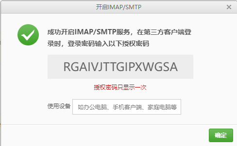

### 从代码仓库下载内核源码

```bash
git clone git://git.kernel.org/pub/scm/linux/kernel/git/torvalds/linux.git
```

主分支代码是相对稳定的代码，一般不够新，本文选择最新尚在开发中的 `linux-next` 分支来演示内核补丁的提交，所以还要更新代码到最新分支：

```bash
git remote add linux-next https://git.kernel.org/pub/scm/linux/kernel/git/next/linux-next.git
```

这些仓库的地址可以从 [Kernel.org git repositories](https://git.kernel.org/) 查找。接下来将 `linux-next` 的代码下载到本地：

```bash
git fetch --tags linux-next
```

注意，此时我们只是将 `linux-next` 分支的代码同步到了本地，但是本地还没有对应的可操作分支，为此，我们还要建立一个本地分支。先看一下当前分支情况：

```bash
$ git branch -a
* master
  remotes/linux-next/akpm
  remotes/linux-next/akpm-base
  remotes/linux-next/master
  remotes/linux-next/pending-fixes
  remotes/linux-next/stable
  remotes/origin/HEAD -> origin/master
  remotes/origin/master
```

所有名字前面有 `remotes` 是都是远程分支引用，我们看到已经有一个 `master` 本地分支，这是在 `git clone` 时自动创建的。但这个本地分支不是我们要的，我们要建立一个关联到 `linux-next` 的本地分支：

```bash
$ git checkout -b linux-next_master # 建立新的本地分支 linux-next_master
$ git branch -u linux-next/master # 关联 本地分支 linux-next_master 到远程分支 linux-next/master

$ git branch -vv
* linux-next_master 709c6adf19dc [linux-next/master] Add linux-next specific files for 20230307
  master            413c1061e467 [origin/master: ahead 2, behind 125519] Merge remote-tracking branch 'origin/master'

$ git branch -a
* linux-next_master
  master
  remotes/linux-next/akpm
  remotes/linux-next/akpm-base
  remotes/linux-next/master
  remotes/linux-next/pending-fixes
  remotes/linux-next/stable
  remotes/origin/HEAD -> origin/master
  remotes/origin/master
```

### 提交补丁

- 安装git 和 git-email

`sudo apt-get update`

- 配置git

```bash
git config --global user.name "nameVal"
git config --global user.email "eamil@qq.com"

# 查看配置
git config --get-all user.name
git config --get-all user.email
```

- 配置smtp

```bash
vi ~/.gitconfig
# 在文件末尾添加
[sendemail]
        smtpencryption=ssl
        smtpserver=smtp.163.com
        smtpuser=a929244872@163.com
        smtpserverport=465
        smtppass=RGAIVJTTGIPXWGSA    #邮箱授权码ibvnraoxojoqbded   qq
#sendemail必须与[user]的email一致
```



KGGAUNOTDYBYUCRA

- 生成补丁

```bash
#修改文件后
git add .
git status
git commit -s -v
```

Commit 信息的格式有严格限制

```
drivers: fix some error

Why I do these changes and how I do it.

Signed-off-by: My Name <my_email@gmail.com>
```

如果 commit 之后还想修改 Commit 信息的话需要使用命令 `git commit --amend -v`

```bash
git format-patch -s -1 # 将自动按最近一次提交生成一个补丁文件 xxx.patch
git format-patch  --subject-prefix='PATCH'  -1

./scripts/checkpatch.pl xxx.patch # 检查补丁的格式是否合法
./scripts/get_maintainer.pl xxx.patch # 补丁是以邮件形式发送，这里是找出要发送的邮箱

#输出如下
Andrew Morton <akpm@linux-foundation.org> (maintainer:MEMORY MANAGEMENT)
linux-mm@kvack.org (open list:MEMORY MANAGEMENT)
linux-kernel@vger.kernel.org (open list)
```

- 发送邮件

```bash
#给自己发送测试
git send-email --smtp-debug --to=a929233872@163.com,929244872@qq.com --cc=929244872@qq.com 0001-mm-fix-some-error.patch
```

# 社区邮件术语

```tex
I ICU  如果我了解得没错(If I Understand Correctly
I IRC  如果我没记错（If I Remember Correctly
```

# 内核修改点

1，修改注释错误，文档档错误，不完善的地方

2，移动函数位置，

```textile
将函数移动到唯一使用的文件中
The mark_free_page() is only used in kernel/power/snapshot.c, move it out
to reduce a bit of page_alloc.c
```

3，内核config拎出单独一个文件

4，去掉重复函数

5，若有功能相同的函数则使用函数，而不是代码

```textile

```

# 目前发现可修改地方

1，mm: page_alloc: move pm_* function into power，其中pm_suspended_storage是否可以去掉

2，
