# 1，概述图
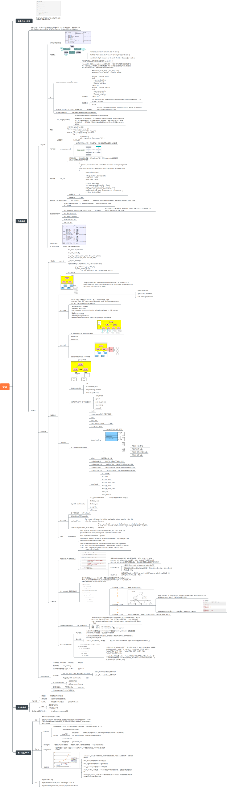
# 2，基础概念
## 2.1Quiescent Status
Quiescent Status，用于描述处理器的执行状态。当某个CPU正在访问RCU保护的临界区时，认为是活动的状态，而当它离开了临界区后，则认为它是静止的状态。当所有的CPU都至少经历过一次QS后，宽限期将结束并触发回收工作。

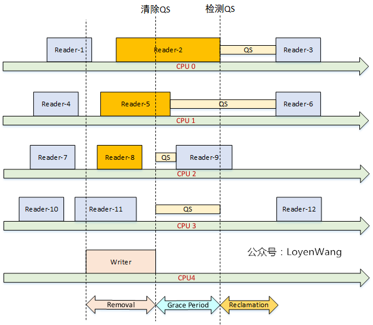

==注意，linux内核是无法检测CPU当前是否处于临界区的，由于rcu_read_lock只是禁止了内核抢占，因此被rcu_read_lock和rcu_read_unlock保护的临界区是不会发生抢占的，linux内核只要检测CPU是否被抢占过，便可以推断出CPU是否离开了临界区==

* 在时钟tick中检测CPU处于用户模式或者idle模式，则表明CPU离开了临界区；

* 在不支持抢占的RCU实现中，检测到CPU有context切换，就能表明CPU离开了临界区；

## 2.2Grace Period
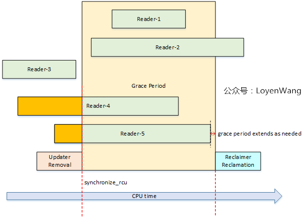
* 中间的黄色部分代表的就是Grace Period，中文叫做宽限期，从Removal到Reclamation，中间就隔了一个宽限期；

* 只有当宽限期结束后，才会触发回收的工作，宽限期的结束代表着Reader都已经退出了临界区，因此回收工作也就是安全的操作了；

* 宽限期是否结束，与处理器的执行状态检测有关，也就是检测静止状态Quiescent Status；

* RCU的性能与可扩展性依赖于它是否能有效的检测出静止状态(Quiescent Status)，并且判断宽限期是否结束。

来一张图：
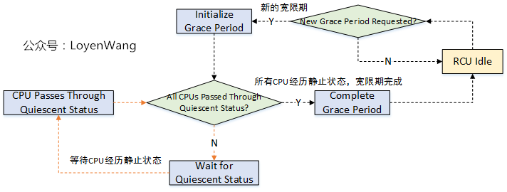

## 3 数据结构

* RCU实际是一个大型的状态机，它的数据结构维护着状态，可以让RCU读者快速执行，同时也可以高效和灵活的处理RCU写者请求的宽限期。

* RCU的性能和可扩展性依赖于采用什么机制来探测宽限期的结束；

* RCU使用位图cpumask去记录CPU经历静止状态，在经典RCU(Classic RCU)实现中，由于使用了全局的cpumask位图，当CPU数量很大时锁争用会带来很大开销（GP开始时设置对应位，GP结束时清除对应位），因此也促成了Tree RCU的诞生；

* Tree RCU以树形分层来组织CPU，将CPU分组，本小组的CPU争用同一个锁，当本小组的某个CPU经历了一个静止状态QS后，将其对应的位从位图清除，如果该小组最后一个CPU经历完静止状态QS后，表明该小组全部经历了CPU的QS状态，那么将上一层对应该组的位从位图清除；

* RCU有几个关键的数据结构：struct rcu_state，struct rcu_node，struct rcu_data；

图来了：
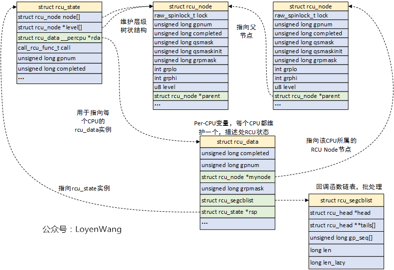

* struct rcu_state：用于描述RCU的全局状态，它负责组织树状层级结构，系统中支持不同类型的RCU状态：rcu_sched_state， rcu_bh_state，rcu_preempt_state；

* struct rcu_node：Tree RCU中的组织节点；

* struct rcu_data：用于描述处理器的RCU状态，每个CPU都维护一个数据，它归属于某一个struct rcu_node，struct rcu_data检测静止状态并进行处理，对应的CPU进行RCU回调，__percpu的定义也减少了同步的开销；

看到这种描述，如果还是在懵逼的状态，那么再来一张拓扑图，让真相更白一点：

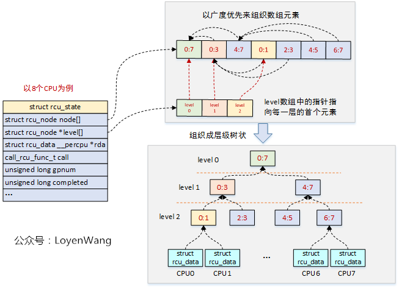

* 层状树形结构由struct rcu_node来组成，这些节点在struct rcu_state结构中是放置在数组中的，由于struct rcu_node结构有父节点指针，因此可以构造树形；

* CPU分组后，对锁的争用就会大大减少，比如CPU0/CPU1就不需要和CPU6/CPU7去争用锁了，逐级以淘汰赛的形式向上；

==关键点来了：Tree RCU使用rcu_node节点来构造层级结构，进而管理静止状态Quiescent State和宽限期Grace Period，静止状态信息QS是从每个CPU的rcu_data往上传递到根节点的，而宽限期GP信息是通过根节点从上往下传递的，当每个CPU经历过一次QS状态后，宽限期结束==

关键字段还是有必要介绍一下的，否则岂不是耍流氓？
```c
struct rcu_state {
	struct rcu_node node[NUM_RCU_NODES];        // rcu_node节点数组，组织成层级树状
	struct rcu_node *level[RCU_NUM_LVLS + 1];   //指向每层的首个rcu_node节点，数组加1是为了消除编译告警
	struct rcu_data __percpu *rda;		                //指向每个CPU的rcu_data实例
	call_rcu_func_t call;			                        //指向特定RCU类型的call_rcu函数：call_rcu_sched, call_rcu_bh等
	int ncpus;				                                // 处理器数量
    
   	unsigned long gpnum;			                //当前宽限期编号，gpnum > completed，表明正处在宽限期内
	unsigned long completed;		                //上一个结束的宽限期编号，如果与gpnum相等，表明RCU空闲 
    ...
        unsigned long gp_max;                                   //最长的宽限期时间，jiffies        
    ...
}
 
 
/*
 * Definition for node within the RCU grace-period-detection hierarchy.
 */
struct rcu_node {
    	raw_spinlock_t __private lock;	        //保护本节点的自旋锁
     	unsigned long gpnum;			        //本节点宽限期编号，等于或小于根节点的gpnum
        unsigned long completed;		        //本节点上一个结束的宽限期编号，等于或小于根节点的completed
        unsigned long qsmask;                       //QS状态位图，某位为1，代表对应的成员没有经历QS状态
        unsigned long qsmaskinit;                //正常宽限期开始时，QS状态的初始值
    ...    
	int	grplo;		//该分组的CPU最小编号
	int	grphi;		//该分组的CPU最大编号
	u8	grpnum;		//该分组在上一层分组里的编号
	u8	level;		//在树中的层级，Root为0
    ...
    
        struct rcu_node *parent; //指向父节点
}
 
 
/* Per-CPU data for read-copy update. */
struct rcu_data {
	unsigned long	completed;	    //本CPU看到的已结束的宽限期编号
	unsigned long	gpnum;		    //本CPU看到的最高宽限期编号
	union rcu_noqs cpu_no_qs;       //记录本CPU是否经历QS状态
	bool core_need_qs;		        //RCU需要本CPU上报QS状态
	unsigned long grpmask;		//本CPU在分组的位图中的掩码
	struct rcu_segcblist;		        //回调函数链表，用于存放call_rcu注册的延后执行的回调函数
    ...
}
```

## 4 RCU更新接口(写端)

我们看到了RCU的写端调用了synchronize_rcu/call_rcu两种类型的接口，事实上Linux内核提供了三种不同类型的RCU，因此也对应了相应形式的接口。

来张图：
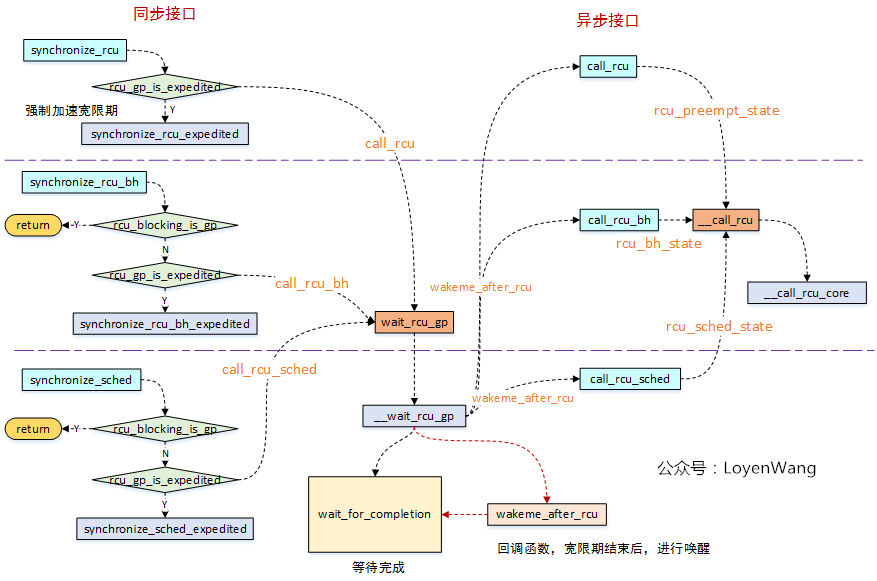

* RCU写者，可以通过两种方式来等待宽限期的结束，一种是调用同步接口等待宽限期结束，一种是异步接口等待宽限期结束后再进行回调处理，分别如上图的左右两侧所示；

* 从图中的接口调用来看，同步接口中实际会去调用异步接口，只是同步接口中增加了一个wait_for_completion睡眠等待操作，并且会将wakeme_after_rcu回调函数传递给异步接口，当宽限期结束后，在异步接口中回调了wakeme_after_rcu进行唤醒处理；

* 目前内核中提供了三种RCU：

  1. 可抢占RCU：rcu_read_lock/rcu_read_unlock来界定区域，在读端临界区可以被其他进程抢占；

  2. 不可抢占RCU(RCU-sched)：rcu_read_lock_sched/rcu_read_unlock_sched来界定区域，在读端临界区不允许其他进程抢占；

  3. 关下半部RCU(RCU-bh)：rcu_read_lock_bh/rcu_read_unlock_bh来界定区域，在读端临界区禁止软中断；

* 从图中可以看出来，不管是同步还是异步接口，最终都是调到__call_rcu接口，它是接口实现的关键，所以接下来分析下这个函数了；

## 5. __call_rcu
函数的调用流程如下：

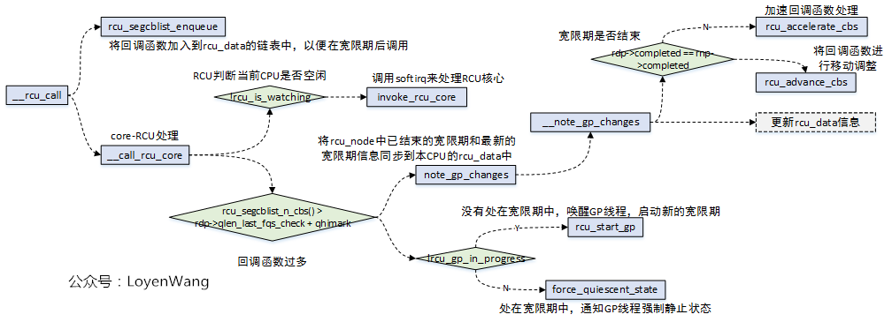
* __call_rcu函数，第一个功能是注册回调函数，而回调的函数的维护是在rcu_data结构中的struct rcu_segcblist cblist字段中；

* rcu_accelerate_cbs/rcu_advance_cbs，实现中都是通过操作struct rcu_segcblist结构，来完成回调函数的移动处理等；

* __call_rcu函数第二个功能是判断是否需要开启新的宽限期GP；

链表的维护关系如下图所示：

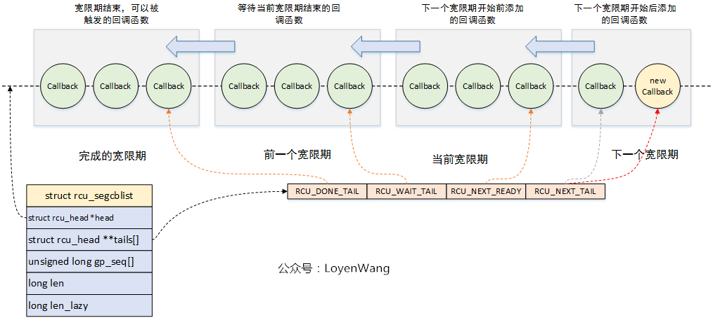

* 实际的设计比较巧妙，通过一个链表来链接所有的回调函数节点，同时维护一个二级指针数组，用于将该链表进行分段，分别维护不同阶段的回调函数，回调函数的移动方向如图所示，关于回调函数节点的处理都围绕着这个图来展开；

那么通过__call_rcu注册的这些回调函数在哪里调用呢？答案是在RCU_SOFTIRQ软中断中：

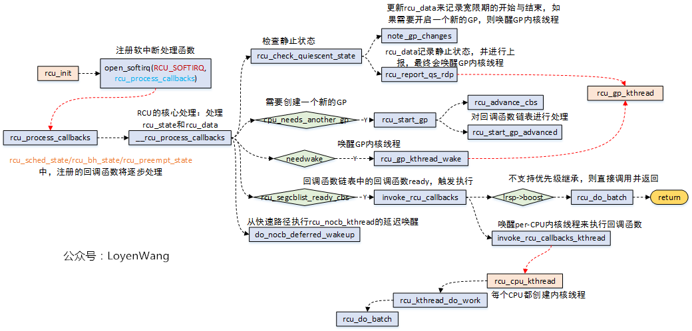

* 当invoke_rcu_core时，在该函数中调用raise_softirq接口，从而触发软中断回调函数rcu_process_callbacks的执行；

* 涉及到与宽限期GP相关的操作，在rcu_process_callbacks中会调用rcu_gp_kthread_wake唤醒内核线程，最终会在rcu_gp_kthread线程中执行；

* 涉及到RCU注册的回调函数执行的操作，都在rcu_do_batch函数中执行，其中有两种执行方式：1）如果不支持优先级继承的话，直接调用即可；2）支持优先级继承，在把回调的工作放置在rcu_cpu_kthread内核线程中，其中内核为每个CPU都创建了一个rcu_cpu_kthread内核线程；

## 6 宽限期开始与结束
既然涉及到宽限期GP的操作，都放到了rcu_gp_kthread内核线程中了，那么来看看这个内核线程的逻辑操作吧：
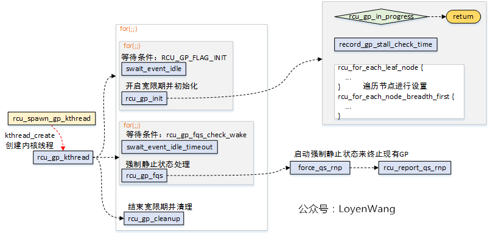

* 内核分别为rcu_preempt_state, rcu_bh_state, rcu_sched_state创建了内核线程rcu_gp_kthread；

* rcu_gp_kthread内核线程主要完成三个工作：1）创建新的宽限期GP；2）等待强制静止状态，设置超时，提前唤醒说明所有处理器经过了静止状态；3）宽限期结束处理。其中，前边两个操作都是通过睡眠等待在某个条件上。

## 7 静止状态检测及报告
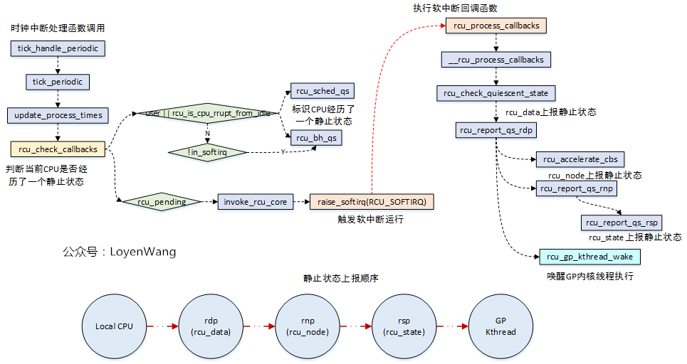

* rcu_sched/rcu_bh类型的RCU中，当检测CPU处于用户模式或处于idle线程中，说明当前CPU已经离开了临界区，经历了一个QS静止状态，对于rcu_bh的RCU，如果没有出去softirq上下文中，也表明CPU经历了QS静止状态；

* 在rcu_pending满足条件的情况下，触发软中断的执行，rcu_process_callbacks将会被调用；

* 在rcu_process_callbacks回调函数中，对宽限期进行判断，并对静止状态逐级上报，如果整个树状结构都经历了静止状态，那就表明了宽限期的结束，从而唤醒内核线程去处理；

* 顺便提一句，在rcu_pending函数中，rcu_pending->__rcu_pending->check_cpu_stall->print_cpu_stall的流程中，会去判断是否有CPU stall的问题，这个在内核中有文档专门来描述，不再分析了；

## 8 状态机变换

如果要观察整个状态机的变化，跟踪一下trace_rcu_grace_period接口的记录就能发现：
```c
/*
 * Tracepoint for grace-period events.  Takes a string identifying the
 * RCU flavor, the grace-period number, and a string identifying the
 * grace-period-related event as follows:
 *
 *	"AccReadyCB": CPU acclerates new callbacks to RCU_NEXT_READY_TAIL.
 *	"AccWaitCB": CPU accelerates new callbacks to RCU_WAIT_TAIL.
 *	"newreq": Request a new grace period.
 *	"start": Start a grace period.
 *	"cpustart": CPU first notices a grace-period start.
 *	"cpuqs": CPU passes through a quiescent state.
 *	"cpuonl": CPU comes online.
 *	"cpuofl": CPU goes offline.
 *	"reqwait": GP kthread sleeps waiting for grace-period request.
 *	"reqwaitsig": GP kthread awakened by signal from reqwait state.
 *	"fqswait": GP kthread waiting until time to force quiescent states.
 *	"fqsstart": GP kthread starts forcing quiescent states.
 *	"fqsend": GP kthread done forcing quiescent states.
 *	"fqswaitsig": GP kthread awakened by signal from fqswait state.
 *	"end": End a grace period.
 *	"cpuend": CPU first notices a grace-period end.
 */
 ```
 大体流程如下：
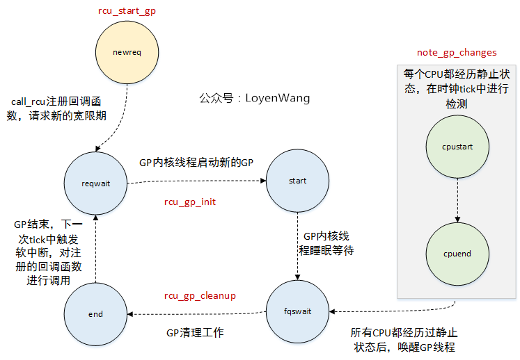

## 9. 总结
* 本文提纲挈领的捋了一下RCU的大体流程，主要涉及到RCU状态机的轮转，从开启宽限期GP，到宽限期GP的初始化、静止状态QS的检测、宽限期结束、回调函数的调用等，而这部分主要涉及到软中断RCU_SOFTIRQ和内核线程rcu_gp_kthread的动态运行及交互等；

* 内部的状态组织是通过rcu_state, rcu_node, rcu_data组织成树状结构来维护，此外回调函数是通过rcu_data中的分段链表来批处理，至于这些结构中相关字段的处理（比如gpnum, completed字段的设置来判断宽限期阶段等），以及链表的节点移动等，都没有进一步去分析跟进了；

* RCU的实现机制很复杂，很多其他内容都还未涉及到，比如SRCU（可睡眠RCU）、可抢占RCU，中断/NMI对RCU的处理等，只能说是蜻蜓点水了；

在阅读代码过程中，经常会发现一些巧妙的设计，有时会有顿悟的感觉，这也是其中的乐趣之一了；