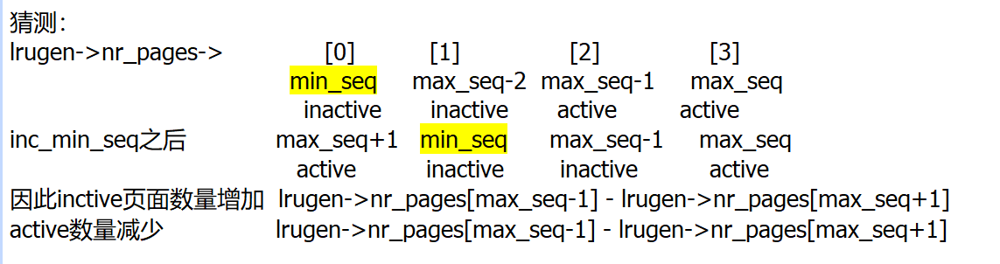
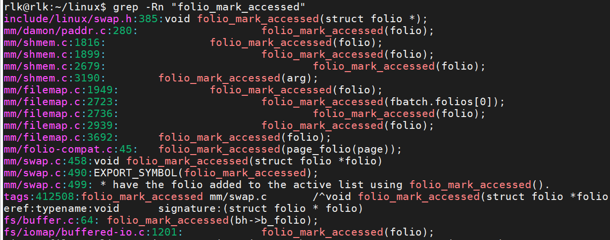
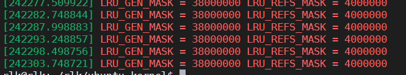

查MEMCG实现原理

查询drapcache页面映射过程

pgdat作用 内存节点结构体，每个内存节点有一个pg_data_t结构体描述物理内存布局，并为每个内存节点创建一个kswapd内核线程，pg_data_t作为入参，kswapd内核线程在kswapd_init->kswapd_run中创建

中断中一定用锁，用哪种锁，中断中为保证实时性，需要些耗时操作，如何平衡，

架构上设计，提高实时性，

什么业务在中断中做，参考依据时什么，实时性？耗时性？

# 最小实现

```c
struct {
            /* this mm_struct is on lru_gen_mm_list */
            struct list_head list;
            /*
             * Set when switching to this mm_struct, as a hint of
             * whether it has been used since the last time per-node
             * page table walkers cleared the corresponding bits.
             */
            unsigned long bitmap;
#ifdef CONFIG_MEMCG
            /* points to the memcg of "owner" above */
            struct mem_cgroup *memcg;
#endif
        } lru_gen;


mm_init()
    ->lru_gen_init_mm()
kernel_clone()
    ->lru_gen_add_mm(mm)   /*定义struct lru_gen_mm_list  mm_list
                    将mm_list->fifo成员添加到mm->lru_gen.list列表*/


context_switch()
    ->lru_gen_use_mm(next->mm)      将mm->lru_gen.bitmap设置为-1

lru_deactivate_fn


deactivate_page


folio_mark_accessed


prepare_scan_count
```

**分配页面时慢速路径，try_to_free_pages中sc->priority = DEF_PRIORITY（普通回收）**

```c
alloc_page()->__alloc_pages()->__alloc_pages_slowpath()->__alloc_pages_direct_reclaim->()->__perform_reclaim()
->try_to_free_pages()->
do_try_to_free_pages()
->shrink_zones()
    ->mem_cgroup_soft_limit_reclaim        /*This steals pages from memory cgroups over softlimit 从cgroups中偷页*/
        ->mem_cgroup_soft_reclaim
            ->mem_cgroup_shrink_node    //
            ->shrink_lruvec    
    ->shrink_node()  /*主动内存回收（alloc_page慢速路径）和kswap内核线程（定时回收）都会调用*/
        ->shrink_node_memcgs()
            ->shrink_lruvec
            if (lru_gen_enabled()) {
                ->lru_gen_shrink_lruvec(lruvec, sc);
                return;
            }
        ->shrink_list
            ->shrink_active_list
            ->shrink_inactive_list
->snapshot_refaults()
    if (lru_gen_enabled())
            return;
```

**kswapd     kswap内核线程（定时回收）**

```c
    ->balance_pgdat            //sc.priority = DEF_PRIORITY，回收过程中若需要提高优先级，则sc->priority--，直到sc->priority==0结束循环
        ->kswapd_age_node
            ->lru_gen_age_node
        ->kswapd_shrink_node
            ->shrink_node
    ->snapshot_refaults        /*页面回收结束后调用*/
        if (lru_gen_enabled())
            return;
```

**debugfs中主动进行回收**

```c
lru_gen_seq_write
    ->run_cmd
        ->run_aging 或者 run_eviction
        ->run_aging
            ->try_to_inc_max_seq
        ->run_eviction
            ->evict_filios
```

**try_to_free_pages中**

```c
    struct scan_control sc = {
        .nr_to_reclaim = SWAP_CLUSTER_MAX,
        .gfp_mask = current_gfp_context(gfp_mask),
        .reclaim_idx = gfp_zone(gfp_mask),
        .order = order,
        .nodemask = nodemask,
        .priority = DEF_PRIORITY,
        .may_writepage = !laptop_mode,
        .may_unmap = 1,
        .may_swap = 1,
    };
```

**最小实现**

```c
lru_gen_shrink_lruvec
->get_nr_to_scan        //若sc->priority ！= DEF_PRIORITY（强制扫描），则会调用inc_max_seq
    ->should_run_aging    //对lrugen->nr_pages中young和old页进行统计，计算代差，结合两者，计算出nr_to_scan和是否需要老化
    ->inc_max_seq        //若min_seq与max_seq的代差等于4，max_seq+1之前先min_seq+1，中间穿插reset_ctrl_pos操作
        ->inc_min_seq    //清空（min_seq），遍历每个min_seq的的folio，调用folio_inc_gen找到合适的new_gen，将folio移动到new_gen列表上末尾，之后min_seq+1
            ->folio_inc_gen    //这里似乎有清folio的访问bit的操作，需后续分析
                ->lru_gen_update_size        
->evict_folios
    ->isolate_folios
        ->get_type_to_scan    //计算首先对哪个type进行剥离LRU_GEN_FILE 或者 LRU_GEN_ANON
        ->scan_folios //对选定的type进行剥离
            ->获取lru->min_seq的相对代数gen，遍历所有zone的对应type和gen的folio
            ->sort_folio    //这里的folio是需要保留的，把每个folio移动到合适的gen
            ->isolate_folio //将folio从lrugen->lists剥离，然后加到临时list
            ->若任然有剥离失败的folio，将这些页面添加回原有lrugen->lists
    ->try_to_inc_min_seq     //尝试增加min_seq，根据lrugen->lists[gen][type][zone]是否为空增加min_seq  与inc_min_seq函数并不相同，这里只对不同zone和type的min_seq做一个整理，不一定会使min_seq增加
    ->shrink_page_list  //或者 shrink_folio_list 二者原理一样，scan_folios中将剥离的页面放到临时list中， 这里对list列表进行扫描，确认哪些页面清出，那些保留，
```

<mark>**老化：如何产生cold页**</mark>

（1）将hot页提升到max_seq代中（放入walk->max_seq，在try_to_inc_max_seq中被赋值为lruvec->lrugen.max_seq），之后令max_seq+1，

（2）原来在max_seq中的page随着max_seq的增加，逐渐老化变冷，最终变成min_seq代，当inc_max_seq增加max_seq时，若代差等于4，在增加max_seq之前增加min_seq

（3）在做驱逐时，对min_seq上的页面进行遍历，将gen计数更新过的页面（被老化操作更新）放到对应的gen中，min_seq上的页面随时间或被驱逐，或被提升，列表最终变空，try_to_inc_min_seq会增加min_seq

（4）老化操作是针对lruvec页表上所有页面（遍历struct mm_struct，见try_to_inc_max_seq）进行的页表遍历，不管页面的gen是多少，

（5）驱逐操作只针对min_seq

（6）evict_folios中若代差等于2,该函数会返回0，try_to_shrink_lruvec会中断回收，导致do_try_to_free_pages中sc->nr_reclaimed回收数量不够，增加优先级，最终调用try_to_inc_max_seq增加max_seq

<mark>普通回收</mark>

（1）should_run_aging中对lrugen->nr_pages中young和old页进行统计，计算代差，结合两者，计算出nr_to_scan和是否需要老化，无论是否需要老化，都要返回nr_to_scan

（2）evict_folios->isolate_folios a, 选定要扫描的type，将folio移动到下一代，或剥离到临时list，或保留在原有lrugen->list

（3）try_to_inc_min_seq尝试增加min_seq，根据lrugen->lists[gen][type][zone]是否为空决定是否增加min_seq

（4）shrink_folio_list对剥离到临时list的folio进行再次扫描，（后续分析shrink_folio_list）

（5）注意，最小实现中普通回收不会增加max_seq

<mark>强制回收</mark>

（1）should_run_aging中对lrugen->nr_pages中young和old页进行统计，计算代差，结合两者，计算出nr_to_scan和是否需要老化，若需要老化调用inc_max_seq

（2）inc_max_seq中max_seq和min_seq做比较，若代差=4，则调用inc_min_seq，将min_seq的所有页面移动到new_gen中，方式冷热反转，再min_seq+1，最后max_seq+1

（3）try_to_inc_min_seq尝试增加min_seq，根据lrugen->lists[gen][type][zone]是否为空决定是否增加min_seq

（4）shrink_folio_list对剥离到临时list的folio进行再次扫描，（后续分析shrink_folio_list）



<font color="#dd0000">**问题1：普通回收与强制回收**</font>

1，分配页面时慢速路径，try_to_free_pages中sc->priority = DEF_PRIORITY（普通回收）

2，kswapd内核线程balance_pgdat函数中sc.priority = DEF_PRIORITY，回收过程中若需要提高优先级，则sc->priority--，直到sc->priority==0结束循环

3，try_to_free_mem_cgroup_pages中sc.priority = DEF_PRIORITY

4，shrink_all_memory中sc.priority = DEF_PRIORITY

5，__node_reclaim中priority = NODE_RECLAIM_PRIORITY

6，shrink-node->lru_gen_shrink_node->set_initial_priority中sc->priority = clamp(priority, 0, DEF_PRIORITY);

<font color="#dd0000">**问题2:何时增加max_seq 与问题7一起思考**</font>

1，强制回收有可能增加

2，debugfs中主动进行回收中run_aging->try_to_inc_max_seq

3，探索普通回收，是否会增加max_seq？

4，try_to_shrink_lruvec，中get_nr_to_scan确定需要扫描多少页，evict_folios中返货扫描了多少页和回收了多少页（放入sc->nr_reclaimed）

5，

4，当min_seq靠近max_seq时，是否会增加max_seq， 见老化：如何产生cold页

**问题3：tier相关，lrugen中没有tier的相关数组，tier被存储在folio->flag中，位宽LRU_REFS_WIDTH，由架构和系统配置决定**

1，isolate_folios->get_type_to_scan与isolate_folios->get_tier_idx中根据lrugen->avg_refaulted,refaulted,avg_total,evicted,protected等值确定要逐出的tier

2，每个folio的tier保存到flag中，sort_folio中，若folio的tier>要扫描的tier(tier_idx),通过folio_inc_gen找到页面的新gen，移动到该gen列表的末尾，更新lrugen->protected与lruvec->pgdat->vm_stat值

3，folio_inc_gen中对LRU_REFS_FLAGS位进行操作，需确认如何形象tier

4，lru_gen_add_folio中对PG_active位操作，需确定是否影响tier

5，folio_mark_accessed->folio_inc_refs通过操作LRU_REFS_MASK为来增加tier

**问题4：refault率如何统计，如何更新？？？**

should_run_aging获取要扫描页的数量，并判断是否要进行老化，

如需要老化，则调用try_to_inc_max_seq

（1）can_swap = 1，max_seq = lruvec->lrugen.max_seq = 100，sc如上，force_scan = false

（2）(max_seq <= READ_ONCE(lruvec->mm_state.seq))即为lruvec->lrugen.max_seq与lruvec->mm_state.seq比较，

（3）lruvec->mm_state.seq 初始化为 MIN_NR_GENS = 2; 在lru_gen_del_mm对其进行+1写入，这里假设(max_seq <= READ_ONCE(lruvec->mm_state.seq))不成立，

（4）假设获取到当前进程lru_gen_mm_walk结构体，设置进程的walk->max_seq = max_seq，开始迭代，调用iterate_mm_list;

（5）

## 加入mm_walk之后

**debugfs中主动进行回收**

```c
lru_gen_seq_write
    ->run_cmd
        ->run_aging 或者 run_eviction
        ->run_aging
            ->try_to_inc_max_seq    //重点分析
        ->run_eviction
            ->evict_filios        //重点分析
```

```c
lru_gen_shrink_lruvec
    ->try_to_shrink_lruvec
        ->get_nr_to_scan
            ->try_to_inc_max_seq
```

<mark>try_to_inc_max_seq</mark>

（1）lrugen->max_seq初始化时为MIN_NR_GENS + 1，lruvec->mm_state.seq初始化时为MIN_NR_GENS，在get_nr_to_scan中，max_seq赋值为lruvec->lrugen.max_seq

（2）首次迭代时，max_seq <= READ_ONCE(lruvec->mm_state.seq)不成立，walk->max_seq = max_seq，执行iterate_mm_list

（3）首次迭代，符合iterate_mm_list中第一种情况，即!mm_state->nr_walkers成立，first = true，拿到一个memcg上的mm_struct(由lru_gen_mm_list实现)

（4）mm_state->nr_walkers++，last = false，最后调用reset_bloom_filter(lruvec, walk->max_seq + 1)，初始化walk->max_seq + 1的mm_stat.filters

（5）iterate_mm_list返回false，if (mm)成立，调用walk_mm遍历页表，更新lru_gen_mm_walk->mm_stats,nr_pages的计数，

（6）遍历时在walk_pmd_range中有test_bloom_filter和update_bloom_filter操作

（7）遍历时，在walk_pte_range中test每个PTE的young标记，若为young调用folio_update_gen将new_gen写入到folio的flag上，

（8）注意folio_update_gen只更新folio的flag，没用将folio放到新的lrugen->list上（folio还在原来的lrugen->list上，可能是min_seq的list），后边在evict_folios->isolate_folios->scan_folios->sort_folio中，if (gen != lru_gen_from_seq(lrugen->min_seq[type]))成立，移动到新的lrugen->list上，还有inc_min_seq中也会移动，还有lru_gen_shrink_node->lru_add_drain也会移动，需确定是都还有其他地方移动

（9）在（2）中walk->max_seq = max_seq，所以walk_pte_range将folio移动到MIN_NR_GENS + 1（最新gen）中

（10）调用inc_max_seq，lrugen->max_seq+1

（11）try_to_inc_max_seq退出后，调用evict_folios对min_seq进行驱逐

**问题5：lru_gen_mm_list相关**

（1）lru_gen_add_mm将mm_struct添加到对应memcg->mm_list->fifo中，即通过memcg可获得该空间的所有mm_struct

（2）exec_mmap，kernel_clone，mm_update_next_owner->lru_gen_migrate_mm，mem_cgroup_attach->lru_gen_migrate_mm，均调用lru_gen_add_mm

**问题6：try_to_inc_max_seq中什么情况下wait_event_killable（睡眠），与唤醒**

（1）When multiple page table walkers iterate the same list, each of them gets a unique mm_struct; therefore they can run concurrently

（2）多个进程对一个mm_list进行老化，当(sc->priority <= DEF_PRIORITY - 2)时，在最后一个wlaker离开之前，其余walker在会睡眠，等最后一个walker完成了遍历并且调用inc_max_seq(lruvec, can_swap, force_scan)后；睡眠的进程会被唤醒

（3）为什么要这样做？？？？

**问题7：什么情况下会跑老化？即什么情况下回调用try_to_inc_max_seq**

（1）只有强制回收和debugfs主动回收有可能执行老化

（2）只有（1）条件满足，并且min_seq靠近过max_seq时才会执行老化，见（should_run_aging）

**问题8：lru_gen_shrink_lruvec中get_nr_to_scan的gen，和evict_folios的gen的关系**

（1）get_nr_to_scan中会遍历每个mm_struct的所有PTE，将符合条件的folio的gen设置为max_seq，并有个能使max_seq增加1，没有操作min_seq

（2）evict_folios会选定type，对选定type的min_seq进行驱逐，

（3）mglru中 老化回事max_seq增加，驱逐会使min_seq增加 get_nr_to_scan决定是否老化，evict_folios管理驱逐

（4）老化操作是针对lruvec页表上所有页面进行的页表遍历，不页面的gen是多少，驱逐操作只针对min_seq

（5）参考上文老化：如何产生cold页

**问题9：公平性**

（1）驱逐公平性，当是全局回收时，达到回收目标停止，若是memcg局部回收时，达到回收目标继续遍历所有memcg进行回收

（1）老化公平性，只保留全局老化，memcg局部老化接受各个memcg的max_seq增长速度不同

**问题10 ：tier如何增加**

（1）tier保存在folio->flags的LRU_REFS_MASK中，folio_inc_refs函数增加tiers

（2）folio_mark_accessed->folio_inc_refs，在folio被访问时，会增加refs计数，例如读取文件，共享内存等

（3）folio_inc_gen会清除tier计数






**问题11：mapped page如何一次升级到max_gen**

（1）通过mmap的映射的内存不会马上分配。而是在第一次访问时通过page fault进入内存

（2）对于mmap的文件页面，通过缺页中断进入内存的页面，直接进入max_gen

```c
handle_pte_fault
	->do_fault
		->do_read_fault                    
			->do_fault
				->vma->vm_ops->fault	//调用文件系统的fault方法
					->filemap_fault
						->__filemap_get_folio(mapping, index, FGP_CREAT|FGP_FOR_MMAP, vmf->gfp_mask);
							->if (fgp_flags & FGP_ACCESSED)		/*__filemap_get_folio调用时没有设置 FGP_ACCESSED*/
								__folio_set_referenced(folio);
							->filemap_add_folio
								->__filemap_add_folio
								->folio_add_lru
								->if (lru_gen_enabled() && !folio_test_unevictable(folio) &&
									lru_gen_in_fault() && !(current->flags & PF_MEMALLOC))
									folio_set_active(folio);	/* see the comment in lru_gen_add_folio() */
									->lru_gen_add_folio
									->if (folio_test_active(folio))
										seq = lrugen->max_seq;
```

（3）对于通过系统调用进入到内存的文件页面，会设置__folio_set_referenced，最终在内存回收时，（后续分析系统调用进入内存页面代码路径？？？）

```c
shrink_folio_list
	->if (lru_gen_enabled() && !ignore_references &&	
		    folio_mapped(folio) && folio_test_referenced(folio))/*folio_update_gen() tried to promote this page? */
			goto keep_locked;	/* 保持在原列表中，根据tier值决定是否升代*/
```
