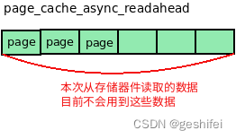
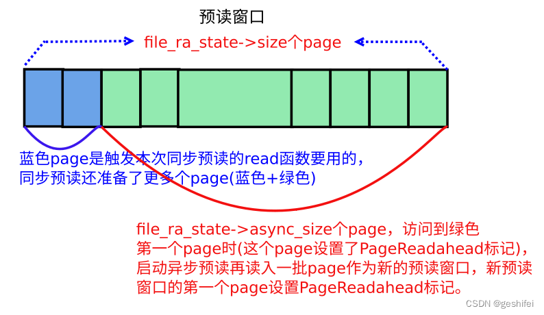
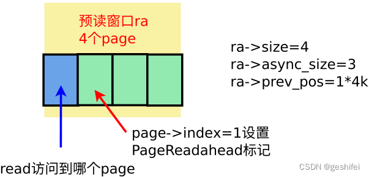
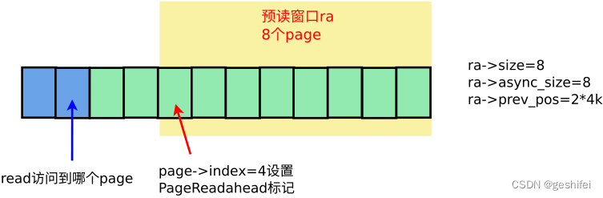
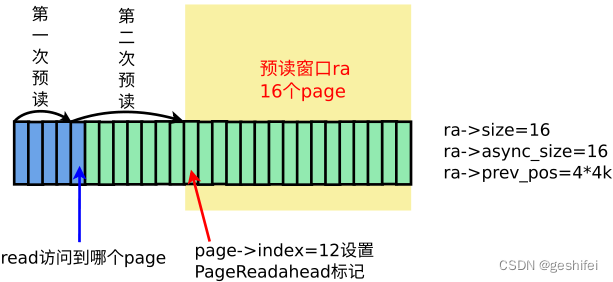

# 同步预读：

从存储器件读取多个page数据，一些page给当前的read（触发同步预读的read）使用，一些page留给将来的read使用。在下图，触发同步预读的read文件数据时，根据page->index在page cache中（struct file->f_mapping->page_tree）找需要的页面（蓝色页面），如果找不到就执行同步预读page_cache_sync_readahead。同步预读根据待读数据的逻辑地址、待读page数量及地址信息，封装成bio，然后调用submit_bio提交给器件处理。不过要注意预读提交bio后就返回了，并不会等待page中的数据变成PageUptodate。


# 异步预读：

本次读的page纯粹是为将来准备的，目前用不到。



# 关键数据结构

```c
/*
 * Track a single file's readahead state
 */
/* 这个结构体是struct file相关的，描述了file的预读状态.
   预读按预读窗口推进，预读窗口中含有file_ra_state->size个page.
   read访问预读窗口中的page，访问到第size-async_size个page，也
   即预读窗口中还剩async_size个page没有访问时，启动异步预读读入一
   批新的page作为预读窗口 
*/
struct file_ra_state {
    //从start这个page开始读
    pgoff_t start;            /* where readahead started */

    //读取size个page放入预读窗口。 如内存不足无法申请page，则预读小于size个page
    unsigned int size;        /* # of readahead pages */

    //预读窗口中还剩async_size个page时，启动异步预读
    unsigned int async_size;    /* do asynchronous readahead when
                       there are only # of pages ahead */

    /* 预读窗口上限值(单位: page)
       默认等于struct backing_dev_info->ra_pages, 可通过fadvise调整。
       如果read需要读的page数量小于ra_pages，最多读取ra_pages个页面。
       如果read需要读的page数量大于ra_pages，最多读取
       min { read的page数量,存储器件单次io最大page数量 }个页面。
       预读窗口中当前有多少个页面由size成员变量表示。
    */
    unsigned int ra_pages;        /* Maximum readahead window */

    unsigned int mmap_miss;        /* Cache miss stat for mmap accesses */

    //最后一次的读位置(单位:字节)
    loff_t prev_pos;        /* Cache last read() position */
};
```



# 原理

read请求N 个page数据，通过预读从存储器件读取M个page数据（M ＞ N），并对其中的第a个page设置PageReadahead标记（0 ≤ a < N）。PageReadahead标记起到一个标识作用，表示预读窗口中剩余的page不多了，需要启动异步预读再读入一批page存放page cache。

如果是顺序读，肯定会读到PageReadahead标记的页（单线程读的场景），或者读到预读窗口的最后一个页（多线程穿插读的场景），所以代码作者认为，如果访问到这两种页就是顺序读（注意：这样的判断不是很准，但代码写起来简单高效），否则认为是随机访问。

如果是顺序访问，预读窗口在之前的基础上扩大2倍或者4倍（上限值不超过struct file_ra_state->ra_pages，需要说明一下，该值是预读窗口大小，如果read的page大于预读窗口，那么最终的预读量是大于ra_pages的），然后从存储器件读入数据填充这些page，并缓存在page cache中，最后，在新读入的这批page中选定一个page设置PageReadahead标记（一般是新读入的这批page中的第一个page）。     

如果是随机访问，预读机制仅从存储器件中读取read函数需要的数据，read请求几个page，就读几个page，并缓存在page cache中。可以看出随机读不会预读多余的page，另外注意随机读不更改预读窗口。

# 实例

按4k顺序访问文件的[0, 8*4K]的数据（顺序访问），然后lseek到108*4k处访问文件（随机访问）。过程如下：

1）访问第0个page数据

page->index=0的页面在page cache中找不到，触发同步预读page_cache_sync_readahead，一次性读了4个page（read需要1个page，预读3个page。预读page数量与实际请求的page数量、file_ra_state->ra_pages有关，通过get_init_ra_size计算）。本次预读建立的预读窗口如下：



 注意，预读窗口中第ra->size - ra->async_size = 1个page，即page->index=1设置了PageReadahead标记。

2）访问第1个page数据

page->index=1的页面在page cache中能找到（预读命中），不需要从存储器件中读取数据。又因该page有PageReadahead标记，触发异步预读page_cache_async_readahead，预读页面数量由get_next_ra_size计算得到，因为本次请求的数据起始位置与上一次读结束位置相同，属于顺序读，get_next_ra_size加大预读量，预读量从之前的4 page增大到8 page。本次预读建立的预读窗口如下：



 注意，预读窗口中第ra->size - ra->async_size = 0个page，即page->index=4设置了PageReadahead标记。

 3）访问第2、3个page数据

这两个page在page cache中可以找到（预读命中），直接从page cache中读取数据。

4）访问第4个page数据

page->index=4的页面在page cache中可以找到（预读命中），直接从page cache中读取数据。不过这个page设置了PageReadahead标记，触发异步预读page_cache_async_readahead，由于是顺序读，get_next_ra_size将预读量从8 page增大到16 page，本次预读建立的预读窗口如下:



 后继的顺序访问流程重复上面过程，遇到page被标记成PageReadahead，增大预读量（最大不超过struct file_ra_state->ra_pages）后启动异步预读。

5）lseek跳到108*4k处访问第108个page数据

访问page->index=108的page，不符合顺序读的条件，所以代码判断成随机读。如果是随机读，则不做预读，read请求几个页的数据，就从存储器件中读几个页数据（ondemand_readahead --> __do_page_cache_readahead）。

注意，这次随机读，不会更改预读窗口状态。

系统默认最大可预读的page cacge数量

```c
super_setup_bdi_name
    ->bdi_alloc
        ->bdi->ra_pages = VM_READAHEAD_PAGES;

//系统默认的数值为128KB，但对于有些文件系统则会重新设置该值
```
