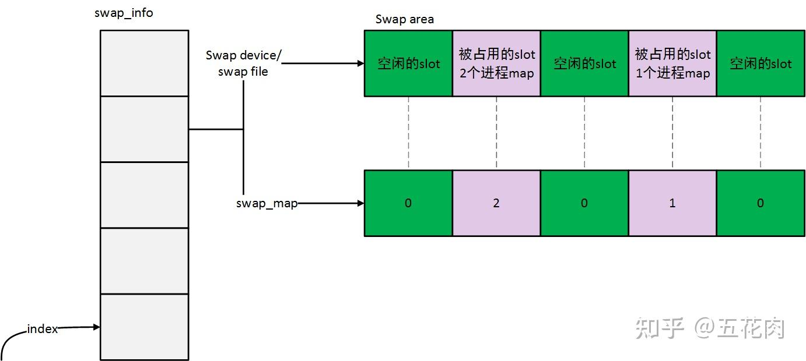
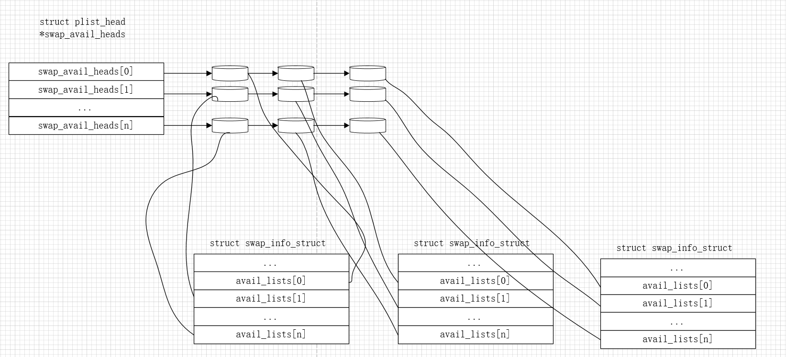
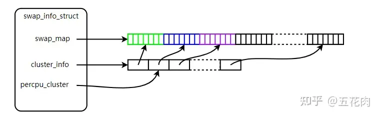
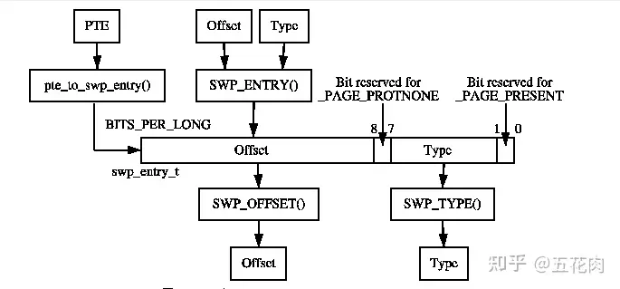
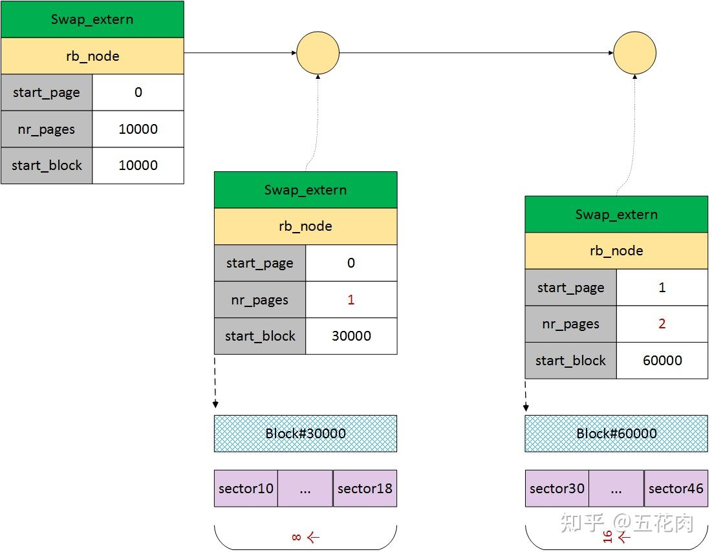

```c
/*
 * The in-memory structure used to track swap areas.
 */
struct swap_info_struct {
	struct percpu_ref users;	/* indicate and keep swap device valid. */
	unsigned long	flags;		/* SWP_USED etc: see above */
	signed short	prio;		/* swap priority of this type */
	struct plist_node list;		/* entry in swap_active_head */
	signed char	type;		/* strange name for an index */
	unsigned int	max;		/* extent of the swap_map */
	unsigned char *swap_map;	/* vmalloc'ed array of usage counts */
	struct swap_cluster_info *cluster_info; /* cluster info. Only for SSD */
	struct swap_cluster_list free_clusters; /* free clusters list */
	unsigned int lowest_bit;	/* index of first free in swap_map */
	unsigned int highest_bit;	/* index of last free in swap_map */
	unsigned int pages;		/* total of usable pages of swap */
	unsigned int inuse_pages;	/* number of those currently in use */
	unsigned int cluster_next;	/* likely index for next allocation */
	unsigned int cluster_nr;	/* countdown to next cluster search */
	unsigned int __percpu *cluster_next_cpu; /*percpu index for next allocation */
	struct percpu_cluster __percpu *percpu_cluster; /* per cpu's swap location */
	struct rb_root swap_extent_root;/* root of the swap extent rbtree */
	struct file *bdev_file;		/* open handle of the bdev */
	struct block_device *bdev;	/* swap device or bdev of swap file */
	struct file *swap_file;		/* seldom referenced */
	unsigned int old_block_size;	/* seldom referenced */
	struct completion comp;		/* seldom referenced */
	spinlock_t lock;		/*
					 * protect map scan related fields like
					 * swap_map, lowest_bit, highest_bit,
					 * inuse_pages, cluster_next,
					 * cluster_nr, lowest_alloc,
					 * highest_alloc, free/discard cluster
					 * list. other fields are only changed
					 * at swapon/swapoff, so are protected
					 * by swap_lock. changing flags need
					 * hold this lock and swap_lock. If
					 * both locks need hold, hold swap_lock
					 * first.
					 */
	spinlock_t cont_lock;		/*
					 * protect swap count continuation page
					 * list.
					 */
	struct work_struct discard_work; /* discard worker */
	struct swap_cluster_list discard_clusters; /* discard clusters list */
	struct plist_node avail_lists[]; /*
					   * entries in swap_avail_heads, one
					   * entry per node.
					   * Must be last as the number of the
					   * array is nr_node_ids, which is not
					   * a fixed value so have to allocate
					   * dynamically.
					   * And it has to be an array so that
					   * plist_for_each_* can work.
					   */
};
```

| 字段           | 含义                                                                                                                                                                                                                                   |
|:------------ | ------------------------------------------------------------------------------------------------------------------------------------------------------------------------------------------------------------------------------------ |
| prio         | 此swap分区的优先级,swap分区初始化时可以指定优先级， 查找时按优先级高到低查找对应槽位                                                                                                                                                                                      |
| list         | swap_active_head 链表中的节点，各个存储块的使用情况以高低优先级的顺序保存在 swap_active_head 链表中                                                                                                                                                                  |
| type         | 名字有点奇怪,其实是index, 指的是第几个 swap 分区，系统一共只允许创建 MAX_SWAPFILES 个 swap 分区，如果该swap 分区是第一个创建的，那么type 就是0，该变量同时也是 swap_info[] 全局变量的索引，即swap_info[0] 就是第一个 swap 分区的 swap_info_struct 结构体。swap_info[] 数组保存着系统中所有swap 分区描述符，即 swap_info_struct 结构体 |
| swap_map     | 页槽数组，长度是swap分区的页面个数，例如swap分区是4GB, 其长度就是4G/4K个。此数组每个元素都是一个页槽代表一个存储块，0代表空闲状态，由于一个物理页面可能被多个进程map，值大于0时表示被map的进程数                                                                                                                        |
| pages        | 去除掉坏块之后可用存储块的个数                                                                                                                                                                                                                      |
| inuse_pages  | 已经使用的存储块个数                                                                                                                                                                                                                           |
| cluster_next | 下一个可用存储块的编号                                                                                                                                                                                                                          |
| bdev         | swap 分区所处于的块设备 struct block_device 结构体                                                                                                                                                                                               |
| swap_file    | swap 分区的 struct file 结构体                                                                                                                                                                                                             |



每个swap分区swapon的时候都会注册一个struct swap_info_struct结构体，并通过struct plist_node avail_lists[]成员挂载全局变量swap_avail_heads列表上，并每个内存节点管理一个列表




```c
/*
 * We use this to track usage of a cluster. A cluster is a block of swap disk
 * space with SWAPFILE_CLUSTER pages long and naturally aligns in disk. All
 * free clusters are organized into a list. We fetch an entry from the list to
 * get a free cluster.
 *
 * The data field stores next cluster if the cluster is free or cluster usage
 * counter otherwise. The flags field determines if a cluster is free. This is
 * protected by swap_info_struct.lock.
 */
struct swap_cluster_info {
	spinlock_t lock;	/*
				 * Protect swap_cluster_info fields
				 * and swap_info_struct->swap_map
				 * elements correspond to the swap
				 * cluster
				 */
	unsigned int data:24;
	unsigned int flags:8;
};
```


| 字段    | 含义                                                                                                                                                                                                             |
| ----- | -------------------------------------------------------------------------------------------------------------------------------------------------------------------------------------------------------------- |
| data  | 如果该簇是空闲的，这个变量代表的是下一个空闲的簇编号如果该簇不是空闲的，那么该变量代表是已经分配的页槽数                                                                                                                                                           |
| flags | #define CLUSTER_FLAG_FREE 1 /* This cluster is free */#define CLUSTER_FLAG_NEXT_NULL 2 /* This cluster has no next cluster */#define CLUSTER_FLAG_HUGE 4 /* This cluster is backing a transparent huge page */ |

我们知道可以通过遍历swap_map数组寻找到一个空闲的页槽。但如果系统同一时间有多个进程同进Swap操作，那么就会同时访问 swap_map[] 数组，从而产生资源竞争，就需要全局的 spin_lock 来保护，在这种情况下如果系统中有 n个 cpu 同时访问这个数组，那么只能一个一个地访问，从而阻塞了其它 cpu 的执行，而且随着CPU核心数增加，锁竞争会加剧。基于这个问题，把所有的页槽组织成以 256个 页槽为一个簇的链表，这样不同CPU可以同时访问不同的簇。

我们需要针对这个结构体在脑海中构建一幅蓝图，如下：




```c
typedef struct {
	unsigned long val;
} swp_entry_t;
```

当一个页面被换出时，Linux 使用相应的 PTE 来存储足够的信息以再次在磁盘上定位该页面。显然，PTE 本身不足以精确存储页面在磁盘上的位置，但足以将索引存储到 swap_info中array 和swap_map中的偏移量。

其中：

- 由PTE中的present位（bits 0-1）被置0进行区别此为swap entry
- 6个bits作为swap_info[]数组的索引，用于查找对应的swap area，索引值用swp_type()函数从swp_entry_t中提取。
- 50个bits作为swap area内的索引，用于查找对应的slot，索引值用swp_offset()函数从swp_entry_t中提取。

第2到第7位存放 swap type，第8位到第57位存放 swap offset，最低两位保留不用，第58位必须等于0，因为该位置1是代表无效的pte

arch/arm64/include/asm/pgtable.h有注释：

```c
/*
 * Encode and decode a swap entry:
 *	bits 0-1:	present (must be zero) //由PTE中的present位被置0进行区别此为swap entry
 *	bits 2-7:	swap type
 *	bits 8-57:	swap offset
 *	bit  58:	PTE_PROT_NONE (must be zero)
 */
```

我们需要针对这个结构体在脑海中构建一幅蓝图，如下：



```c
struct swap_extent {
	struct rb_node rb_node;
	pgoff_t start_page;
	pgoff_t nr_pages;
	sector_t start_block;
};
```

存储块描述符，用于描述多个连续的存储块，以及描述与块设备中扇区的映射关系。其数据结构如下

| 字段          | 含义               |
| ----------- | ---------------- |
| start_page  | 描述的第一个存储块编号      |
| nr_pages    | 描述存储块个数          |
| start_block | 描述该第一个存储块对应的扇区编号 |

存储块的大小为 4KB，扇区的大小为 512Bytes，所以一个存储块中包含 8个 连续的扇区

我们需要针对这个结构体在脑海中构建一幅蓝图，如下：

多个存储块之间如果是连续的，可以合并成一个 swap_extent 结构来描述。




