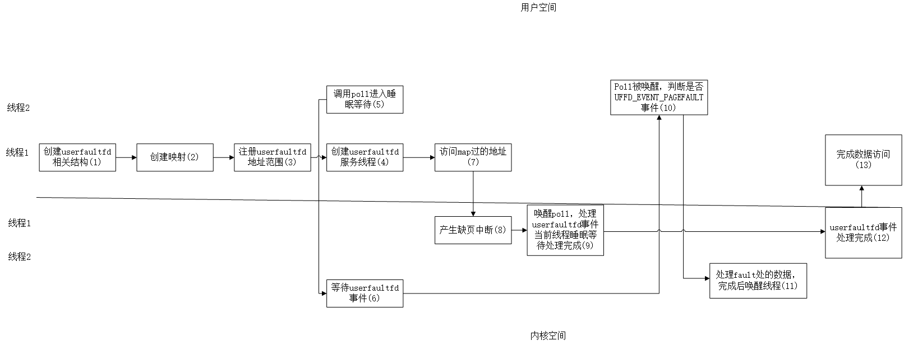

# sample

```c
/* userfaultfd_demo.c

  Licensed under the GNU General Public License version 2 or later.
*/
#define _GNU_SOURCE
#include <inttypes.h>
#include <sys/types.h>
#include <stdio.h>
#include <linux/userfaultfd.h>
#include <pthread.h>
#include <errno.h>
#include <unistd.h>
#include <stdlib.h>
#include <fcntl.h>
#include <signal.h>
#include <poll.h>
#include <string.h>
#include <sys/mman.h>
#include <sys/syscall.h>
#include <sys/ioctl.h>
#include <poll.h>

#define errExit(msg)    do { perror(msg); exit(EXIT_FAILURE); \
					   } while (0)

static int page_size;

static void *
fault_handler_thread(void *arg)
{
	static struct uffd_msg msg;   /* Data read from userfaultfd */
	static int fault_cnt = 0;     /* Number of faults so far handled */
	long uffd;                    /* userfaultfd file descriptor */
	static char *page = NULL;
	struct uffdio_copy uffdio_copy;
	ssize_t nread;

	uffd = (long) arg;

	/* Create a page that will be copied into the faulting region */

	if (page == NULL) {
		page = mmap(NULL, page_size, PROT_READ | PROT_WRITE,
						MAP_PRIVATE | MAP_ANONYMOUS, -1, 0);
		if (page == MAP_FAILED)
			errExit("mmap");
	}

	/* Loop, handling incoming events on the userfaultfd
	  file descriptor */

	for (;;) {

		/* See what poll() tells us about the userfaultfd */

		struct pollfd pollfd;
		int nready;
		pollfd.fd = uffd;
		pollfd.events = POLLIN;
		nready = poll(&pollfd, 1, -1);
		if (nready == -1)
			errExit("poll");

		printf("\nfault_handler_thread():\n");
		printf("    poll() returns: nready = %d; "
			"POLLIN = %d; POLLERR = %d\n", nready,
			(pollfd.revents & POLLIN) != 0,
			(pollfd.revents & POLLERR) != 0);

		/* Read an event from the userfaultfd */

		nread = read(uffd, &msg, sizeof(msg));
		if (nread == 0) {
			printf("EOF on userfaultfd!\n");
			exit(EXIT_FAILURE);
		}

		if (nread == -1)
			errExit("read");

		/* We expect only one kind of event; verify that assumption */

		if (msg.event != UFFD_EVENT_PAGEFAULT) {
			fprintf(stderr, "Unexpected event on userfaultfd\n");
			exit(EXIT_FAILURE);
		}

		/* Display info about the page-fault event */

		printf("    UFFD_EVENT_PAGEFAULT event: ");
		printf("flags = %"PRIx64"; ", msg.arg.pagefault.flags);
		printf("address = %"PRIx64"\n", msg.arg.pagefault.address);

		/* Copy the page pointed to by 'page' into the faulting
		  region. Vary the contents that are copied in, so that it
		  is more obvious that each fault is handled separately. */

		memset(page, 'A' + fault_cnt % 20, page_size);
		fault_cnt++;

		uffdio_copy.src = (unsigned long) page;

		/* We need to handle page faults in units of pages(!).
		  So, round faulting address down to page boundary */

		uffdio_copy.dst = (unsigned long) msg.arg.pagefault.address &
										  ~(page_size - 1);
		uffdio_copy.len = page_size;
		uffdio_copy.mode = 0;
		uffdio_copy.copy = 0;
		if (ioctl(uffd, UFFDIO_COPY, &uffdio_copy) == -1)
			errExit("ioctl-UFFDIO_COPY");

		printf("        (uffdio_copy.copy returned %"PRId64")\n",
				uffdio_copy.copy);
	}
}

int
main(int argc, char *argv[])
{
	long uffd;          /* userfaultfd file descriptor */
	char *addr;         /* Start of region handled by userfaultfd */
	uint64_t len;       /* Length of region handled by userfaultfd */
	pthread_t thr;      /* ID of thread that handles page faults */
	struct uffdio_api uffdio_api;
	struct uffdio_register uffdio_register;
	int s;

	if (argc != 2) {
		fprintf(stderr, "Usage: %s num-pages\n", argv[0]);
		exit(EXIT_FAILURE);
	}

	page_size = sysconf(_SC_PAGE_SIZE);
	len = strtoull(argv[1], NULL, 0) * page_size;

	/* Create and enable userfaultfd object */

	uffd = syscall(__NR_userfaultfd, O_CLOEXEC | O_NONBLOCK);
	if (uffd == -1)
		errExit("userfaultfd");

	uffdio_api.api = UFFD_API;
	uffdio_api.features = 0;
	if (ioctl(uffd, UFFDIO_API, &uffdio_api) == -1)
		errExit("ioctl-UFFDIO_API");

	/* Create a private anonymous mapping. The memory will be
	  demand-zero paged--that is, not yet allocated. When we
	  actually touch the memory, it will be allocated via
	  the userfaultfd. */

	addr = mmap(NULL, len, PROT_READ | PROT_WRITE,
			   MAP_PRIVATE | MAP_ANONYMOUS, -1, 0);
	if (addr == MAP_FAILED)
		errExit("mmap");

	printf("Address returned by mmap() = %p\n", addr);

	/* Register the memory range of the mapping we just created for
	  handling by the userfaultfd object. In mode, we request to track
	  missing pages (i.e., pages that have not yet been faulted in). */

	uffdio_register.range.start = (unsigned long) addr;
	uffdio_register.range.len = len;
	uffdio_register.mode = UFFDIO_REGISTER_MODE_MISSING;
	if (ioctl(uffd, UFFDIO_REGISTER, &uffdio_register) == -1)
		errExit("ioctl-UFFDIO_REGISTER");

	/* Create a thread that will process the userfaultfd events */

	s = pthread_create(&thr, NULL, fault_handler_thread, (void *) uffd);
	if (s != 0) {
		errno = s;
		errExit("pthread_create");
	}

	/* Main thread now touches memory in the mapping, touching
	  locations 1024 bytes apart. This will trigger userfaultfd
	  events for all pages in the region. */

	int l;
	l = 0xf;    /* Ensure that faulting address is not on a page
				  boundary, in order to test that we correctly
				  handle that case in fault_handling_thread() */
	while (l < len) {
		char c = addr[l];
		printf("Read address %p in main(): ", addr + l);
		printf("%c\n", c);
		l += 1024;
		usleep(100000);         /* Slow things down a little */
	}

	exit(EXIT_SUCCESS);
}

```

（1）调用userfaultfd系统调用创建userfauldfd，内核对应创建相应结构体
     调用UFFDIO_API ioctl用于查询内核支持userfaultfd特性
（2）main函数调用mmap系统调用创建映射，测试只建立的虚拟地址，还没有分配物理内存
（3）调用UFFDIO_REGISTER ioctl 注册userfaultfd的支持范围，内核对vma struct结构体做一些校验
（4）创建userfaultfd处理线程，
（5）对于userfaultfd处理线程，调用poll系统调用查询是否有userfaultfd事件，
（6）由于还没有出现userfaultfd异常，会在userfaultfd_poll中睡眠，
（7）此时，main线程进行数据访问，
（8）触发缺页中断
（9）handle_userfault中初始化msg消息后，由于查询到页表没有建立，所以会在fault_pending_wqh队列上等待，同时唤醒poll线程
（10）此时userfaultfd处理线程被唤醒，首先查询（6）中handle_userfault中初始化msg的消息，看是否是UFFD_EVENT_PAGEFAULT事件，若是，则将man线程移动到fault_wqh队列上继续等待，
（11）此时userfaultfd处理线程调用UFFDIO_COPY系统调用，建立PTE映射，拷贝数据，唤醒fault_wqh队列上睡眠的线程
（12）main线程被唤醒，完成数据访问

# 内核代码

## userfaultfd系统调用
```c
/*创建一个userfaultfd_ctx结构体并初始化
*/
static int new_userfaultfd(int flags)
{
	struct userfaultfd_ctx *ctx __free(kfree) = NULL;

	VM_WARN_ON_ONCE(!current->mm);

	/* Check the UFFD_* constants for consistency.  */
	BUILD_BUG_ON(UFFD_USER_MODE_ONLY & UFFD_SHARED_FCNTL_FLAGS);

	if (flags & ~(UFFD_SHARED_FCNTL_FLAGS | UFFD_USER_MODE_ONLY))
		return -EINVAL;

	ctx = kmem_cache_alloc(userfaultfd_ctx_cachep, GFP_KERNEL);
	if (!ctx)
		return -ENOMEM;

	refcount_set(&ctx->refcount, 1);
	ctx->flags = flags;
	ctx->features = 0;
	ctx->released = false;
	init_rwsem(&ctx->map_changing_lock);
	atomic_set(&ctx->mmap_changing, 0);
	ctx->mm = current->mm;

	FD_PREPARE(fdf, flags & UFFD_SHARED_FCNTL_FLAGS,
		   anon_inode_create_getfile("[userfaultfd]", &userfaultfd_fops, ctx,
					     O_RDONLY | (flags & UFFD_SHARED_FCNTL_FLAGS),
					     NULL));//根据userfaultfd_fops和ctx生成一个struct file，赋值给struct fd_prepare，
	if (fdf.err)
		return fdf.err;

	/* prevent the mm struct to be freed */
	mmgrab(ctx->mm);//mm_struct计数+1
	fd_prepare_file(fdf)->f_mode |= FMODE_NOWAIT;//初始化f_mode
	retain_and_null_ptr(ctx);//将ctx赋值为NULL。但ctx原先指向的内存依然保留，anon_inode_create_getfile中将ctx作为priv数据放到file中
	return fd_publish(fdf);//将anon_inode_create_getfile申请到的fd和file加到fd数组中
}
```

## ioctl(uffd, UFFDIO_API, &uffdio_api)

```c
/*
 * userland asks for a certain API version and we return which bits
 * and ioctl commands are implemented in this kernel for such API
 * version or -EINVAL if unknown.
 * 查询API版本和内核已支持的特性，返回给用户空间
 */
static int userfaultfd_api(struct userfaultfd_ctx *ctx,
			   unsigned long arg)
{
	struct uffdio_api uffdio_api;
	void __user *buf = (void __user *)arg;
	unsigned int ctx_features;
	int ret;
	__u64 features;

	ret = -EFAULT;
	if (copy_from_user(&uffdio_api, buf, sizeof(uffdio_api)))
		goto out;
	features = uffdio_api.features;
	ret = -EINVAL;
	if (uffdio_api.api != UFFD_API)
		goto err_out;
	ret = -EPERM;
	if ((features & UFFD_FEATURE_EVENT_FORK) && !capable(CAP_SYS_PTRACE))
		goto err_out;

	/* WP_ASYNC relies on WP_UNPOPULATED, choose it unconditionally */
	if (features & UFFD_FEATURE_WP_ASYNC)
		features |= UFFD_FEATURE_WP_UNPOPULATED;

	/* report all available features and ioctls to userland */
	uffdio_api.features = UFFD_API_FEATURES;
#ifndef CONFIG_HAVE_ARCH_USERFAULTFD_MINOR
	uffdio_api.features &=
		~(UFFD_FEATURE_MINOR_HUGETLBFS | UFFD_FEATURE_MINOR_SHMEM);
#endif
	if (!pgtable_supports_uffd_wp())
		uffdio_api.features &= ~UFFD_FEATURE_PAGEFAULT_FLAG_WP;

	if (!uffd_supports_wp_marker()) {
		uffdio_api.features &= ~UFFD_FEATURE_WP_HUGETLBFS_SHMEM;
		uffdio_api.features &= ~UFFD_FEATURE_WP_UNPOPULATED;
		uffdio_api.features &= ~UFFD_FEATURE_WP_ASYNC;
	}

	ret = -EINVAL;
	if (features & ~uffdio_api.features)
		goto err_out;

	uffdio_api.ioctls = UFFD_API_IOCTLS;
	ret = -EFAULT;
	if (copy_to_user(buf, &uffdio_api, sizeof(uffdio_api)))
		goto out;

	/* only enable the requested features for this uffd context */
	ctx_features = uffd_ctx_features(features);
	ret = -EINVAL;
	if (cmpxchg(&ctx->features, 0, ctx_features) != 0)
		goto err_out;

	ret = 0;
out:
	return ret;
err_out:
	memset(&uffdio_api, 0, sizeof(uffdio_api));
	if (copy_to_user(buf, &uffdio_api, sizeof(uffdio_api)))
		ret = -EFAULT;
	goto out;
}
```

## ioctl(uffd, UFFDIO_REGISTER, &uffdio_register)
```c
static int userfaultfd_register(struct userfaultfd_ctx *ctx,
				unsigned long arg)
{
	struct mm_struct *mm = ctx->mm;
	struct vm_area_struct *vma, *cur;
	int ret;
	struct uffdio_register uffdio_register;
	struct uffdio_register __user *user_uffdio_register;
	vm_flags_t vm_flags;
	bool found;
	bool basic_ioctls;
	unsigned long start, end;
	struct vma_iterator vmi;
	bool wp_async = userfaultfd_wp_async_ctx(ctx);

	user_uffdio_register = (struct uffdio_register __user *) arg;

	ret = -EFAULT;
	if (copy_from_user(&uffdio_register, user_uffdio_register,
			   sizeof(uffdio_register)-sizeof(__u64)))
		goto out;

	ret = -EINVAL;
	if (!uffdio_register.mode)//解析mode参数
		goto out;
	if (uffdio_register.mode & ~UFFD_API_REGISTER_MODES)
		goto out;
	vm_flags = 0;
	if (uffdio_register.mode & UFFDIO_REGISTER_MODE_MISSING)
		vm_flags |= VM_UFFD_MISSING;
	if (uffdio_register.mode & UFFDIO_REGISTER_MODE_WP) {
		if (!pgtable_supports_uffd_wp())
			goto out;

		vm_flags |= VM_UFFD_WP;
	}
	if (uffdio_register.mode & UFFDIO_REGISTER_MODE_MINOR) {
#ifndef CONFIG_HAVE_ARCH_USERFAULTFD_MINOR
		goto out;
#endif
		vm_flags |= VM_UFFD_MINOR;
	}

	ret = validate_range(mm, uffdio_register.range.start,
			     uffdio_register.range.len);//检验注册地址范围是否超出范围
	if (ret)
		goto out;

	start = uffdio_register.range.start;
	end = start + uffdio_register.range.len;

	ret = -ENOMEM;
	if (!mmget_not_zero(mm))
		goto out;

	ret = -EINVAL;

    /* 对于uffdio_register注册的地址范围，在内核中可能包含多个vma
     *（即用户空间可能调用了多次mmap，传不通的flag映射了这段地址）
     * 需要对每个vma进行检验看是否满足uerfaultfd条件，若其中有一个不满足条件，则返回错误
     */
	mmap_write_lock(mm);
	vma_iter_init(&vmi, mm, start);
	vma = vma_find(&vmi, end);
	if (!vma)
		goto out_unlock;

	/*
	 * If the first vma contains huge pages, make sure start address
	 * is aligned to huge page size.
	 */
	if (is_vm_hugetlb_page(vma)) {
		unsigned long vma_hpagesize = vma_kernel_pagesize(vma);

		if (start & (vma_hpagesize - 1))
			goto out_unlock;
	}

	/*
	 * Search for not compatible vmas.
	 */
	found = false;
	basic_ioctls = false;
	cur = vma;
	do {
		cond_resched();

		VM_WARN_ON_ONCE(!!cur->vm_userfaultfd_ctx.ctx ^
				!!(cur->vm_flags & __VM_UFFD_FLAGS));

		/* check not compatible vmas */
		ret = -EINVAL;
		if (!vma_can_userfault(cur, vm_flags, wp_async))
			goto out_unlock;

		/*
		 * UFFDIO_COPY will fill file holes even without
		 * PROT_WRITE. This check enforces that if this is a
		 * MAP_SHARED, the process has write permission to the backing
		 * file. If VM_MAYWRITE is set it also enforces that on a
		 * MAP_SHARED vma: there is no F_WRITE_SEAL and no further
		 * F_WRITE_SEAL can be taken until the vma is destroyed.
         * UFFDIO_COPY 操作即使在没有设置 PROT_WRITE 权限的情况下也能填充文件空洞。
         * 此项检查强制要求：如果这是一个 MAP_SHARED 类型的映射，则进程必须对后备文件拥有写权限。
         * 如果 VMA 设置了 VM_MAYWRITE 标志，该检查还会强制保证，对于 MAP_SHARED 的虚拟内存区域，
         * 当前不存在 F_WRITE_SEAL（写密封），并且在该 VMA 被销毁之前，也不能再施加 F_WRITE_SEAL。
         * 使用  MAP_SHARED  标志进行内存映射时，对内存的修改会写回到对应的文件中。这里的“后备文件”就是指被映射的那个文件
		 */
		ret = -EPERM;
		if (unlikely(!(cur->vm_flags & VM_MAYWRITE)))//检查写权限
			goto out_unlock;

		/*
		 * If this vma contains ending address, and huge pages
		 * check alignment.
		 */
		if (is_vm_hugetlb_page(cur) && end <= cur->vm_end &&
		    end > cur->vm_start) {
			unsigned long vma_hpagesize = vma_kernel_pagesize(cur);

			ret = -EINVAL;

			if (end & (vma_hpagesize - 1))
				goto out_unlock;
		}
		if ((vm_flags & VM_UFFD_WP) && !(cur->vm_flags & VM_MAYWRITE))
			goto out_unlock;

		/*
		 * Check that this vma isn't already owned by a
		 * different userfaultfd. We can't allow more than one
		 * userfaultfd to own a single vma simultaneously or we
		 * wouldn't know which one to deliver the userfaults to.
         * 请检查该 VMA 是否未被另一个不同的 userfaultfd 占用。
         * 我们不允许多个 userfaultfd 同时占用同一个 VMA，
         * 否则我们将无法确定应该将用户缺页异常传递给哪一个（即用户空间可能调用多次UFFDIO_REGISTER，且传的uffd不同）
		 */
		ret = -EBUSY;
		if (cur->vm_userfaultfd_ctx.ctx &&
		    cur->vm_userfaultfd_ctx.ctx != ctx)
			goto out_unlock;

		/*
		 * Note vmas containing huge pages
		 */
		if (is_vm_hugetlb_page(cur))
			basic_ioctls = true;

		found = true;
	} for_each_vma_range(vmi, cur, end);
	VM_WARN_ON_ONCE(!found);

	ret = userfaultfd_register_range(ctx, vma, vm_flags, start, end,
					 wp_async);

out_unlock:
	mmap_write_unlock(mm);
	mmput(mm);
	if (!ret) {//注册过程出现错误，告诉用户空间用什么mode可能成功
		__u64 ioctls_out;

		ioctls_out = basic_ioctls ? UFFD_API_RANGE_IOCTLS_BASIC :
		    UFFD_API_RANGE_IOCTLS;

		/*
		 * Declare the WP ioctl only if the WP mode is
		 * specified and all checks passed with the range
		 */
		if (!(uffdio_register.mode & UFFDIO_REGISTER_MODE_WP))
			ioctls_out &= ~((__u64)1 << _UFFDIO_WRITEPROTECT);

		/* CONTINUE ioctl is only supported for MINOR ranges. */
		if (!(uffdio_register.mode & UFFDIO_REGISTER_MODE_MINOR))
			ioctls_out &= ~((__u64)1 << _UFFDIO_CONTINUE);

		/*
		 * Now that we scanned all vmas we can already tell
		 * userland which ioctls methods are guaranteed to
		 * succeed on this range.
		 */
		if (put_user(ioctls_out, &user_uffdio_register->ioctls))
			ret = -EFAULT;
	}
out:
	return ret;
}


/* Assumes mmap write lock taken, and mm_struct pinned. */
int userfaultfd_register_range(struct userfaultfd_ctx *ctx,
			       struct vm_area_struct *vma,
			       vm_flags_t vm_flags,
			       unsigned long start, unsigned long end,
			       bool wp_async)
{
	vma_flags_t vma_flags = legacy_to_vma_flags(vm_flags);
	VMA_ITERATOR(vmi, ctx->mm, start);
	struct vm_area_struct *prev = vma_prev(&vmi);
	unsigned long vma_end;
	vma_flags_t new_vma_flags;

	if (vma->vm_start < start)
		prev = vma;

	for_each_vma_range(vmi, vma, end) {
		cond_resched();

		VM_WARN_ON_ONCE(!vma_can_userfault(vma, vm_flags, wp_async));
		VM_WARN_ON_ONCE(vma->vm_userfaultfd_ctx.ctx &&
				vma->vm_userfaultfd_ctx.ctx != ctx);
		VM_WARN_ON_ONCE(!vma_test(vma, VMA_MAYWRITE_BIT));

		/*
		 * Nothing to do: this vma is already registered into this
		 * userfaultfd and with the right tracking mode too.
		 */
		if (vma->vm_userfaultfd_ctx.ctx == ctx &&
		    vma_test_all_mask(vma, vma_flags))
			goto skip;

		if (vma->vm_start > start)
			start = vma->vm_start;
		vma_end = min(end, vma->vm_end);

		new_vma_flags = vma->flags;
		vma_flags_clear_mask(&new_vma_flags, __VMA_UFFD_FLAGS);
		vma_flags_set_mask(&new_vma_flags, vma_flags);

		vma = vma_modify_flags_uffd(&vmi, prev, vma, start, vma_end,
					    &new_vma_flags,
					    (struct vm_userfaultfd_ctx){ctx},
					    /* give_up_on_oom = */false);//检测当前VMA是否可以与已有的VMA合并
		if (IS_ERR(vma))
			return PTR_ERR(vma);

		/*
		 * In the vma_merge() successful mprotect-like case 8:
		 * the next vma was merged into the current one and
		 * the current one has not been updated yet.
		 */
		userfaultfd_set_ctx(vma, ctx, vm_flags);

		if (is_vm_hugetlb_page(vma) && uffd_disable_huge_pmd_share(vma))
			hugetlb_unshare_all_pmds(vma);

skip:
		prev = vma;
		start = vma->vm_end;
	}

	return 0;
}
```

## poll
```c
static __poll_t userfaultfd_poll(struct file *file, poll_table *wait)
{
	struct userfaultfd_ctx *ctx = file->private_data;
	__poll_t ret;

	poll_wait(file, &ctx->fd_wqh, wait);//将poll函数加入到fd_wqh等待队列

	if (!userfaultfd_is_initialized(ctx))
		return EPOLLERR;

	/*
	 * poll() never guarantees that read won't block.
	 * userfaults can be waken before they're read().
	 */
	if (unlikely(!(file->f_flags & O_NONBLOCK)))
		return EPOLLERR;
	/*
	 * lockless access to see if there are pending faults
	 * __pollwait last action is the add_wait_queue but
	 * the spin_unlock would allow the waitqueue_active to
	 * pass above the actual list_add inside
	 * add_wait_queue critical section. So use a full
	 * memory barrier to serialize the list_add write of
	 * add_wait_queue() with the waitqueue_active read
	 * below.
	 */
	ret = 0;
	smp_mb();
	if (waitqueue_active(&ctx->fault_pending_wqh))
		ret = EPOLLIN;
	else if (waitqueue_active(&ctx->event_wqh))
		ret = EPOLLIN;

	return ret;
}

/*若没有产生userfualtfd缺页中断，进程在userfaultfd_poll跑完一次后睡眠在fd_wqh上，
若产生userfualtfd缺页中断，handle_userfault会唤醒在fd_wqh上睡眠的poll*/

/*
 * The locking rules involved in returning VM_FAULT_RETRY depending on
 * FAULT_FLAG_ALLOW_RETRY, FAULT_FLAG_RETRY_NOWAIT and
 * FAULT_FLAG_KILLABLE are not straightforward. The "Caution"
 * recommendation in __lock_page_or_retry is not an understatement.
 *
 * If FAULT_FLAG_ALLOW_RETRY is set, the mmap_lock must be released
 * before returning VM_FAULT_RETRY only if FAULT_FLAG_RETRY_NOWAIT is
 * not set.
 *
 * If FAULT_FLAG_ALLOW_RETRY is set but FAULT_FLAG_KILLABLE is not
 * set, VM_FAULT_RETRY can still be returned if and only if there are
 * fatal_signal_pending()s, and the mmap_lock must be released before
 * returning it.
 */
vm_fault_t handle_userfault(struct vm_fault *vmf, unsigned long reason)
{
	struct vm_area_struct *vma = vmf->vma;
	struct mm_struct *mm = vma->vm_mm;
	struct userfaultfd_ctx *ctx;
	struct userfaultfd_wait_queue uwq;
	vm_fault_t ret = VM_FAULT_SIGBUS;
	bool must_wait;
	unsigned int blocking_state;

	/*
	 * We don't do userfault handling for the final child pid update
	 * and when coredumping (faults triggered by get_dump_page()).
	 */
	if (current->flags & (PF_EXITING|PF_DUMPCORE))
		goto out;

	assert_fault_locked(vmf);

	ctx = vma->vm_userfaultfd_ctx.ctx;
	if (!ctx)
		goto out;

	VM_WARN_ON_ONCE(ctx->mm != mm);

	/* Any unrecognized flag is a bug. */
	VM_WARN_ON_ONCE(reason & ~__VM_UFFD_FLAGS);
	/* 0 or > 1 flags set is a bug; we expect exactly 1. */
	VM_WARN_ON_ONCE(!reason || (reason & (reason - 1)));

	if (ctx->features & UFFD_FEATURE_SIGBUS)
		goto out;
	if (!(vmf->flags & FAULT_FLAG_USER) && (ctx->flags & UFFD_USER_MODE_ONLY))
		goto out;

	/*
	 * Check that we can return VM_FAULT_RETRY.
	 *
	 * NOTE: it should become possible to return VM_FAULT_RETRY
	 * even if FAULT_FLAG_TRIED is set without leading to gup()
	 * -EBUSY failures, if the userfaultfd is to be extended for
	 * VM_UFFD_WP tracking and we intend to arm the userfault
	 * without first stopping userland access to the memory. For
	 * VM_UFFD_MISSING userfaults this is enough for now.
	 */
	if (unlikely(!(vmf->flags & FAULT_FLAG_ALLOW_RETRY))) {
		/*
		 * Validate the invariant that nowait must allow retry
		 * to be sure not to return SIGBUS erroneously on
		 * nowait invocations.
		 */
		VM_WARN_ON_ONCE(vmf->flags & FAULT_FLAG_RETRY_NOWAIT);
#ifdef CONFIG_DEBUG_VM
		if (printk_ratelimit()) {
			pr_warn("FAULT_FLAG_ALLOW_RETRY missing %x\n",
				vmf->flags);
			dump_stack();
		}
#endif
		goto out;
	}

	/*
	 * Handle nowait, not much to do other than tell it to retry
	 * and wait.
	 */
	ret = VM_FAULT_RETRY;
	if (vmf->flags & FAULT_FLAG_RETRY_NOWAIT)
		goto out;

	if (unlikely(READ_ONCE(ctx->released))) {
		/*
		 * If a concurrent release is detected, do not return
		 * VM_FAULT_SIGBUS or VM_FAULT_NOPAGE, but instead always
		 * return VM_FAULT_RETRY with lock released proactively.
		 *
		 * If we were to return VM_FAULT_SIGBUS here, the non
		 * cooperative manager would be instead forced to
		 * always call UFFDIO_UNREGISTER before it can safely
		 * close the uffd, to avoid involuntary SIGBUS triggered.
		 *
		 * If we were to return VM_FAULT_NOPAGE, it would work for
		 * the fault path, in which the lock will be released
		 * later.  However for GUP, faultin_page() does nothing
		 * special on NOPAGE, so GUP would spin retrying without
		 * releasing the mmap read lock, causing possible livelock.
		 *
		 * Here only VM_FAULT_RETRY would make sure the mmap lock
		 * be released immediately, so that the thread concurrently
		 * releasing the userfault would always make progress.
		 */
		release_fault_lock(vmf);
		goto out;
	}

	/* take the reference before dropping the mmap_lock */
	userfaultfd_ctx_get(ctx);

	init_waitqueue_func_entry(&uwq.wq, userfaultfd_wake_function);
	uwq.wq.private = current;
	uwq.msg = userfault_msg(vmf->address, vmf->real_address, vmf->flags,
				reason, ctx->features);
	uwq.ctx = ctx;
	uwq.waken = false;

	blocking_state = userfaultfd_get_blocking_state(vmf->flags);

        /*
         * Take the vma lock now, in order to safely call
         * userfaultfd_huge_must_wait() later. Since acquiring the
         * (sleepable) vma lock can modify the current task state, that
         * must be before explicitly calling set_current_state().
         */
	if (is_vm_hugetlb_page(vma))
		hugetlb_vma_lock_read(vma);

	spin_lock_irq(&ctx->fault_pending_wqh.lock);
	/*
	 * After the __add_wait_queue the uwq is visible to userland
	 * through poll/read().
	 */
	__add_wait_queue(&ctx->fault_pending_wqh, &uwq.wq);
	/*
	 * The smp_mb() after __set_current_state prevents the reads
	 * following the spin_unlock to happen before the list_add in
	 * __add_wait_queue.
	 */
	set_current_state(blocking_state);
	spin_unlock_irq(&ctx->fault_pending_wqh.lock);

	/*在将任务注册到   fault_pending_wqh   等待队列后，需再次验证页表状态是否仍未就绪
	 * 若后台有线程可能已经悄然解决了缺页，但当前线程并不知道这个结果
	 * 在真正将任务投入睡眠、等待缺页被解决之前，进行最后一次检查
	 * 若后台有线程解决了缺页，则用户空间无需等待fault_handler_thread中poll函数的返回，直接读取该地址数据即可*/
	if (is_vm_hugetlb_page(vma)) {
		must_wait = userfaultfd_huge_must_wait(ctx, vmf, reason);
		hugetlb_vma_unlock_read(vma);
	} else {
		must_wait = userfaultfd_must_wait(ctx, vmf, reason);
	}

	release_fault_lock(vmf);

	if (likely(must_wait && !READ_ONCE(ctx->released))) {
		wake_up_poll(&ctx->fd_wqh, EPOLLIN);
		schedule();
	}

	__set_current_state(TASK_RUNNING);

	/*
	 * Here we race with the list_del; list_add in
	 * userfaultfd_ctx_read(), however because we don't ever run
	 * list_del_init() to refile across the two lists, the prev
	 * and next pointers will never point to self. list_add also
	 * would never let any of the two pointers to point to
	 * self. So list_empty_careful won't risk to see both pointers
	 * pointing to self at any time during the list refile. The
	 * only case where list_del_init() is called is the full
	 * removal in the wake function and there we don't re-list_add
	 * and it's fine not to block on the spinlock. The uwq on this
	 * kernel stack can be released after the list_del_init.
	 */
	if (!list_empty_careful(&uwq.wq.entry)) {
		spin_lock_irq(&ctx->fault_pending_wqh.lock);
		/*
		 * No need of list_del_init(), the uwq on the stack
		 * will be freed shortly anyway.
		 */
		list_del(&uwq.wq.entry);
		spin_unlock_irq(&ctx->fault_pending_wqh.lock);
	}

	/*
	 * ctx may go away after this if the userfault pseudo fd is
	 * already released.
	 */
	userfaultfd_ctx_put(ctx);

out:
	return ret;
}

```

## userfaultfd_read_iter

```c
static ssize_t userfaultfd_read_iter(struct kiocb *iocb, struct iov_iter *to)
{
	struct file *file = iocb->ki_filp;
	struct userfaultfd_ctx *ctx = file->private_data;
	ssize_t _ret, ret = 0;
	struct uffd_msg msg;
	struct inode *inode = file_inode(file);
	bool no_wait;

	if (!userfaultfd_is_initialized(ctx))
		return -EINVAL;

	no_wait = file->f_flags & O_NONBLOCK || iocb->ki_flags & IOCB_NOWAIT;
	for (;;) {
		if (iov_iter_count(to) < sizeof(msg))
			return ret ? ret : -EINVAL;
		_ret = userfaultfd_ctx_read(ctx, no_wait, &msg, inode);
		if (_ret < 0)
			return ret ? ret : _ret;
		_ret = !copy_to_iter_full(&msg, sizeof(msg), to);
		if (_ret)
			return ret ? ret : -EFAULT;
		ret += sizeof(msg);
		/*
		 * Allow to read more than one fault at time but only
		 * block if waiting for the very first one.
		 */
		no_wait = true;
	}
}

static ssize_t userfaultfd_ctx_read(struct userfaultfd_ctx *ctx, int no_wait,
				    struct uffd_msg *msg, struct inode *inode)
{
	ssize_t ret;
	DECLARE_WAITQUEUE(wait, current);
	struct userfaultfd_wait_queue *uwq;
	/*
	 * Handling fork event requires sleeping operations, so
	 * we drop the event_wqh lock, then do these ops, then
	 * lock it back and wake up the waiter. While the lock is
	 * dropped the ewq may go away so we keep track of it
	 * carefully.
	 */
	LIST_HEAD(fork_event);
	struct userfaultfd_ctx *fork_nctx = NULL;

	/* always take the fd_wqh lock before the fault_pending_wqh lock */
	spin_lock_irq(&ctx->fd_wqh.lock);
	__add_wait_queue(&ctx->fd_wqh, &wait);
	for (;;) {
		set_current_state(TASK_INTERRUPTIBLE);
		spin_lock(&ctx->fault_pending_wqh.lock);
		//首先查看是否有pagefault错误类型
		uwq = find_userfault(ctx);
		if (uwq) {
			/*
			 * Use a seqcount to repeat the lockless check
			 * in wake_userfault() to avoid missing
			 * wakeups because during the refile both
			 * waitqueue could become empty if this is the
			 * only userfault.
			 */
			write_seqcount_begin(&ctx->refile_seq);

			/*
			 * The fault_pending_wqh.lock prevents the uwq
			 * to disappear from under us.
			 *
			 * Refile this userfault from
			 * fault_pending_wqh to fault_wqh, it's not
			 * pending anymore after we read it.
			 *
			 * Use list_del() by hand (as
			 * userfaultfd_wake_function also uses
			 * list_del_init() by hand) to be sure nobody
			 * changes __remove_wait_queue() to use
			 * list_del_init() in turn breaking the
			 * !list_empty_careful() check in
			 * handle_userfault(). The uwq->wq.head list
			 * must never be empty at any time during the
			 * refile, or the waitqueue could disappear
			 * from under us. The "wait_queue_head_t"
			 * parameter of __remove_wait_queue() is unused
			 * anyway.
			 将此次用户态缺页异常从   fault_pending_wqh   队列移动到   fault_wqh   队列，因为在我们读取它之后，它就不再处于“待处理”状态了
			 */
			list_del(&uwq->wq.entry);
			add_wait_queue(&ctx->fault_wqh, &uwq->wq);

			write_seqcount_end(&ctx->refile_seq);

			/* careful to always initialize msg if ret == 0 */
			*msg = uwq->msg;
			spin_unlock(&ctx->fault_pending_wqh.lock);
			ret = 0;
			break;
		}
		spin_unlock(&ctx->fault_pending_wqh.lock);

		spin_lock(&ctx->event_wqh.lock);
		uwq = find_userfault_evt(ctx);
		if (uwq) {
			*msg = uwq->msg;

			if (uwq->msg.event == UFFD_EVENT_FORK) {
				fork_nctx = (struct userfaultfd_ctx *)
					(unsigned long)
					uwq->msg.arg.reserved.reserved1;
				list_move(&uwq->wq.entry, &fork_event);
				/*
				 * fork_nctx can be freed as soon as
				 * we drop the lock, unless we take a
				 * reference on it.
				 */
				userfaultfd_ctx_get(fork_nctx);
				spin_unlock(&ctx->event_wqh.lock);
				ret = 0;
				break;
			}

			userfaultfd_event_complete(ctx, uwq);
			spin_unlock(&ctx->event_wqh.lock);
			ret = 0;
			break;
		}
		spin_unlock(&ctx->event_wqh.lock);

		if (signal_pending(current)) {
			ret = -ERESTARTSYS;
			break;
		}
		if (no_wait) {
			ret = -EAGAIN;
			break;
		}
		spin_unlock_irq(&ctx->fd_wqh.lock);
		schedule();
		spin_lock_irq(&ctx->fd_wqh.lock);
	}
	__remove_wait_queue(&ctx->fd_wqh, &wait);
	__set_current_state(TASK_RUNNING);
	spin_unlock_irq(&ctx->fd_wqh.lock);

	if (!ret && msg->event == UFFD_EVENT_FORK) {
		ret = resolve_userfault_fork(fork_nctx, inode, msg);
		spin_lock_irq(&ctx->event_wqh.lock);
		if (!list_empty(&fork_event)) {
			/*
			 * The fork thread didn't abort, so we can
			 * drop the temporary refcount.
			 */
			userfaultfd_ctx_put(fork_nctx);

			uwq = list_first_entry(&fork_event,
					       typeof(*uwq),
					       wq.entry);
			/*
			 * If fork_event list wasn't empty and in turn
			 * the event wasn't already released by fork
			 * (the event is allocated on fork kernel
			 * stack), put the event back to its place in
			 * the event_wq. fork_event head will be freed
			 * as soon as we return so the event cannot
			 * stay queued there no matter the current
			 * "ret" value.
			 */
			list_del(&uwq->wq.entry);
			__add_wait_queue(&ctx->event_wqh, &uwq->wq);

			/*
			 * Leave the event in the waitqueue and report
			 * error to userland if we failed to resolve
			 * the userfault fork.
			 */
			if (likely(!ret))
				userfaultfd_event_complete(ctx, uwq);
		} else {
			/*
			 * Here the fork thread aborted and the
			 * refcount from the fork thread on fork_nctx
			 * has already been released. We still hold
			 * the reference we took before releasing the
			 * lock above. If resolve_userfault_fork
			 * failed we've to drop it because the
			 * fork_nctx has to be freed in such case. If
			 * it succeeded we'll hold it because the new
			 * uffd references it.
			 */
			if (ret)
				userfaultfd_ctx_put(fork_nctx);
		}
		spin_unlock_irq(&ctx->event_wqh.lock);
	}

	return ret;
} 
```

## userfaultfd_copy
/*
userfaultfd_copy获取到src地址和dst地址，并根据src地址建立dst地址处的pte页表，完成映射
*/
```c
userfaultfd_copy
	->mfill_atomic_copy
		->mfill_atomic
			->mfill_get_vma  //寻找目标地址处的vma struct
			->while循环处理每个page
			->mfill_atomic_pte //数据拷贝
				->ops->alloc_folio //anon_uffd_ops，anon_alloc_folio//申请页面
				->mfill_copy_folio_locked
					->copy_from_user //将数据拷贝到刚刚申请的page中
				->mfill_atomic_install_pte //建立页表映射，加入反向映射系统和lru列表
	->wake_userfault;//唤醒fault_wqh上等待的进程

static int userfaultfd_copy(struct userfaultfd_ctx *ctx,
			    unsigned long arg)
{
	__s64 ret;
	struct uffdio_copy uffdio_copy;
	struct uffdio_copy __user *user_uffdio_copy;
	struct userfaultfd_wake_range range;
	uffd_flags_t flags = 0;

	user_uffdio_copy = (struct uffdio_copy __user *) arg;

	ret = -EAGAIN;
	if (unlikely(atomic_read(&ctx->mmap_changing))) {
		if (unlikely(put_user(ret, &user_uffdio_copy->copy)))
			return -EFAULT;
		goto out;
	}

	ret = -EFAULT;
	if (copy_from_user(&uffdio_copy, user_uffdio_copy,
			   /* don't copy "copy" last field */
			   sizeof(uffdio_copy)-sizeof(__s64)))
		goto out;

	ret = validate_unaligned_range(ctx->mm, uffdio_copy.src,
				       uffdio_copy.len);//检测源地址合法性
	if (ret)
		goto out;
	ret = validate_range(ctx->mm, uffdio_copy.dst, uffdio_copy.len);//检查目的地址合法性
	if (ret)
		goto out;

	ret = -EINVAL;
	if (uffdio_copy.mode & ~(UFFDIO_COPY_MODE_DONTWAKE|UFFDIO_COPY_MODE_WP))
		goto out;
	if (uffdio_copy.mode & UFFDIO_COPY_MODE_WP)
		flags |= MFILL_ATOMIC_WP;
	if (mmget_not_zero(ctx->mm)) {
		ret = mfill_atomic_copy(ctx, uffdio_copy.dst, uffdio_copy.src,
					uffdio_copy.len, flags);//数据拷贝，调用mfill_atomic
		mmput(ctx->mm);
	} else {
		return -ESRCH;
	}
	if (unlikely(put_user(ret, &user_uffdio_copy->copy)))
		return -EFAULT;
	if (ret < 0)
		goto out;
	VM_WARN_ON_ONCE(!ret);
	/* len == 0 would wake all */
	range.len = ret;
	if (!(uffdio_copy.mode & UFFDIO_COPY_MODE_DONTWAKE)) {
		range.start = uffdio_copy.dst;
		wake_userfault(ctx, &range);
	}
	ret = range.len == uffdio_copy.len ? 0 : -EAGAIN;
out:
	return ret;
}

static __always_inline ssize_t mfill_atomic(struct userfaultfd_ctx *ctx,
					    unsigned long dst_start,
					    unsigned long src_start,
					    unsigned long len,
					    uffd_flags_t flags)
{
	struct mfill_state state = (struct mfill_state){
		.ctx = ctx,
		.dst_start = dst_start,
		.src_start = src_start,
		.flags = flags,
		.len = len,
		.src_addr = src_start,
		.dst_addr = dst_start,
	};
	long copied = 0;
	ssize_t err;

	/*
	 * Sanitize the command parameters:
	 */
	VM_WARN_ON_ONCE(dst_start & ~PAGE_MASK);
	VM_WARN_ON_ONCE(len & ~PAGE_MASK);

	/* Does the address range wrap, or is the span zero-sized? */
	VM_WARN_ON_ONCE(src_start + len <= src_start);
	VM_WARN_ON_ONCE(dst_start + len <= dst_start);

	err = mfill_get_vma(&state);
	if (err)
		goto out;

	/*
	 * If this is a HUGETLB vma, pass off to appropriate routine
	 */
	if (is_vm_hugetlb_page(state.vma))
		return  mfill_atomic_hugetlb(ctx, state.vma, dst_start,
					     src_start, len, flags);

	while (state.src_addr < src_start + len) {
		VM_WARN_ON_ONCE(state.dst_addr >= dst_start + len);

		err = mfill_establish_pmd(&state);
		if (err)
			break;

		/*
		 * For shmem mappings, khugepaged is allowed to remove page
		 * tables under us; pte_offset_map_lock() will deal with that.
		 */

		err = mfill_atomic_pte(&state);
		cond_resched();

		if (!err) {
			state.dst_addr += PAGE_SIZE;
			state.src_addr += PAGE_SIZE;
			copied += PAGE_SIZE;

			if (fatal_signal_pending(current))
				err = -EINTR;
		}
		if (err)
			break;
	}

	mfill_put_vma(&state);
out:
	VM_WARN_ON_ONCE(copied < 0);
	VM_WARN_ON_ONCE(err > 0);
	VM_WARN_ON_ONCE(!copied && !err);
	return copied ? copied : err;
}

```