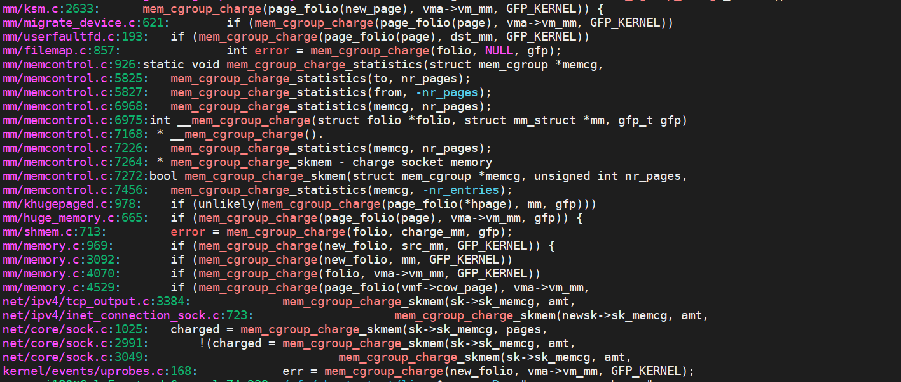

ls /sys/fs/cgroup/memory/

cat /proc/cgroups

mount -t cgroup -o memory mem cgrp1/

cat /proc/$pid/cgroup

mount -t tmpfs cgroup_root /sys/fs/cgroup

mount -t cgroup2 none /sys/fs/cgroup

cd /sys/fs/cgroup

echo "+memory" > cgroup.subtree_control（cgroup.controllers有的才可以加）

mkdir cgroup0

echo 4M > cgroup0/memory.high

echo <pid> > cgroup0/cgroup.procs

**问题1：申请内存是如何将page加入mem_cgroup_per_node的lru列表（以do_anonymous_page申请页面为例）do_anonymous_page->folio_add_lru_vma**

（1）get_mem_cgroup_from_mm通过mm_struct获取memcg（mm_struct获取task_struct,结合memory_cgrp_id获取进程所在的mem_cgroup）

（2）申请页面成功后调用mem_cgroup_charge->charge_memcg->try_charge记账成功后，commit_charge将folio->memcg_data设置为memcg

（3）folio_lruvec->folio_memcg中，通过folio->memcg_data成员获取memcg，进而获取mem_cgroup_per_node的lru列表

（4）folio_lruvec->folio_pgdat通过folio->page->flag获取folio所在的内存节点号

（5）结合 memcg->nodeinfo和内存节点号返回lruvec

（6）folio_add_lru_vma将folio添加到内存节点上

**内存记账**

```c
handle_mm_fault //这只是众多记账路径中的一个，
->__handle_mm_fault
->handle_pte_fault
->do_anonymous_page
->mem_cgroup_charge
```


