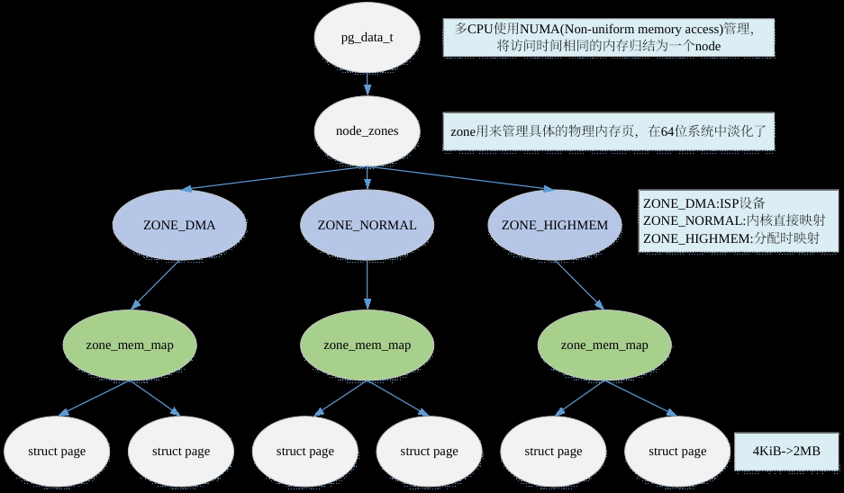
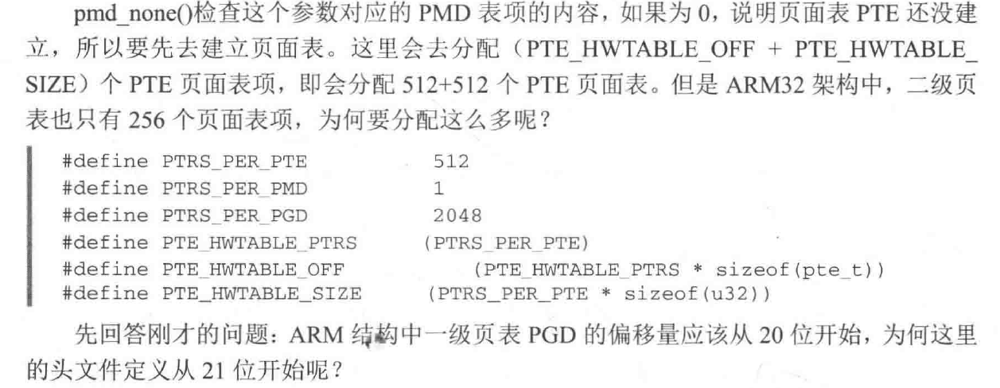
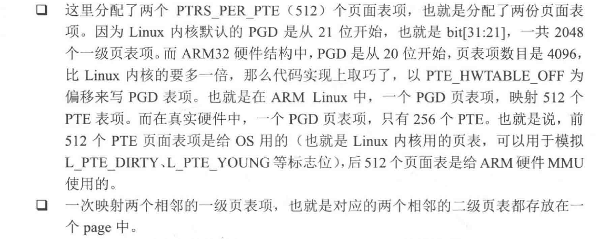

**物理内存架构**



**问题1：arm32一个PAGE放几个PTE**





**问题2：一个巨页的大小和虚拟地址BIT索引有关**


<mark>页面种类（page->flag，page->mapping）</mark>

```c
1，匿名页        (利用page->mapping最低两个bit判断 ) -> 单身匿名页面（page->flag的PG_anon_exclusive位）
2，文件页
3，mlock页        page->flag的PG_Mlocked位
4，GUP pin页        通过增加page->_refcount来pin住页面，比较page->_mapcount和page->_refcount来判断页面是否被pin住
5，THP页            filio->flag与filio->_filio_dtor共同判断    
                PMD-mapped THP ( pmd_val(pmd) && pmd_present(pmd) && !(pmd_val(pmd) & PMD_TABLE_BIT);)   
                PTE-mapped THP   (compound_order(page) == HPAGE_PMD_ORDER  并且pmd_trans_huge（pmd)不成立)
6，hugeTLB页        filio->flag与filio->_filio_dtor共同判断
7，uffd_wp 页    pte_flags（_PAGE_SWP_UFFD_WP和_PAGE_UFFD_WP）和 vma->vm_flags 的 VM_UFFD_WP
8，毒页
9，swap页        !pet_none && ! !pte_present(pte有值，但pte不在内存中，PTE_VALID | PTE_PROT_NONE置位)
                page->flag的PG_swapcache: Swap page: swp_entry_t in private    shrink_page_list->add_to_swap  设置，
                            shrink_page_list->page_check_dirty_writeback 或 shrink_page_list->page_out回写
                            shrink_page_list->__remove_mapping->__delete_from_swap_cache，再清除
                page->flag的PG_swapbacked : Page is backed by RAM/swap 页面可以被swap到磁盘，一般匿名页面都会设置
                                do_anonymous_page->page_add_new_anon_rmap会设置
                                shmem页面既有匿名页特点又有文件页特点（tmpfs），但是由于它有swap特性，它会加入到匿名的lru中
                                do_swap_page->swapin_readahead会设置 看folio_is_file_lru（）的注释
                page->flag的PG_swapbacked 同时标记lazy free页是干净的匿名页，相比普通的匿名页，lazy free页清除了PG_swapbacked
                            在使用过程中，若发现lazy free匿名页变脏，则设置PG_swapbacked
10，writeback页    page->flag的PG_writeback filio正在回写    __folio_start_writeback设置
11，KSM页        folio->mapping设置PAGE_MAPPING_KSM，  set_page_stable_node加入稳定树时设置
12,workingset页    用于记录页面之前是否处于active列表中，查看refault_distance笔记
13,young与idle    PG_young 与 PG_idle是idle page tracking机制引入的标记位，用于追踪这个页最近是否被访问过
                   要与pte_young区分开，pte_young是改PTE映射的页被访问时硬件自动
```

<mark>映射种类（vma->vm_flags）</mark>

```c
1，共享映射
2，
3，mlock映射    vma->vm_flags & VM_LOCKED

6，hugeTLB映射    vma->vm_flags=VM_HUGETLB
7，uffd 页        vma->vm_flags=VM_UFFD_WP 和vma->vm_flags=VM_UFFD_MISSING
```

**ARM Linux 如何模拟X86 PTE中的Present Young和Dirty标志位**

**ARM Linux 如何模拟X86 PTE中的Present Young和Dirty标志位**

原创文章，转载请注明出处.转载自: Li Haifeng's Blog  
本文链接地址: ARM  
Linux 如何模拟X86 PTE中的Present Young和Dirty标志位

注：本文是参考Kernel的代码并加上个人揣测，欢迎指正

在X86 MMU Page table entry中，有三个标志位在ARM 的MMU硬件所规定的Page table entry中不提供。这三个标志位的作用如下：

- PTE_DIRTY的作用：CPU在写操作的时候，处理器会将改位置位。说明对应的页被写过，是脏的。
- PTE_YOUNG的作用是：MMU 寻址是将该标志置位（在换出的时候，如果此标志位被置位，说明该地址刚刚被使用过，暂时不换出此pte对应的页，同时清除该标志位）。
- PTE_PRESENT的作用是：MMU在访问PTE的时候，若PTE_PRESENT为0，则将地址放在CR2寄存器中，同时触发Pagefault异常。

下图抓自：《Linux内核情景分析》

由于Linux最早是build在X86平台上的，因此移植到ARM后，也需要遵从X86的内存管理框架，模拟ARM MMU没有提供的PTE_PRESENT， PTE_YOUNG 和PTE_WRITE。

下面的分析，参考了arch/arm/include/asm/pgtable-2level.h中的注释

Q:如何模拟PTE_DIRTY ?

A:  
ARM Linux是通过dirty去标识某个页是否是可以PTE_WRITE的。  
对于新分配的页，Hardware页表会设置只读，Linux页表设置为可写，对其进行写操作，会触发MMU异常。该异常会被handle_pte_fault处理。进而设置Hardware页表为可写

Q:如何模拟PTE_YOUNG?

A:这个PTE_YOUNG在内存被分配的Linux页表设置，当解除映射的时候，将清掉该位。如果Linux版本的PTE的young位被清除了，MMU使用的PTE版本的value是要清除的，但TLB并不刷新。

Q:如何模拟present：

A:  
ARM的MMU在访问的时候，不像X86的MMU那样(只要看到*pte为0，就判断该页压根没有被加载到内存中；若*pte不为0，PTE_PRESENT位为0，就能判断该被swap out了),那么ARM  
MMU是如何判断某页是swap out了，还是压根就没有被加载到memory中呢？在ARM Linux中，若换出某页，会置位Linux版本中的PTE_YOUNG，清掉Linux版本中的PTE_PRESENT（在ARM Linux中，每一个页表项是有两份的）。如果被换出，那么Linux  
Version中的值非0，而Hardware值被置为0：  
arch/arm/mm/proc-v7-2level.S  
103 tst r1, #L_PTE_YOUNG  
104 tstne r1, #L_PTE_PRESENT  
105 moveq r3, #0

From Li Haifeng's Blog, post ARM  
Linux 如何模拟X86 PTE中的Present Young和Dirty标志位
