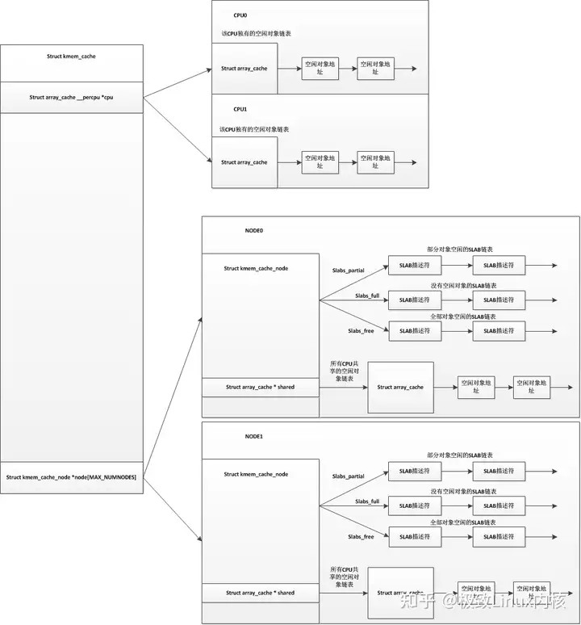
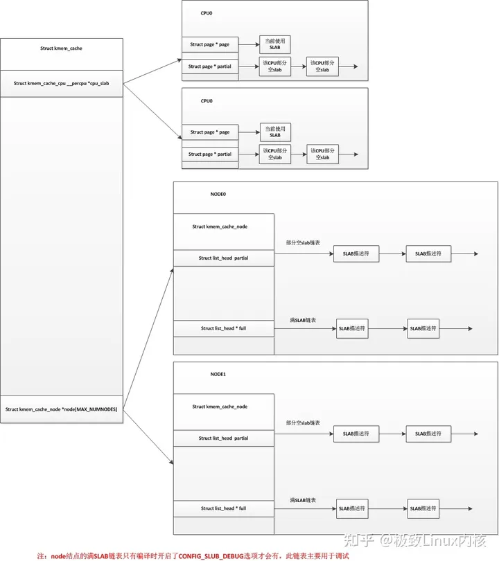
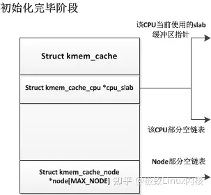
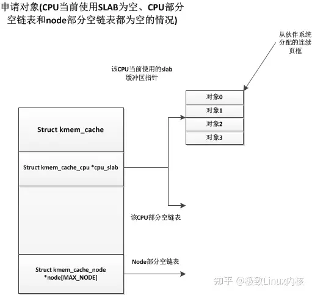
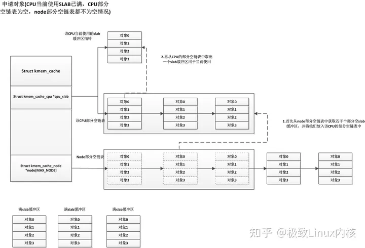
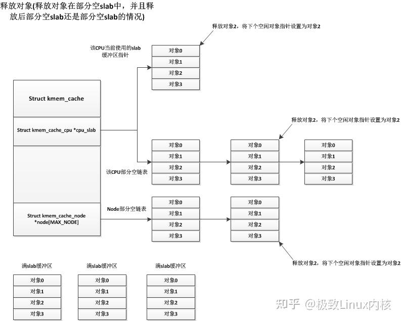
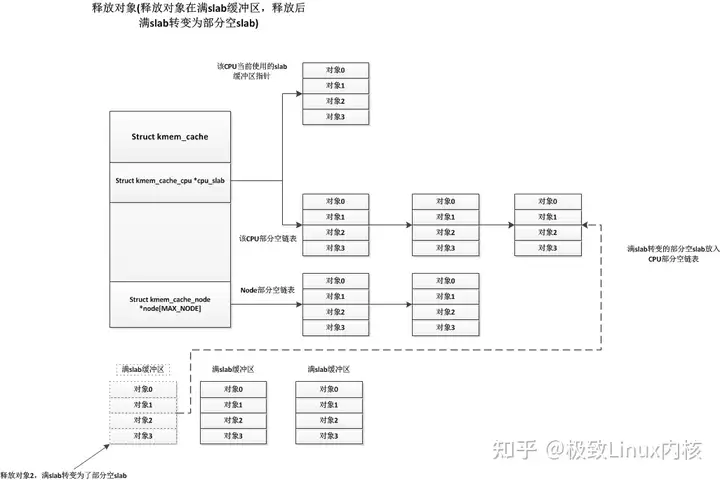
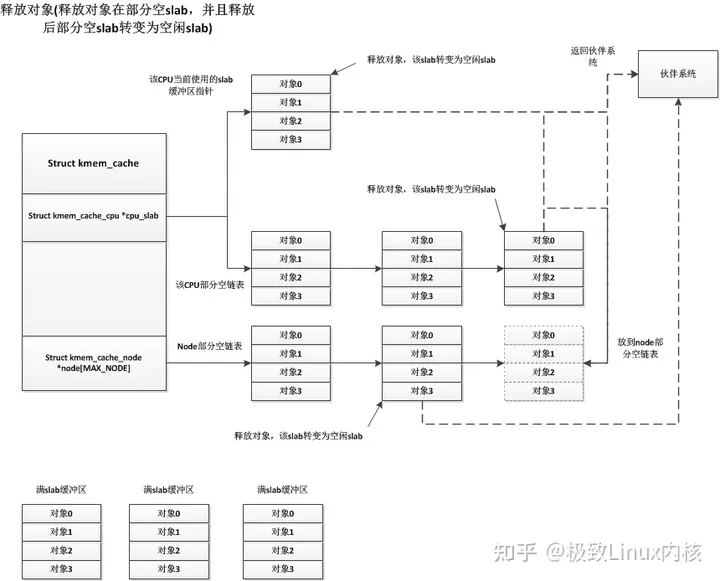

## **SLUB和SLAB的区别**

首先为什么要说slub分配器，内核里小内存分配一共有三种，SLAB/SLUB/SLOB，slub分配器是slab分配器的进化版，而slob是一种精简的小内存分配算法，主要用于嵌入式系统。慢慢的slab分配器或许会被slub取代，所以对slub的了解是十分有必要的。

　　我们先说说slab分配器的弊端，我们知道slab分配器中每个node结点有三个链表，分别是空闲slab链表，部分空slab链表，已满slab链表，这三个链表中维护着对应的slab缓冲区。我们也知道slab缓冲区的内存是从伙伴系统中申请过来的，我们设想一个情景，如果没有内存回收机制的情况下，只要申请的slab缓冲区就会存入这三个链表中，并不会返回到伙伴系统里，如果这个类型的SLAB迎来了一个分配高峰期，将会从伙伴系统中获取很多页面去生成许多slab缓冲区，之后这些slab缓冲区并不会自动返回到伙伴系统中，而是会添加到node结点的这三个slab链表中去，这样就会有很多slab缓冲区是很少用到的。

　　而slub分配器把node结点的这三个链表精简为了一个链表，只保留了部分空slab链表，而SLUB中对于每个CPU来说已经不使用空闲对象链表，而是直接使用单个slab，并且每个CPU都维护有自己的一个部分空链表。在slub分配器中，对于每个node结点，也没有了所有CPU共享的空闲对象链表。我们用以下图来表示以下slab分配器和slub分配器的区别(上图为SLAB，下图为SLUB)：





## **SLUB分配器**

发明SLUB分配器的主要目的就是减少slab缓冲区的个数，让更多的空闲内存得到使用。首先，SLUB和SLAB一样，都分为多种，同时也分为专用SLUB和普通SLUB。如TCP,UDP,dquot这些，它们都是专用SLAB，专属于它们自己的模块。而后面这张图，如kmalloc-8，kmalloc-16...还有dma-kmalloc-96，dma-kmalloc-192...在这方面与SLAB是一样的，同样地，也是使用一个struct kmem_cache结构来描述一个SLUB（与SLAB一样）。并且这个struct kmem_cache与SLAB的struct kmem_cache几乎是同一个，而且对于SLAB和SLUB，向外提供的接口是统一的(函数名、参数以及返回值一模一样)，这样也就让驱动和其他模块在编写代码时无需操心系统使用的是SLAB还是SLUB。这是为了同一个内核可以通过编译选项使用SLAB或者SLUB。

SLUB分配器中的slab缓冲区结构与SLAB分配器中的slab缓冲区的结构也有了明显的不同，对于SLAB分配器的slab缓冲区，其结构如下：


而在SLUB分配器的slab缓冲区结构中，已经没有了对象描述符数组，而freelist也拆分成了每个对象有一个指向下一个对象的指针，如下：


虽然这两个slab缓冲区的结构上有所不同，但其实际原理还是一样，每次分配或释放都会设置对象的下个空闲对象指针，让其指向正确的位置。在初始化一个slab缓冲区时，默认第一个空闲对象是对象0，然后对象0后面跟着的下一个空闲对象指针指向对象1，对象1的空闲对象指针指向对象2，以此类推。

我们看看SLUB分配器的描述符，struct kmem_cache结构：

```c
struct kmem_cache {
    struct kmem_cache_cpu __percpu *cpu_slab;
    /* 标志 */
    unsigned long flags;
    /* 每个node结点中部分空slab缓冲区数量不能低于这个值 */
    unsigned long min_partial;
    /* 分配给对象的内存大小(大于对象的实际大小，大小包括对象后边的下个空闲对象指针) */
    int size;    
    /* 对象的实际大小 */
    int object_size;  
    /* 存放空闲对象指针的偏移量 */
    int offset;  
    /* cpu的可用objects数量范围最大值 */
    int cpu_partial;   
    /* 保存slab缓冲区需要的页框数量的order值和objects数量的值，通过这个值可以计算出需要多少页框，这个是默认值，初始化时会根据经验计算这个值 */
    struct kmem_cache_order_objects oo;

    /* 保存slab缓冲区需要的页框数量的order值和objects数量的值，这个是最大值 */
    struct kmem_cache_order_objects max;
    /* 保存slab缓冲区需要的页框数量的order值和objects数量的值，这个是最小值，当默认值oo分配失败时，会尝试用最小值去分配连续页框 */
    struct kmem_cache_order_objects min;
    /* 每一次分配时所使用的标志 */
    gfp_t allocflags;   
    /* 重用计数器，当用户请求创建新的SLUB种类时，SLUB 分配器重用已创建的相似大小的SLUB，从而减少SLUB种类的个数。 */
    int refcount;  
    /* 创建slab时的构造函数 */
    void (*ctor)(void *);
    /* 元数据的偏移量 */
    int inuse;   
    /* 对齐 */
    int align;      
    int reserved;      
    /* 高速缓存名字 */
    const char *name;    
    /* 所有的 kmem_cache 结构都会链入这个链表，链表头是 slab_caches */
    struct list_head list;    
#ifdef CONFIG_SYSFS
    /* 用于sysfs文件系统，在/sys中会有个slub的专用目录 */
    struct kobject kobj;   
#endif
#ifdef CONFIG_MEMCG_KMEM
    /* 这两个主要用于memory cgroup的，先不管 */
    struct memcg_cache_params *memcg_params;
    int max_attr_size; 
#ifdef CONFIG_SYSFS
    struct kset *memcg_kset;
#endif
#endif

#ifdef CONFIG_NUMA
    /* 用于NUMA架构，该值越小，越倾向于在本结点分配对象 */
    int remote_node_defrag_ratio;
#endif
    /* 此高速缓存的SLAB链表，每个NUMA结点有一个，有可能该高速缓存有些SLAB处于其他结点上 */
    struct kmem_cache_node *node[MAX_NUMNODES];
};
```

扫一下整个kmem_cache结构，知识点最重要的有4个：**每CPU对应的cpu_slab结构，每个node结点对应的kmem_cache_node结构，slub重用以及struct kmem_cache_order_objects结构对应的oo,max,min这三个值**。

除去以上4个知识点，我们先简单说说kmem_cache中的一些成员变量：

- **size**：**size** = 对象大小 + 对象后面紧跟的下个空闲对象指针。
- **object_size**：**对象大小**。
- **offset**：**对象首地址**+ offset = 下个空闲对象指针地址
- **min_partial**：**node**结点中部分空slab缓冲区数量不能小于这个值，如果小于这个值，空闲slab缓冲区则不能够进行释放，而是将空闲slab加入到node结点的部分空slab链表中。
- **cpu_partial**：**同min_partial类似**，只是这个值表示的是空闲对象数量，而不是部分空slab数量，即CPU的空闲对象数量不能小于这个值，小于的情况下要去对应node结点的部分空链表中获取若干个部分空slab。
- **name**：**该kmem_cache的名字**。

我们再来看看struct kmem_cache_cpu __percpu *cpu_slab，对于同一种kmem_cache来说，每个CPU对应有自己的struct kmem_cache_cpu结构，这个结构如下：

```c
struct kmem_cache_cpu {
    /* 指向下一个空闲对象，用于快速找到对象 */
    void **freelist;
    /* 用于保证cmpxchg_double计算发生在正确的CPU上，并且可作为一个锁保证不会同时申请这个kmem_cache_cpu的对象 */
    unsigned long tid;    
    /* CPU当前所使用的slab缓冲区描述符，freelist会指向此slab的下一个空闲对象 */
    struct page *page;    
    /* CPU的部分空slab链表，放到CPU的部分空slab链表中的slab会被冻结，而放入node中的部分空slab链表则解冻，冻结标志在slab缓冲区描述符中 */
    struct page *partial;
#ifdef CONFIG_SLUB_STATS
    unsigned stat[NR_SLUB_STAT_ITEMS];
#endif
};
```

在此结构中主要注意有个partial部分空slab链表以及page指针，page指针指向当前使用的slab缓冲区描述符，内核中slab缓冲区描述符与页描述符共用一个struct page结构。SLUB分配器与SLAB分配器有一部分不同就在此，SLAB分配器的每CPU结构中保存的是空闲对象链表，而SLUB分配器的每CPU结构中保存的是一个slab缓冲区。而对于tid，它主要用于检查是否有并发，对于一些操作，操作前读取其值，操作结束后再检查其值是否与之前读取的一致，非一致则要进行一些相应的处理，这个tid一般是递增状态，每分配一次对象加1。这个结构说明了一个问题，就是每个CPU有自己当前使用的slab缓冲区，CPU0不能够使用CPU1所在使用的slab缓存，CPU1也不能够使用CPU0正在使用的slab缓存。而CPU从node获取slab缓冲区时，一般倾向于从该CPU所在的node结点上分配，如果该node结点没有空闲的内存，则根据memcg以及node结点的zonelist从其他node获取slab缓冲区。这些具体可以在代码中见到。

我们再看看kmem_cache_node结构：

```c
struct kmem_cache_node {
    /* 锁 */
    spinlock_t list_lock;

/* SLAB使用 */
#ifdef CONFIG_SLAB
    /* 只使用了部分对象的SLAB描述符的双向循环链表 */
    struct list_head slabs_partial;    /* partial list first, better asm code */
    /* 不包含空闲对象的SLAB描述符的双向循环链表 */
    struct list_head slabs_full;
    /* 只包含空闲对象的SLAB描述符的双向循环链表 */
    struct list_head slabs_free;
    /* 高速缓存中空闲对象个数(包括slabs_partial链表中和slabs_free链表中所有的空闲对象) */
    unsigned long free_objects;
    /* 高速缓存中空闲对象的上限 */
    unsigned int free_limit;
    /* 下一个被分配的SLAB使用的颜色 */
    unsigned int colour_next;    /* Per-node cache coloring */
    /* 指向这个结点上所有CPU共享的一个本地高速缓存 */
    struct array_cache *shared;    /* shared per node */
    struct alien_cache **alien;    /* on other nodes */
    /* 两次缓存收缩时的间隔，降低次数，提高性能 */
    unsigned long next_reap;    
    /* 0:收缩  1:获取一个对象 */
    int free_touched;        /* updated without locking */
#endif

/* SLUB使用 */
#ifdef CONFIG_SLUB
    unsigned long nr_partial;
    struct list_head partial;
#ifdef CONFIG_SLUB_DEBUG
    /* 该node中此kmem_cache的所有slab的数量 */
    atomic_long_t nr_slabs;
    /* 该node中此kmem_cache中所有对象的数量 */
    atomic_long_t total_objects;
    struct list_head full;
#endif
#endif

};
```

这个结构中我们只需要看#ifdef CONFIG_SLUB部分，这个结构里正常情况下只有一个node结点部分空slab链表partial，如果在编译内核时选择了CONFIG_SLUB_DEBUG选项，则会有个node结点满slab链表。对于SLAB分配器，SLUB分配器在这个结构也做出了相应的变化，去除了满slab缓冲区链表和空闲slab缓冲区链表，只使用了一个部分空slab缓冲区链表。对于所有的CPU来说，它们可以使用这个node结点里面部分空链表中保存的那些slab缓冲区，当它们需要使用时，要先将缓冲区拿到CPU对应自己的链表或者当前使用中，也就是说node结点上部分空slab缓冲区同一个时间只能让一个CPU使用。

而**关于slub重用**，这里只做一个简单的解释，其作用是为了减少slub的种类，比如我有个kmalloc-8类型的slub，里面每个对象大小是8，而我某个驱动想申请自己所属的slub，其对象大小是6，这时候系统会给驱动一个假象，让驱动申请了自己专属的slub，但系统实际把kmalloc-8这个类型的slub返回给了驱动，之后驱动中分配对象时实际上就是从kmalloc-8中分配对象，这就是slub重用，将相近大小的slub共用一个slub类型，虽然会造成一些内碎片，但是大大减少了slub种类过多以及减少使用了跟多的内存。

最后说说**struct kmem_cache_order_objects结构对应的oo,max,min这三个值**，struct kmem_cache_order_objects结构实际上就是一个unsigned long，这个结构有两个作用，保存一个slab缓冲区占用页框的order值和一个slab缓冲区对象数量的值。当kmem_cache需要创建一个新的slab缓冲区时，会使用它们当中保存的oder值去申请2的order次方个数的页框。oo是一个默认值，在大多数情况下创建一个新的slab缓冲区时会用oo中的值来申请页框，而min是在oo申请失败的情况下使用，它是一个比oo更小的值，当伙伴系统拿不出oo中指定的数量的页框，会尝试向伙伴系统申请min中指定的页框数量(这个slab缓冲区连续页框数量少，对象数量也会少)。而max的值是在做slab缓冲区压缩时使用，其作用更多的是作为一个安全值，在这个kmem_cache中所有slab缓冲区的objects数量都不会大于max中的值。所有情况都是max >= oo > min。

现在，我们描述一下SLUB分配器是如何运作的，kmem_cache初始化后其是没有slab缓冲区的，当其他模块需要从此kmem_cache中申请一个对象时，kmem_cache会从伙伴系统获取连续的页框作为一个slab缓冲区，然后通过kmem_cache中的cotr函数指针指向的构造函数构造初始化这个slab缓冲区后，将其设置为该cpu的当前使用slab缓冲区，当此slab缓冲区使用完后，外部模块在申请对象时，会把这个满的slab缓冲区移除，再从伙伴系统获取一段连续页框作为一个新的空闲slab缓冲区，也是设置为该CPU当前使用的slab缓冲区。而那些满slab缓冲区中有对象释放时，SLUB分配器优先把这些缓冲区放入该CPU对应的部分空slab链表。而当一个部分空slab通过释放对象成为了一个空闲slab缓冲区时，SLUB分配器会视情况而定将此空闲slab释放还是加入到node结点的部分空slab链表中。

我们先看看一个slub初始化结束的情况：



初始化完成后，slub中并没有一个slab缓冲区，只有在第一次申请时，才会从伙伴系统中获取一段连续页框作为一个slab缓冲区，如下：



这时候当前CPU获得了一个空闲slab缓冲区，并将其中的一个空闲对象分配出去，而下次申请对象时也会从该slab缓冲区中获取对象，直到此缓冲区中对象用完为止。

上面描述的是初始化完成后第一次申请对象的情况，现在我们描述一下运行时申请对象的情况，一种情况是当前CPU使用的slab缓冲区有多余的空闲对象，这样直接从这些多余的空闲对象中分配一个出去即可，这种情况很简单。我们着重说明CPU使用的slab缓冲区没有多余的空闲对象的情况，这种情况又分为CPU的部分空slab链表是否为空的情况，如果CPU部分空slab链表不为空，则CPU会将当前使用的满slab移除，并从CPU的部分空slab链表中获取一个部分空的slab缓冲区，并设置为CPU当前使用的slab缓冲区，如下图：


如果node的部分空链表和CPU的部分空链表都为空的情况，那就与我们第一次申请对象的情况一样，直接从伙伴系统中获取连续页框用于一个slab缓冲区。

现在我们再说说CPU当前使用的slab已满，CPU的部分空slab链表为空的情况，这种情况下，会从node结点的部分空slab链表获取若干个部分空slab缓冲区，将它们放入CPU的部分空slab链表中，获取的slab缓冲区个数根据一个规则就是：**cpu空闲的对象数量必须要大于kmem_cache中的cpu_partial的值的一半**。具体如下：



各种情况的申请对象都已经说明了，接下来我们说说释放对象的情况，释放对象也分很多种，我们先说说最简单的一种释放情况，就是部分空的slab释放其中一个使用着的对象，释放后这个部分空slab还是部分空slab(有些部分空slab只使用了一个对象，释放这个对象后就变为空闲slab)，这些部分空slab可能处于CPU当前使用slab，CPU部分空链表，node部分空链表中，但是它们的处理都是一样的，直接释放掉该对象即可，如下：



另一种情况是满slab缓冲区释放对象后变为了部分空slab缓冲区，这种情况下系统会将此部分空slab缓冲区放入CPU的部分空链表中，如下：



最后一种释放情况就是部分空slab释放一个对象后转变成了空闲slab缓冲区，而对于这个空闲slab缓冲区的处理，系统首先会检查node部分空链表中slab缓冲区的个数，如果node部分空链表中slab缓冲区数量小于kmem_cache中的min_partial，则将这个空闲slab缓冲区放入node部分空链表中。否则释放此空闲slab，将其占用页框返回伙伴系统中。我们知道部分空slab有可能存在于3个地方，CPU当前使用的slab缓冲区，CPU部分空链表，node部分空链表，这三个地方对于这种情况下的处理都是一样的，如下：



这样看来只有空闲的slab缓冲区会被放入node结点的部分空链表中，这只是从释放对象的角度看是这样的，当刷新kmem_cache时，会将kmem_cache中所有的slab缓冲区放回到node结点的部分空链表(也包括当前CPU使用的slab缓冲区)，这种情况node结点的部分空链表就会有部分空slab缓冲区了。而还有一种情况就是编译时禁用了CPU的部分空链表，即CPU只有一个当前使用的slab缓冲区，这样其他的部分空缓冲区都会保存在node结点的部分空链表上，更多详细细节请看内核源码中的mm/slub.c文件。

**slab缓冲区压缩技术**

本来不想写这一节，不过担心以后懒得去用一篇文章去描述slab压缩技术，这里就简单说一下吧。

说是压缩技术，其实就是把kmem_cache中所有的slab缓冲区放回到node结点的部分空链表中(包括所有CPU当前正在使用的slab)，然后node结点的部分空链表中的空闲的slab缓冲区释放掉，然后将node结点中的其他部分空slab缓冲区按照空闲对象数量进行重新排列，把空闲数量少的放在前面，空闲数量多的放在后面，这样空闲数量少的更容易被移去cpu的部分空链表。其实思想就是让那些更容易成为满slab的部分空slab优先被使用。总结出来就是释放空闲slab和对部分空slab排序。

我们知道，在node结点的部分空链表中，slab缓冲区数量少于kmem_cache中的min_partial的值时，即使空闲slab缓冲区也不会被释放，而是放入node结点部分空链表中，这样一来之后会有一些空闲slab缓冲区无法自动释放回伙伴系统，压缩技术就是在系统内存紧急时会去释放这些空闲的伙伴系统，然后对其他部分空的slab缓冲区重新排列。代码如下：

```c
int __kmem_cache_shrink(struct kmem_cache *s)
{
    int node;
    int i;
    struct kmem_cache_node *n;
    struct page *page;
    struct page *t;
    /* 所有slab缓冲区的最大对象数量 */
    int objects = oo_objects(s->max);
    /* 申请objects个链表头，每个inuse相同的slab缓冲区会放入对应的链表中 */
    struct list_head *slabs_by_inuse =
        kmalloc(sizeof(struct list_head) * objects, GFP_KERNEL);
    unsigned long flags;

    if (!slabs_by_inuse)
        return -ENOMEM;

    /* 刷新这个kmem_cache中所有的slab，这个操作会将所有CPU中的slab放回到node结点的部分空链表中 */
    flush_all(s);
    
    /* 变量kmem_cache中的每个node结点 */
    for_each_kmem_cache_node(s, node, n) {
        /* node结点部分空链表为空则直接下一个结点 */
        if (!n->nr_partial)
            continue;

        /* node结点部分空链表不为空，初始化slabs_by_inuse链表中每个链表头结点 */
        for (i = 0; i < objects; i++)
            INIT_LIST_HEAD(slabs_by_inuse + i);

        /* kmem_cache_node上锁 */
        spin_lock_irqsave(&n->list_lock, flags);

        /* 遍历node结点部分空链表中所有的部分空slab缓冲区 */
        list_for_each_entry_safe(page, t, &n->partial, lru) {
            /* 将node结点中所有的部分空slab缓冲区移到slabs_by_inuse中inuse链表中，也就是所有inuse=1的slab放入同一个链表，inuse=2的放入同一个链表 */
            list_move(&page->lru, slabs_by_inuse + page->inuse);
            /* 如果inuse == 0，则node结点的部分空slab数量-- */
            if (!page->inuse)
                n->nr_partial--;
        }

        /* 重建node结点的部分空链表，将slabs_by_inuse中inuse高的放在前面，inuse低的放在后面，让inuse高的更容易得到分配机会，也就是让inuse高的更快用完 */
        for (i = objects - 1; i > 0; i--)
            list_splice(slabs_by_inuse + i, n->partial.prev);

        spin_unlock_irqrestore(&n->list_lock, flags);

        /* 如果有空的slab缓冲区，空的slab缓冲区保存在slabs_by_inuse + 0的链表位置，释放他们 */
        list_for_each_entry_safe(page, t, slabs_by_inuse, lru)
            discard_slab(s, page);
    }
    /* 释放objects个链表头 */
    kfree(slabs_by_inuse);
    return 0;
```


