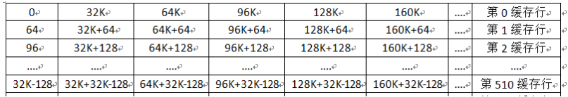

## slab的着色区是什么

cache总共就32K，每个缓存行为64个字节，一共512行。为什么说cache行是一个固定映射呢，以内存物理地址是0x1000000为例，从0x1000000 —— 0x1008000 属于同一片空间（0x8000 = 2^14 =32K）。从0x1008000 —— 0x1010000 属于另一片空间。cache大小只有32k，也就是一次只能代表一片空间。如果两个访存操作，位于两片不同的空间，那么cache就需要进行切换，才能满足两个访存操作的要求

现在又2个slab描述符A和B，这两个slab描述符里的slab obj大小相同，假设都是8字节，
操作A要对0x10000008地址进行读写操做,而操作B要对0x10008008地址进行读写操做cpu检测到冲突（为啥说是冲突呢，**这两个地址都对应着cache0行**，你想想操作A未结束，操作B只能等待操作A结束后，cache0行切换地址范围，此时操作B才能进行），这里再纠正上面的一个说法，cache空间并不是整片切换(开始那么说只是为了方便理解)，可以是切换某一行，比如说，第0缓存行第一次代表0x1000000—0x1000040这64个字节大小(即缓存行大小)，下一次就是代表0x1008000—0x1008040（前后两次中间隔了32K，这是理解为啥着色的关键！！！）
若是咱们须要进行对这两块上面的数据分别交叉的读取1000次，那么咱们须要进行对高速缓存的不断移除更新，并且读取内存的速度远远的大于读取缓存的速度，那么将会形成大量的时间消耗。

解决办法就是将第二块读取的数据前加一个偏移，让它移到第1块缓存行上面，两块数据分别能够在缓存行的0和1行上面进行读取，那么咱们读取数据的时候就不会形成没必要要的数据交换。
着色即为添加偏移。

在内核V6.8版本后，**slab被移除**，取而代之的是slub，而slub并没有着色区的概念