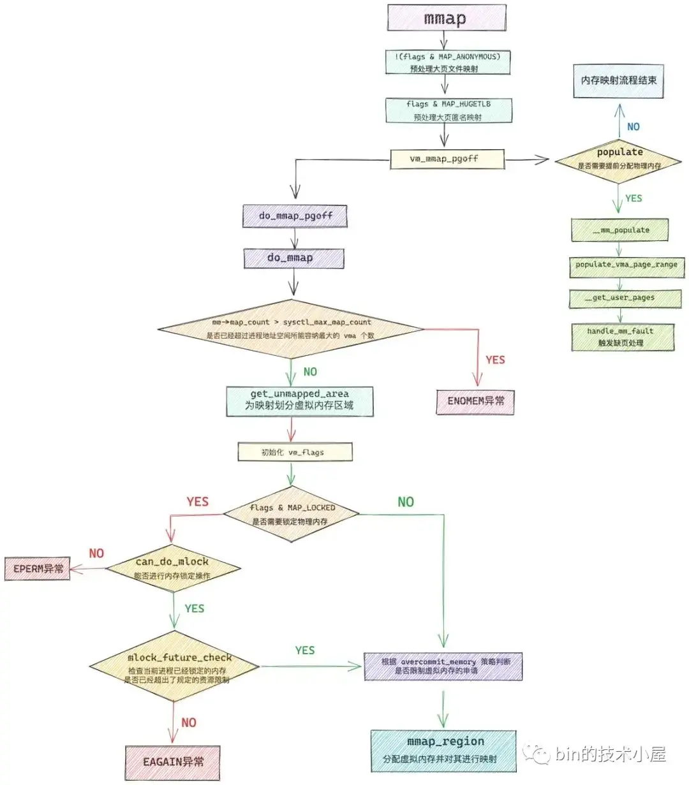
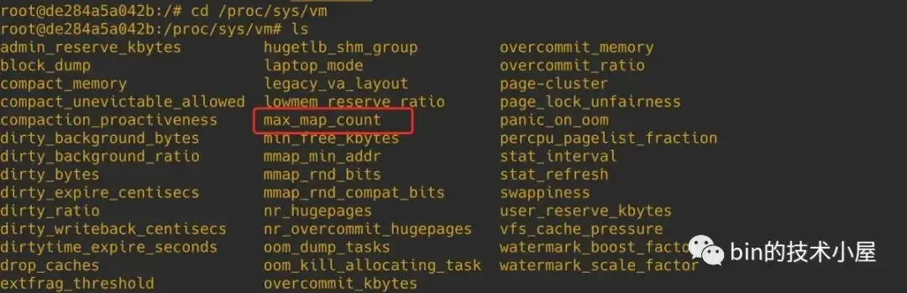
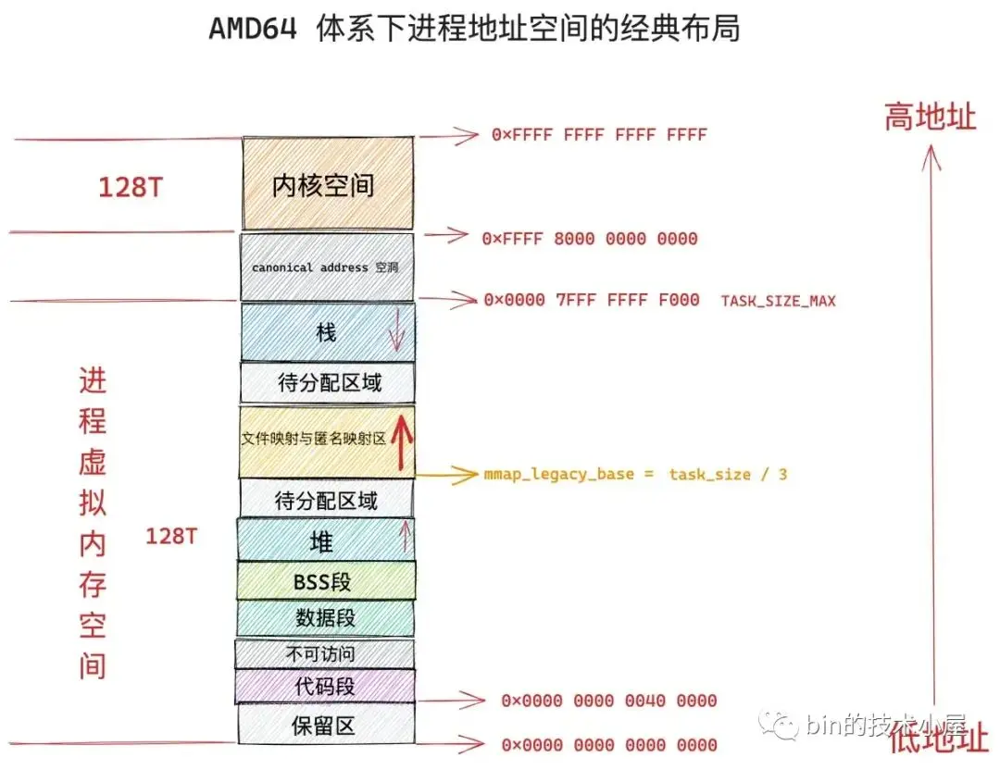
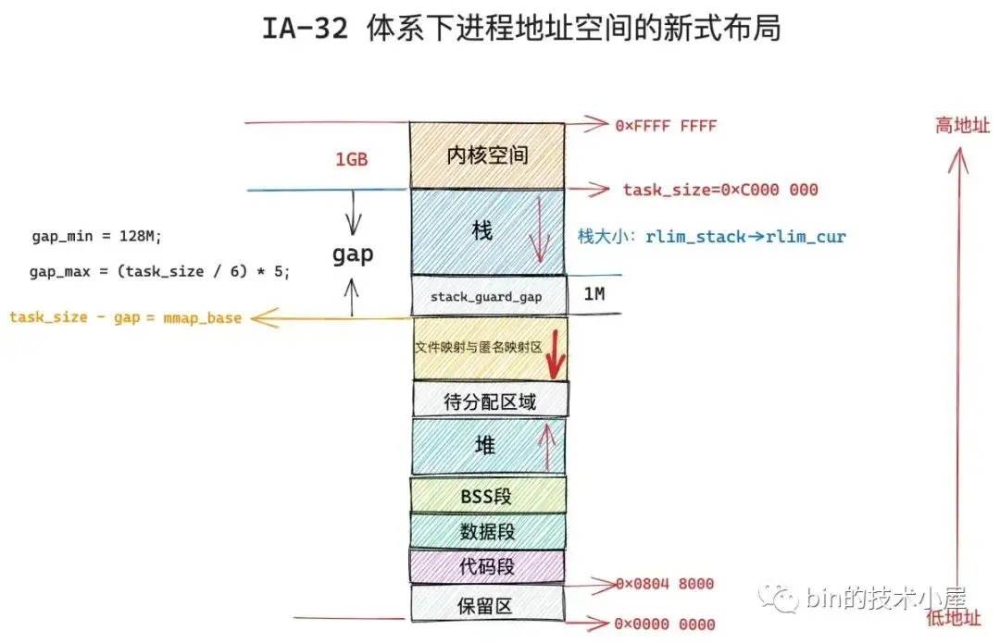

# 从内核世界透视 mmap 内存映射的本质（源码实现篇）


通过上篇文章 《从内核世界透视 mmap 内存映射的本质（原理篇）》的介绍，我们现在已经非常清楚了 mmap 背后的映射原理以及它的使用方法，其核心就是在进程虚拟内存空间中分配一段虚拟内存出来，然后将这段虚拟内存与磁盘文件映射起来，整个 mmap 系统调用就结束了。

而在 mmap 内存映射的整个过程中，最为核心且复杂烧脑的环节其实不是内存映射的逻辑，而是虚拟内存分配的整个流程。笔者曾在之前的文章 《深入理解 Linux 物理内存分配全链路实现》 中详细地为大家介绍了物理内存的分配过程，那么虚拟内存的分配过程又是什么样的呢？

本文我们将进入到内核源码实现中，来看一下虚拟内存分配的过程，在这个过程中，我们还可以亲眼看到前面介绍的 mmap 内存映射原理在内核中具体是如何实现的，下面我们就从 mmap 系统调用的入口处来开始本文的内容：


## 1. 预处理大页映射
   
```c
SYSCALL_DEFINE6(mmap, unsigned long, addr, unsigned long, len,
        unsigned long, prot, unsigned long, flags,
        unsigned long, fd, unsigned long, off)
{         
    error = ksys_mmap_pgoff(addr, len, prot, flags, fd, off >> PAGE_SHIFT);
}
```
```c
unsigned long ksys_mmap_pgoff(unsigned long addr, unsigned long len,
                  unsigned long prot, unsigned long flags,
                  unsigned long fd, unsigned long pgoff)
{
    struct file *file = NULL;
    unsigned long retval;

    // 预处理文件映射
    if (!(flags & MAP_ANONYMOUS)) {
        // 根据 fd 获取映射文件的 struct file 结构
        audit_mmap_fd(fd, flags);
        file = fget(fd);
        if (!file)
            // 这里可以看出如果是匿名映射的话必须要指定 MAP_ANONYMOUS 否则这里就返回错误了
            return -EBADF;
        // 映射文件是否是 hugetlbfs 中的文件，hugetlbfs 中的文件默认由大页支持
        if (is_file_hugepages(file))
            // mmap 进行文件大页映射，len 需要和大页尺寸对齐
            len = ALIGN(len, huge_page_size(hstate_file(file)));
        retval = -EINVAL;
        // 这里可以看出如果想要使用 mmap 对文件进行大页映射，那么映射的文件必须是 hugetlbfs 中的
        // mmap 文件大页映射并不需要指定 MAP_HUGETLB，并且 mmap 不能对普通文件进行大页映射
        if (unlikely(flags & MAP_HUGETLB && !is_file_hugepages(file)))
            goto out_fput;
    } else if (flags & MAP_HUGETLB) {
        // 从这里我们可以看出 MAP_HUGETLB 只能支持 MAP_ANONYMOUS 匿名映射的方式使用 HugePage
        struct user_struct *user = NULL;
        // 内核中的大页池（预先创建）
        struct hstate *hs;
        // 选取指定大页尺寸的大页池（内核中存在不同尺寸的大页池）
        hs = hstate_sizelog((flags >> MAP_HUGE_SHIFT) & MAP_HUGE_MASK);
        if (!hs)
            return -EINVAL;
        // 映射长度 len 必须与大页尺寸对齐
        len = ALIGN(len, huge_page_size(hs));
 
        // 在 hugetlbfs 中创建 anon_hugepage 文件，并预留大页内存（禁止其他进程申请）
        file = hugetlb_file_setup(HUGETLB_ANON_FILE, len,
                VM_NORESERVE,
                &user, HUGETLB_ANONHUGE_INODE,
                (flags >> MAP_HUGE_SHIFT) & MAP_HUGE_MASK);
        if (IS_ERR(file))
            return PTR_ERR(file);
    }

    flags &= ~(MAP_EXECUTABLE | MAP_DENYWRITE);
    // 开始内存映射
    retval = vm_mmap_pgoff(file, addr, len, prot, flags, pgoff);
out_fput:
    if (file)
        // file 引用计数减 1
        fput(file);
    return retval;
}
```

ksys_mmap_pgoff 函数主要是针对 mmap 大页映射的情况进行预处理，从该函数对大页的预处理逻辑中我们可以提取出如下几个关键信息：

* 在使用 mmap 进行匿名映射的时候，必须在 flags 参数中指定 MAP_ANONYMOUS 标志，否则映射流程将会终止，并返回 EBADF 错误。
* mmap 在对文件进行大页映射的时候，映射文件必须是 hugetlbfs 中的文件，flags 参数无需设置 MAP_HUGETLB， mmap 不能对普通文件进行大页映射，这种映射方式必须提前手动挂载 hugetlbfs 文件系统到指定路径下。映射长度需要与大页尺寸进行对齐。
* MAP_HUGETLB 需要和 MAP_ANONYMOUS 配合一起使用，MAP_HUGETLB 只能支持匿名映射的方式来使用 HugePage，当 mmap 设置 MAP_HUGETLB 标志进行匿名大页映射的时候，在这里需要为进程在大页池（hstate）中预留好本次映射所需要的大页个数，注意此时只是预留，还并未分配给进程，大页池中被预留好的大页不能被其他进程使用。当进程发生缺页的时候，内核会直接从大页池中把这些提前预留好的内存映射到进程的虚拟内存空间中。
  
这部分被预留好的大页会记录在 cat /proc/meminfo 命令中的 HugePages_Rsvd 字段上。

1. mmap 系统调用，背后依赖的是 hugetlbfs 文件系统，这种情况下只需要判断映射文件的 struct file 结构中定义的文件操作是否是 hugetlbfs 文件系统相关的操作，这样就可以确定出映射文件是否为 hugetlbfs 文件系统中的文件。
2. SYSV 标准的系统调用 shmget 和 shmat，背后依赖 shm 文件系统，同理，只需要判断映射文件是否为 shm 文件系统中的文件即可。

```c
static inline bool is_file_hugepages(struct file *file)
{
    // hugetlbfs 文件系统中的文件默认由大页支持
    // mmap 通过映射 hugetlbfs 中的文件实现文件大页映射
    if (file->f_op == &hugetlbfs_file_operations)
        return true;

    // 通过 shmat 使用匿名大页，这里不需要关注
    return is_file_shm_hugepages(file);
}

bool is_file_shm_hugepages(struct file *file)
{
     // SYSV 标准的系统调用 shmget 和 shmat 通过 shm 文件系统来共享内存
     // 通过 shmat 的方式使用大页会设置，这里我们不需要关注
    return file->f_op == &shm_file_operations_huge;
}
```
## 2.是否立即为映射分配物理内存
在一般情况下，我们调用 mmap 进行内存映射的时候，内核只是会在进程的虚拟内存空间中为这次映射分配一段虚拟内存，然后建立好这段虚拟内存与相关文件之间的映射关系就结束了，内核并不会为映射分配物理内存。

而物理内存的分配工作需要延后到这段虚拟内存被 CPU 访问的时候，通过缺页中断来进入内核，分配物理内存，并在页表中建立好映射关系。

但是当我们调用 mmap 的时候，如果在 flags 参数中设置了 MAP_POPULATE 或者 MAP_LOCKED 标志位之后，物理内存的分配动作会提前发生。

首先会通过 do_mmap_pgoff 函数在进程虚拟内存空间中分配出一段未映射的虚拟内存区域，返回值 ret 表示映射的这段虚拟内存区域的起始地址。

紧接着就会调用 mm_populate，内核会在 mmap 刚刚映射出来的这段虚拟内存区域上，依次扫描这段 vma 中的每一个虚拟页，并对每一个虚拟页触发缺页异常，从而为其立即分配物理内存。

```c
unsigned long vm_mmap_pgoff(struct file *file, unsigned long addr,
    unsigned long len, unsigned long prot,
    unsigned long flag, unsigned long pgoff)
{
    unsigned long ret;
    // 获取进程虚拟内存空间
    struct mm_struct *mm = current->mm;
    // 是否需要为映射的 VMA，提前分配物理内存页，避免后续的缺页
    // 取决于 flag 是否设置了 MAP_POPULATE 或者 MAP_LOCKED，这里的 populate 表示需要分配物理内存的大小
    unsigned long populate;

    ret = security_mmap_file(file, prot, flag);
    if (!ret) {
        // 对进程虚拟内存空间加写锁保护，防止多线程并发修改
        if (down_write_killable(&mm->mmap_sem))
            return -EINTR;
        // 开始 mmap 内存映射，在进程虚拟内存空间中分配一段 vma，并建立相关映射关系
        // ret 为映射虚拟内存区域的起始地址
        ret = do_mmap_pgoff(file, addr, len, prot, flag, pgoff,
                    &populate, &uf);
        // 释放写锁
        up_write(&mm->mmap_sem);
        if (populate)
            // 提前分配物理内存页面，后续访问不会缺页
            // 为 [ret , ret + populate] 这段虚拟内存立即分配物理内存
            mm_populate(ret, populate);
    }
    return ret;
}
```
mm_populate 函数的作用主要是在进程虚拟内存空间中，找出 <font color = fuchsia > [ret , ret + populate] </font>这段虚拟地址范围内的所有 vma，并为每一个 vma 填充物理内存。

```c
int __mm_populate(unsigned long start, unsigned long len, int ignore_errors)
{
    struct mm_struct *mm = current->mm;
    unsigned long end, nstart, nend;
    struct vm_area_struct *vma = NULL;
    long ret = 0;

    end = start + len;

    // 依次遍历进程地址空间中 [start , end] 这段虚拟内存范围的所有 vma
    for (nstart = start; nstart < end; nstart = nend) {

              ........ 省略查找指定地址范围内 vma 的过程 ....

        // 为这段地址范围内的所有 vma 分配物理内存
        ret = populate_vma_page_range(vma, nstart, nend, &locked);
        // 继续为下一个 vma （如果有的话）分配物理内存
        nend = nstart + ret * PAGE_SIZE;
        ret = 0;
    }

    return ret; /* 0 or negative error code */
}
```
populate_vma_page_range 函数则是在 __mm_populate 的处理基础上，为指定地址范围 [start , end] 内的每一个虚拟内存页，通过 __get_user_pages 函数为其分配物理内存。
```c
long populate_vma_page_range(struct vm_area_struct *vma,
        unsigned long start, unsigned long end, int *nonblocking)
{
    struct mm_struct *mm = vma->vm_mm;
    // 计算 vma 中包含的虚拟内存页个数，后续会按照 nr_pages 分配物理内存
    unsigned long nr_pages = (end - start) / PAGE_SIZE;
    int gup_flags;

    // 循环遍历 vma 中的每一个虚拟内存页，依次为其分配物理内存页
    return __get_user_pages(current, mm, start, nr_pages, gup_flags,
                NULL, NULL, nonblocking);
}
```
__get_user_pages 会循环遍历 vma 中的每一个虚拟内存页，首先会通过 follow_page_mask 在进程页表中查找该虚拟内存页背后是否有物理内存页与之映射，如果没有则调用 faultin_page，其底层会调用到 handle_mm_fault 进入缺页处理流程，内核在这里会为其分配物理内存页，并在进程页表中建立好映射关系。
```c
static long __get_user_pages(struct task_struct *tsk, struct mm_struct *mm,
        unsigned long start, unsigned long nr_pages,
        unsigned int gup_flags, struct page **pages,
        struct vm_area_struct **vmas, int *nonblocking)
{
    long ret = 0, i = 0;
    struct vm_area_struct *vma = NULL;
    struct follow_page_context ctx = { NULL };

    if (!nr_pages)
        return 0;

    start = untagged_addr(start);
    // 循环遍历 vma 中的每一个虚拟内存页
    do {
        struct page *page;
        unsigned int foll_flags = gup_flags;
        unsigned int page_increm;
        // 在进程页表中检查该虚拟内存页背后是否有物理内存页映射
        page = follow_page_mask(vma, start, foll_flags, &ctx);
        if (!page) {
            // 如果虚拟内存页在页表中并没有物理内存页映射，那么这里调用 faultin_page
            // 底层会调用到 handle_mm_fault 进入缺页处理流程，分配物理内存，在页表中建立好映射关系
            ret = faultin_page(tsk, vma, start, &foll_flags,
                    nonblocking);

    } while (nr_pages);

    return i ? i : ret;
}
```
## 3. 虚拟内存映射整体流程

do_mmap 是 mmap 系统调用的核心函数，内核会在这里完成内存映射的整个流程，其中最为核心的是如下两个方面的内容：
1. get_unmapped_area 函数用于在进程地址空间中寻找出一段长度为 len，并且还未映射的虚拟内存区域 vma 出来。返回值 addr 表示这段虚拟内存区域的起始地址。
2. mmap_region 函数是整个内存映射的核心，它首先会为这段选取出来的映射虚拟内存区域分配 vma 结构，并根据映射信息进行初始化，以及建立 vma 与相关映射文件的关系，最后将这段 vma 插入到进程的虚拟内存空间中。

除了这两个核心内容之外，do_mmap 函数还承担了对一些内存映射约束条件的检查，比如：内核规定一个进程虚拟内存空间内所能映射的虚拟内存区域 vma 是有数量限制的，sysctl_max_map_count 规定了进程虚拟内存空间所能包含 VMA 的最大个数，我们可以通过 <font color = fuchsia >/proc/sys/vm/max_map_count, </font> 内核参数来调整 sysctl_max_map_count。

进程虚拟内存空间中现有的虚拟内存区域 vma 个数保存在 mm_struct 结构的 map_count 字段中。
```c
struct mm_struct {
    int map_count;            /* number of VMAs */
}
```
所以在内存映射开始之前，内核需要确保 mm->map_count 不能超过 sysctl_max_map_count 中规定的映射个数。

mmap 系统调用的本质其实就是在进程虚拟内存空间中划分出一段未映射的虚拟内存区域，随后内核会为这段映射出来的虚拟内存区域创建 vma 结构，并初始化 vma 结构的相关属性。
```c
#include <sys/mman.h>
void* mmap(void* addr, size_t length, int prot, int flags, int fd, off_t offset);
```
而 mmap 系统调用参数 prot (用于指定映射区域的访问权限)，flags （指定内存映射方式），最终是要初始化进 vma 结构的 vm_flags 属性中。
```c
struct vm_area_struct {
    unsigned long vm_flags; 
}
```
内核会通过 calc_vm_prot_bits 函数和 calc_vm_flag_bits 函数来分别将 mmap 系统调用中指定的参数 prot，flags 转换为 <font color = red>vm_</font> 前缀的标志位，随后一起设置到 vm_flags 中。

前面我们也提到了，如果我们在 flags 参数中设置了 MAP_LOCKED，那么 mmap 系统调用在分配完虚拟内存之后，会立即分配物理内存，并且分配的物理内存会一直驻留锁定在内存中，不会被 swap out 出去。

而在内核中，允许被锁定的物理内存容量是有规定限额的，所以在内存映射之前，内核还需要检查需要锁定的物理内存数量是否超过了规定的限额，如果超过了则会停止映射，返回 EPERM 或者 EAGAIN 错误。

我们可以通过修改 /etc/security/limits.conf 文件中的 memlock 相关配置项来调整能够被锁定的内存资源配额，设置为 unlimited 表示不对锁定内存进行限制。

进程的虚拟内存空间是非常庞大的，远远地超过真实物理内存容量，这就容易给我们造成一种错觉，就是当我们调用 mmap 为应用进程申请虚拟内存的时候，可以无限制的申请，反正都是虚拟的嘛，内核应该痛痛快快的给我们。

但事实上并非如此，内核会对我们申请的虚拟内存容量进行审计（account），结合当前物理内存容量以及 swap 交换区的大小来综合判断是否允许本次虚拟内存的申请。

内核对虚拟内存使用的审计策略定义在 sysctl_overcommit_memory 中，我们可以通过内核参数<font color = red> /proc/sys/vm/overcommit_memory </font> 来调整 。

内核定义了如下三个 overcommit 策略，这里的 commit 意思是需要申请的虚拟内存，overcommit 的意思是向内核申请过量的（远远超过物理内存容量）虚拟内存：
```c
#define OVERCOMMIT_GUESS        0
#define OVERCOMMIT_ALWAYS        1
#define OVERCOMMIT_NEVER        2
```
* OVERCOMMIT_GUESS 是内核的默认 overcommit 策略。在这种模式下，特别激进的，过量的虚拟内存申请将会被拒绝，内核会对虚拟内存能够过量申请多少做出一定的限制，这种策略既不激进也不保守，比较中庸。
* OVERCOMMIT_ALWAYS 是最为激进的 overcommit 策略，无论进程申请多大的虚拟内存，只要不超过整个进程虚拟内存空间的大小，内核总会痛快的答应。但是这种策略下，虚拟内存的申请虽然容易了，但是当进程遇到缺页，内核为其分配物理内存的时候，会非常容易造成 OOM 。
* OVERCOMMIT_NEVER 是最为严格的一种控制虚拟内存 overcommit 的策略，在这种模式下，内核会严格的规定虚拟内存的申请用量。

这里我们先对这三种 overcommit 策略做一个简单了解，具体内核在 OVERCOMMIT_GUESS 和 OVERCOMMIT_NEVER 模式下分别能够允许进程 overcommit 多少虚拟内存，笔者在后面相关源码章节在做详细分析。

当我们使用 mmap 系统调用进行虚拟内存申请的时候，会受到内核 overcommit 策略的影响，内核会综合物理内存的总体容量以及 swap 交换区的总体大小来决定是否允许本次虚拟内存用量的申请。mmap 申请过大的虚拟内存，内核会拒绝。

但是当我们在 mmap 系统调用参数 flags 中设置了 MAP_NORESERVE，则内核在分配虚拟内存的时候将不会考虑物理内存的总体容量以及 swap space 的限制因素，无论申请多大的虚拟内存，内核都会满足。但缺页的时候会容易导致 oom。

MAP_NORESERVE 只会在 OVERCOMMIT_GUESS 和 OVERCOMMIT_ALWAYS 模式下才有意义，因为如果内核本身是禁止 overcommit 的话，设置 MAP_NORESERVE 是无意义的。

在我们清楚了以上这些前置知识之后，再来看这段源码实现就非常好理解了：
```c
unsigned long do_mmap(struct file *file, unsigned long addr,
            unsigned long len, unsigned long prot,
            unsigned long flags, vm_flags_t vm_flags,
            unsigned long pgoff, unsigned long *populate,
            struct list_head *uf)
{
    struct mm_struct *mm = current->mm;

            ........ 省略参数校验 ..........
        
    // 一个进程虚拟内存空间内所能包含的虚拟内存区域 vma 是有数量限制的
    // sysctl_max_map_count 规定了进程虚拟内存空间所能包含 VMA 的最大个数
    // 可以通过 /proc/sys/vm/max_map_count 内核参数调整 sysctl_max_map_count
    // mmap 需要再进程虚拟内存空间中创建映射的 VMA，这里需要检查 VMA 的个数是否超过最大限制
    if (mm->map_count > sysctl_max_map_count)
        return -ENOMEM;

    // 在进程虚拟内存空间中寻找一块未映射的虚拟内存范围
    // 这段虚拟内存范围后续将会用于 mmap 内存映射
    addr = get_unmapped_area(file, addr, len, pgoff, flags);

    // 通过 calc_vm_prot_bits 和 calc_vm_flag_bits 将 mmap 参数 prot , flag 中   
    // 设置的访问权限以及映射方式等枚举值转换为统一的 vm_flags，后续一起映射进 VMA 的相应属性中，相应前缀转换为 VM_  
    vm_flags |= calc_vm_prot_bits(prot, pkey) | calc_vm_flag_bits(flags) |
            mm->def_flags | VM_MAYREAD | VM_MAYWRITE | VM_MAYEXEC;

    // 设置了 MAP_LOCKED，表示用户期望 mmap 背后映射的物理内存锁定在内存中，不允许 swap
    if (flags & MAP_LOCKED)
        // 这里需要检查是否可以将本次映射的物理内存锁定
        if (!can_do_mlock())
            return -EPERM;
    // 进一步检查锁定的内存页数是否超过了内核限制
    if (mlock_future_check(mm, vm_flags, len))
        return -EAGAIN;

        ....... 省略设置其他 vm_flags 相关细节 .......      

    // 通常内核会为 mmap 申请虚拟内存的时候会综合考虑 ram 以及 swap space 的总体大小。
    // 当映射的虚拟内存过大，而没有足够的 swap space 的时候， mmap 就会失败。
    // 设置 MAP_NORESERVE，内核将不会考虑上面的限制因素
    // 这样当通过 mmap 申请大量的虚拟内存，并且当前系统没有足够的 swap space 的时候，mmap 系统调用依然能够成功
    if (flags & MAP_NORESERVE) {
        // 设置 MAP_NORESERVE 的目的是为了应用可以申请过量的虚拟内存
        // 如果内核本身是禁止 overcommit 的，那么设置 MAP_NORESERVE 是无意义的
        // 如果内核允许过量申请虚拟内存时（overcommit 为 0 或者 1）
        // 无论映射多大的虚拟内存，mmap 将会始终成功，但缺页的时候会容易导致 oom
        if (sysctl_overcommit_memory != OVERCOMMIT_NEVER)
            // 设置 VM_NORESERVE 表示无论申请多大的虚拟内存，内核总会答应
            vm_flags |= VM_NORESERVE;

        // 大页内存是提前预留出来的，并且本身就不会被 swap
        // 所以不需要像普通内存页那样考虑 swap space 的限制因素
        if (file && is_file_hugepages(file))
            vm_flags |= VM_NORESERVE;
    }
    // 这里就是 mmap 内存映射的核心
    addr = mmap_region(file, addr, len, vm_flags, pgoff, uf);

    // 当 mmap 设置了 MAP_POPULATE 或者 MAP_LOCKED 标志
    // 那么在映射完之后，需要立马为这块虚拟内存分配物理内存页，后续访问就不会发生缺页了
    if (!IS_ERR_VALUE(addr) &&
        ((vm_flags & VM_LOCKED) ||
         (flags & (MAP_POPULATE | MAP_NONBLOCK)) == MAP_POPULATE))
        // 设置需要分配的物理内存大小
        *populate = len;
    return addr;
}
```
当我们期望对 mmap 背后映射的物理内存进行锁定的时候，内核首先需要调用 can_do_mlock 函数，对能够锁定的物理内存资源配额进行判断，如果配额不足则不能对本次映射的物理内存进行锁定，mmap 返回 EPERM 错误，流程结束。
```c
bool can_do_mlock(void)
{
    // 内核会限制能够被锁定的内存资源大小，单位为bytes
    // 这里获取 RLIMIT_MEMLOCK 能够锁定的内存资源，如果为 0 ，则不能够锁定内存了。
    // 我们可以通过修改 /etc/security/limits.conf 文件中的 memlock 相关配置项
    // 来调整能够被锁定的内存资源配额，设置为 unlimited 表示不对锁定内存进行限制
    if (rlimit(RLIMIT_MEMLOCK) != 0)
        return true;
    // 检查内核是否允许 mlock ，mlockall 等内存锁定操作
    if (capable(CAP_IPC_LOCK))
        return true;
    return false;
}
```
进程的相关资源限制配额定义在 task_struct->signal_struct->rlim 数组中：
```c
struct task_struct {
  struct signal_struct    *signal;
}

struct signal_struct {
  // 进程相关的资源限制，相关的资源限制以数组的形式组织在 rlim 中
  // RLIMIT_MEMLOCK 下标对应的是进程能够锁定的内存资源，单位为bytes
  struct rlimit rlim[RLIM_NLIMITS];
}

struct rlimit {
    __kernel_ulong_t    rlim_cur;
    __kernel_ulong_t    rlim_max;
};
```
内核中通过 rlimit 函数获取进程相关的资源限制：
```c
// 定义在文件：/include/linux/sched/signal.h
static inline unsigned long rlimit(unsigned int limit)
{
    // 参数 limit 为相关资源的下标
    return task_rlimit(current, limit);
}

static inline unsigned long task_rlimit(const struct task_struct *task,
        unsigned int limit)
{
    return READ_ONCE(task->signal->rlim[limit].rlim_cur);
}
```
当通过 can_do_mlock 的检验之后，内核还需要近一步通过 mlock_future_check 函数来检查本次映射需要锁定的物理内存页数加上进程已经锁定的物理内存页数总体上是否超过了内存资源锁定限额 rlimit(RLIMIT_MEMLOCK)。如果已经超过限额，本次 mmap 流程就会停止。
```c
static inline int mlock_future_check(struct mm_struct *mm,
                     unsigned long flags,
                     unsigned long len)
{
    unsigned long locked, lock_limit;

    if (flags & VM_LOCKED) {
        // 需要锁定的内存页数
        locked = len >> PAGE_SHIFT;
        // 更新进程内存空间中已经锁定的内存页数
        locked += mm->locked_vm;
        // 获取内核还能允许锁定的内存页数
        lock_limit = rlimit(RLIMIT_MEMLOCK);        
        lock_limit >>= PAGE_SHIFT;
        // 如果超出允许锁定的内存限额，那么就返回错误
        if (locked > lock_limit && !capable(CAP_IPC_LOCK))
            return -EAGAIN;
    }
    return 0;
}
```
## 4. 虚拟内存的分配流程

mmap 系统调用分配虚拟内存的本质其实就是在进程的虚拟内存空间中的文件映射与匿名映射区，找出一段未被映射过的空闲虚拟内存区域 vma，这个 vma 就是我们申请到的虚拟内存。

由此可以看出 mmap 主要的工作区域是在文件映射与匿名映射区，而在映射区查找空闲 vma 的过程又是和映射区的布局息息相关的，所以在为大家介绍虚拟内存分配流程之前，还是有必要介绍一下文件映射与匿名映射区的布局情况，这样方便大家后续理解虚拟内存分配的逻辑。
### 4.1 文件映射与匿名映射区的布局

文件映射与匿名映射区的布局在 linux 内核中分为两种：一种是经典布局，另一种是新式布局，不同的体系结构可以通过内核参数 <font color = red >/proc/sys/vm/legacy_va_layout </font> 来指定具体采用哪种布局。 1 表示采用经典布局， 0 表示采用新式布局。

在经典布局下，文件映射与匿名映射区的地址增长方向是从低地址到高地址，也就是说映射区是从下往上增长，这也就导致了 mmap 在分配虚拟内存的时候需要从下往上搜索空闲 vma。

经典布局下，文件映射与匿名映射区的起始地址 mm_struct->mmap_base 被设置在 task_size 的三分之一处，task_size 为进程虚拟内存空间与内核空间的分界线，也就说 task_size 是进程虚拟内存空间的末尾，大小为 3G。

这表明了文件映射与匿名映射区起始于进程虚拟内存空间开始的 1G 位置处，而映射区恰好位于整个进程虚拟内存空间的中间，其下方就是堆了，由于代码段，数据段的存在，可供堆进行扩展的空间是小于 1G 的，否则就会与映射区冲突了。

这种布局对于虚拟内存空间非常大的体系结构，比如 AMD64 , 是合适的而且会工作的非常好，因为虚拟内存空间足够的大（128T），堆与映射区都有足够的空间来扩展，不会发生冲突。

但是对于虚拟内存空间比较小的体系结构，比如 IA-32，只能提供 3G 大小的进程虚拟内存空间，就会出现上述冲突问题，于是内核在 2.6.7 版本引入了新式布局。

在新式布局下，文件映射与匿名映射区的地址增长方向是从高地址到低地址，也就是说映射区是从上往下增长，这也就导致了 mmap 在分配虚拟内存的时候需要从上往下搜索空闲 vma。

在新式布局中，栈的空间大小会被限制，栈最大空间大小保存在 task_struct->signal_struct->rlimp[RLIMIT_STACK] 中，我们可以通过修改<font color = red> /etc/security/limits.conf </font>文件中 stack 配置项来调整栈最大空间的限制。

由于栈变为有界的了，所以文件映射与匿名映射区可以在栈的下方立即开始，为确保栈与映射区不会冲突，它们中间还设置了 1M 大小的安全间隙 stack_guard_gap。

这样一来堆在进程地址空间中较低的地址处开始向上增长，而映射区位于进程空间较高的地址处向下增长，因此堆区和映射区在新式布局下都可以较好的扩展，直到耗尽剩余的虚拟内存区域。

### 4.2 内核具体如何对文件映射与匿名映射区进行布局
进程虚拟内存空间的创建以及初始化是由 load_elf_binary 函数负责的，当进程通过 fork() 系统调用创建出子进程之后，子进程可以通过前面介绍的 execve 系统调用加载并执行一个指定的二进制执行文件。

execve 函数会调用到 load_elf_binary，由 load_elf_binary 负责解析指定的 ELF 格式的二进制可执行文件，并将二进制文件中的 .text , .data 映射到新进程的虚拟内存空间中的代码段，数据段，BSS 段中。

随后会通过 setup_new_exec 创建文件映射与匿名映射区，设置映射区的起始地址 mm_struct->mmap_base，通过 setup_arg_pages 创建栈，设置 mm->start_stack 栈的起始地址（栈底）。这样新进程的虚拟内存空间就被创建了出来。
```c
static int load_elf_binary(struct linux_binprm *bprm)
{
    // 创建文件映射与匿名映射区，设置映射区的起始地址 mm_struct->mmap_base
    setup_new_exec(bprm);
    // 创建栈，设置  mm->start_stack 栈的起始地址（栈底）
    retval = setup_arg_pages(bprm, randomize_stack_top(STACK_TOP),
                 executable_stack);
}
```
由于本文主要讨论的是 mmap 系统调用，mmap 最重要的一个任务就是在进程虚拟内存空间中的文件映射与匿名映射区划分出一段空闲的虚拟内存区域出来，而划分的逻辑是和文件映射与匿名映射区的布局强相关的，所以这里我们主要介绍文件映射与匿名映射区的布局情况，方便大家后续理解 mmap 分配虚拟内存的逻辑。
```c
void setup_new_exec(struct linux_binprm * bprm)
{
    // 对文件映射与匿名映射区进行布局
    arch_pick_mmap_layout(current->mm, &bprm->rlim_stack);
}
```
文件映射与匿名映射区的布局分为两种，一种是经典布局，另一种是新布局。不同的体系结构可以通过设置 <font color = red>HAVE_ARCH_PICK_MMAP_LAYOUT </font>预处理符号，并提供 <font color = red>arch_pick_mmap_layout </font>函数的实现来在这两种不同布局之间进行选择。
```c
// 定义在文件：/arch/x86/include/asm/processor.h
#define HAVE_ARCH_PICK_MMAP_LAYOUT 1
```
```c
// 定义在文件：/arch/x86/mm/mmap.c
void arch_pick_mmap_layout(struct mm_struct *mm, struct rlimit *rlim_stack)
{
    if (mmap_is_legacy())
        // 经典布局下，映射区分配虚拟内存方法
        mm->get_unmapped_area = arch_get_unmapped_area;
    else
        // 新式布局下，映射区分配虚拟内存方法
        mm->get_unmapped_area = arch_get_unmapped_area_topdown;
    // 映射区布局
    arch_pick_mmap_base(&mm->mmap_base, &mm->mmap_legacy_base,
            arch_rnd(mmap64_rnd_bits), task_size_64bit(0),
            rlim_stack);
}
```
由于在经典布局下，文件映射与匿名映射区的地址增长方向是从低地址到高地址增长，在新布局下，文件映射与匿名映射区的地址增长方向是从高地址到低地址增长。

所以当 mmap 在文件映射与匿名映射区中寻找空闲 vma 的时候，会受到不同布局的影响，其寻找方向是相反的，因此不同的体系结构需要设置<font color = red> HAVE_ARCH_UNMAPPED_AREA </font>预处理符号，并提供 <font color = red>arch_get_unmapped_area</font> 函数的实现。这样一来，如果文件映射与匿名映射区采用的是经典布局，那么 mmap 就会通过这里的 arch_get_unmapped_area 来在映射区查找空闲的 vma。

如果文件映射与匿名映射区采用的是新布局，地址增长方向是从高地址到低地址增长。因此不同的体系结构需要设置 <font color = red>HAVE_ARCH_UNMAPPED_AREA_TOPDOWN </font>预处理符号，并提供 arch_get_unmapped_area_topdown 函数的实现。mmap 在新布局下则会通过这里的 <font color = red>arch_get_unmapped_area_topdown</font> 函数在文件映射与匿名映射区寻找空闲 vma。

arch_get_unmapped_area 和 arch_get_unmapped_area_topdown 函数，内核都会提供默认的实现，不同体系结构如果没有特殊的定制需求，无需单独实现。
无论是经典布局下的 arch_get_unmapped_area，还是新布局下的 arch_get_unmapped_area_topdown 都会设置到 mm_struct->get_unmapped_area 这个函数指针中，后续 mmap 会利用这个 get_unmapped_area 来在文件映射与匿名映射区中划分虚拟内存区域 vma。
```c
struct mm_struct {

        unsigned long (*get_unmapped_area) (struct file *filp,
                unsigned long addr, unsigned long len,
                unsigned long pgoff, unsigned long flags);
}
```
内核通过 mmap_is_legacy 函数来判断进程虚拟内存空间布局采用的是经典布局（返回 1）还是新式布局（返回 0）。
```c
static int mmap_is_legacy(void)
{
    if (current->personality & ADDR_COMPAT_LAYOUT)
        return 1;

    return sysctl_legacy_va_layout;
}
```
首先内核会判断进程 struct task_struct 结构中的 personality 标志位是否设置为 ADDR_COMPAT_LAYOUT，如果设置了 ADDR_COMPAT_LAYOUT 标志则表示进程虚拟内存空间布局应该采用经典布局。
```c
 #include <sys/personality.h>
 int personality(unsigned long persona);

 struct task_struct {
      // 通过系统调用 personality 设置 task_struct->personality 标志位
      unsigned int    personality;
 }
 ```
 task_struct->personality 如果没有设置 ADDR_COMPAT_LAYOUT，则继续判断 sysctl_legacy_va_layout 内核参数的值，如果为 1 则表示采用经典布局，为 0 则采用新式布局。

用户可通过设置 <font color = red>/proc/sys/vm/legacy_va_layout </font>内核参数来指定 sysctl_legacy_va_layout 变量的值。

当我们为 mmap 设置好了真正的 mm_struct->get_unmapped_area 函数指针之后，内核会调用 arch_pick_mmap_base 函数来进行具体的文件映射与匿名映射区的布局工作：

mmap 为进程分配虚拟内存的具体工作由这里的 get_unmapped_area 负责。

```c
static void arch_pick_mmap_base(unsigned long *base, unsigned long *legacy_base,
        unsigned long random_factor, unsigned long task_size,
        struct rlimit *rlim_stack)
{
    // 对文件映射与匿名映射区进行经典布局，经典布局下映射区的起始地址设置在 mm_struct->mmap_legacy_base
    *legacy_base = mmap_legacy_base(random_factor, task_size);
    if (mmap_is_legacy())
        *base = *legacy_base;
    else
        // 对文件映射与匿名映射区进行新布局，无论在新布局下还是在经典布局下
        // 映射区的起始地址最终都会设置在 mm_struct->mmap_base
        *base = mmap_base(random_factor, task_size, rlim_stack);
}
```
mmap_legacy_base 负责对文件映射与匿名映射区进行经典布局，经典布局下，映射区的起始地址设置在 mm_struct->mmap_legacy_base 字段中。

mmap_base 负责对文件映射与匿名映射区进行新式布局，新布局下，映射区的起始地址设置在 mm_struct->mmap_base 字段中。
```c
struct mm_struct {
        // 文件映射与匿名映射区的起始地址，无论在经典布局下还是在新布局下，起始地址最终都会设置在这里
        unsigned long mmap_base;    /* base of mmap area */
        // 文件映射与匿名映射区在经典布局下的起始地址
        unsigned long mmap_legacy_base; /* base of mmap area in bottom-up allocations */
        // 进程虚拟内存空间与内核空间的分界线（也是用户空间的结束地址）
        unsigned long task_size;    /* size of task vm space */
        // 用户空间中，栈顶位置
        unsigned long start_stack;
}
```
在经典布局下，文件映射与匿名映射区的起始地址 mmap_legacy_base 被设置为 __TASK_UNMAPPED_BASE，其值为 task_size 的三分之一，也就是说文件映射与匿名映射区起始于进程虚拟内存空间的三分之一处：

```c
#define __TASK_UNMAPPED_BASE(task_size)    (PAGE_ALIGN(task_size / 3))

static unsigned long mmap_legacy_base(unsigned long rnd,
                      unsigned long task_size)
{
    return __TASK_UNMAPPED_BASE(task_size) + rnd;
}
```
如果我们开启了进程虚拟内存空间的随机化，全局变量 randomize_va_space 就会为 1，进程的 flags 标志将会设置为 PF_RANDOMIZE，表示对进程地址空间进行随机化布局。

我们可以通过调整内核参数<font color = red> /proc/sys/kernel/randomize_va_space </font>的值来开启或者关闭进程虚拟内存空间布局随机化特性。

在开启进程地址空间随机化布局之后，进程虚拟内存空间中的文件映射与匿名映射区起始地址会加上一个随机偏移 rnd。

事实上，不仅仅文件映射与匿名映射区起始地址会加随机偏移 rnd，虚拟内存空间中的栈顶位置 STACK_TOP，堆的起始位置 start_brk，BSS 段的起始位置 elf_bss，数据段的起始位置 start_data，代码段的起始位置 start_code，都会加上一个随机偏移。

```c
static int load_elf_binary(struct linux_binprm *bprm)
{
    // 是否开启进程地址空间的随机化布局
    if (!(current->personality & ADDR_NO_RANDOMIZE) && randomize_va_space)
        current->flags |= PF_RANDOMIZE;
    // 创建文件映射与匿名映射区，设置映射区的起始地址 mm_struct->mmap_base
    setup_new_exec(bprm);
    // 创建栈，设置  mm->start_stack 栈的起始地址（栈底）
    retval = setup_arg_pages(bprm, randomize_stack_top(STACK_TOP),
                 executable_stack);
}
```
内核中通过 arch_rnd 函数来获取进程地址空间随机化偏移值：
```c
arch_pick_mmap_base(&mm->mmap_base, &mm->mmap_legacy_base,
            arch_rnd(mmap64_rnd_bits), task_size_64bit(0),
            rlim_stack);

static unsigned long arch_rnd(unsigned int rndbits)
{
    // 关闭进程地址空间随机化，偏移值就会为 0 
    if (!(current->flags & PF_RANDOMIZE))
        return 0;
    return (get_random_long() & ((1UL << rndbits) - 1)) << PAGE_SHIFT;
}
```
下面是文件映射与匿名映射区的新式布局，这里需要注意的是在新式布局下，映射区地址的增长方向是从高地址到低地址的，所以这里映射区的起始地址 mm->mmap_base 位于高地址处，从上往下增长。
