# 从内核世界透视 mmap 内存映射的本质（源码实现篇）


通过上篇文章 《从内核世界透视 mmap 内存映射的本质（原理篇）》的介绍，我们现在已经非常清楚了 mmap 背后的映射原理以及它的使用方法，其核心就是在进程虚拟内存空间中分配一段虚拟内存出来，然后将这段虚拟内存与磁盘文件映射起来，整个 mmap 系统调用就结束了。

而在 mmap 内存映射的整个过程中，最为核心且复杂烧脑的环节其实不是内存映射的逻辑，而是虚拟内存分配的整个流程。笔者曾在之前的文章 《深入理解 Linux 物理内存分配全链路实现》 中详细地为大家介绍了物理内存的分配过程，那么虚拟内存的分配过程又是什么样的呢？

本文我们将进入到内核源码实现中，来看一下虚拟内存分配的过程，在这个过程中，我们还可以亲眼看到前面介绍的 mmap 内存映射原理在内核中具体是如何实现的，下面我们就从 mmap 系统调用的入口处来开始本文的内容：


## 1. 预处理大页映射
   
```c
SYSCALL_DEFINE6(mmap, unsigned long, addr, unsigned long, len,
        unsigned long, prot, unsigned long, flags,
        unsigned long, fd, unsigned long, off)
{         
    error = ksys_mmap_pgoff(addr, len, prot, flags, fd, off >> PAGE_SHIFT);
}
```
```c
unsigned long ksys_mmap_pgoff(unsigned long addr, unsigned long len,
                  unsigned long prot, unsigned long flags,
                  unsigned long fd, unsigned long pgoff)
{
    struct file *file = NULL;
    unsigned long retval;

    // 预处理文件映射
    if (!(flags & MAP_ANONYMOUS)) {
        // 根据 fd 获取映射文件的 struct file 结构
        audit_mmap_fd(fd, flags);
        file = fget(fd);
        if (!file)
            // 这里可以看出如果是匿名映射的话必须要指定 MAP_ANONYMOUS 否则这里就返回错误了
            return -EBADF;
        // 映射文件是否是 hugetlbfs 中的文件，hugetlbfs 中的文件默认由大页支持
        if (is_file_hugepages(file))
            // mmap 进行文件大页映射，len 需要和大页尺寸对齐
            len = ALIGN(len, huge_page_size(hstate_file(file)));
        retval = -EINVAL;
        // 这里可以看出如果想要使用 mmap 对文件进行大页映射，那么映射的文件必须是 hugetlbfs 中的
        // mmap 文件大页映射并不需要指定 MAP_HUGETLB，并且 mmap 不能对普通文件进行大页映射
        if (unlikely(flags & MAP_HUGETLB && !is_file_hugepages(file)))
            goto out_fput;
    } else if (flags & MAP_HUGETLB) {
        // 从这里我们可以看出 MAP_HUGETLB 只能支持 MAP_ANONYMOUS 匿名映射的方式使用 HugePage
        struct user_struct *user = NULL;
        // 内核中的大页池（预先创建）
        struct hstate *hs;
        // 选取指定大页尺寸的大页池（内核中存在不同尺寸的大页池）
        hs = hstate_sizelog((flags >> MAP_HUGE_SHIFT) & MAP_HUGE_MASK);
        if (!hs)
            return -EINVAL;
        // 映射长度 len 必须与大页尺寸对齐
        len = ALIGN(len, huge_page_size(hs));
 
        // 在 hugetlbfs 中创建 anon_hugepage 文件，并预留大页内存（禁止其他进程申请）
        file = hugetlb_file_setup(HUGETLB_ANON_FILE, len,
                VM_NORESERVE,
                &user, HUGETLB_ANONHUGE_INODE,
                (flags >> MAP_HUGE_SHIFT) & MAP_HUGE_MASK);
        if (IS_ERR(file))
            return PTR_ERR(file);
    }

    flags &= ~(MAP_EXECUTABLE | MAP_DENYWRITE);
    // 开始内存映射
    retval = vm_mmap_pgoff(file, addr, len, prot, flags, pgoff);
out_fput:
    if (file)
        // file 引用计数减 1
        fput(file);
    return retval;
}
```

ksys_mmap_pgoff 函数主要是针对 mmap 大页映射的情况进行预处理，从该函数对大页的预处理逻辑中我们可以提取出如下几个关键信息：

* 在使用 mmap 进行匿名映射的时候，必须在 flags 参数中指定 MAP_ANONYMOUS 标志，否则映射流程将会终止，并返回 EBADF 错误。
* mmap 在对文件进行大页映射的时候，映射文件必须是 hugetlbfs 中的文件，flags 参数无需设置 MAP_HUGETLB， mmap 不能对普通文件进行大页映射，这种映射方式必须提前手动挂载 hugetlbfs 文件系统到指定路径下。映射长度需要与大页尺寸进行对齐。
* MAP_HUGETLB 需要和 MAP_ANONYMOUS 配合一起使用，MAP_HUGETLB 只能支持匿名映射的方式来使用 HugePage，当 mmap 设置 MAP_HUGETLB 标志进行匿名大页映射的时候，在这里需要为进程在大页池（hstate）中预留好本次映射所需要的大页个数，注意此时只是预留，还并未分配给进程，大页池中被预留好的大页不能被其他进程使用。当进程发生缺页的时候，内核会直接从大页池中把这些提前预留好的内存映射到进程的虚拟内存空间中。
  
这部分被预留好的大页会记录在 cat /proc/meminfo 命令中的 HugePages_Rsvd 字段上。

1. mmap 系统调用，背后依赖的是 hugetlbfs 文件系统，这种情况下只需要判断映射文件的 struct file 结构中定义的文件操作是否是 hugetlbfs 文件系统相关的操作，这样就可以确定出映射文件是否为 hugetlbfs 文件系统中的文件。
2. SYSV 标准的系统调用 shmget 和 shmat，背后依赖 shm 文件系统，同理，只需要判断映射文件是否为 shm 文件系统中的文件即可。

```c
static inline bool is_file_hugepages(struct file *file)
{
    // hugetlbfs 文件系统中的文件默认由大页支持
    // mmap 通过映射 hugetlbfs 中的文件实现文件大页映射
    if (file->f_op == &hugetlbfs_file_operations)
        return true;

    // 通过 shmat 使用匿名大页，这里不需要关注
    return is_file_shm_hugepages(file);
}

bool is_file_shm_hugepages(struct file *file)
{
     // SYSV 标准的系统调用 shmget 和 shmat 通过 shm 文件系统来共享内存
     // 通过 shmat 的方式使用大页会设置，这里我们不需要关注
    return file->f_op == &shm_file_operations_huge;
}
```
## 2.是否立即为映射分配物理内存
在一般情况下，我们调用 mmap 进行内存映射的时候，内核只是会在进程的虚拟内存空间中为这次映射分配一段虚拟内存，然后建立好这段虚拟内存与相关文件之间的映射关系就结束了，内核并不会为映射分配物理内存。

而物理内存的分配工作需要延后到这段虚拟内存被 CPU 访问的时候，通过缺页中断来进入内核，分配物理内存，并在页表中建立好映射关系。

但是当我们调用 mmap 的时候，如果在 flags 参数中设置了 MAP_POPULATE 或者 MAP_LOCKED 标志位之后，物理内存的分配动作会提前发生。

首先会通过 do_mmap_pgoff 函数在进程虚拟内存空间中分配出一段未映射的虚拟内存区域，返回值 ret 表示映射的这段虚拟内存区域的起始地址。

紧接着就会调用 mm_populate，内核会在 mmap 刚刚映射出来的这段虚拟内存区域上，依次扫描这段 vma 中的每一个虚拟页，并对每一个虚拟页触发缺页异常，从而为其立即分配物理内存。

```c
unsigned long vm_mmap_pgoff(struct file *file, unsigned long addr,
    unsigned long len, unsigned long prot,
    unsigned long flag, unsigned long pgoff)
{
    unsigned long ret;
    // 获取进程虚拟内存空间
    struct mm_struct *mm = current->mm;
    // 是否需要为映射的 VMA，提前分配物理内存页，避免后续的缺页
    // 取决于 flag 是否设置了 MAP_POPULATE 或者 MAP_LOCKED，这里的 populate 表示需要分配物理内存的大小
    unsigned long populate;

    ret = security_mmap_file(file, prot, flag);
    if (!ret) {
        // 对进程虚拟内存空间加写锁保护，防止多线程并发修改
        if (down_write_killable(&mm->mmap_sem))
            return -EINTR;
        // 开始 mmap 内存映射，在进程虚拟内存空间中分配一段 vma，并建立相关映射关系
        // ret 为映射虚拟内存区域的起始地址
        ret = do_mmap_pgoff(file, addr, len, prot, flag, pgoff,
                    &populate, &uf);
        // 释放写锁
        up_write(&mm->mmap_sem);
        if (populate)
            // 提前分配物理内存页面，后续访问不会缺页
            // 为 [ret , ret + populate] 这段虚拟内存立即分配物理内存
            mm_populate(ret, populate);
    }
    return ret;
}
```
mm_populate 函数的作用主要是在进程虚拟内存空间中，找出 <font color = fuchsia > [ret , ret + populate] </font>这段虚拟地址范围内的所有 vma，并为每一个 vma 填充物理内存。

```c
int __mm_populate(unsigned long start, unsigned long len, int ignore_errors)
{
    struct mm_struct *mm = current->mm;
    unsigned long end, nstart, nend;
    struct vm_area_struct *vma = NULL;
    long ret = 0;

    end = start + len;

    // 依次遍历进程地址空间中 [start , end] 这段虚拟内存范围的所有 vma
    for (nstart = start; nstart < end; nstart = nend) {

              ........ 省略查找指定地址范围内 vma 的过程 ....

        // 为这段地址范围内的所有 vma 分配物理内存
        ret = populate_vma_page_range(vma, nstart, nend, &locked);
        // 继续为下一个 vma （如果有的话）分配物理内存
        nend = nstart + ret * PAGE_SIZE;
        ret = 0;
    }

    return ret; /* 0 or negative error code */
}
```
populate_vma_page_range 函数则是在 __mm_populate 的处理基础上，为指定地址范围 [start , end] 内的每一个虚拟内存页，通过 __get_user_pages 函数为其分配物理内存。
```c
long populate_vma_page_range(struct vm_area_struct *vma,
        unsigned long start, unsigned long end, int *nonblocking)
{
    struct mm_struct *mm = vma->vm_mm;
    // 计算 vma 中包含的虚拟内存页个数，后续会按照 nr_pages 分配物理内存
    unsigned long nr_pages = (end - start) / PAGE_SIZE;
    int gup_flags;

    // 循环遍历 vma 中的每一个虚拟内存页，依次为其分配物理内存页
    return __get_user_pages(current, mm, start, nr_pages, gup_flags,
                NULL, NULL, nonblocking);
}
```
__get_user_pages 会循环遍历 vma 中的每一个虚拟内存页，首先会通过 follow_page_mask 在进程页表中查找该虚拟内存页背后是否有物理内存页与之映射，如果没有则调用 faultin_page，其底层会调用到 handle_mm_fault 进入缺页处理流程，内核在这里会为其分配物理内存页，并在进程页表中建立好映射关系。
```c
static long __get_user_pages(struct task_struct *tsk, struct mm_struct *mm,
        unsigned long start, unsigned long nr_pages,
        unsigned int gup_flags, struct page **pages,
        struct vm_area_struct **vmas, int *nonblocking)
{
    long ret = 0, i = 0;
    struct vm_area_struct *vma = NULL;
    struct follow_page_context ctx = { NULL };

    if (!nr_pages)
        return 0;

    start = untagged_addr(start);
    // 循环遍历 vma 中的每一个虚拟内存页
    do {
        struct page *page;
        unsigned int foll_flags = gup_flags;
        unsigned int page_increm;
        // 在进程页表中检查该虚拟内存页背后是否有物理内存页映射
        page = follow_page_mask(vma, start, foll_flags, &ctx);
        if (!page) {
            // 如果虚拟内存页在页表中并没有物理内存页映射，那么这里调用 faultin_page
            // 底层会调用到 handle_mm_fault 进入缺页处理流程，分配物理内存，在页表中建立好映射关系
            ret = faultin_page(tsk, vma, start, &foll_flags,
                    nonblocking);

    } while (nr_pages);

    return i ? i : ret;
}
```
## 3. 虚拟内存映射整体流程

do_mmap 是 mmap 系统调用的核心函数，内核会在这里完成内存映射的整个流程，其中最为核心的是如下两个方面的内容：
1. get_unmapped_area 函数用于在进程地址空间中寻找出一段长度为 len，并且还未映射的虚拟内存区域 vma 出来。返回值 addr 表示这段虚拟内存区域的起始地址。
2. mmap_region 函数是整个内存映射的核心，它首先会为这段选取出来的映射虚拟内存区域分配 vma 结构，并根据映射信息进行初始化，以及建立 vma 与相关映射文件的关系，最后将这段 vma 插入到进程的虚拟内存空间中。

除了这两个核心内容之外，do_mmap 函数还承担了对一些内存映射约束条件的检查，比如：内核规定一个进程虚拟内存空间内所能映射的虚拟内存区域 vma 是有数量限制的，sysctl_max_map_count 规定了进程虚拟内存空间所能包含 VMA 的最大个数，我们可以通过 <font color = fuchsia >/proc/sys/vm/max_map_count, </font> 内核参数来调整 sysctl_max_map_count。

进程虚拟内存空间中现有的虚拟内存区域 vma 个数保存在 mm_struct 结构的 map_count 字段中。
```c
struct mm_struct {
    int map_count;            /* number of VMAs */
}
```
所以在内存映射开始之前，内核需要确保 mm->map_count 不能超过 sysctl_max_map_count 中规定的映射个数。

mmap 系统调用的本质其实就是在进程虚拟内存空间中划分出一段未映射的虚拟内存区域，随后内核会为这段映射出来的虚拟内存区域创建 vma 结构，并初始化 vma 结构的相关属性。
```c
#include <sys/mman.h>
void* mmap(void* addr, size_t length, int prot, int flags, int fd, off_t offset);
```
而 mmap 系统调用参数 prot (用于指定映射区域的访问权限)，flags （指定内存映射方式），最终是要初始化进 vma 结构的 vm_flags 属性中。
```c
struct vm_area_struct {
    unsigned long vm_flags; 
}
```
内核会通过 calc_vm_prot_bits 函数和 calc_vm_flag_bits 函数来分别将 mmap 系统调用中指定的参数 prot，flags 转换为 <font color = red>vm_</font> 前缀的标志位，随后一起设置到 vm_flags 中。

前面我们也提到了，如果我们在 flags 参数中设置了 MAP_LOCKED，那么 mmap 系统调用在分配完虚拟内存之后，会立即分配物理内存，并且分配的物理内存会一直驻留锁定在内存中，不会被 swap out 出去。

而在内核中，允许被锁定的物理内存容量是有规定限额的，所以在内存映射之前，内核还需要检查需要锁定的物理内存数量是否超过了规定的限额，如果超过了则会停止映射，返回 EPERM 或者 EAGAIN 错误。

我们可以通过修改 /etc/security/limits.conf 文件中的 memlock 相关配置项来调整能够被锁定的内存资源配额，设置为 unlimited 表示不对锁定内存进行限制。

进程的虚拟内存空间是非常庞大的，远远地超过真实物理内存容量，这就容易给我们造成一种错觉，就是当我们调用 mmap 为应用进程申请虚拟内存的时候，可以无限制的申请，反正都是虚拟的嘛，内核应该痛痛快快的给我们。

但事实上并非如此，内核会对我们申请的虚拟内存容量进行审计（account），结合当前物理内存容量以及 swap 交换区的大小来综合判断是否允许本次虚拟内存的申请。

内核对虚拟内存使用的审计策略定义在 sysctl_overcommit_memory 中，我们可以通过内核参数<font color = red> /proc/sys/vm/overcommit_memory </font> 来调整 。

内核定义了如下三个 overcommit 策略，这里的 commit 意思是需要申请的虚拟内存，overcommit 的意思是向内核申请过量的（远远超过物理内存容量）虚拟内存：
```c
#define OVERCOMMIT_GUESS        0
#define OVERCOMMIT_ALWAYS        1
#define OVERCOMMIT_NEVER        2
```
* OVERCOMMIT_GUESS 是内核的默认 overcommit 策略。在这种模式下，特别激进的，过量的虚拟内存申请将会被拒绝，内核会对虚拟内存能够过量申请多少做出一定的限制，这种策略既不激进也不保守，比较中庸。
* OVERCOMMIT_ALWAYS 是最为激进的 overcommit 策略，无论进程申请多大的虚拟内存，只要不超过整个进程虚拟内存空间的大小，内核总会痛快的答应。但是这种策略下，虚拟内存的申请虽然容易了，但是当进程遇到缺页，内核为其分配物理内存的时候，会非常容易造成 OOM 。
* OVERCOMMIT_NEVER 是最为严格的一种控制虚拟内存 overcommit 的策略，在这种模式下，内核会严格的规定虚拟内存的申请用量。

这里我们先对这三种 overcommit 策略做一个简单了解，具体内核在 OVERCOMMIT_GUESS 和 OVERCOMMIT_NEVER 模式下分别能够允许进程 overcommit 多少虚拟内存，笔者在后面相关源码章节在做详细分析。

当我们使用 mmap 系统调用进行虚拟内存申请的时候，会受到内核 overcommit 策略的影响，内核会综合物理内存的总体容量以及 swap 交换区的总体大小来决定是否允许本次虚拟内存用量的申请。mmap 申请过大的虚拟内存，内核会拒绝。

但是当我们在 mmap 系统调用参数 flags 中设置了 MAP_NORESERVE，则内核在分配虚拟内存的时候将不会考虑物理内存的总体容量以及 swap space 的限制因素，无论申请多大的虚拟内存，内核都会满足。但缺页的时候会容易导致 oom。

MAP_NORESERVE 只会在 OVERCOMMIT_GUESS 和 OVERCOMMIT_ALWAYS 模式下才有意义，因为如果内核本身是禁止 overcommit 的话，设置 MAP_NORESERVE 是无意义的。

在我们清楚了以上这些前置知识之后，再来看这段源码实现就非常好理解了：
```c
unsigned long do_mmap(struct file *file, unsigned long addr,
            unsigned long len, unsigned long prot,
            unsigned long flags, vm_flags_t vm_flags,
            unsigned long pgoff, unsigned long *populate,
            struct list_head *uf)
{
    struct mm_struct *mm = current->mm;

            ........ 省略参数校验 ..........
        
    // 一个进程虚拟内存空间内所能包含的虚拟内存区域 vma 是有数量限制的
    // sysctl_max_map_count 规定了进程虚拟内存空间所能包含 VMA 的最大个数
    // 可以通过 /proc/sys/vm/max_map_count 内核参数调整 sysctl_max_map_count
    // mmap 需要再进程虚拟内存空间中创建映射的 VMA，这里需要检查 VMA 的个数是否超过最大限制
    if (mm->map_count > sysctl_max_map_count)
        return -ENOMEM;

    // 在进程虚拟内存空间中寻找一块未映射的虚拟内存范围
    // 这段虚拟内存范围后续将会用于 mmap 内存映射
    addr = get_unmapped_area(file, addr, len, pgoff, flags);

    // 通过 calc_vm_prot_bits 和 calc_vm_flag_bits 将 mmap 参数 prot , flag 中   
    // 设置的访问权限以及映射方式等枚举值转换为统一的 vm_flags，后续一起映射进 VMA 的相应属性中，相应前缀转换为 VM_  
    vm_flags |= calc_vm_prot_bits(prot, pkey) | calc_vm_flag_bits(flags) |
            mm->def_flags | VM_MAYREAD | VM_MAYWRITE | VM_MAYEXEC;

    // 设置了 MAP_LOCKED，表示用户期望 mmap 背后映射的物理内存锁定在内存中，不允许 swap
    if (flags & MAP_LOCKED)
        // 这里需要检查是否可以将本次映射的物理内存锁定
        if (!can_do_mlock())
            return -EPERM;
    // 进一步检查锁定的内存页数是否超过了内核限制
    if (mlock_future_check(mm, vm_flags, len))
        return -EAGAIN;

        ....... 省略设置其他 vm_flags 相关细节 .......      

    // 通常内核会为 mmap 申请虚拟内存的时候会综合考虑 ram 以及 swap space 的总体大小。
    // 当映射的虚拟内存过大，而没有足够的 swap space 的时候， mmap 就会失败。
    // 设置 MAP_NORESERVE，内核将不会考虑上面的限制因素
    // 这样当通过 mmap 申请大量的虚拟内存，并且当前系统没有足够的 swap space 的时候，mmap 系统调用依然能够成功
    if (flags & MAP_NORESERVE) {
        // 设置 MAP_NORESERVE 的目的是为了应用可以申请过量的虚拟内存
        // 如果内核本身是禁止 overcommit 的，那么设置 MAP_NORESERVE 是无意义的
        // 如果内核允许过量申请虚拟内存时（overcommit 为 0 或者 1）
        // 无论映射多大的虚拟内存，mmap 将会始终成功，但缺页的时候会容易导致 oom
        if (sysctl_overcommit_memory != OVERCOMMIT_NEVER)
            // 设置 VM_NORESERVE 表示无论申请多大的虚拟内存，内核总会答应
            vm_flags |= VM_NORESERVE;

        // 大页内存是提前预留出来的，并且本身就不会被 swap
        // 所以不需要像普通内存页那样考虑 swap space 的限制因素
        if (file && is_file_hugepages(file))
            vm_flags |= VM_NORESERVE;
    }
    // 这里就是 mmap 内存映射的核心
    addr = mmap_region(file, addr, len, vm_flags, pgoff, uf);

    // 当 mmap 设置了 MAP_POPULATE 或者 MAP_LOCKED 标志
    // 那么在映射完之后，需要立马为这块虚拟内存分配物理内存页，后续访问就不会发生缺页了
    if (!IS_ERR_VALUE(addr) &&
        ((vm_flags & VM_LOCKED) ||
         (flags & (MAP_POPULATE | MAP_NONBLOCK)) == MAP_POPULATE))
        // 设置需要分配的物理内存大小
        *populate = len;
    return addr;
}
```
当我们期望对 mmap 背后映射的物理内存进行锁定的时候，内核首先需要调用 can_do_mlock 函数，对能够锁定的物理内存资源配额进行判断，如果配额不足则不能对本次映射的物理内存进行锁定，mmap 返回 EPERM 错误，流程结束。
```c
bool can_do_mlock(void)
{
    // 内核会限制能够被锁定的内存资源大小，单位为bytes
    // 这里获取 RLIMIT_MEMLOCK 能够锁定的内存资源，如果为 0 ，则不能够锁定内存了。
    // 我们可以通过修改 /etc/security/limits.conf 文件中的 memlock 相关配置项
    // 来调整能够被锁定的内存资源配额，设置为 unlimited 表示不对锁定内存进行限制
    if (rlimit(RLIMIT_MEMLOCK) != 0)
        return true;
    // 检查内核是否允许 mlock ，mlockall 等内存锁定操作
    if (capable(CAP_IPC_LOCK))
        return true;
    return false;
}
```
进程的相关资源限制配额定义在 task_struct->signal_struct->rlim 数组中：
```c
struct task_struct {
  struct signal_struct    *signal;
}

struct signal_struct {
  // 进程相关的资源限制，相关的资源限制以数组的形式组织在 rlim 中
  // RLIMIT_MEMLOCK 下标对应的是进程能够锁定的内存资源，单位为bytes
  struct rlimit rlim[RLIM_NLIMITS];
}

struct rlimit {
    __kernel_ulong_t    rlim_cur;
    __kernel_ulong_t    rlim_max;
};
```
内核中通过 rlimit 函数获取进程相关的资源限制：
```c
// 定义在文件：/include/linux/sched/signal.h
static inline unsigned long rlimit(unsigned int limit)
{
    // 参数 limit 为相关资源的下标
    return task_rlimit(current, limit);
}

static inline unsigned long task_rlimit(const struct task_struct *task,
        unsigned int limit)
{
    return READ_ONCE(task->signal->rlim[limit].rlim_cur);
}
```
当通过 can_do_mlock 的检验之后，内核还需要近一步通过 mlock_future_check 函数来检查本次映射需要锁定的物理内存页数加上进程已经锁定的物理内存页数总体上是否超过了内存资源锁定限额 rlimit(RLIMIT_MEMLOCK)。如果已经超过限额，本次 mmap 流程就会停止。
```c
static inline int mlock_future_check(struct mm_struct *mm,
                     unsigned long flags,
                     unsigned long len)
{
    unsigned long locked, lock_limit;

    if (flags & VM_LOCKED) {
        // 需要锁定的内存页数
        locked = len >> PAGE_SHIFT;
        // 更新进程内存空间中已经锁定的内存页数
        locked += mm->locked_vm;
        // 获取内核还能允许锁定的内存页数
        lock_limit = rlimit(RLIMIT_MEMLOCK);        
        lock_limit >>= PAGE_SHIFT;
        // 如果超出允许锁定的内存限额，那么就返回错误
        if (locked > lock_limit && !capable(CAP_IPC_LOCK))
            return -EAGAIN;
    }
    return 0;
}
```
## 4. 虚拟内存的分配流程

mmap 系统调用分配虚拟内存的本质其实就是在进程的虚拟内存空间中的文件映射与匿名映射区，找出一段未被映射过的空闲虚拟内存区域 vma，这个 vma 就是我们申请到的虚拟内存。

由此可以看出 mmap 主要的工作区域是在文件映射与匿名映射区，而在映射区查找空闲 vma 的过程又是和映射区的布局息息相关的，所以在为大家介绍虚拟内存分配流程之前，还是有必要介绍一下文件映射与匿名映射区的布局情况，这样方便大家后续理解虚拟内存分配的逻辑。
### 4.1 文件映射与匿名映射区的布局

文件映射与匿名映射区的布局在 linux 内核中分为两种：一种是经典布局，另一种是新式布局，不同的体系结构可以通过内核参数 <font color = red >/proc/sys/vm/legacy_va_layout </font> 来指定具体采用哪种布局。 1 表示采用经典布局， 0 表示采用新式布局。

在经典布局下，文件映射与匿名映射区的地址增长方向是从低地址到高地址，也就是说映射区是从下往上增长，这也就导致了 mmap 在分配虚拟内存的时候需要从下往上搜索空闲 vma。

经典布局下，文件映射与匿名映射区的起始地址 mm_struct->mmap_base 被设置在 task_size 的三分之一处，task_size 为进程虚拟内存空间与内核空间的分界线，也就说 task_size 是进程虚拟内存空间的末尾，大小为 3G。

这表明了文件映射与匿名映射区起始于进程虚拟内存空间开始的 1G 位置处，而映射区恰好位于整个进程虚拟内存空间的中间，其下方就是堆了，由于代码段，数据段的存在，可供堆进行扩展的空间是小于 1G 的，否则就会与映射区冲突了。

这种布局对于虚拟内存空间非常大的体系结构，比如 AMD64 , 是合适的而且会工作的非常好，因为虚拟内存空间足够的大（128T），堆与映射区都有足够的空间来扩展，不会发生冲突。

但是对于虚拟内存空间比较小的体系结构，比如 IA-32，只能提供 3G 大小的进程虚拟内存空间，就会出现上述冲突问题，于是内核在 2.6.7 版本引入了新式布局。

在新式布局下，文件映射与匿名映射区的地址增长方向是从高地址到低地址，也就是说映射区是从上往下增长，这也就导致了 mmap 在分配虚拟内存的时候需要从上往下搜索空闲 vma。

在新式布局中，栈的空间大小会被限制，栈最大空间大小保存在 task_struct->signal_struct->rlimp[RLIMIT_STACK] 中，我们可以通过修改<font color = red> /etc/security/limits.conf </font>文件中 stack 配置项来调整栈最大空间的限制。

由于栈变为有界的了，所以文件映射与匿名映射区可以在栈的下方立即开始，为确保栈与映射区不会冲突，它们中间还设置了 1M 大小的安全间隙 stack_guard_gap。

这样一来堆在进程地址空间中较低的地址处开始向上增长，而映射区位于进程空间较高的地址处向下增长，因此堆区和映射区在新式布局下都可以较好的扩展，直到耗尽剩余的虚拟内存区域。

### 4.2 内核具体如何对文件映射与匿名映射区进行布局
进程虚拟内存空间的创建以及初始化是由 load_elf_binary 函数负责的，当进程通过 fork() 系统调用创建出子进程之后，子进程可以通过前面介绍的 execve 系统调用加载并执行一个指定的二进制执行文件。

execve 函数会调用到 load_elf_binary，由 load_elf_binary 负责解析指定的 ELF 格式的二进制可执行文件，并将二进制文件中的 .text , .data 映射到新进程的虚拟内存空间中的代码段，数据段，BSS 段中。

随后会通过 setup_new_exec 创建文件映射与匿名映射区，设置映射区的起始地址 mm_struct->mmap_base，通过 setup_arg_pages 创建栈，设置 mm->start_stack 栈的起始地址（栈底）。这样新进程的虚拟内存空间就被创建了出来。
```c
static int load_elf_binary(struct linux_binprm *bprm)
{
    // 创建文件映射与匿名映射区，设置映射区的起始地址 mm_struct->mmap_base
    setup_new_exec(bprm);
    // 创建栈，设置  mm->start_stack 栈的起始地址（栈底）
    retval = setup_arg_pages(bprm, randomize_stack_top(STACK_TOP),
                 executable_stack);
}
```
由于本文主要讨论的是 mmap 系统调用，mmap 最重要的一个任务就是在进程虚拟内存空间中的文件映射与匿名映射区划分出一段空闲的虚拟内存区域出来，而划分的逻辑是和文件映射与匿名映射区的布局强相关的，所以这里我们主要介绍文件映射与匿名映射区的布局情况，方便大家后续理解 mmap 分配虚拟内存的逻辑。
```c
void setup_new_exec(struct linux_binprm * bprm)
{
    // 对文件映射与匿名映射区进行布局
    arch_pick_mmap_layout(current->mm, &bprm->rlim_stack);
}
```
文件映射与匿名映射区的布局分为两种，一种是经典布局，另一种是新布局。不同的体系结构可以通过设置 <font color = red>HAVE_ARCH_PICK_MMAP_LAYOUT </font>预处理符号，并提供 <font color = red>arch_pick_mmap_layout </font>函数的实现来在这两种不同布局之间进行选择。
```c
// 定义在文件：/arch/x86/include/asm/processor.h
#define HAVE_ARCH_PICK_MMAP_LAYOUT 1
```
```c
// 定义在文件：/arch/x86/mm/mmap.c
void arch_pick_mmap_layout(struct mm_struct *mm, struct rlimit *rlim_stack)
{
    if (mmap_is_legacy())
        // 经典布局下，映射区分配虚拟内存方法
        mm->get_unmapped_area = arch_get_unmapped_area;
    else
        // 新式布局下，映射区分配虚拟内存方法
        mm->get_unmapped_area = arch_get_unmapped_area_topdown;
    // 映射区布局
    arch_pick_mmap_base(&mm->mmap_base, &mm->mmap_legacy_base,
            arch_rnd(mmap64_rnd_bits), task_size_64bit(0),
            rlim_stack);
}
```
由于在经典布局下，文件映射与匿名映射区的地址增长方向是从低地址到高地址增长，在新布局下，文件映射与匿名映射区的地址增长方向是从高地址到低地址增长。

所以当 mmap 在文件映射与匿名映射区中寻找空闲 vma 的时候，会受到不同布局的影响，其寻找方向是相反的，因此不同的体系结构需要设置<font color = red> HAVE_ARCH_UNMAPPED_AREA </font>预处理符号，并提供 <font color = red>arch_get_unmapped_area</font> 函数的实现。这样一来，如果文件映射与匿名映射区采用的是经典布局，那么 mmap 就会通过这里的 arch_get_unmapped_area 来在映射区查找空闲的 vma。

如果文件映射与匿名映射区采用的是新布局，地址增长方向是从高地址到低地址增长。因此不同的体系结构需要设置 <font color = red>HAVE_ARCH_UNMAPPED_AREA_TOPDOWN </font>预处理符号，并提供 arch_get_unmapped_area_topdown 函数的实现。mmap 在新布局下则会通过这里的 <font color = red>arch_get_unmapped_area_topdown</font> 函数在文件映射与匿名映射区寻找空闲 vma。

arch_get_unmapped_area 和 arch_get_unmapped_area_topdown 函数，内核都会提供默认的实现，不同体系结构如果没有特殊的定制需求，无需单独实现。
无论是经典布局下的 arch_get_unmapped_area，还是新布局下的 arch_get_unmapped_area_topdown 都会设置到 mm_struct->get_unmapped_area 这个函数指针中，后续 mmap 会利用这个 get_unmapped_area 来在文件映射与匿名映射区中划分虚拟内存区域 vma。
```c
struct mm_struct {

        unsigned long (*get_unmapped_area) (struct file *filp,
                unsigned long addr, unsigned long len,
                unsigned long pgoff, unsigned long flags);
}
```
内核通过 mmap_is_legacy 函数来判断进程虚拟内存空间布局采用的是经典布局（返回 1）还是新式布局（返回 0）。
```c
static int mmap_is_legacy(void)
{
    if (current->personality & ADDR_COMPAT_LAYOUT)
        return 1;

    return sysctl_legacy_va_layout;
}
```
首先内核会判断进程 struct task_struct 结构中的 personality 标志位是否设置为 ADDR_COMPAT_LAYOUT，如果设置了 ADDR_COMPAT_LAYOUT 标志则表示进程虚拟内存空间布局应该采用经典布局。
```c
 #include <sys/personality.h>
 int personality(unsigned long persona);

 struct task_struct {
      // 通过系统调用 personality 设置 task_struct->personality 标志位
      unsigned int    personality;
 }
 ```
 task_struct->personality 如果没有设置 ADDR_COMPAT_LAYOUT，则继续判断 sysctl_legacy_va_layout 内核参数的值，如果为 1 则表示采用经典布局，为 0 则采用新式布局。

用户可通过设置 <font color = red>/proc/sys/vm/legacy_va_layout </font>内核参数来指定 sysctl_legacy_va_layout 变量的值。

当我们为 mmap 设置好了真正的 mm_struct->get_unmapped_area 函数指针之后，内核会调用 arch_pick_mmap_base 函数来进行具体的文件映射与匿名映射区的布局工作：

mmap 为进程分配虚拟内存的具体工作由这里的 get_unmapped_area 负责。

```c
static void arch_pick_mmap_base(unsigned long *base, unsigned long *legacy_base,
        unsigned long random_factor, unsigned long task_size,
        struct rlimit *rlim_stack)
{
    // 对文件映射与匿名映射区进行经典布局，经典布局下映射区的起始地址设置在 mm_struct->mmap_legacy_base
    *legacy_base = mmap_legacy_base(random_factor, task_size);
    if (mmap_is_legacy())
        *base = *legacy_base;
    else
        // 对文件映射与匿名映射区进行新布局，无论在新布局下还是在经典布局下
        // 映射区的起始地址最终都会设置在 mm_struct->mmap_base
        *base = mmap_base(random_factor, task_size, rlim_stack);
}
```
mmap_legacy_base 负责对文件映射与匿名映射区进行经典布局，经典布局下，映射区的起始地址设置在 mm_struct->mmap_legacy_base 字段中。

mmap_base 负责对文件映射与匿名映射区进行新式布局，新布局下，映射区的起始地址设置在 mm_struct->mmap_base 字段中。
```c
struct mm_struct {
        // 文件映射与匿名映射区的起始地址，无论在经典布局下还是在新布局下，起始地址最终都会设置在这里
        unsigned long mmap_base;    /* base of mmap area */
        // 文件映射与匿名映射区在经典布局下的起始地址
        unsigned long mmap_legacy_base; /* base of mmap area in bottom-up allocations */
        // 进程虚拟内存空间与内核空间的分界线（也是用户空间的结束地址）
        unsigned long task_size;    /* size of task vm space */
        // 用户空间中，栈顶位置
        unsigned long start_stack;
}
```
在经典布局下，文件映射与匿名映射区的起始地址 mmap_legacy_base 被设置为 __TASK_UNMAPPED_BASE，其值为 task_size 的三分之一，也就是说文件映射与匿名映射区起始于进程虚拟内存空间的三分之一处：

```c
#define __TASK_UNMAPPED_BASE(task_size)    (PAGE_ALIGN(task_size / 3))

static unsigned long mmap_legacy_base(unsigned long rnd,
                      unsigned long task_size)
{
    return __TASK_UNMAPPED_BASE(task_size) + rnd;
}
```
如果我们开启了进程虚拟内存空间的随机化，全局变量 randomize_va_space 就会为 1，进程的 flags 标志将会设置为 PF_RANDOMIZE，表示对进程地址空间进行随机化布局。

我们可以通过调整内核参数<font color = red> /proc/sys/kernel/randomize_va_space </font>的值来开启或者关闭进程虚拟内存空间布局随机化特性。

在开启进程地址空间随机化布局之后，进程虚拟内存空间中的文件映射与匿名映射区起始地址会加上一个随机偏移 rnd。

事实上，不仅仅文件映射与匿名映射区起始地址会加随机偏移 rnd，虚拟内存空间中的栈顶位置 STACK_TOP，堆的起始位置 start_brk，BSS 段的起始位置 elf_bss，数据段的起始位置 start_data，代码段的起始位置 start_code，都会加上一个随机偏移。

```c
static int load_elf_binary(struct linux_binprm *bprm)
{
    // 是否开启进程地址空间的随机化布局
    if (!(current->personality & ADDR_NO_RANDOMIZE) && randomize_va_space)
        current->flags |= PF_RANDOMIZE;
    // 创建文件映射与匿名映射区，设置映射区的起始地址 mm_struct->mmap_base
    setup_new_exec(bprm);
    // 创建栈，设置  mm->start_stack 栈的起始地址（栈底）
    retval = setup_arg_pages(bprm, randomize_stack_top(STACK_TOP),
                 executable_stack);
}
```
内核中通过 arch_rnd 函数来获取进程地址空间随机化偏移值：
```c
arch_pick_mmap_base(&mm->mmap_base, &mm->mmap_legacy_base,
            arch_rnd(mmap64_rnd_bits), task_size_64bit(0),
            rlim_stack);

static unsigned long arch_rnd(unsigned int rndbits)
{
    // 关闭进程地址空间随机化，偏移值就会为 0 
    if (!(current->flags & PF_RANDOMIZE))
        return 0;
    return (get_random_long() & ((1UL << rndbits) - 1)) << PAGE_SHIFT;
}
```
下面是文件映射与匿名映射区的新式布局，这里需要注意的是在新式布局下，映射区地址的增长方向是从高地址到低地址的，所以这里映射区的起始地址 mm->mmap_base 位于高地址处，从上往下增长。

进程虚拟内存空间中栈顶 STACK_TOP 的位置一般设置为 task_size，也就是说从进程地址空间的末尾开始向下增长，如果开启地址随机化特性，STACK_TOP 还需要再加上一个随机偏移 stack_maxrandom_size。

整个栈空间的最大长度设置在 rlim_stack->rlim_cur 中，在栈区和映射区之间，有一个 1M 大小的间隙 stack_guard_gap。

映射区的起始地址 mmap_base 与进程地址空间末尾 task_size 的间隔为 gap 大小，gap = rlim_stack->rlim_cur + stack_guard_gap。gap 的最小值为 128M，最大值为 (task_size / 6) * 5。

task_size 减去 gap 就是映射区起始地址 mmap_base 的位置，如果启用地址随机化特性，还需要在此基础上减去一个随机偏移 rnd。
```C
// 栈区与映射区之间的间隔 1M
unsigned long stack_guard_gap = 256UL<<PAGE_SHIFT;

static unsigned long mmap_base(unsigned long rnd, unsigned long task_size,
                   struct rlimit *rlim_stack)
{
    // 栈空间大小
    unsigned long gap = rlim_stack->rlim_cur;
    // 栈区与映射区之间的间隔为 1M 大小，如果开启了地址随机化，还会加上一个随机偏移 stack_maxrandom_size
    unsigned long pad = stack_maxrandom_size(task_size) + stack_guard_gap;
    unsigned long gap_min, gap_max;

    // gap 在这里的语义是映射区的起始地址 mmap_base 距离进程地址空间的末尾 task_size 的距离
    if (gap + pad > gap)
        gap += pad;

    // gap 的最小值为 128M
    gap_min = SIZE_128M;
    // gap 的最大值
    gap_max = (task_size / 6) * 5;

    if (gap < gap_min)
        gap = gap_min;
    else if (gap > gap_max)
        gap = gap_max;
    // 映射区在新式布局下的起始地址 mmap_base，如果开启随机化，则需要在减去一个随机偏移 rnd
    return PAGE_ALIGN(task_size - gap - rnd);
}
```
现在 mmap 的主要工作区域：文件映射与匿名映射区在进程虚拟内存空间中的布局情况，我们已经清楚了。那么接下来，笔者会以 AMD64 体系结构的经典布局为基础，为大家介绍 mmap 是如何分配虚拟内存的。
### 4.3 虚拟内存的分配
get_unmapped_area 主要的目的就是在具体的映射区布局下，根据布局特点，真正负责划分虚拟内存区域的函数。经过上一小节的介绍我们知道，在经典布局下，mm->get_unmapped_area 指向的函数为 arch_get_unmapped_area。

如果 mmap 进行的是私有匿名映射，那么内核会通过 mm->get_unmapped_area 函数进行虚拟内存的分配。

如果 mmap 进行的是文件映射，那么内核则采用的是特定于文件系统的 file->f_op->get_unmapped_area 函数。比如，我们通过 mmap 映射的是 ext4 文件系统下的文件，那么 file->f_op->get_unmapped_area 指向的是 thp_get_unmapped_area 函数，专门为 ext4 文件映射申请虚拟内存。

```C
const struct file_operations ext4_file_operations = {
        .mmap           = ext4_file_mmap
        .get_unmapped_area = thp_get_unmapped_area,
};
```
如果 mmap 进行的是共享匿名映射，由于共享匿名映射的本质其实是基于 tmpfs 的虚拟文件系统中的匿名文件进行的共享文件映射，所以这种情况下 get_unmapped_area 函数是需要基于 tmpfs 的虚拟文件系统的，在共享匿名映射的情况下 get_unmapped_area 指向 shmem_get_unmapped_area 函数。

```C
unsigned long
get_unmapped_area(struct file *file, unsigned long addr, unsigned long len,
        unsigned long pgoff, unsigned long flags)
{
    // 在进程虚拟空间中寻找还未被映射的 VMA 这段核心逻辑是被内核实现在特定于体系结构的函数中
    // 该函数指针用于指向真正的 get_unmapped_area 函数
    // 在经典布局下，真正的实现函数为 arch_get_unmapped_area
    unsigned long (*get_area)(struct file *, unsigned long,
                  unsigned long, unsigned long, unsigned long);

    // 映射的虚拟内存区域长度不能超过进程的地址空间
    if (len > TASK_SIZE)
        return -ENOMEM;
    // 如果是匿名映射，则采用 mm_struct 中保存的特定于体系结构的 arch_get_unmapped_area 函数
    get_area = current->mm->get_unmapped_area;
    if (file) {
        // 如果是文件映射话，则需要使用 file->f_op 中的 get_unmapped_area，来为文件映射申请虚拟内存
        // file->f_op 保存的是特定于文件系统中文件的相关操作
        if (file->f_op->get_unmapped_area)
            get_area = file->f_op->get_unmapped_area;
    } else if (flags & MAP_SHARED) {
        // 共享匿名映射是通过在 tmpfs 中创建的匿名文件实现的
        // 所以这里也有其专有的 get_unmapped_area 函数
        pgoff = 0;
        get_area = shmem_get_unmapped_area;
    }
    
    // 在进程虚拟内存空间中，根据指定的 addr，len 查找合适的VMA
    addr = get_area(file, addr, len, pgoff, flags);
    if (IS_ERR_VALUE(addr))
        return addr;
    // VMA 区域不能超过进程地址空间
    if (addr > TASK_SIZE - len)
        return -ENOMEM;
    // addr 需要与 page size 对齐
    if (offset_in_page(addr))
        return -EINVAL;

    return error ? error : addr;
}
```
如果我们仔细观察 ext4 文件系统下的 thp_get_unmapped_area 函数以及 tmpfs 虚拟文件系统下的 shmem_get_unmapped_area，会发现，它们最终都会调用到 mm->get_unmapped_area 函数指针指向的函数。
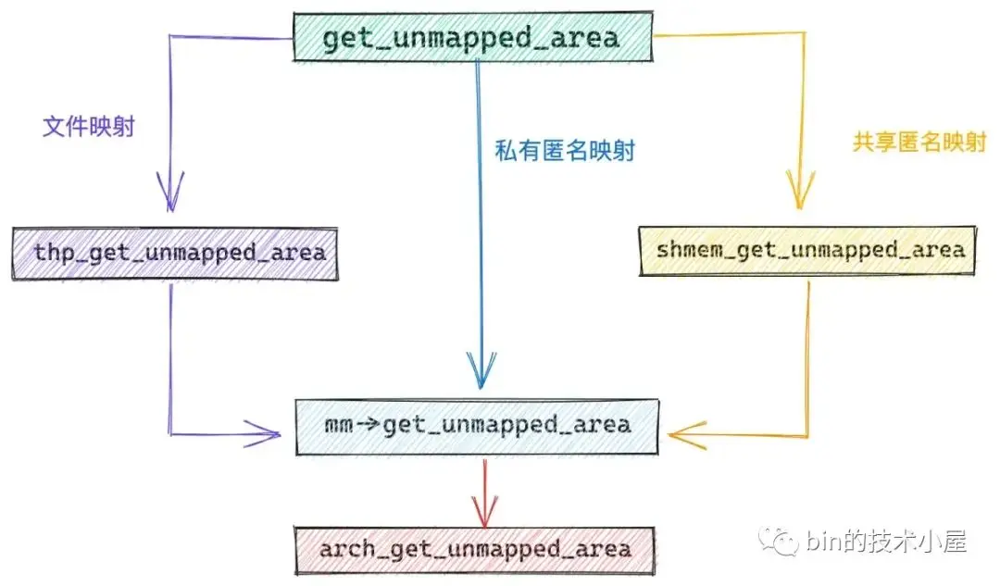
```C

const struct file_operations ext4_file_operations = {
        .mmap           = ext4_file_mmap
        .get_unmapped_area = thp_get_unmapped_area,
};


unsigned long __thp_get_unmapped_area(struct file *filp, unsigned long len,
                loff_t off, unsigned long flags, unsigned long size)
{
        ........... 省略 ........

        addr = current->mm->get_unmapped_area(filp, 0, len_pad,
                                              off >> PAGE_SHIFT, flags);
        return addr;
}
```
```C
unsigned long shmem_get_unmapped_area(struct file *file,
                      unsigned long uaddr, unsigned long len,
                      unsigned long pgoff, unsigned long flags)
{
    unsigned long (*get_area)(struct file *,
        unsigned long, unsigned long, unsigned long, uns

         ........... 省略 ........

    get_area = current->mm->get_unmapped_area;
    
    return addr;
}
```
在经典布局下，mm->get_unmapped_area 指向的是 arch_get_unmapped_area 函数，mmap 虚拟内存分配的秘密就隐藏在这里：

首先我们需要明确一下，mmap 可以映射的虚拟内存范围必须在进程虚拟内存空间 mmap_min_addr 到 mmap_end 这段地址范围内，mmap_min_addr 为 TASK_SIZE 的三分之一，mmap_end 为 TASK_SIZE。

内核需要检查本次 mmap 映射的虚拟内存长度 len 是否超过了规定的映射范围，如果超过了则返回 ENOMEM 错误，并停止映射流程。

如果映射长度 len 在规定的映射地址范围内，内核则会根据我们指定的映射起始地址 addr，以及映射长度 len，开始在文件映射与匿名映射区，为本次 mmap 映射寻找一段空闲的虚拟内存区域 vma 出来。
```C
#include <sys/mman.h>
void* mmap(void* addr, size_t length, int prot, int flags, int fd, off_t offset);
```
如果在 flags 参数中指定了 <font color = red>MAP_FIXED</font> 标志，则意味着我们强制要求内核在我们指定的起始地址 addr 处开始映射 len 长度的虚拟内存区域，无论这段虚拟内存区域 [addr , addr + len] 是否已经存在映射关系，内核都会强行进行映射，如果这块区域已经存在映射关系，那么后续内核会把旧的映射关系覆盖掉。

如果我们指定了 addr，但是并没有指定 MAP_FIXED，则意味着我们只是建议内核优先考虑从我们指定的 addr 地址处开始映射，但是如果 [addr , addr+len] 这段虚拟内存区域已经存在映射关系，内核则不会按照我们指定的 addr 开始映射，而是会自动查找一段空闲的 len 长度的虚拟内存区域。这一部分的工作由 vm_unmapped_area 函数承担。

如果通过查找发现， [addr , addr+len] 这段虚拟内存地址范围并未存在任何映射关系，那么 addr 就会作为 mmap 映射的起始地址。这里面会分为两种情况：

1. 第一种是我们指定的 addr 比较大，addr 位于文件映射与匿名映射区中所有映射区域 vma 的最后面，这样一来，[addr , addr + len] 这段地址范围当然是空闲的了。
2. 第二种情况是我们指定的 addr 恰好位于一个 vma 和另一个 vma 中间的地址间隙中，并且这个地址间隙刚好大于或者等于我们指定的映射长度 len。内核就可以将这个地址间隙映射起来。

```c
// 内核标准实现 
unsigned long
arch_get_unmapped_area(struct file *filp, unsigned long addr,
        unsigned long len, unsigned long pgoff, unsigned long flags)
{
    struct mm_struct *mm = current->mm;
    struct vm_area_struct *vma, *prev;
    struct vm_unmapped_area_info info;
    // 进程虚拟内存空间的末尾 TASK_SIZE
    const unsigned long mmap_end = arch_get_mmap_end(addr);
    // 映射区域长度是否超过进程虚拟内存空间
    if (len > mmap_end - mmap_min_addr)
        return -ENOMEM;
    // 如果我们指定了 MAP_FIXED 表示必须要从我们指定的 addr 开始映射 len 长度的区域
    // 如果这块区域已经存在映射关系，那么后续内核会把旧的映射关系覆盖掉
    if (flags & MAP_FIXED)
        return addr;

    // 没有指定 MAP_FIXED，但是我们指定了 addr
    // 我们希望内核从我们指定的 addr 地址开始映射，内核这里会检查我们指定的这块虚拟内存范围是否有效
    if (addr) {
        // addr 先保证与 page size 对齐
        addr = PAGE_ALIGN(addr);
        // 内核这里需要确认一下我们指定的 [addr, addr+len] 这段虚拟内存区域是否存在已有的映射关系
        // [addr, addr+len] 地址范围内已经存在映射关系，则不能按照我们指定的 addr 作为映射起始地址
        // 在进程地址空间中查找第一个符合 addr < vma->vm_end  条件的 VMA
        // 如果不存在这样一个 vma（!vma）, 则表示 [addr, addr+len] 这段范围的虚拟内存是可以使用的，内核将会从我们指定的 addr 开始映射
        // 如果存在这样一个 vma ，则表示  [addr, addr+len] 这段范围的虚拟内存区域目前已经存在映射关系了，不能采用 addr 作为映射起始地址
        // 这里还有一种情况是 addr 落在 prev 和 vma 之间的一块未映射区域
        // 如果这块未映射区域的长度满足 len 大小，那么这段未映射区域可以被本次使用，内核也会从我们指定的 addr 开始映射
        vma = find_vma_prev(mm, addr, &prev);
        if (mmap_end - len >= addr && addr >= mmap_min_addr &&
            (!vma || addr + len <= vm_start_gap(vma)) &&
            (!prev || addr >= vm_end_gap(prev)))
            return addr;
    }

    // 如果我们明确指定 addr 但是指定的虚拟内存范围是一段无效的区域或者已经存在映射关系
    // 那么内核会自动在地址空间中寻找一段合适的虚拟内存范围出来
    // 这段虚拟内存范围的起始地址就不是我们指定的 addr 了
    info.flags = 0;
    // VMA 区域长度
    info.length = len;
    // 这里定义从哪里开始查找 VMA, 这里我们会从文件映射与匿名映射区开始查找
    info.low_limit = mm->mmap_base;
    // 查找结束位置为进程地址空间的末尾 TASK_SIZE
    info.high_limit = mmap_end;
    info.align_mask = 0;
    return vm_unmapped_area(&info);
}
```
### 4.4 find_vma_prev 查找是否有重叠的映射区域
find_vma_prev 的作用就是根据我们指定的映射起始地址 addr，在进程地址空间中查找出符合<font color = red> addr < vma->vm_end</font> 条件的第一个 vma 出来（下图中的蓝色部分）。
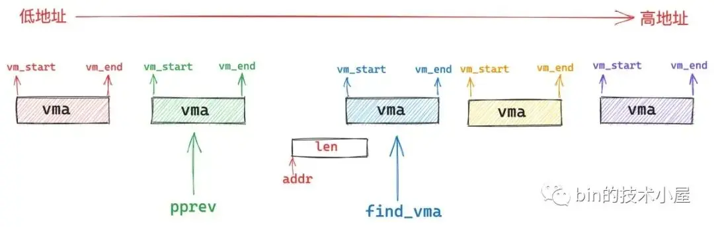
然后在进程地址空间中的 vma 链表 mmap 中，找出它的前驱节点 pprev （上图中的绿色部分）。
```c
struct mm_struct {
    struct vm_area_struct *mmap;  /* list of VMAs */
}
```
如果不存在这样一个 vma（addr < vma->vm_end），那么内核直接从我们指定的 addr 地址处开始映射就好了，这时 pprev 指向进程地址空间中最后一个 vma。
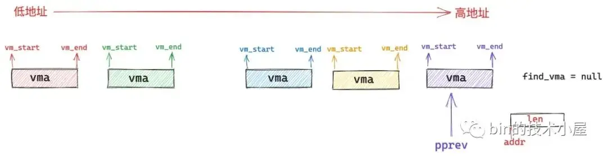

如果存在这样一个 vma，那么内核就会判断，该 vma 与其前驱节点 pprev 之间的地址间隙 gap 是否能容纳下一段 len 长度的映射区间，如果可以，那么内核就映射在这个地址间隙 gap 中。如果不可以，内核就需要在 vm_unmapped_area 函数中重新到整个进程地址空间中查找出一个 len 长度的空闲映射区域，这种情况下映射区的起始地址就不是我们指定的 addr 了。


```c
struct vm_area_struct *
find_vma_prev(struct mm_struct *mm, unsigned long addr,
            struct vm_area_struct **pprev)
{
    struct vm_area_struct *vma;
    // 在进程地址空间 mm 中查找第一个符合 addr < vma->vm_end 的 VMA
    vma = find_vma(mm, addr);

    if (vma) {
        // 恰好包含 addr 的 VMA 的前一个虚拟内存区域 
        *pprev = vma->vm_prev;
    } else {
        // 如果当前进程地址空间中，addr 不属于任何一个 VMA 
        // 那么这里的 pprev 指向进程地址空间中最后一个 VMA
        struct rb_node *rb_node = rb_last(&mm->mm_rb);

        *pprev = rb_node ? rb_entry(rb_node, struct vm_area_struct, vm_rb) : NULL;
    }
    // 返回查找到的 vma，不存在则返回 null（内核后续会创建 VMA）
    return vma;
}
```
根据指定地址 addr 在进程地址空间中查找第一个符合 <font color = red>addr < vma->vm_end</font> 条件 vma 的操作在 find_vma 函数中进行，内核为了高效地在进程地址空间中查找特定条件的 vma，会按照地址的增长方向将所有的 vma 组织在一颗红黑树 mm_rb 中。
```c
struct mm_struct {
     struct rb_root mm_rb;
}
```
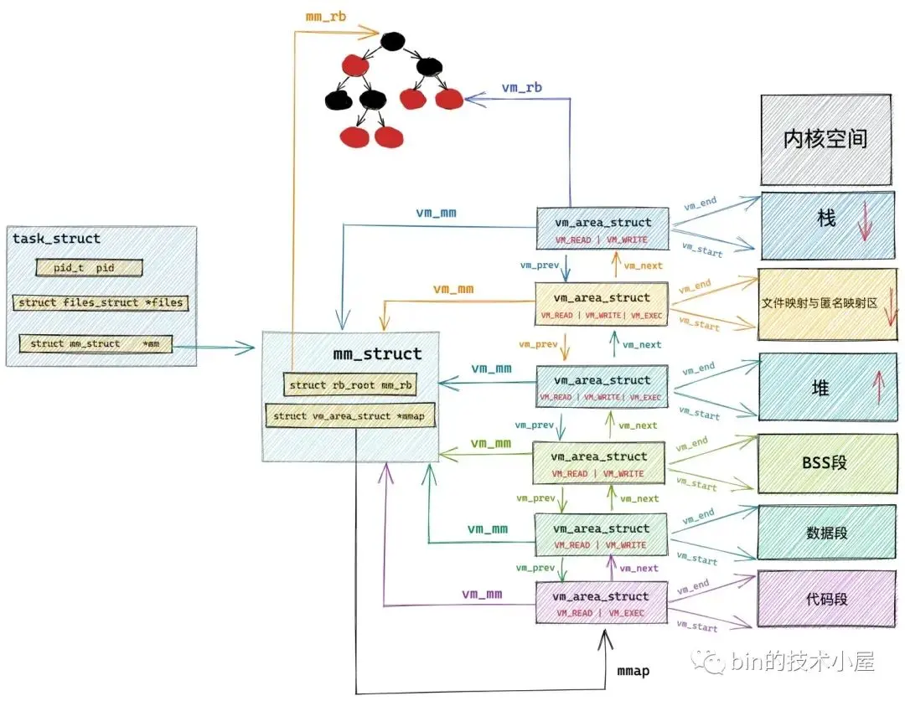
find_vma 会根据我们指定的 addr 在这颗红黑树中查找第一个符合<font color = red> addr < vma->vm_end </font>条件的 vma 。
```c
/* Look up the first VMA which satisfies  addr < vm_end,  NULL if none. */
struct vm_area_struct *find_vma(struct mm_struct *mm, unsigned long addr)
{
    struct rb_node *rb_node;
    struct vm_area_struct *vma;

    // 进程地址空间中缓存了最近访问过的 VMA
    // 首先从进程地址空间中 VMA 缓存中开始查找,缓存命中率通常大约为 35%
    // 查找条件为：vma->vm_start <= addr && vma->vm_end > addr
    vma = vmacache_find(mm, addr);
    if (likely(vma))
        return vma;

    // 进程地址空间中的所有 VMA 被组织在一颗红黑树中，为了方便内核在进程地址空间中查找特定的 VMA
    // 这里首先需要获取红黑树的根节点，内核会从根节点开始查找
    rb_node = mm->mm_rb.rb_node;

    while (rb_node) {
        struct vm_area_struct *tmp;
        // 获取位于根节点的 VMA
        tmp = rb_entry(rb_node, struct vm_area_struct, vm_rb);

        if (tmp->vm_end > addr) {
            vma = tmp;
            // 判断 addr 是否恰好落在根节点 VMA 中： vm_start <= addr < vm_end
            if (tmp->vm_start <= addr)
                break;
            // 如果不存在，则继续到左子树中查找
            rb_node = rb_node->rb_left;
        } else
            // 如果根节点的 vm_end <= addr，说明 addr 在根节点 vma 的后边
            // 这种情况则到右子树中继续查找
            rb_node = rb_node->rb_right;
    }

    if (vma)
        // 更新 vma 缓存
        vmacache_update(addr, vma);
    // 返回查找到的 vma，如果没有查找到，则返回 Null，表示进程空间中目前还没有这样一个 VMA ,后续需要新建了。
    return vma;
}
```
如果我们找到的这个 vma 与 [addr , addr +len] 这段虚拟地址范围有重叠的部分，那么内核就不能按照我们指定的 addr 开始映射，内核需要重新在文件映射与匿名映射区中按照地址的增长方向，找到一段 len 大小的空闲虚拟内存区域。这一部分的逻辑由 vm_unmapped_area 函数承担。
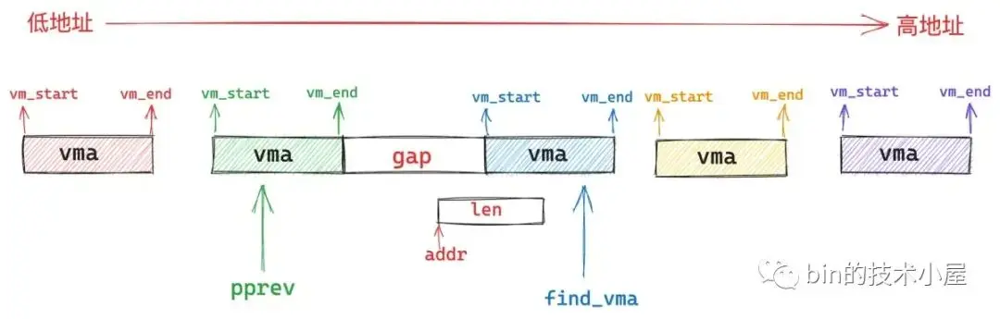
###4.5 vm_unmapped_area 寻找未映射的虚拟内存区域
```c
/*
 * Search for an unmapped address range.
 *
 * We are looking for a range that:
 * - does not intersect with any VMA;
 * - is contained within the [low_limit, high_limit) interval;
 * - is at least the desired size.
 * - satisfies (begin_addr & align_mask) == (align_offset & align_mask)
 */
static inline unsigned long
vm_unmapped_area(struct vm_unmapped_area_info *info)
{
    // 按照进程虚拟内存空间中文件映射与匿名映射区的地址增长方向
    // 分为两个函数，来在进程地址空间中查找未映射的 VMA
    if (info->flags & VM_UNMAPPED_AREA_TOPDOWN)
        // 当文件映射与匿名映射区的地址增长方向是从上到下逆向增长时（新式布局）
        // 采用 topdown 后缀的函数查找
        return unmapped_area_topdown(info);
    else
        // 地址增长方向为从下倒上正向增长（经典布局），采用该函数查找
        return unmapped_area(info);
}
```
本文是以 AMD64 体系为例展开讨论的，在 AMD64 体系结构下，文件映射与匿名映射区的布局采用的是经典布局，地址的增长方向从低地址到高地址增长。因此这里我们选择 unmapped_area 函数。
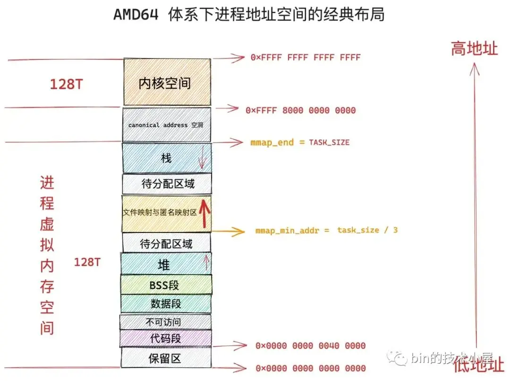
我们苦苦寻找的 unmapped_area 一定是在文件映射与匿名映射区中某个 vma 与其前驱 vma 之间的地址间隙 gap 中产生的。
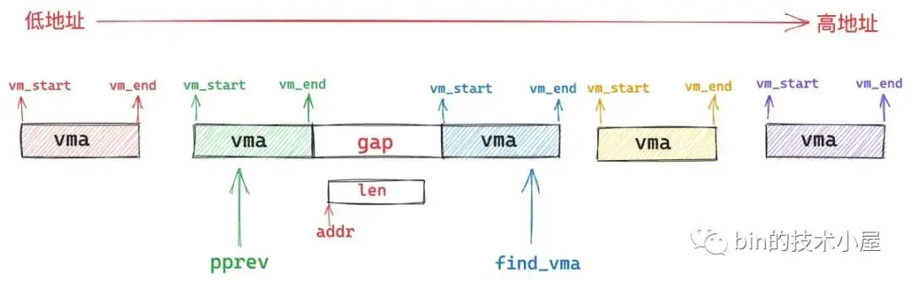
所以这就要求这个 gap 的长度必须大于等于映射 length，这样才能容纳下我们要映射的长度。gap 的起始地址 gap_start 一般从 prev 节点的末尾开始：gap_start = vma->vm_prev->vm_end 。gap 的结束地址 gap_end 一般从 vma 的起始地址结束：gap_end = vma->vm_start 。

在此基础之上，gap 还会受到 low_limit（mm->mmap_base）和 high_limit（TASK_SIZE）的地址限制。

因此这个 gap 的起始地址 gap_start 不能高于 high_limit - length，否则我们从 gap_start 地址处开始映射长度 length 的区域就会超出 high_limit 的限制。

gap 的结束地址 gap_end 不能低于 low_limit + length，否则映射区域的起始地址就会低于 low_limit 的限制。

unmapped_area 函数的核心任务就是在管理进程地址空间这些 vma 的红黑树 mm_struct-> mm_rb 中找到这样的一个地址间隙 gap 出来。

首先内核会从红黑树中的根节点 vma 开始查找，判断根节点的 vma 与其前驱节点 vma->vm_prev 之间的地址间隙 gap 是否满足上述条件，如果根节点 vma 的起始地址 vma->vm_start 也就是 gap_end 低于了 low_limit + length 的限制，那就说明根节点 vma 与其前驱节点之间的 gap 不适合用来作为 unmapped_area，否则 unmapped_area 的起始地址 gap_start 就会低于 low_limit 的限制。
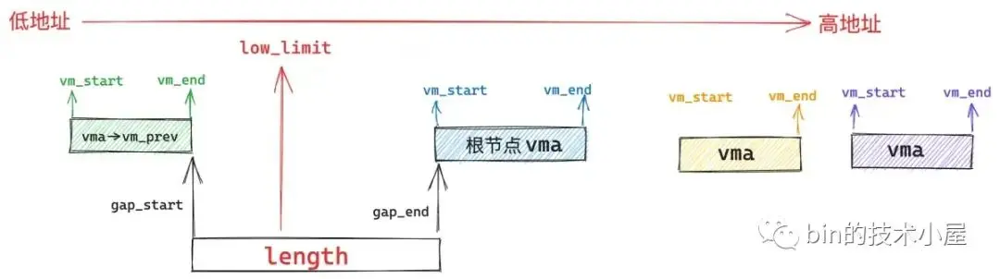

由于红黑树是按照 vma 的地址增长方向来组织的，左子树中的所有 vma 地址都低于根节点 vma 的地址，右子树的所有 vma 地址均高于根节点 vma 的地址。

现在的情况是 vma->vm_start 的地址太低了，已经小于了 low_limit + length 的限制，所以左子树的 vma 就不用看了，直接从右子树中去查找。

如果根节点 vma 的起始地址 vma->vm_start 也就是 gap_end 高于 low_limit + length 的要求，说明 gap_end 是符合我们的要求的，但是目前我们还不能马上对 gap_start 的限制要求进行检查，因为我们需要按照地址从低到高的优先级来查看最合适的 unmapped_area 未映射区域，所以我们需要到左子树中去查找地址更低的 vma。

如果我们在左子树中找到了一个地址最低的 vma，并且这个 vma 与其前驱节点vma->vm_prev 之间的地址间隙 gap 符合上述的三个条件：

1. gap 的长度大于等于映射长度 length ： gap_end - gap_start >= length
2. gap_end >= low_limit + length 。
3. gap_start <= high_limit - length。
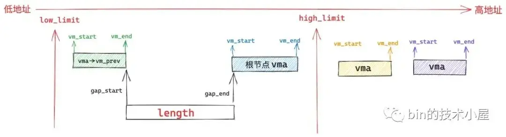
这里内核还有一个小小的优化点，如果我们遍历完了当前 vma 节点的所有子树（包括左子树和右子树）依然无法找到一个 gap 的长度可以满足我们的映射长度： gap_end - gap_start < length。那我们不是白白遍历了整棵树吗？

能否有一种机制，使我们通过当前 vma 就可以知道其子树中的所有 vma 节点与其前驱节点 vma->vm_prev 之间的地址间隙 gap 的最大长度（包括当前 vma）。

这样我们在遍历一个 vma 节点的时候，只需要检查一下其左右子树中的最大 gap 长度是否能够满足映射长度 length ，如果不能满足，说明整棵树中的 vma 节点与其前驱节点之间的间隙都不能容纳我们要映射的长度，直接就不用遍历了。

事实上，内核会将一个 vma 节点以及它所有子树中存在的最大间隙 gap 保存在 struct vm_area_struct 结构中的 rb_subtree_gap 属性中：
```c
struct vm_area_struct {


    unsigned long vm_start;     /* Our start address within vm_mm. */
    unsigned long vm_end;       /* The first byte after our end address
                       within vm_mm. */

    /* linked list of VM areas per task, sorted by address */
    struct vm_area_struct *vm_next, *vm_prev;

    struct rb_node vm_rb;

    // 在当前 vma 的红黑树左右子树中的所有节点 vma （包括当前 vma）
    // 这个集合中的 vma 与其 vm_prev 之间最大的虚拟内存地址 gap （单位字节）保存在 rb_subtree_gap 字段中
    unsigned long rb_subtree_gap;
}
```
当我们遍历 vma 节点的时候发现：<font color = red>vma->rb_subtree_gap < length。</font>那么整棵红黑树都不需要看了，我们直接从进程地址空间中最后一个 vma->vm_end 处开始映射就好了。

当前进程虚拟内存空间中，地址最高的一个 VMA 的结束地址位置保存在 mm_struct 结构中的 highest_vm_end 属性中：

```c
struct mm_struct {
    // 当前进程虚拟内存空间中，地址最高的一个 VMA 的结束地址位置
    unsigned long highest_vm_end;   /* highest vma end address */
}
```
以上就是内核在文件映射与匿名映射区寻找 unmapped_area 的核心逻辑，我们明白了这些，在看源码就会清晰很多了：
```c
unsigned long unmapped_area(struct vm_unmapped_area_info *info)
{
    /*
     * We implement the search by looking for an rbtree node that
     * immediately follows a suitable gap. That is,
     * - gap_start = vma->vm_prev->vm_end <= info->high_limit - length;
     * - gap_end   = vma->vm_start        >= info->low_limit  + length;
     * - gap_end - gap_start >= length
     */

    struct mm_struct *mm = current->mm;
    // 寻找未映射区域的参考 vma (该区域以存在映射关系)
    struct vm_area_struct *vma;
    // 未映射区域产生在 vma->vm_prev 与 vma 这两个虚拟内存区域中的间隙 gap 中
    // length 表示本次映射区域的长度
    // low_limit ，high_limit 表示在进程地址空间中哪段地址范围内查找，一个地址下限（mm->mmap_base），另一个标识地址上限（TASK_SIZE）
    // gap_start, gap_end 表示 vma->vm_prev 与 vma 之间的 gap 范围，unmapped_area 将会在这里产生
    unsigned long length, low_limit, high_limit, gap_start, gap_end;

    // gap_start 需要满足的条件：gap_start =  vma->vm_prev->vm_end <= info->high_limit - length
    // 否则 unmapped_area 将会超出 high_limit 的限制
    high_limit = info->high_limit - length;

    // gap_end 需要满足的条件：gap_end = vma->vm_start >= info->low_limit + length
    // 否则 unmapped_area 将会超出 low_limit 的限制
    low_limit = info->low_limit + length;

    // 首先将 vma 红黑树的根节点作为 gap 的参考 vma
    if (RB_EMPTY_ROOT(&mm->mm_rb))
        // 'empty' nodes are nodes that are known not to be inserted in an rbtree
        goto check_highest;
    // 获取红黑树根节点的 vma
    vma = rb_entry(mm->mm_rb.rb_node, struct vm_area_struct, vm_rb);

    // rb_subtree_gap 为当前 vma 及其左右子树中所有 vma 与其对应 vm_prev 之间最大的虚拟内存地址 gap
    // 最大的 gap 如果都不能满足映射长度 length 则跳转到 check_highest 处理
    if (vma->rb_subtree_gap < length)
        // 从进程地址空间最后一个 vma->vm_end 地址处开始映射
        goto check_highest;

    while (true) {
        // 获取当前 vma 的 vm_start 起始虚拟内存地址作为 gap_end
        gap_end = vm_start_gap(vma);
        // gap_end 需要满足：gap_end >= low_limit，否则 unmapped_area 将会超出 low_limit 的限制
        // 如果存在左子树，则需要继续到左子树中去查找，因为我们需要按照地址从低到高的优先级来查看合适的未映射区域
        if (gap_end >= low_limit && vma->vm_rb.rb_left) {
            struct vm_area_struct *left =
                rb_entry(vma->vm_rb.rb_left,
                     struct vm_area_struct, vm_rb);
            // 如果左子树中存在合适的 gap，则继续左子树的查找
            // 否则查找结束，gap 为当前 vma 与其 vm_prev 之间的间隙    
            if (left->rb_subtree_gap >= length) {
                vma = left;
                continue;
            }
        }
        // 获取当前 vma->vm_prev 的 vm_end 作为 gap_start
        gap_start = vma->vm_prev ? vm_end_gap(vma->vm_prev) : 0;
check_current:
        // gap_start 需要满足：gap_start <= high_limit，否则 unmapped_area 将会超出 high_limit 的限制
        if (gap_start > high_limit)
            return -ENOMEM;

        if (gap_end >= low_limit &&
            gap_end > gap_start && gap_end - gap_start >= length)
            // 找到了合适的 unmapped_area 跳转到 found 处理
            goto found;

       // 当前 vma 与其左子树中的所有 vma 均不存在一个合理的 gap
       // 那么从 vma 的右子树中继续查找
        if (vma->vm_rb.rb_right) {
            struct vm_area_struct *right =
                rb_entry(vma->vm_rb.rb_right,
                     struct vm_area_struct, vm_rb);
            if (right->rb_subtree_gap >= length) {
                vma = right;
                continue;
            }
        }

        // 如果在当前 vma 以及它的左右子树中均无法找到一个合适的 gap
        // 那么这里会从当前 vma 节点向上回溯整颗红黑树，在它的父节点中尝试查找是否有合适的 gap
        // 因为这时候有可能会有新的 vma 插入到红黑树中，可能会产生新的 gap
        while (true) {
            struct rb_node *prev = &vma->vm_rb;
            if (!rb_parent(prev))
                goto check_highest;
            vma = rb_entry(rb_parent(prev),
                       struct vm_area_struct, vm_rb);
            if (prev == vma->vm_rb.rb_left) {
                gap_start = vm_end_gap(vma->vm_prev);
                gap_end = vm_start_gap(vma);
                goto check_current;
            }
        }
    }

check_highest:
    // 流程走到这里表示在当前进程虚拟内存空间的所有 VMA 中都无法找到一个合适的 gap 来作为 unmapped_area
    // 那么就从进程地址空间中最后一个 vma->vm_end 开始映射
    // mm->highest_vm_end 表示当前进程虚拟内存空间中，地址最高的一个 VMA 的结束地址位置
    gap_start = mm->highest_vm_end;
    gap_end = ULONG_MAX;  /* Only for VM_BUG_ON below */
    // 这里最后需要检查剩余虚拟内存空间是否满足映射长度
    if (gap_start > high_limit)
        // ENOMEM 表示当前进程虚拟内存空间中虚拟内存不足
        return -ENOMEM;

found:
    // 流程走到这里表示我们已经找到了一个合适的 gap 来作为 unmapped_area 
    // 直接返回 gap_start （需要与 4K 对齐）作为映射的起始地址
    /* We found a suitable gap. Clip it with the original low_limit. */
    if (gap_start < info->low_limit)
        gap_start = info->low_limit;

    /* Adjust gap address to the desired alignment */
    gap_start += (info->align_offset - gap_start) & info->align_mask;

    VM_BUG_ON(gap_start + info->length > info->high_limit);
    VM_BUG_ON(gap_start + info->length > gap_end);
    return gap_start;
}
```
## 5. 内存映射的本质
流程走到这里，我们就来到了 mmap 系统调用最为核心的部分了，在之前的内容中，内核已经通过 get_unmapped_area 函数为我们在进程地址空间中挑选出一段地址范围为 [addr , addr + len] 的虚拟内存区域供 mmap 进行映射。

注意：这里的 addr 并不一定是我们指定的映射起始地址。
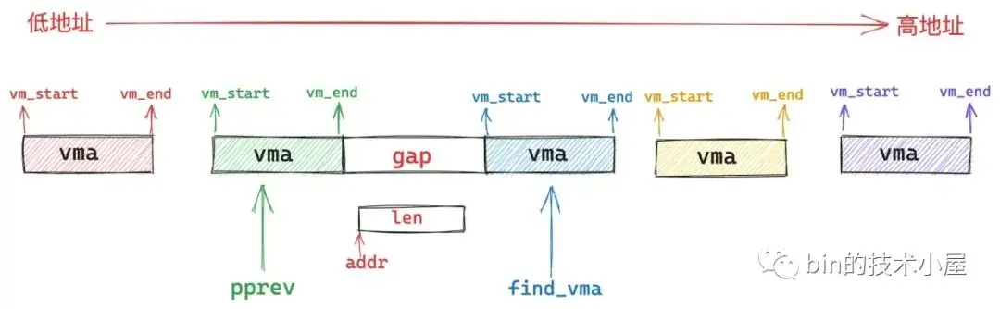
现在我们只是确定了 [addr , addr + len] 这段虚拟内存区域是可以映射的，这段区域只是被内核先划分出来了，但是还未分配出去，在 mmap_region 函数中，需要为这段虚拟内存区域分配 vma 结构，并根据映射方式对 vma 进行初始化，这样这段虚拟内存才算真正的被分配给了进程。

而在进程虚拟内存空间中允许被映射的虚拟内存总量是有限制的，所以在 mmap_region 开始分配虚拟内存之前，内核需要通过 may_expand_vm 检查本次需要映射的虚拟内存页数 len >> PAGE_SHIFT 是否已经超过了进程地址空间中可以被映射的虚拟内存总量限制。

如果未超过，则内核可以顺利的进行后续的内存映射流程，如果已经超过，内核则需近一步考虑能否消减一下不必要的虚拟内存用量。那么什么可以算作是不必要的虚拟内存用量呢？
```c
#include <sys/mman.h>
void* mmap(void* addr, size_t length, int prot, int flags, int fd, off_t offset);
```
比如，我们在 mmap 系统调用的 flags 参数中指定了 MAP_FIXED，强制内核从我们指定的 addr 地址处开始映射。


这样一来，[addr , addr + len] 这段范围的虚拟内存就会有很大的可能与现有虚拟内存映射区 vma（上图中蓝色部分）发生重叠，因为这里我们指定的是强制映射 MAP_FIXED，所以内核会将这部分重叠的部分通过 do_munmap 函数先解除映射，然后建立新的映射关系，效果就是将这部分重叠的虚拟内存覆盖掉了。

由于这部分重叠的虚拟内存部分是之前已经分配出去的，本次映射不需要再重新申请，所以真实虚拟内存的用量需要减去这部分重叠的部分。

内核通过 count_vma_pages_range 函数计算出这部分重叠的虚拟内存页个数，然后用本次申请的虚拟内存页个数 len >> PAGE_SHIFT 减去重叠的页数就是本次映射真实的虚拟内存用量。

最后重新通过 may_expand_vm 函数判断是否超过进程地址空间中可以被映射的虚拟内存总量限制，如果依然超过，则返回 ENOMEM 异常。如果没有超过，则正式进入虚拟内存分配的流程。

说到虚拟内存的分配，我们不由的会想到进程的虚拟内存空间，每个进程的虚拟内存空间都是独立的，而且虚拟内存空间的容量非常巨大，在 64 位系统中进程的虚拟内存空间为 128T，在这么巨大的虚拟内存空间下申请虚拟内存，我们想当然的会认为，进程可以随意申请，随意折腾。

理论上是这样，但是事实上，虚拟内存说到底最终还是要映射到物理内存上的，背后需要物理内存作为支撑，如果进程申请的虚拟内存远远超过物理内存大小，那么在运行的过程中就会导致部分内存被 swap 来 swap 去，甚至频繁的发生 oom，导致性能下降严重。

进程申请虚拟内存的过程就好比我们向银行贷款一样，进程的虚拟内存空间好比是现实中的银行，虚拟内存空间中的虚拟内存非常庞大，银行里的钱也非常多，但这并不意味着我们要多少银行就会贷给我们多少，银行需要对我们的资产进行审计，我们的资产越多，银行给我们贷款也会越多，我们的资产越少，银行给我们的贷款也越少。

同样的道理，内核也会对进程申请的虚拟内存进行审计（account），物理内存空间越大，swap 交换区越大，进程能能够申请到的虚拟内存也就越多。内核对虚拟内存申请的审计（account）策略就是我们前面提到的 overcommit_memory 策略，后面的相关章节笔者会详细的介绍，这里大家只需要知道内核的这个 overcommit_memory 策略会影响到进程申请虚拟内存大小。

内核通过 accountable_mapping 函数来判断是否需要对进程申请的虚拟内存进行审计，这就好比我们去银行贷款，如果客户的信用值一般，银行就需要对客户进行审计，如果客户端的信用值很高，资产优质，那么银行就不需要对客户的贷款进行审计。进程对虚拟内存的申请也是一样。

如果需要对虚拟内存进行审计，那么内核接着会调用 security_vm_enough_memory_mm 函数根据 overcommit_memory 策略判断是否允许进程申请这么多的虚拟内存，如果不通过，则返回 ENOMEM 停止虚拟内存申请流程。如果通过则将虚拟内存分配给进程。

内核为进程分配虚拟内存的本质其实就是在进程的虚拟内存空间中，找出一段未被映射的空闲虚拟内存地址范围 [addr , addr + len]，就像之前介绍的 get_unmapped_area 函数那样。

然后再 mmap_region 函数中为这段空闲的虚拟内存地址范围 [addr , addr + len]，创建 vma 结构，并初始化 vma 相关的属性。然后将这个 vma 结构插入到进程的虚拟内存空间中。

内核为了精细化的控制内存的开销，避免创建没有必要的 vma 结构，内核会本着能省则省的原则，在创建新的 vma 之前，按照最大程度合并的原则，内核会尝试看能不能将当前寻找出来的空闲虚拟内存区域 [addr , addr + len] 与其前一个 vma 以及后一个 vma 进行合并，然后重新调整合并后的 vma 相关属性，比如：vm_start , vm_end , vm_pgoff，以及涉及到相关数据结构的改变。这样一来，内核就不需要为这段空闲虚拟内存创建新的 vma 了。

如果不能合并，内核则只能从 slab 缓存中拿出一个 vma 结构来描述这段虚拟内存地址范围 [addr , addr + len]。并根据 mmap 映射的这段虚拟内存区域属性初始化 vma 结构中的相关字段。
```c
    vma->vm_start = addr;
    vma->vm_end = addr + len;
    vma->vm_flags = vm_flags;
    vma->vm_page_prot = vm_get_page_prot(vm_flags);
    vma->vm_pgoff = pgoff;
```
如果 mmap 进行的是文件映射，那么这里内核会将映射的文件与虚拟映射区关联起来。`vma->vm_file = get_file(file);`
然后内核会通过 call_mmap 函数，将虚拟内存的相关操作函数映射成文件相关的操作函数，大家或多或少在网上看到过这样的论述——" 通过内存文件映射可以将磁盘上的文件映射到内存中，这样我们就可以通过读写内存来完成磁盘文件的读写 "，其实本质就在 call_mmap 函数中，因为经过该函数处理之后，虚拟内存相关的操作函数已经变成文件相关的操作函数了。
```c
struct vm_area_struct {

    struct file * vm_file;      /* File we map to (can be NULL). */

    /* Function pointers to deal with this struct. */
    const struct vm_operations_struct *vm_ops;
}

struct vm_operations_struct {

    vm_fault_t (*fault)(struct vm_fault *vmf);

    void (*map_pages)(struct vm_fault *vmf,
            pgoff_t start_pgoff, pgoff_t end_pgoff);

    vm_fault_t (*page_mkwrite)(struct vm_fault *vmf);
}
```
我们接着来看 call_mmap 函数，mmap 文件映射的本质就在这里：
```c
static inline int call_mmap(struct file *file, struct vm_area_struct *vma)
{
    return file->f_op->mmap(file, vma);
}
```
内核将文件相关的操作全部定义在 struct file 结构中的 f_op 属性中：
```c
struct file {
    const struct file_operations  *f_op;
}
```
文件的操作与其所在的文件系统是紧密相关的，在 ext4 文件系统中，相关文件的 file->f_op 指向 ext4_file_operations 操作集合：
```c
const struct file_operations ext4_file_operations = {
    .mmap        = ext4_file_mmap,
};
```
其中 file->f_op->mmap 函数专门用于文件与内存的映射，在这里内核将 vm_area_struct 的内存操作 vma->vm_ops 设置为文件系统的操作 ext4_file_vm_ops，当通过 mmap 将内存与文件映射起来之后，读写内存其实就是读写文件系统的本质就在这里。
```c
static int ext4_file_mmap(struct file *file, struct vm_area_struct *vma)
{
        ........ 省略 ........
        
      vma->vm_ops = &ext4_file_vm_ops;
      
        ........ 省略 ........    
}
```
```c
static const struct vm_operations_struct ext4_file_vm_ops = {
    .fault      = ext4_filemap_fault,
    .map_pages  = filemap_map_pages,
    .page_mkwrite   = ext4_page_mkwrite,
};
```
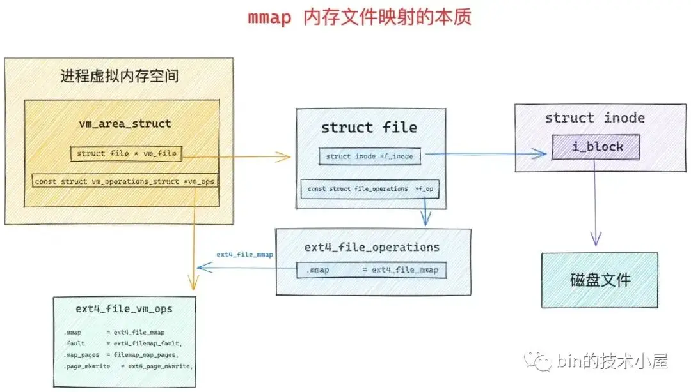
如果 mmap 进行的是共享匿名映射，父子进程之间需要依赖 tmpfs 文件系统中的匿名文件对共享内存进行访问，当进行共享匿名映射的时候，内核会在 shmem_zero_setup 函数中，到 tmpfs 文件系统里为映射创建一个匿名文件（shmem_kernel_file_setup），随后将 tmpfs 文件系统中的这个匿名文件与虚拟映射区 vma 中的 vm_file 关联映射起来，当然了，vma->vm_ops 也需要映射成 shmem_vm_ops。

当父进程调用 fork 创建子进程的时候，内核会将父进程的虚拟内存空间全部拷贝给子进程，包括这里创建的共享匿名映射区域 vma，这样一来，父子进程就可以通过共同的 vma->vm_file 来实现共享内存的通信了。

这里可以看出 mmap 的共享匿名映射其实本质上还是共享文件映射，只不过这个文件比较特殊，创建于<font color = red> dev/zero </font> 目录下的 tmpfs 文件系统中。
```c
int shmem_zero_setup(struct vm_area_struct *vma)
{
    struct file *file;
    loff_t size = vma->vm_end - vma->vm_start;
    // tmpfs 中获取一个匿名文件
    file = shmem_kernel_file_setup("dev/zero", size, vma->vm_flags);
    if (IS_ERR(file))
        return PTR_ERR(file);

    if (vma->vm_file)
        // 如果 vma 中已存在其他文件，则解除与其他文件的映射关系
        fput(vma->vm_file);
    
    // 将 tmpfs 中的匿名文件映射进虚拟内存区域 vma 中
    // 后续 fork 子进程的时候，父子进程就可以通过这个匿名文件实现共享匿名映射 
    vma->vm_file = file;
    // 对这块共享匿名映射区相关操作这里直接映射成 shmem_vm_ops
    vma->vm_ops = &shmem_vm_ops;

    return 0;
}

static const struct vm_operations_struct shmem_vm_ops = {
    .fault        = shmem_fault,
    .map_pages    = filemap_map_pages,
#ifdef CONFIG_NUMA
    .set_policy     = shmem_set_policy,
    .get_policy     = shmem_get_policy,
#endif
};
```
如果 mmap 这里进行的是私有匿名映射的话，情况就变得简单了，由于私有匿名映射并不涉及到与文件之间的映射，所以只需要简单的将 vma->vm_ops 设置为 null 即可。

流程走到这里，本次 mmap 映射所产生的虚拟内存区域 vma 结构就被初始化好了，整个内存映射的核心工作就此完成了，剩下要做的事情就是将这个 vma 结构插入到进程虚拟内存空间中。

经过前面的介绍我们知道，在进程的虚拟内存空间中，所有的 vma 结构是被两种数据结构来组织管理的。一种是 mm_struct->mmap 指向的链表结构，另一种是 mm_struct->mm_rb 指向的红黑树结构

vma_link 要做的工作就是按照虚拟内存地址的增长方向，将本次映射产生的 vma 结构插入到进程地址空间这两个数据结构中。
```c
static void vma_link(struct mm_struct *mm, struct vm_area_struct *vma,
            struct vm_area_struct *prev, struct rb_node **rb_link,
            struct rb_node *rb_parent)
{
    // 文件 page cache
    struct address_space *mapping = NULL;

    if (vma->vm_file) {
        // 获取映射文件的 page cache
        mapping = vma->vm_file->f_mapping;
        i_mmap_lock_write(mapping);
    }
    // 将 vma 插入到地址空间中的 vma 链表 mm_struct->mmap 以及红黑树 mm_struct->mm_rb 中
    __vma_link(mm, vma, prev, rb_link, rb_parent);
    // 建立文件与 vma 的反向映射
    __vma_link_file(vma);

    if (mapping)
        i_mmap_unlock_write(mapping);

    // map_count 表示进程地址空间中 vma 的个数
    mm->map_count++;
    validate_mm(mm);
}
```
除此之外，vma_link 还做了一项重要工作，就是通过 __vma_link_file 函数建立文件与虚拟内存区域 vma （所有进程）的反向映射关系。说起反向映射，笔者在之前的文章 《一步一图带你深入理解 Linux 物理内存管理》 中的 “6.1 匿名页的反向映射” 小节中为大家介绍过关于匿名页的反向映射过程，感兴趣的同学可以回看下。

匿名页的反向映射还是相对比较复杂的，文件页的反向映射就很简单了，在之前的文章中笔者曾介绍过，struct file 结构中的 f_maping 属性指向了一个非常重要的数据结构 struct address_space。
```c
struct address_space {
    struct inode        *host;      /* owner: inode, block_device */
    // page cache
    struct radix_tree_root  i_pages;    /* cached pages */
    atomic_t        i_mmap_writable;/* count VM_SHARED mappings */
    // 文件与 vma 反向映射的核心数据结构，i_mmap 也是一颗红黑树
    // 在所有进程的地址空间中，只要与该文件发生映射的 vma 均挂在 i_mmap 中
    struct rb_root_cached   i_mmap;     /* tree of private and shared mappings */
}
```
struct address_space 结构中有两个非常重要的属性，其中一个是 i_pages ，它指向了我们熟悉的 page cache。另一个就是 i_mmap，它指向的是一颗红黑树，这颗红黑树正是文件页反向映射的核心数据结构，反向映射关系就保存在这里。
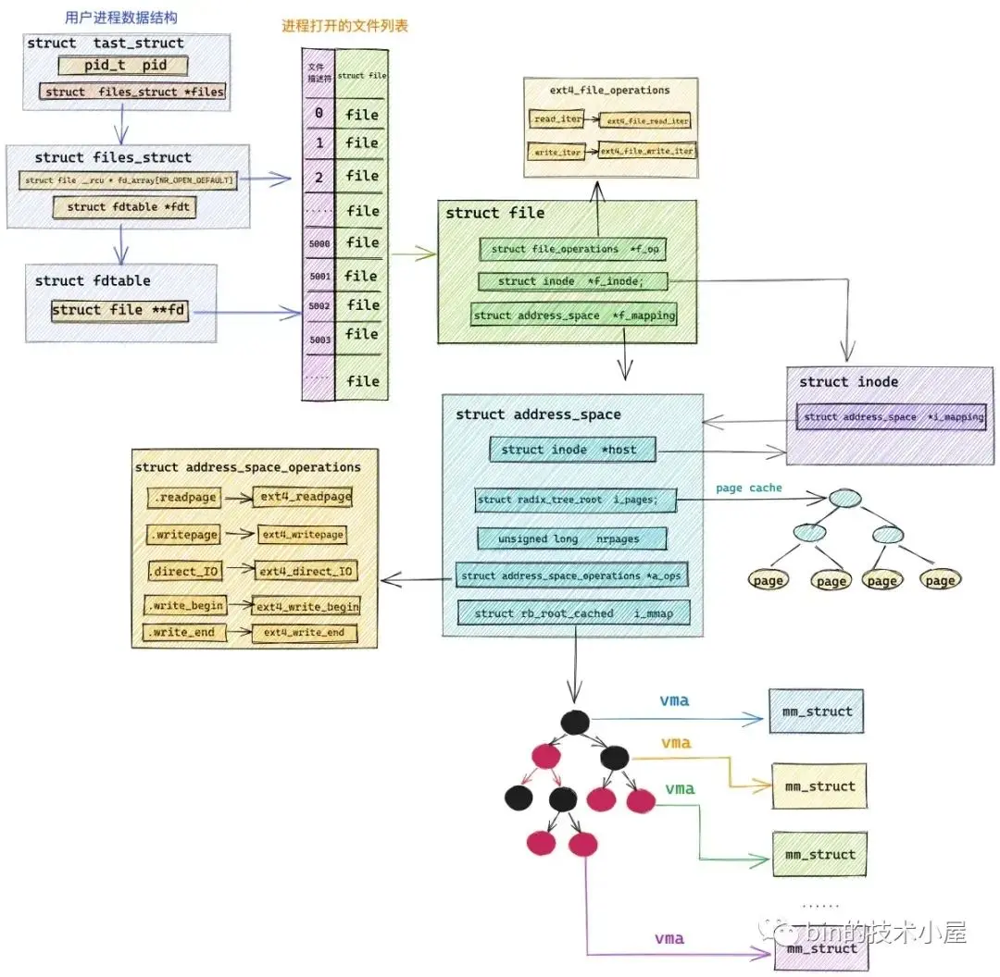
我们知道，一个文件可以被多个进程一起映射，这样一来在每个进程的地址空间 mm_struct 结构中都会有一个 vma 结构来与这个文件进行映射，与该文件发生映射关系的所有进程地址空间中的 vma 就挂在 address_space-> i_mmap 这颗红黑树中，通过它，我们可以找到所有与该文件进行映射的进程。

__vma_link_file 函数建立文件页反向映射的核心其实就是将 mmap 映射出的这个 vma 插入到这颗红黑树中。
```c
static void __vma_link_file(struct vm_area_struct *vma)
{
    struct file *file;

    file = vma->vm_file;
    if (file) {
        struct address_space *mapping = file->f_mapping;
        // address_space->i_mmap 也是一颗红黑树，上面挂着的是与该文件映射的所有 vma（所有进程地址空间）
        // 这里将 vma 插入到 i_mmap 中，实现文件与 vma 的反向映射
        vma_interval_tree_insert(vma, &mapping->i_mmap);
    }
}
```
好了，mmap 内存映射最为核心的部分，到这里笔者就为大家介绍完了，映射原理我们清楚了，接下来我们跟着这副 mmap_region 流程图，来看源码实现就很清晰了：
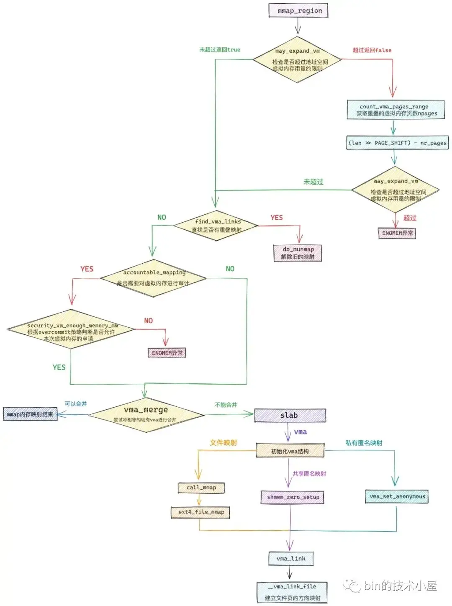
```c
unsigned long mmap_region(struct file *file, unsigned long addr,
        unsigned long len, vm_flags_t vm_flags, unsigned long pgoff,
        struct list_head *uf)
{
    struct mm_struct *mm = current->mm;
    struct vm_area_struct *vma, *prev;
    int error;
    struct rb_node **rb_link, *rb_parent;
    unsigned long charged = 0;

    // 检查本次映射是否超过了进程虚拟内存空间中的虚拟内存容量的限制，超过则返回 false
    if (!may_expand_vm(mm, vm_flags, len >> PAGE_SHIFT)) {
        unsigned long nr_pages;

        // 如果 mmap 指定了 MAP_FIXED，表示内核必须要按照用户指定的映射区来进行映射
        // 这种情况下就会导致，我们指定的映射区[addr, addr + len] 有一部分可能与现有映射重叠
        // 内核将会覆盖掉这段已有的映射，重新按照用户指定的映射关系进行映射
        // 所以这里需要计算进程地址空间中与指定映射区[addr, addr + len]重叠的虚拟内存页数 nr_pages
        nr_pages = count_vma_pages_range(mm, addr, addr + len);
        // 由于这里的 nr_pages 表示重叠的虚拟内存部分，将会被覆盖，所以这部分被覆盖的虚拟内存不需要额外申请
        // 这里通过 len >> PAGE_SHIFT 减去这段可以被覆盖的 nr_pages 在重新检查是否超过虚拟内存相关区域的限额
        if (!may_expand_vm(mm, vm_flags,
                    (len >> PAGE_SHIFT) - nr_pages))
            return -ENOMEM;
    }

   // 如果当前进程地址空间中存在于指定映射区域 [addr, addr + len] 重叠的部分
   // 则调用  do_munmap 将这段重叠的映射部分解除掉，后续会重新映射这部分
    while (find_vma_links(mm, addr, addr + len, &prev, &rb_link,
                  &rb_parent)) {
        if (do_munmap(mm, addr, len, uf))
            return -ENOMEM;
    }
   
    /*
     * 判断将来是否会为这段虚拟内存 vma ，申请新的物理内存，比如 私有，可写（private writable）的映射方式，内核将来会通过 cow 重新为其分配新的物理内存。
     * 私有，只读（private readonly）的映射方式，内核则会共享原来映射的物理内存，而不会申请新的物理内存。
     * 如果将来需要申请新的物理内存则会根据当前系统的 overcommit 策略以及当前物理内存的使用情况来  
     * 综合判断是否允许本次虚拟内存的申请。如果虚拟内存不足，则返回 ENOMEM，这样的话可以防止缺页的时候发生 OOM
     */
    if (accountable_mapping(file, vm_flags)) {
        charged = len >> PAGE_SHIFT;
        // 根据内核 overcommit 策略以及当前物理内存的使用情况综合判断，是否能够通过本次虚拟内存的申请
        // 虚拟内存的申请一旦这里通过之后，后续发生缺页，内核将会有足够的物理内存为其分配，不会发生 OOM
        if (security_vm_enough_memory_mm(mm, charged))
            return -ENOMEM;
        // 凡是设置了 VM_ACCOUNT 的 VMA，表示这段虚拟内存均已经过 vm_enough_memory 的检测
        // 当虚拟内存发生缺页的时候，内核会有足够的物理内存分配，而不会导致 OOM 
        // 其虚拟内存的用量都会被统计在 /proc/meminfo 的 Committed_AS  字段中    
        vm_flags |= VM_ACCOUNT;
    }

    // 为了精细化的控制内存的开销，内核这里首先需要尝试看能不能和地址空间中已有的 vma 进行合并
    // 尝试将当前 vma 合并到已有的 vma 中
    vma = vma_merge(mm, prev, addr, addr + len, vm_flags,
            NULL, file, pgoff, NULL, NULL_VM_UFFD_CTX);
    if (vma)
        // 如果可以合并，则虚拟内存分配过程结束
        goto out;

    // 如果不可以合并，则只能从 slab 中取出一个新的 vma 结构来
    vma = vm_area_alloc(mm);
    if (!vma) {
        error = -ENOMEM;
        goto unacct_error;
    }
    // 根据我们要映射的虚拟内存区域属性初始化 vma 结构中的相关字段
    vma->vm_start = addr;
    vma->vm_end = addr + len;
    vma->vm_flags = vm_flags;
    vma->vm_page_prot = vm_get_page_prot(vm_flags);
    vma->vm_pgoff = pgoff;

    // 文件映射
    if (file) {
        // 将文件与虚拟内存映射起来
        vma->vm_file = get_file(file);
        // 这一步中将虚拟内存区域 vma 的操作函数 vm_ops 映射成文件的操作函数（和具体文件系统有关）
        // ext4 文件系统中的操作函数为 ext4_file_vm_ops
        // 从这一刻开始，读写内存就和读写文件是一样的了
        error = call_mmap(file, vma);
        if (error)
            goto unmap_and_free_vma;

        addr = vma->vm_start;
        vm_flags = vma->vm_flags;
    } else if (vm_flags & VM_SHARED) {
        // 这里处理共享匿名映射
        // 前面提到共享匿名映射依赖于 tmpfs 文件系统中的匿名文件
        // 父子进程通过这个匿名文件进行通讯
        // 该函数用于在 tmpfs 中创建匿名文件，并映射进当前共享匿名映射区 vma 中
        error = shmem_zero_setup(vma);
        if (error)
            goto free_vma;
    } else {
        // 这里处理私有匿名映射
        // 将  vma->vm_ops 设置为 null，只有文件映射才需要 vm_ops 这样才能将内存与文件映射起来
        vma_set_anonymous(vma);
    }
    // 将当前 vma 按照地址的增长方向插入到进程虚拟内存空间的 mm_struct->mmap 链表以及mm_struct->mm_rb 红黑树中
    // 并建立文件与 vma 的反向映射
    vma_link(mm, vma, prev, rb_link, rb_parent);

    file = vma->vm_file;
out:
    // 更新地址空间 mm_struct 中的相关统计变量
    vm_stat_account(mm, vm_flags, len >> PAGE_SHIFT);
    return addr;
}
```
### 5.1 may_expand_vm 检查映射的虚拟内存是否超过了内核限制
进程地址空间中对虚拟内存的用量是有限制的，限制分为两个方面：

1. 对进程地址空间中能够映射的虚拟内存页总数做出限制。
2. 对进程地址空间中数据区的虚拟内存页总数做出限制。
这里的数据区，在内核中定义的是所有私有，可写的虚拟内存区域（栈区除外）：
```c
/*
 * Data area - private, writable, not stack
 */
static inline bool is_data_mapping(vm_flags_t flags)
{
    // 本次需要映射的虚拟内存区域是否是私有，可写的（数据区）
    return (flags & (VM_WRITE | VM_SHARED | VM_STACK)) == VM_WRITE;
}
```
以上两个方面的限制，我们可以通过修改<font color = red> /etc/security/limits.conf </font>文件进行调整。
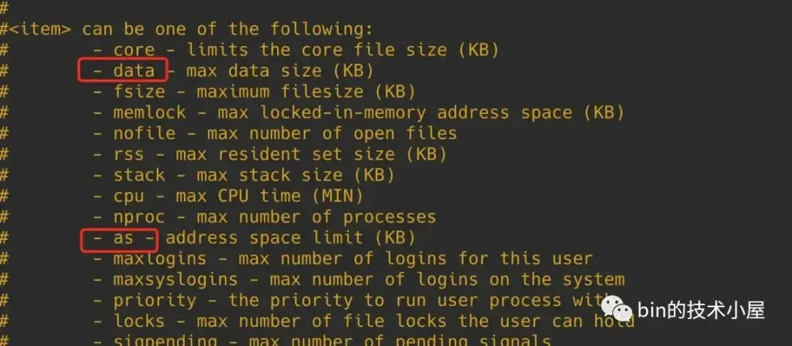
内核对进程地址空间中相关区域的虚拟内存用量限制依然保存在 task_struct->signal_struct->rlim 数组中，我们可以通过 RLIMIT_AS 以及 RLIMIT_DATA 下标进行访问。
```c
// 进程地址空间中允许映射的虚拟内存总量，单位为字节
# define RLIMIT_AS        9    /* address space limit */
// 进程地址空间中允许用于私有可写（private,writable）的虚拟内存总量，单位字节
# define RLIMIT_DATA        2    /* max data size */
```
当前进程地址空间中已经映射的虚拟内存页数保存在 mm_struct->total_vm 中，数据区（私有，可写）已经映射的虚拟内存页数保存在 mm_struct->data_vm 中。
```c
struct mm_struct {
    // 进程地址空间中所有已经映射的虚拟内存页总数
    unsigned long total_vm;    /* Total pages mapped */
    // 进程地址空间中所有私有，可写的虚拟内存页总数
    unsigned long data_vm;     /* VM_WRITE & ~VM_SHARED & ~VM_STACK */
}
```
may_expand_vm 函数的核心逻辑就是判断经过本次 mmap 映射之后（mmap 需要映射的虚拟内存页数为 npages），mm->total_vm + npages 是否超过了 rlimit(RLIMIT_AS) 中的限制，mm->data_vm + npages 是否超过了 rlimit(RLIMIT_DATA) 中的限制。如果超过，那么本次 mmap 内存映射流程在这里就会停止进行。
```c
// 检查本次映射是否超过了进程虚拟内存空间中的虚拟内存总量的限制，超过则返回 false
bool may_expand_vm(struct mm_struct *mm, vm_flags_t flags, unsigned long npages)
{
    // mm->total_vm 表示当前进程地址空间中映射的虚拟内存页总数
    // npages 表示此次要映射的虚拟内存页个数
    // rlimit(RLIMIT_AS) 表示进程地址空间中允许映射的虚拟内存总量，单位为字节
    if (mm->total_vm + npages > rlimit(RLIMIT_AS) >> PAGE_SHIFT)
        // 如果映射的虚拟内存页总数超出了内核的限制，那么就返回 false 表示虚拟内存不足
        return false;

    // 检查本次映射是否属于数据区域的映射，这里的数据区域指的是私有，可写的虚拟内存区域（栈区除外）
    // 如果是则需要检查数据区域里的虚拟内存页是否超过了内核的限制
    // rlimit(RLIMIT_DATA) 表示进程地址空间中允许映射的私有，可写的虚拟内存总量，单位为字节
    // 如果超过则返回 false，表示数据区虚拟内存不足
    if (is_data_mapping(flags) &&
        mm->data_vm + npages > rlimit(RLIMIT_DATA) >> PAGE_SHIFT) {
        /* Workaround for Valgrind */
        if (rlimit(RLIMIT_DATA) == 0 &&
            mm->data_vm + npages <= rlimit_max(RLIMIT_DATA) >> PAGE_SHIFT)
            return true;

        pr_warn_once("%s (%d): VmData %lu exceed data ulimit %lu. Update limits%s.\n",
                 current->comm, current->pid,
                 (mm->data_vm + npages) << PAGE_SHIFT,
                 rlimit(RLIMIT_DATA),
                 ignore_rlimit_data ? "" : " or use boot option ignore_rlimit_data");

        if (!ignore_rlimit_data)
            return false;
    }

    return true;
}
```
### 5.2 内核的 overcommit 策略
正如前边笔者所介绍到的，内核的 overcommit 策略会影响到进程申请虚拟内存的用量，进程对虚拟内存的申请就好比是我们向银行贷款，我们在向银行贷款的时候，银行是需要对我们的还款能力进行审计的，我们抵押的资产越优质，银行贷款给我们的也会越多。

同样的道理，进程再向内核申请虚拟内存的时候，也是需要物理内存作为抵押的，因为虚拟内存说到底最终还是要映射到物理内存上的，背后需要物理内存作为支撑，不能无限制的申请。

所以进程在申请虚拟内存的时候，内核也是需要对申请的虚拟内存用量进行审计的，审计的对象就是那些在未来需要为其分配物理内存的虚拟内存。这也是符合常理的，因为只有在未来需要分配新的物理内存的时候，内核才需要综合物理内存的容量来进行审计，从而决定是否为进程分配这么多的虚拟内存，否则将来可能到处都是 OOM。如果未来不需要为这段虚拟内存分配物理内存，那么内核自然不会对虚拟内存用量进行审计。这取决于 mmap 的映射方式。

比如，这段虚拟内存是私有，可写的，那么在未来，当进程对这段虚拟内存进行写入的时候，内核会通过 cow 的方式为其分配新的物理内存，但是这段虚拟内存是共享的或者是只读的话，内核将不会为这段虚拟内存分配新的物理内存，而是继续共享原来已经映射好的物理内存（内核中只有一份）。

如果进程在向内核申请的虚拟内存在未来是需要重新分配物理内存的话，比如：私有，可写。那么这种虚拟内存的使用量就需要被内核审计起来，因为物理内存总是有限的，不可能为所有虚拟内存都分配物理内存。内核需要确保能够为这段虚拟内存未来分配足够的物理内存，防止 oom。这种虚拟内存称之为 account virtual memory。

而进程向内核申请的虚拟内存并不需要内核为其重新分配物理内存的时候（共享或只读），反正不会增加物理内存的使用负担，这种虚拟内存就不需要被内核审计。
```c
/*
 * We account for memory if it's a private writeable mapping,
 * not hugepages and VM_NORESERVE wasn't set.
 */
static inline int accountable_mapping(struct file *file, vm_flags_t vm_flags)
{
    /*
     * hugetlb 类型的大页有其自己的统计方式，不会和普通的虚拟内存统计混合
     */
    if (file && is_file_hugepages(file))
        return 0;
    // 私有，可写，并且没有设置 VM_NORESERVE 的相关 VMA 是需要被 account 审计起来的。这样在后续发生缺页的时候，不会导致 OOM
    return (vm_flags & (VM_NORESERVE | VM_SHARED | VM_WRITE)) == VM_WRITE;
}
```
由于大页内存都是被预先分配在大页内存池中的，所以针对大页的虚拟内存不需要被审计，另外如果这段虚拟内存 vma 设置了 VM_NORESERVE 标志的话，也不需要被内核审计。

所以 account virtual memory 特指那些私有，可写（private ，writeable）的虚拟内存区域，并且这些虚拟内存区域的 vm_flags 没有设置 VM_NORESERVE 标志位，以及这部分虚拟内存不能是映射大页的。

这部分 account virtual memory 被记录在 vm_committed_as 字段中，表示被审计起来的虚拟内存，这些虚拟内存在未来都是需要映射新的物理内存的，站在物理内存的角度 vm_committed_as 可以理解为当前系统中已经分配的物理内存和未来可能需要的物理内存总量。
```c
// 定义在文件：/include/linux/mman.h
extern struct percpu_counter vm_committed_as;

static inline void vm_acct_memory(long pages)
{
    percpu_counter_add_batch(&vm_committed_as, pages, vm_committed_as_batch);
}

static inline void vm_unacct_memory(long pages)
{
    vm_acct_memory(-pages);
}
```
每当有进程向内核申请或者释放虚拟内存（account virtual memory ）的时候，内核都会通过 vm_acct_memory 和 vm_unacct_memory 函数来更新 vm_committed_as 的值。

当我们使用 mmap 进行内存映射的时候，如果映射出的虚拟内存区域 vma 为私有，可写的，并且参数 flags 没有设置 MAP_NORESERVE 标志，那么这部分虚拟内存就需要被记录在 vm_committed_as 字段中。

vm_committed_as 的值最终会反应在<font color = red> /proc/meminfo</font> 中的 Committed_AS 字段上。用来记录当前系统中，所有进程申请到的 account virtual memory 总量。
```c
static int meminfo_proc_show(struct seq_file *m, void *v)
{
    struct sysinfo i;
    unsigned long committed;


    committed = percpu_counter_read_positive(&vm_committed_as);
  
    show_val_kb(m, "Committed_AS:   ", committed);
}
```
现在 account virtual memory 的概念我们清楚了，那么接下来就该来看一下，内核是如何对这部分虚拟内存的申请进行审计的（account）。

如果 accountable_mapping 函数返回值为 true，表示内核需要对当前进程申请的这部分虚拟内存进行审计，审计的逻辑封装在 __vm_enough_memory 函数中，返回 0 表示有足够的虚拟内存，返回 ENOMEM 表示虚拟内存不足。这里正是内核 overcommit 策略的核心实现。

我们可以通过内核参数 <font color = red>/proc/sys/vm/overcommit_memory </font> 来调整 overcommit 策略 。
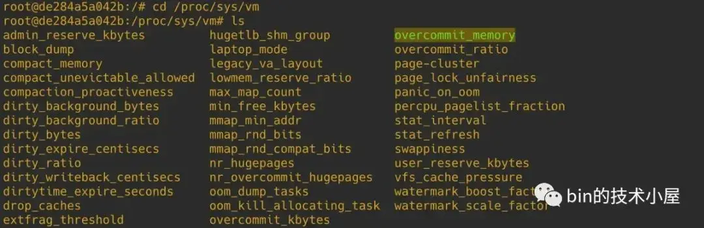
内核定义了如下三种 overcommit 策略：
```c
#define OVERCOMMIT_GUESS        0
#define OVERCOMMIT_ALWAYS        1
#define OVERCOMMIT_NEVER        2
```
OVERCOMMIT_GUESS 是内核默认的 overcommit 策略，在这种策略下，进程对虚拟内存的申请不能超过物理内存总大小和 swap 交换区的总大小 之和。
```c
    if (sysctl_overcommit_memory == OVERCOMMIT_GUESS) {
        if (pages > totalram_pages() + total_swap_pages)
            goto error;
        return 0;
    }
```
OVERCOMMIT_ALWAYS 策略下应用进程无论申请多大的虚拟内存，内核总是会答应，分配虚拟内存非常的激进。

```c
 if (sysctl_overcommit_memory == OVERCOMMIT_ALWAYS)
        return 0;
```
OVERCOMMIT_NEVER 策略下，内核会严格控制进程申请虚拟内存的用量，虚拟内存的限制通过 vm_commit_limit 函数计算得出，一般情况下为<font color = red> (总物理内存大小 - 大页占用的内存大小） * 50% + swap 交换区总大小</font>。所有进程申请到的虚拟内存总量不能超过该值。

vm_commit_limit 函数返回值体现在<font color = red> /proc/meminfo</font> 中的 CommitLimit 字段中。
注意：只有在 OVERCOMMIT_NEVER 策略下，CommitLimit 的限制才会生效
除此之外，内核会在 CommitLimit 的基础上为进程预留一部分内存，用于在紧急情况下做一些恢复的操作，这部分预留的内存包括两种，一种是 sysctl_admin_reserve_kbytes，另一种是 sysctl_user_reserve_kbytes。它们的大小均可以在 <font color = red>/proc/sys/vm </font>目录下相应的配置文件中进行调整，单位为 KB。
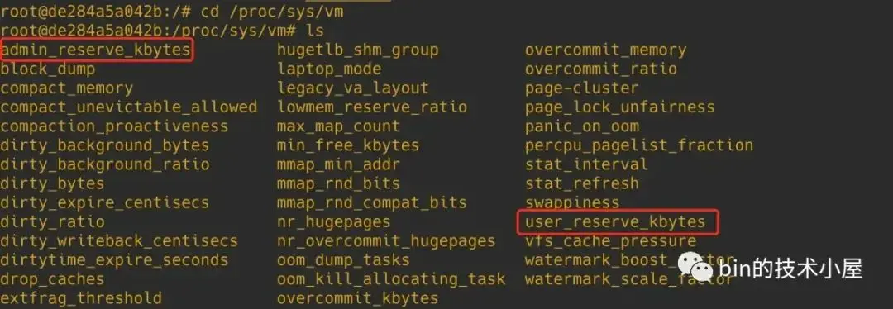
* sysctl_admin_reserve_kbytes 表示当进程拥有 root 权限的时候，内核需要为 root 相关的操作保留一部分内存，这样可以使进程在任何情况下都可以顺利执行 root 权限的相关操作。
* sysctl_user_reserve_kbytes 用于在紧急情况下用户恢复系统。比如系统卡死，用户主动 kill 资源消耗比较大的进程，这个动作需要预留一些 user_reserve 内存。

所以在 OVERCOMMIT_NEVER 策略下，进程可以申请到的虚拟内存容量需要在 CommitLimit 的基础上再减去 sysctl_admin_reserve_kbytes 和 sysctl_user_reserve_kbytes 配置的预留容量。

注意这里对虚拟内存申请的限制是针对所有进程已经申请到的虚拟内存总量 + 本次 mmap 申请的虚拟内存总和的限制
```c
// 用于检查进程虚拟内存空间中是否有足够的虚拟内存可供本次申请使用（需要结合 overcommit 策略来综合判定）
// 返回 0 表示有足够的虚拟内存，返回 ENOMEM 表示虚拟内存不足
int __vm_enough_memory(struct mm_struct *mm, long pages, int cap_sys_admin)
{
    // OVERCOMMIT_NEVER 模式下允许进程申请的虚拟内存大小
    long allowed;
    // 虚拟内存审计字段 vm_committed_as 增加 pages
    vm_acct_memory(pages);

    // 虚拟内存的 overcommit 策略可以通过修改 /proc/sys/vm/overcommit_memory 文件来设置，
    // 它有三个设置选项：
    // OVERCOMMIT_ALWAYS 表示无论应用进程申请多大的虚拟内存，内核总是会答应，分配虚拟内存非常的激进
    if (sysctl_overcommit_memory == OVERCOMMIT_ALWAYS)
        return 0;
    // OVERCOMMIT_GUESS 则相对 always 策略稍微保守一点，也是内核的默认策略
    // 它会对进程能够申请到的虚拟内存大小做一定的限制，特别激进的申请比如申请非常大的虚拟内存则会被拒绝。
    if (sysctl_overcommit_memory == OVERCOMMIT_GUESS) {
        // guess 默认策略下，进程申请的虚拟内存大小不能超过 物理内存总大小和 swap 交换区的总大小之和
        if (pages > totalram_pages() + total_swap_pages)
            goto error;
        return 0;
    }

    // OVERCOMMIT_NEVER 是最为严格的一种控制虚拟内存 overcommit 的策略
    // 进程申请的虚拟内存大小不能超过 vm_commit_limit()，该值也会反应在 /proc/meminfo 中的 CommitLimit 字段中。
    // 只有采用 OVERCOMMIT_NEVER 模式，CommitLimit 的限制才会生效
    // allowed =（总物理内存大小 - 大页占用的内存大小） * 50%  + swap 交换区总大小 
    allowed = vm_commit_limit();

    // cap_sys_admin 表示申请内存的进程拥有 root 权限
    if (!cap_sys_admin)
        // 为 root 进程保存一些内存，这样可以保证 root 相关的操作在任何时候都可以顺利进行
        // 大小为 sysctl_admin_reserve_kbytes，这部分内存普通进程不能申请使用
        // 可通过 /proc/sys/vm/admin_reserve_kbytes 来配置
        allowed -= sysctl_admin_reserve_kbytes >> (PAGE_SHIFT - 10);

    /*
     * Don't let a single process grow so big a user can't recover
     */
    if (mm) {
        // 可通过 /proc/sys/vm/user_reserve_kbytes 来配置
        // 用于在紧急情况下，用户恢复系统，比如系统卡死，用户主动 kill 资源消耗比较大的进程，这个动作需要预留一些 user_reserve 内存
        long reserve = sysctl_user_reserve_kbytes >> (PAGE_SHIFT - 10);

        allowed -= min_t(long, mm->total_vm / 32, reserve);
    }
    // Committed_AS （系统中所有进程已经申请的虚拟内存总量 + 本次 mmap 申请的）不可以超过 CommitLimit（allowed）
    if (percpu_counter_read_positive(&vm_committed_as) < allowed)
        return 0;
error:
    vm_unacct_memory(pages);

    return -ENOMEM;
}
```
下面我们来看一下，OVERCOMMIT_NEVER 策略下，CommitLimit 的计算逻辑。

有两个内核参数会影响 CommitLimit 的计算，它们分别是 sysctl_overcommit_kbytes 和 sysctl_overcommit_ratio，可通过 <font color = red>/proc/sys/vm</font> 目录下相应的配置文件中进行调整。
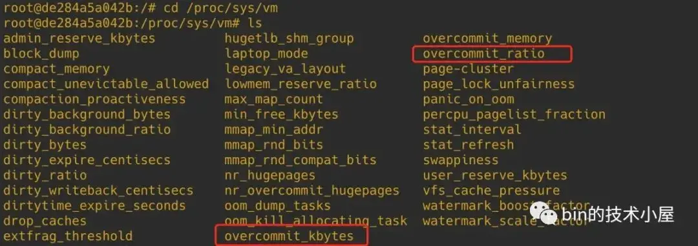
如果我们配置了 overcommit_kbytes （单位为 KB）, CommitLimit （单位为页）的值就是 <font color = red>sysctl_overcommit_kbytes >> (PAGE_SHIFT - 10) + total_swap_pages</font>。

如果我们没有配置 overcommit_kbytes，内核则会根据 overcommit_ratio 的值（默认为 50）计算 CommitLimit ：<font color = red>（总物理内存大小 - 大页占用的内存大小） * overcommit_ratio % + total_swap_pages</font>。

overcommit_kbytes 的优先级要大于 overcommit_ratio
```c
/*
 * Committed memory limit enforced when OVERCOMMIT_NEVER policy is used
 */
unsigned long vm_commit_limit(void)
{
    // 允许申请的虚拟内存大小，单位为页
    unsigned long allowed;
    // 该值可通过 /proc/sys/vm/overcommit_kbytes 来修改
    // sysctl_overcommit_kbytes 设置的是 Committed memory limit 的绝对值
    if (sysctl_overcommit_kbytes)
        // 转换单位为页
        allowed = sysctl_overcommit_kbytes >> (PAGE_SHIFT - 10);
    else
        // sysctl_overcommit_ratio 该值可通过 /proc/sys/vm/overcommit_ratio 来修改，设置的 commit limit 的比例
        // 默认值为 50，（总物理内存大小 - 大页占用的内存大小） * 50%
        allowed = ((totalram_pages() - hugetlb_total_pages())
               * sysctl_overcommit_ratio / 100);

    // 最后都需要加上 swap 交换区的总大小
    allowed += total_swap_pages;
    // （总物理内存大小 - 大页占用的内存大小） * 50%  + swap 交换区总大小 
    return allowed;
}
```
### 5.3 vma_merge 函数解析

经过前面的介绍我们知道，当 mmap 在进程虚拟内存空间中映射出一段 [addr , end] 的虚拟内存区域 area 时，内核需要为这段虚拟内存区域 area 创建一个 vma 结构来描述。

而在创建新的 vma 结构之前，内核会在这里尝试看能不能将 area 与现有的 vma 进行合并，这样就可以避免创建新的 vma 结构，节省了内存的开销。

内核会本着合并最大化的原则，检查当前映射出来的 area 能否与其前后两个 vma 进行合并，能合并就合并，如果不能合并就只能从 slab 中申请新的 vma 结构了。合并条件如下：

1. area 的 vm_flags 不能设置 VM_SPECIAL 标志，该标志表示 area 区域是不可以被合并的，只能重新创建 vma。
2. area 的起始地址 addr 必须要与其 prev vma 的结束地址重合，这样，area 才能和它的前一个 vma 进行合并，如果不重合，area 则不能和前一个 vma 进行合并。
3. area 的结束地址 end 必须要与其 next vma 的起始地址重合，这样，area 才能和它的后一个 vma 进行合并，如果不重合，area 则不能和后一个 vma 进行合并。如果前后都不能合并，那就只能重新创建 vma 结构了。
4. area 需要与其要合并区域的 vm_flags 必须相同，否则不能合并。
5. 如果两个合并区域都是文件映射区，那么它们映射的文件必须是同一个。并且他们的文件映射偏移 vm_pgoff 必须是连续的。
6. 如果两个合并区域都是匿名映射区，那么两个 vma 映射的匿名页 anon_vma 必须是相同的。
7. 合并区域的 numa policy 必须是相同的。关于 numa policy 的介绍，感兴趣的同学可以查看笔者之前的文章 《一步一图带你深入理解 Linux 物理内存管理》 第 “3.2.1 NUMA 的内存分配策略” 小节的内容。
8. 要合并的 prev 和 next 虚拟内存区域中，不能包含 close 操作，也就是说 vma->vm_ops 不能设置有 close 函数，如果虚拟内存区域操作支持 close，则不能合并，否则会导致现有虚拟内存区域 prev 和 next 的资源无法释放。
can_vma_merge_after 函数用于判断其参数中指定的 vma 能否与其后一个 vma 进行合并。can_vma_merge_before 的逻辑也是一样，用于判断参数指定的 vma 能否与其前一个 vma 合并。
```c
static int
can_vma_merge_after(struct vm_area_struct *vma, unsigned long vm_flags,
            struct anon_vma *anon_vma, struct file *file,
            pgoff_t vm_pgoff,
            struct vm_userfaultfd_ctx vm_userfaultfd_ctx)
{
    // 判断参数中指定的 vma 能否与其后一个 vma 进行合并
    if (is_mergeable_vma(vma, file, vm_flags, vm_userfaultfd_ctx) &&
        is_mergeable_anon_vma(anon_vma, vma->anon_vma, vma)) {
        pgoff_t vm_pglen;
        // vma 区域的长度
        vm_pglen = vma_pages(vma);
        // 判断 vma 和 next 两个文件映射区域的映射偏移 pgoff 是否是连续的
        if (vma->vm_pgoff + vm_pglen == vm_pgoff)
            return 1;
    }
    return 0;
}
```
is_mergeable_vma 函数用于判断两个 vma 是否能够合并：
```c
static inline int is_mergeable_vma(struct vm_area_struct *vma,
                struct file *file, unsigned long vm_flags,
                struct vm_userfaultfd_ctx vm_userfaultfd_ctx)
{
    // 对比 prev 和 area 的 vm_flags 是否相同，这里需要排除 VM_SOFTDIRTY
    // VM_SOFTDIRTY 用于追踪进程写了哪些内存页，如果 prev 被标记了 soft dirty，那么合并之后的 vma 也应该继续保留 soft dirty 标记
    if ((vma->vm_flags ^ vm_flags) & ~VM_SOFTDIRTY)
        return 0;
    // prev 和 area 如果是文件映射区的话，这里需要检查两者映射的文件是否相同
    if (vma->vm_file != file)
        return 0;
    // 如果 prev 虚拟内存区域中包含了 close 的操作，后续可能会释放 prev 的资源
    // 所以这种情况下不能和 prev 进行合并，否则就会导致 prev 的资源无法释放
    if (vma->vm_ops && vma->vm_ops->close)
        return 0;
    // userfaultfd 是用来在用户态实现缺页处理的机制，这里需要保证两者的 userfaultfd 相同
    // 不过在 mmap_region 中传入的 vm_userfaultfd_ctx 为 null，这里我们不需要关注
    if (!is_mergeable_vm_userfaultfd_ctx(vma, vm_userfaultfd_ctx))
        return 0;
    return 1;
}
```
is_mergeable_vma 函数用于判断两个 vma 是否能够合并：
```c
static inline int is_mergeable_vma(struct vm_area_struct *vma,
                struct file *file, unsigned long vm_flags,
                struct vm_userfaultfd_ctx vm_userfaultfd_ctx)
{
    // 对比 prev 和 area 的 vm_flags 是否相同，这里需要排除 VM_SOFTDIRTY
    // VM_SOFTDIRTY 用于追踪进程写了哪些内存页，如果 prev 被标记了 soft dirty，那么合并之后的 vma 也应该继续保留 soft dirty 标记
    if ((vma->vm_flags ^ vm_flags) & ~VM_SOFTDIRTY)
        return 0;
    // prev 和 area 如果是文件映射区的话，这里需要检查两者映射的文件是否相同
    if (vma->vm_file != file)
        return 0;
    // 如果 prev 虚拟内存区域中包含了 close 的操作，后续可能会释放 prev 的资源
    // 所以这种情况下不能和 prev 进行合并，否则就会导致 prev 的资源无法释放
    if (vma->vm_ops && vma->vm_ops->close)
        return 0;
    // userfaultfd 是用来在用户态实现缺页处理的机制，这里需要保证两者的 userfaultfd 相同
    // 不过在 mmap_region 中传入的 vm_userfaultfd_ctx 为 null，这里我们不需要关注
    if (!is_mergeable_vm_userfaultfd_ctx(vma, vm_userfaultfd_ctx))
        return 0;
    return 1;
}
```
在我们清楚了 vma 之间的的合并条件之后，接下来我们来看一下 vma 的合并过程，整个合并过程其实还蛮复杂的，总共涉及到 8 种场景，不过大家别担心，笔者会带着大家从最简单的场景出发来逐渐演变。

经过前面内容的介绍，我们知道，通过 mmap 在进程地址空间中映射出的这个 area 一般是在两个 vma 中产生的，内核源码中使用 prev 指向 area 的前一个 vma，使用 next 指向 area 的后一个 vma，这个原则请大家务必牢记。
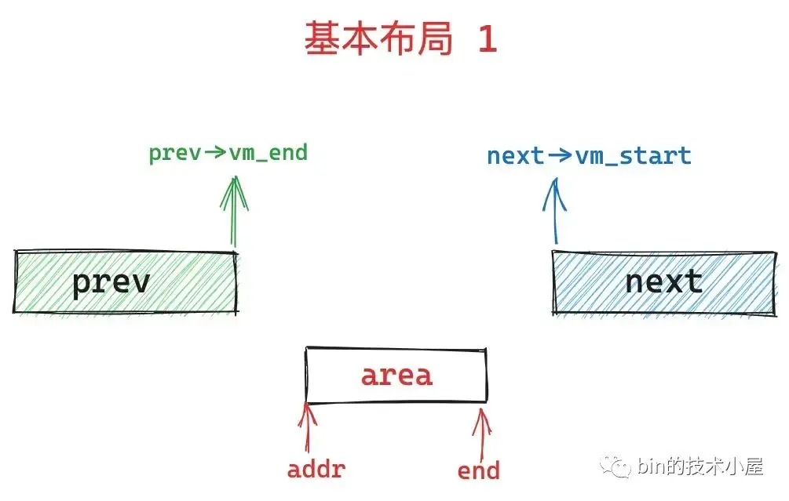
如果我们在 mmap 系统调用参数 flags 中设置了 MAP_FIXED 标志，表示需要内核进行强制映射，在这种情况下，area 区域有可能会与 prev 区域和 next 区域有部分重合。
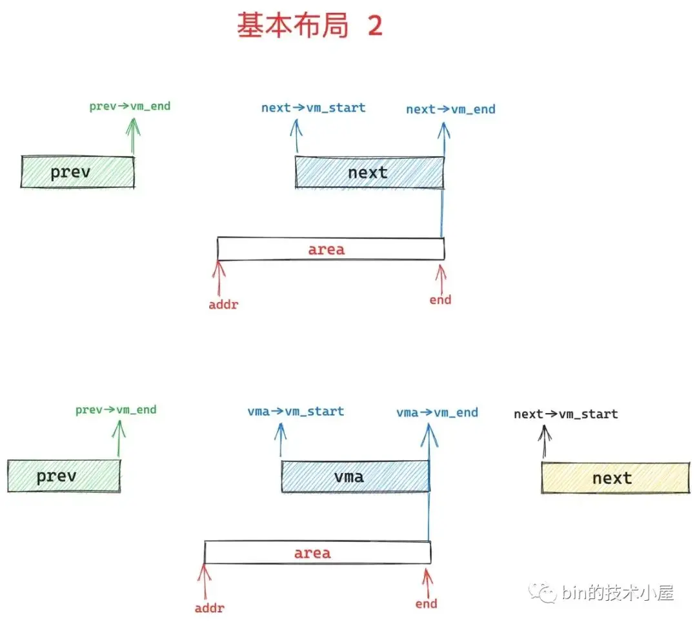
如上图所示，如果 area 区域的结束地址 end 与 next 区域的结束地址重合，内核会将 next 指针继续向后移动一下，指向 next->vm_next 区域。保证 area 始终处于 prev 和 next 之间的 gap 中。
```c
 if (area && area->vm_end == end)        
        next = next->vm_next;
```
以上这两种基本布局，大家要好好记住，多看几眼，后面 8 种合并情况基本都是脱胎于这两个基本布局。

下面即将要介绍的这 8 种合并情况从总体上来讲会分为两个大的类别：

第一个类别是 area 的前一个 prev vma 的结束地址与 area 的起始地址 addr 重合，判断条件为：<font color = red >prev->vm_end == addr</font>。
第二个类别是 area 的后一个 next vma 的起始地址与 area 的结束地址 end 重合，判断条件为：<font color = red >end == next->vm_start </font>。
其中这两个大的类别将会分别根据前面两个基本布局展开进行，下面我们来看源码中的 case 1 。

注意下面的 8 种 case，笔者按照从简单到复杂的顺序来展示。
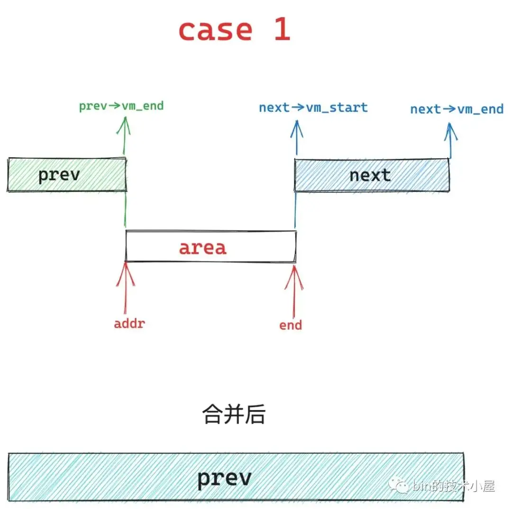
case 1 是在基本布局 1 中，area 的起始地址 addr 与 prev vma 的结束地址重合，同时 area 的结束地址 end 与 next vma 的起始地址重合，内核将会删除 next 区域，扩充 prev 区域，也就是说将这三个区域统一合并到 prev 区域中。

case 1 在基本布局 2 下，就演变成了 case 6 的情况，内核会将中间重叠的蓝色区域覆盖掉，然后统一合并到 prev 区域中。
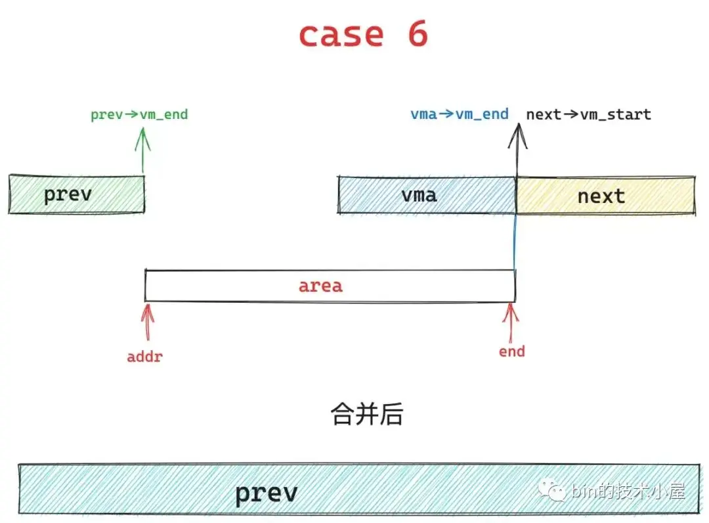
如果只是 area 的起始地址 addr 与 prev vma 的结束地址重合，但是 area 的结束地址 end 不与 next vma 的起始地址重合，就会出现 case 2 , case 5 , case 7 三种情况。

其中 case 2 的情况是 area 的结束地址 end 小于 next vma 的起始地址，内核会扩充 prev 区域，将 area 合并进去，next 区域保持不变。
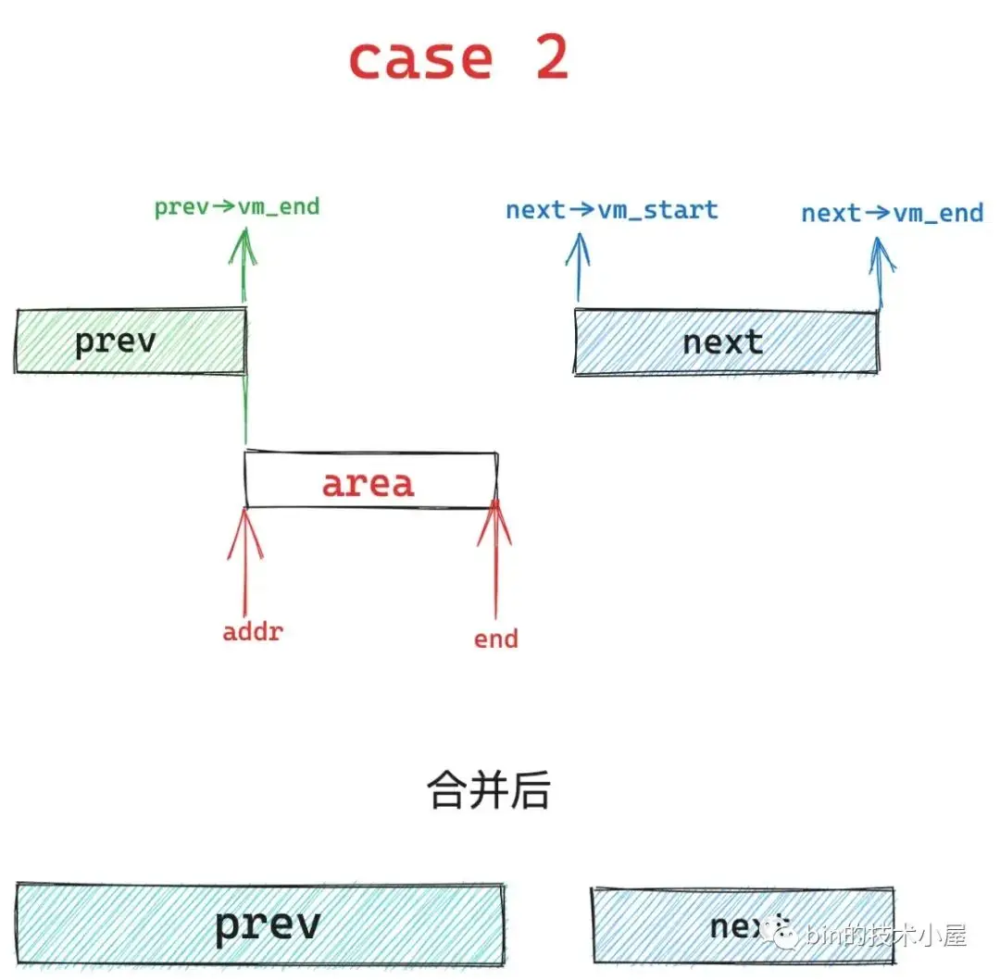
case 5 的情况是 area 的结束地址 end 大于 next vma 的起始地址，内核会扩充 prev 区域，将 area 以及与 next 重叠的部分合并到 prev 区域中，剩下的继续留在 next 区域保持不变。
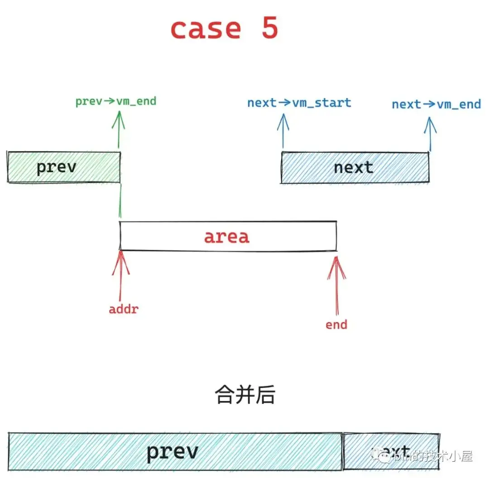
case 2 在基本布局 2 下又会演变成 case 7 , 这种情况下内核会将下图中的蓝色区域覆盖，并扩充 prev 区域。next 区域保持不变。

如果只是 area 的结束地址 end 与 next vma 的起始地址重合，但是 area 的起始地址 addr 不与 prev vma 的结束地址重合，同样的道理也会分为三种情况，分别是下面介绍的 case 4 , case 3 , case 8。

case 4 的情况下，area 的起始地址 addr 小于 prev 区域的结束地址，那么内核会缩小 prev 区域，然后扩充 next 区域，将重叠的部分合并到 next 区域中。
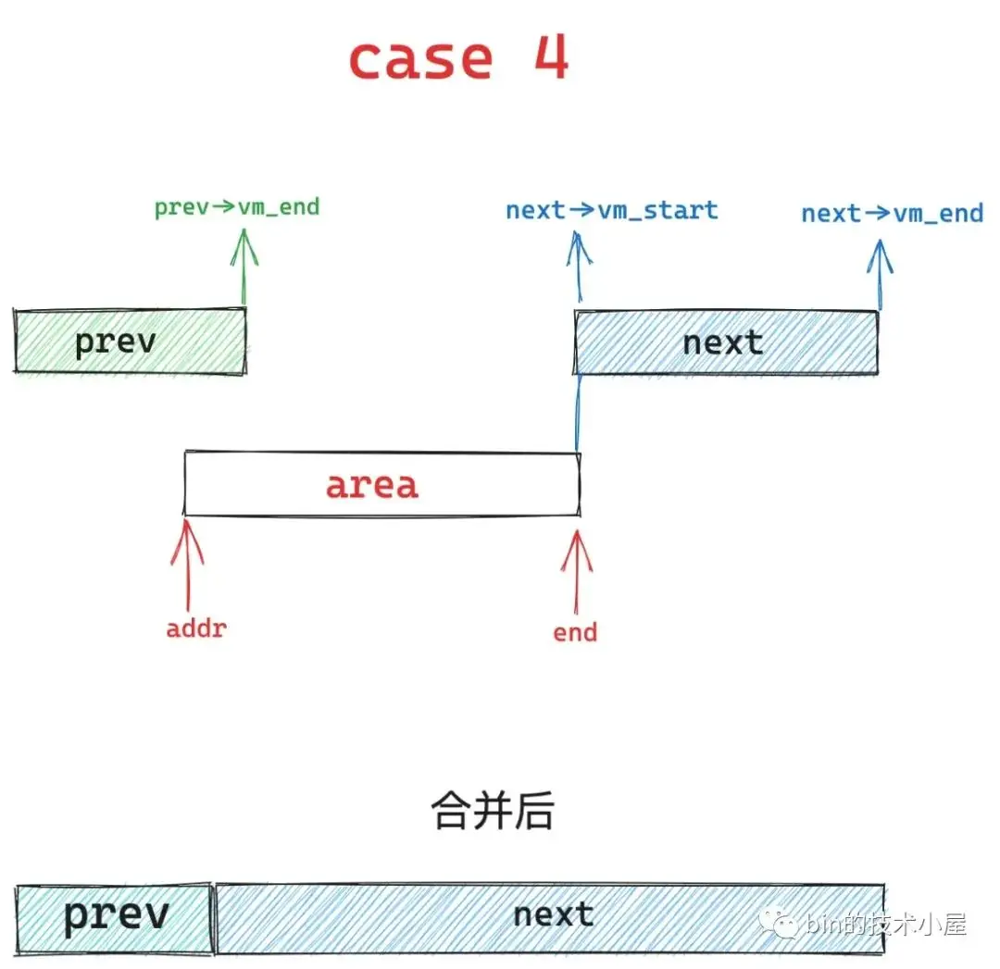
如果 area 的起始地址 addr 大于 prev 区域的结束地址的话，就是 case 3 的情况 ，内核会扩充 next 区域，并将 area 合并到 next 中，prev 区域保持不变。
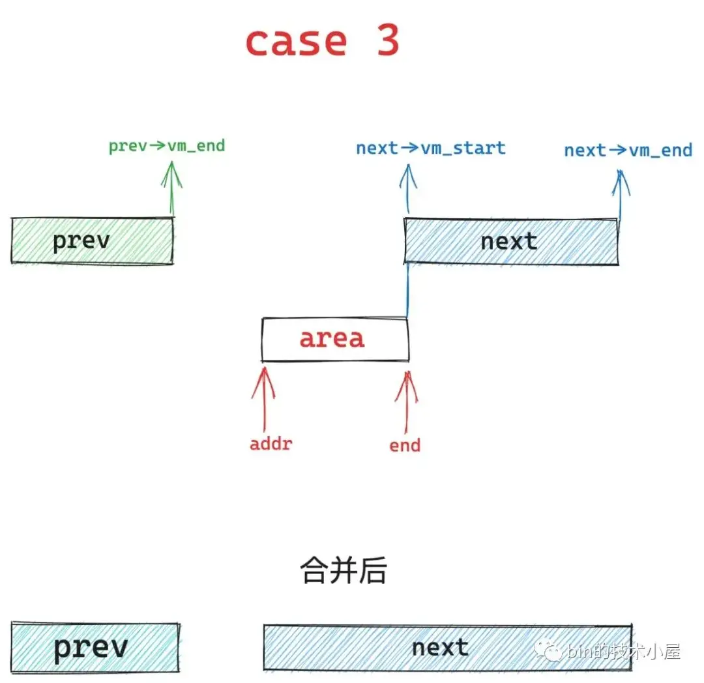
case 3 在基本布局 2 下就会演变为 case 8 ，内核继续保持 prev 区域不变，然后扩充 next 区域并覆盖下图中蓝色部分，将 area 合并到 next 区域中
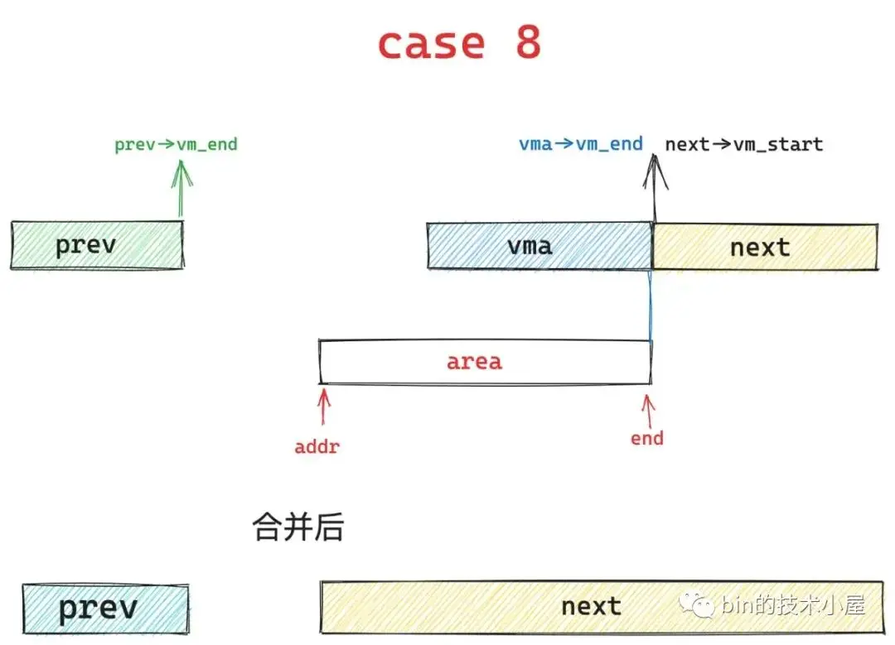
好了，现在 vma 合并的流程我们也清楚了，合并的条件也清楚了，接下来在看这部分源码就很简单了。
```C
struct vm_area_struct *vma_merge(struct mm_struct *mm,
            struct vm_area_struct *prev, unsigned long addr,
            unsigned long end, unsigned long vm_flags,
            struct anon_vma *anon_vma, struct file *file,
            pgoff_t pgoff, struct mempolicy *policy,
            struct vm_userfaultfd_ctx vm_userfaultfd_ctx)
{
    // 本次需要创建的 VMA 区域大小
    pgoff_t pglen = (end - addr) >> PAGE_SHIFT;
    // area 表示当前要创建的 VMA，next 表示 area 的下一个 VMA
    // 事实上 area 会在其 prev 前一个 VMA 和 next 后一个 VMA 之间的间隙 gap 中创建产生
    struct vm_area_struct *area, *next;
    int err;

    // 设置了 VM_SPECIAL 表示 area 区域是不可以被合并的，只能重新创建 VMA，直接退出合并流程。
    if (vm_flags & VM_SPECIAL)
        return NULL;
    // 根据 prev vma 是否存在，设置 area 的 next vma，基本布局 1
    if (prev)
        // area 将在 prev vma 和 next vma 的间隙 gap 中产生
        next = prev->vm_next;
    else
        // 如果 prev 不存在，那么 next 就设置为地址空间中的第一个 vma。
        next = mm->mmap;

    area = next;
    // 新 vma 的 end 与 next->vm_end 相等 ，表示新 vma 与 next vma 是重合的，基本布局 2
    // 那么 next 指向下一个 vma，prev 和 next 这里的语义是始终指向 area 区域的前一个和后一个 vma
    if (area && area->vm_end == end)        /* cases 6, 7, 8 */
        next = next->vm_next;
 
    // 判断 area 是否能够和 prev 进行合并
    if (prev && prev->vm_end == addr &&
            mpol_equal(vma_policy(prev), policy) &&
            can_vma_merge_after(prev, vm_flags,
                        anon_vma, file, pgoff,
                        vm_userfaultfd_ctx)) {
        /*
         * 如何 area 可以和 prev 进行合并，那么这里继续判断 area 能够与 next 进行合并
         * 内核这里需要保证 vma 合并程度的最大化
         */
        if (next && end == next->vm_start &&
                mpol_equal(policy, vma_policy(next)) &&
                can_vma_merge_before(next, vm_flags,
                             anon_vma, file,
                             pgoff+pglen,
                             vm_userfaultfd_ctx) &&
                is_mergeable_anon_vma(prev->anon_vma,
                              next->anon_vma, NULL)) {
            // 流程走到这里表示 area 可以和它的 prev ，next 区域进行合并  /* cases 1,6 */
            // __vma_adjust 是真正执行 vma 合并操作的函数，这里会重新调整已有 vma 的相关属性，比如：vm_start,vm_end,vm_pgoff。以及涉及到相关数据结构的改变
            err = __vma_adjust(prev, prev->vm_start,
                     next->vm_end, prev->vm_pgoff, NULL,
                     prev);
        } else                  /* cases 2, 5, 7 */
            // 流程走到这里表示 area 只能和 prev 进行合并
            err = __vma_adjust(prev, prev->vm_start,
                     end, prev->vm_pgoff, NULL, prev);
        if (err)
            return NULL;
        khugepaged_enter_vma_merge(prev, vm_flags);
        // 返回最终合并好的 vma
        return prev;
    }

    // 下面这种情况属于，area 的结束地址 end 与 next 的起始地址是重合的
    // 但是 area 的起始地址 start 和 prev 的结束地址不是重合的
    if (next && end == next->vm_start &&
            mpol_equal(policy, vma_policy(next)) &&
            can_vma_merge_before(next, vm_flags,
                         anon_vma, file, pgoff+pglen,
                         vm_userfaultfd_ctx)) {
        // area 区域前半部分和 prev 区域的后半部分重合
        // 那么就缩小 prev 区域，然后将 area 合并到 next 区域
        if (prev && addr < prev->vm_end)    /* case 4 */
            err = __vma_adjust(prev, prev->vm_start,
                     addr, prev->vm_pgoff, NULL, next);
        else {                  /* cases 3, 8 */
            // area 区域前半部分和 prev 区域是有间隙 gap 的
            // 那么这种情况下 prev 不变，area 合并到 next 中
            err = __vma_adjust(area, addr, next->vm_end,
                     next->vm_pgoff - pglen, NULL, next);
            // 合并后的 area
            area = next;
        }
        if (err)
            return NULL;
        khugepaged_enter_vma_merge(area, vm_flags);
        // 返回合并后的 vma
        return area;
    }
    
    // prev 的结束地址不与 area 的起始地址重合，并且 area 的结束地址不与 next 的起始地址重合
    // 这种情况就不能执行合并，需要为 area 重新创建新的 vma 结构
    return NULL;
}
```
# 总结
到现在为止，笔者通过两篇文章，一篇原理，一篇源码，深入到内核世界中，将 mmap 内存映射的本质给大家呈现了出来，知识点比较密集且比较烧脑，因此笔者又画了一副 mmap 内存映射的整体思维导图方便大家回顾。

在原理篇中笔者首先通过五个角度为大家详细介绍了 mmap 的使用方法及其在内核中的实现原理，这五个角度分别是：

1. 私有匿名映射，其主要用于进程申请虚拟内存，以及初始化进程虚拟内存空间中的 BSS 段，堆，栈这些虚拟内存区域。
2. 私有文件映射，其核心特点是背后映射的文件页在多进程之间是读共享的，但多个进程对各自虚拟内存区的修改只能反应到各自对应的文件页上，而且各自的修改在进程之间是互不可见的，最重要的一点是这些修改均不会回写到磁盘文件中。我们可以利用这些特点来加载二进制可执行文件的 .text , .data section 到进程虚拟内存空间中的代码段和数据段中。
3. 共享文件映射，多进程之间读写共享（不会发生写时复制），常用于多进程之间共享内存（page cache），多进程之间的通讯。
4. 共享匿名映射，用于父子进程之间共享内存，父子进程之间的通讯。父子进程之间需要依赖 tmpfs 中的匿名文件来实现共享内存。是一种特殊的共享文件映射。
5. 大页内存映射，这里我们介绍了标准大页与透明大页两种大页类型的区别与联系，以及他们各自的实现原理和使用方法。

介绍完原理之后，在本文的源码实现篇中笔者花了大量的篇幅介绍了 mmap 在内核中的源码实现，其中最核心的两个函数是：

1. get_unmapped_area 函数用于在进程虚拟内存空间中为本次 mmap 映射寻找出一段未被映射的空闲虚拟内存地址范围。其中笔者还为大家介绍了文件映射与匿名映射区在进程虚拟内存空间的布局情况。
2. map_region 函数主要是对这段空闲虚拟内存地址范围进行映射，在映射过程中涉及到的重要内容有：
* 内核的 overcommit 策略
* vm_merge 合并的流程，其中涉及到 8 种合并场景和 2 中基本布局。
