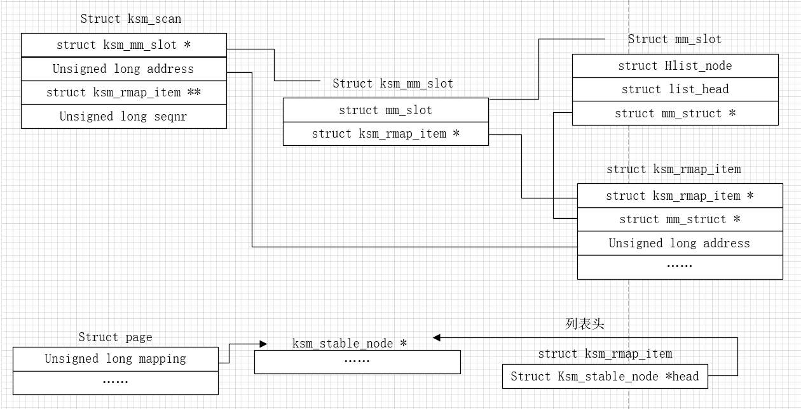
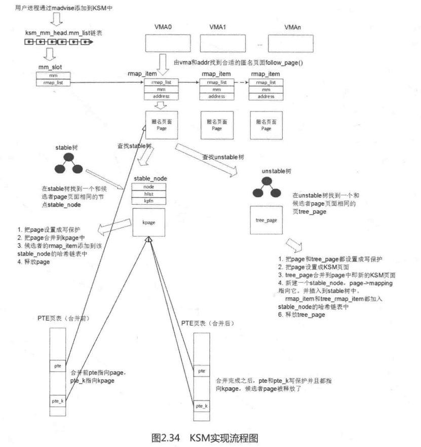

零页合并解决zram+swap和KSM不能处理的页，

1，系统中存在经常读取，但不写入的页，不会swap出去

2，没有调用`madvise(addr, length, MADV_MERGEABLE)`的页无法合并

3，KSM合并需要时间长，先加入不稳定树，再加入稳定树才允许合并

**注意事项**

1，KSM只会处理通过madvise系统调用显示处理的用户进程空间内存，因此，用户想用这个功能，必须在分配内存后调用`madvise(addr, length, MADV_MERGEABLE)`,

2，调试路径`/sys/kernel/mm/ksm/`

3，只处理匿名页面

**数据结构**



**代码分析**

```c
ksm_madvise
    ->__ksm_enter    //从mm_slot_cache申请内存，存放进程的struct mm，并添加到ksm_scan.mm_slot->slot.mm_node列表上
        ->wake_up_interruptible(&ksm_thread_wait);//唤醒ksm_do_scan进程


ksm_do_scan
    ->scan_get_next_rmap_item//扫描ksm_mm_head上的每个进程的每个页面，找到一个可被合并的候选页
    ->cmp_and_merge_page
        ->stable_tree_search
        ->kpage = stable_tree_search(page)
        ->if (kpage) {try_to_merge_with_ksm_page;stable_tree_append}//在稳定树中找一个与page内容相同的页面，合并
        ->tree_rmap_item = unstable_tree_search_insert
        ->if (tree_rmap_item) {try_to_merge_two_pages}//在不稳定树中找到内容一样的页面，尝试合并并放到稳定树中


try_to_merge_with_ksm_page
    ->try_to_merge_one_page
        ->write_protect_page//对PTE进行写保护
        ->//在于不稳定树节点合并时，set_page_stable_node(page, NULL);为插入稳定树做准备
        ->//与稳定树的页面合并，replace_page，修改pte，指向kapge


/**
 * ksm_do_scan  - the ksm scanner main worker function.
 * @scan_npages:  number of pages we want to scan before we return.
 */
static void ksm_do_scan(unsigned int scan_npages)
{
    struct ksm_rmap_item *rmap_item;
    struct page *page;

    while (scan_npages-- && likely(!freezing(current))) {
        cond_resched();
        rmap_item = scan_get_next_rmap_item(&page);
        if (!rmap_item)
            return;
        cmp_and_merge_page(page, rmap_item);
        put_page(page);
    }
}


static struct ksm_rmap_item *scan_get_next_rmap_item(struct page **page)
{
    struct mm_struct *mm;
    struct ksm_mm_slot *mm_slot;
    struct mm_slot *slot;
    struct vm_area_struct *vma;
    struct ksm_rmap_item *rmap_item;
    struct vma_iterator vmi;
    int nid;

    if (list_empty(&ksm_mm_head.slot.mm_node))
        return NULL;

    mm_slot = ksm_scan.mm_slot;//当前扫描的struct ksm_mm_slot
    if (mm_slot == &ksm_mm_head) {
        /*
         * A number of pages can hang around indefinitely on per-cpu
         * pagevecs, raised page count preventing write_protect_page
         * from merging them.  Though it doesn't really matter much,
         * it is puzzling to see some stuck in pages_volatile until
         * other activity jostles them out, and they also prevented
         * LTP's KSM test from succeeding deterministically; so drain
         * them here (here rather than on entry to ksm_do_scan(),
         * so we don't IPI too often when pages_to_scan is set low).
         */
        lru_add_drain_all();

        /*
         * Whereas stale stable_nodes on the stable_tree itself
         * get pruned in the regular course of stable_tree_search(),
         * those moved out to the migrate_nodes list can accumulate:
         * so prune them once before each full scan.
         */
        if (!ksm_merge_across_nodes) {
            struct ksm_stable_node *stable_node, *next;
            struct page *page;

            list_for_each_entry_safe(stable_node, next,
                         &migrate_nodes, list) {
                page = get_ksm_page(stable_node,
                            GET_KSM_PAGE_NOLOCK);
                if (page)
                    put_page(page);
                cond_resched();
            }
        }

        for (nid = 0; nid < ksm_nr_node_ids; nid++)
            root_unstable_tree[nid] = RB_ROOT;

        spin_lock(&ksm_mmlist_lock);
        slot = list_entry(mm_slot->slot.mm_node.next,
                  struct mm_slot, mm_node);//拿到下一个struct ksm_mm_slot里的struct mm_slot 
        mm_slot = mm_slot_entry(slot, struct ksm_mm_slot, slot);//通过struct mm_slot再拿到struct ksm_mm_slot
        ksm_scan.mm_slot = mm_slot;//设置为当前要扫描的
        spin_unlock(&ksm_mmlist_lock);
        /*
         * Although we tested list_empty() above, a racing __ksm_exit
         * of the last mm on the list may have removed it since then.
         */
        if (mm_slot == &ksm_mm_head)//如果当前要扫描任然是ksm_mm_head，则说明列表是空的
            return NULL;
next_mm:
        ksm_scan.address = 0;
        ksm_scan.rmap_list = &mm_slot->rmap_list;
    }

    slot = &mm_slot->slot;
    mm = slot->mm;
    vma_iter_init(&vmi, mm, ksm_scan.address);

    mmap_read_lock(mm);
    if (ksm_test_exit(mm))
        goto no_vmas;

    for_each_vma(vmi, vma) {//从VMA的枫叶树中遍历vma
        if (!(vma->vm_flags & VM_MERGEABLE))
            continue;
        if (ksm_scan.address < vma->vm_start)
            ksm_scan.address = vma->vm_start;
        if (!vma->anon_vma)
            ksm_scan.address = vma->vm_end;

        while (ksm_scan.address < vma->vm_end) {
            if (ksm_test_exit(mm))
                break;
            *page = follow_page(vma, ksm_scan.address, FOLL_GET);//根据虚拟地址，遍历页表，找到normal映射的struct page
            if (IS_ERR_OR_NULL(*page)) {
                ksm_scan.address += PAGE_SIZE;
                cond_resched();
                continue;
            }
            if (is_zone_device_page(*page))
                goto next_page;
            if (PageAnon(*page)) {
                flush_anon_page(vma, *page, ksm_scan.address);
                flush_dcache_page(*page);
                rmap_item = get_next_rmap_item(mm_slot,
                    ksm_scan.rmap_list, ksm_scan.address);
                if (rmap_item) {
                    ksm_scan.rmap_list =
                            &rmap_item->rmap_list;//向后移动一个，指向下次要扫描的rmap_item
                    ksm_scan.address += PAGE_SIZE;
                } else
                    put_page(*page);
                mmap_read_unlock(mm);
                return rmap_item;
            }
next_page:
            put_page(*page);
            ksm_scan.address += PAGE_SIZE;
            cond_resched();
        }
    }

    if (ksm_test_exit(mm)) {//被扫描的进程被销毁
no_vmas:
        ksm_scan.address = 0;
        ksm_scan.rmap_list = &mm_slot->rmap_list;
    }
    /*
     * Nuke all the rmap_items that are above this current rmap:
     * because there were no VM_MERGEABLE vmas with such addresses.
     * 到这里，在这个进程中的所有vma中没有找到可以合并的页面，    
     * 释放这个rmap_list上的所有rmap_item
     */
    remove_trailing_rmap_items(ksm_scan.rmap_list);

    spin_lock(&ksm_mmlist_lock);
    slot = list_entry(mm_slot->slot.mm_node.next,
              struct mm_slot, mm_node);
    ksm_scan.mm_slot = mm_slot_entry(slot, struct ksm_mm_slot, slot);//取下一个要扫描的struct ksm_mm_slot，下边将判断mm_slot是否扫面完一轮
    if (ksm_scan.address == 0) {//被扫描的进程被销毁
        /*
         * We've completed a full scan of all vmas, holding mmap_lock
         * throughout, and found no VM_MERGEABLE: so do the same as
         * __ksm_exit does to remove this mm from all our lists now.
         * This applies either when cleaning up after __ksm_exit
         * (but beware: we can reach here even before __ksm_exit),
         * or when all VM_MERGEABLE areas have been unmapped (and
         * mmap_lock then protects against race with MADV_MERGEABLE).
         */
        hash_del(&mm_slot->slot.hash);
        list_del(&mm_slot->slot.mm_node);
        spin_unlock(&ksm_mmlist_lock);

        mm_slot_free(mm_slot_cache, mm_slot);
        clear_bit(MMF_VM_MERGEABLE, &mm->flags);
        mmap_read_unlock(mm);
        mmdrop(mm);
    } else {
        mmap_read_unlock(mm);
        /*
         * mmap_read_unlock(mm) first because after
         * spin_unlock(&ksm_mmlist_lock) run, the "mm" may
         * already have been freed under us by __ksm_exit()
         * because the "mm_slot" is still hashed and
         * ksm_scan.mm_slot doesn't point to it anymore.
         */
        spin_unlock(&ksm_mmlist_lock);
    }

    /* Repeat until we've completed scanning the whole list */
    mm_slot = ksm_scan.mm_slot;
    if (mm_slot != &ksm_mm_head)//判断mm_slot是否扫面完一轮
        goto next_mm;

    ksm_scan.seqnr++;
    return NULL;
}

/* 对于没有进程
 * KSM会为每个待合并的page分配一个ksm_rmap_item，挂struct ksm_mm_slot->rmap_list上
 * 顺序按虚拟地址从小到大排列，每完成一个页面的扫描之后，ksm_scan.address + PAGE_SIZE，
 * ksm_scan.rmap_list向后移动一个，指向下次要扫描的rmap_item。
 */
static struct ksm_rmap_item *get_next_rmap_item(struct ksm_mm_slot *mm_slot,
                        struct ksm_rmap_item **rmap_list,
                        unsigned long addr)
{
    struct ksm_rmap_item *rmap_item;

    while (*rmap_list) {
        rmap_item = *rmap_list;
        if ((rmap_item->address & PAGE_MASK) == addr)
            return rmap_item;
        if (rmap_item->address > addr)//之前没有为这个地址建立rmap_item，现在
            break;
        *rmap_list = rmap_item->rmap_list;
/*到这里rmap_item->address < addr,说明之前为这个地址（rmap_item->address）
的页面建立过rmap_item，现在由于某种原因无法合并了，否则一定会扫描
*/
        remove_rmap_item_from_tree(rmap_item);
        free_rmap_item(rmap_item);
    }

    rmap_item = alloc_rmap_item();
    if (rmap_item) {
        /* It has already been zeroed */
        rmap_item->mm = mm_slot->slot.mm;
        rmap_item->mm->ksm_rmap_items++;
        rmap_item->address = addr;
        rmap_item->rmap_list = *rmap_list;
        *rmap_list = rmap_item;
    }
    return rmap_item;
}
```

```c
/*
 * cmp_and_merge_page - first see if page can be merged into the stable tree;
 * if not, compare checksum to previous and if it's the same, see if page can
 * be inserted into the unstable tree, or merged with a page already there and
 * both transferred to the stable tree.
 *
 * @page: the page that we are searching identical page to.
 * @rmap_item: the reverse mapping into the virtual address of this page
 */
static void cmp_and_merge_page(struct page *page, struct ksm_rmap_item *rmap_item)
{
    struct mm_struct *mm = rmap_item->mm;
    struct ksm_rmap_item *tree_rmap_item;
    struct page *tree_page = NULL;
    struct ksm_stable_node *stable_node;
    struct page *kpage;
    unsigned int checksum;
    int err;
    bool max_page_sharing_bypass = false;

    stable_node = page_stable_node(page);
    if (stable_node) {
        if (stable_node->head != &migrate_nodes &&
            get_kpfn_nid(READ_ONCE(stable_node->kpfn)) !=
            NUMA(stable_node->nid)) {
            stable_node_dup_del(stable_node);
            stable_node->head = &migrate_nodes;
            list_add(&stable_node->list, stable_node->head);
        }
        if (stable_node->head != &migrate_nodes &&
            rmap_item->head == stable_node)
            return;
        /*
         * If it's a KSM fork, allow it to go over the sharing limit
         * without warnings.
         */
        if (!is_page_sharing_candidate(stable_node))
            max_page_sharing_bypass = true;
    }

    /* We first start with searching the page inside the stable tree */
    kpage = stable_tree_search(page);//在稳定树中找一个与page内容相同的页面
    if (kpage == page && rmap_item->head == stable_node) {//如果找到的kpage和page是同一个页面
        put_page(kpage);//scan_get_next_rmap_item->follow_page中增加了_refcount计数
        return;
    }

    remove_rmap_item_from_tree(rmap_item);//将这个页面对应的rmap_item从稳定树或不稳定树上摘下来

    if (kpage) {//在stable数中找到一个内容相同的页面
        if (PTR_ERR(kpage) == -EBUSY)
            return;

        err = try_to_merge_with_ksm_page(rmap_item, page, kpage);
        if (!err) {
            /*
             * The page was successfully merged:
             * add its rmap_item to the stable tree.
             * 把rmap_item添加到kpage->mapping指向的稳定树节点中
             */
            lock_page(kpage);
            stable_tree_append(rmap_item, page_stable_node(kpage),
                       max_page_sharing_bypass);
            unlock_page(kpage);
        }
        put_page(kpage);
        return;
    }

    /*
     * If the hash value of the page has changed from the last time
     * we calculated it, this page is changing frequently: therefore we
     * don't want to insert it in the unstable tree, and we don't want
     * to waste our time searching for something identical to it there.
     */
    checksum = calc_checksum(page);
    if (rmap_item->oldchecksum != checksum) {
        rmap_item->oldchecksum = checksum;
        return;
    }

    /*
     * Same checksum as an empty page. We attempt to merge it with the
     * appropriate zero page if the user enabled this via sysfs.
     * 处理零页情况
     */
    if (ksm_use_zero_pages && (checksum == zero_checksum)) {
        struct vm_area_struct *vma;

        mmap_read_lock(mm);
        vma = find_mergeable_vma(mm, rmap_item->address);
        if (vma) {
            err = try_to_merge_one_page(vma, page,
                    ZERO_PAGE(rmap_item->address));
        } else {
            /*
             * If the vma is out of date, we do not need to
             * continue.
             */
            err = 0;
        }
        mmap_read_unlock(mm);
        /*
         * In case of failure, the page was not really empty, so we
         * need to continue. Otherwise we're done.
         */
        if (!err)
            return;
    }
    tree_rmap_item =
        unstable_tree_search_insert(rmap_item, page, &tree_page);
    if (tree_rmap_item) {
        bool split;

        kpage = try_to_merge_two_pages(rmap_item, page,
                        tree_rmap_item, tree_page);
        /*
         * If both pages we tried to merge belong to the same compound
         * page, then we actually ended up increasing the reference
         * count of the same compound page twice, and split_huge_page
         * failed.
         * Here we set a flag if that happened, and we use it later to
         * try split_huge_page again. Since we call put_page right
         * afterwards, the reference count will be correct and
         * split_huge_page should succeed.
         */
        split = PageTransCompound(page)
            && compound_head(page) == compound_head(tree_page);
        put_page(tree_page);
        if (kpage) {
            /*
             * The pages were successfully merged: insert new
             * node in the stable tree and add both rmap_items.
             */
            lock_page(kpage);
            stable_node = stable_tree_insert(kpage);
            if (stable_node) {
                stable_tree_append(tree_rmap_item, stable_node,
                           false);
                stable_tree_append(rmap_item, stable_node,
                           false);
            }
            unlock_page(kpage);

            /*
             * If we fail to insert the page into the stable tree,
             * we will have 2 virtual addresses that are pointing
             * to a ksm page left outside the stable tree,
             * in which case we need to break_cow on both.
             */
            if (!stable_node) {
                break_cow(tree_rmap_item);
                break_cow(rmap_item);
            }
        } else if (split) {
            /*
             * We are here if we tried to merge two pages and
             * failed because they both belonged to the same
             * compound page. We will split the page now, but no
             * merging will take place.
             * We do not want to add the cost of a full lock; if
             * the page is locked, it is better to skip it and
             * perhaps try again later.
             */
            if (!trylock_page(page))
                return;
            split_huge_page(page);
            unlock_page(page);
        }
    }
}
```

```c
/*
 * try_to_merge_two_pages - take two identical pages and prepare them
 * to be merged into one page.
 *
 * This function returns the kpage if we successfully merged two identical
 * pages into one ksm page, NULL otherwise.
 *
 * Note that this function upgrades page to ksm page: if one of the pages
 * is already a ksm page, try_to_merge_with_ksm_page should be used.
 */
static struct page *try_to_merge_two_pages(struct ksm_rmap_item *rmap_item,
					   struct page *page,
					   struct ksm_rmap_item *tree_rmap_item,
					   struct page *tree_page)
{
	int err;
    //第一次调用主要将page设置为写保护，并设置为KSM页面
	err = try_to_merge_with_ksm_page(rmap_item, page, NULL);
	if (!err) {
        //第二次调用将尝试合并两个页面，对比内容是否一致，并替换PTE
		err = try_to_merge_with_ksm_page(tree_rmap_item,
							tree_page, page);
		/*
		 * If that fails, we have a ksm page with only one pte
		 * pointing to it: so break it.
		 */
		if (err)
			break_cow(rmap_item);//合并失败，通过人为触发写错误缺页中断
	}
	return err ? NULL : page;
}
```



