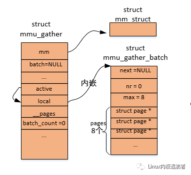
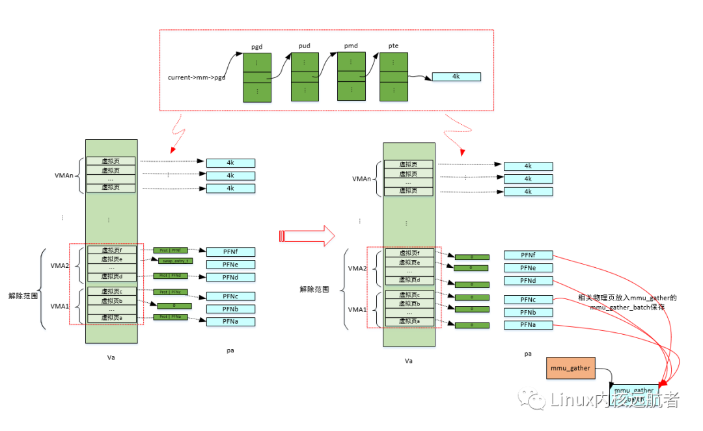
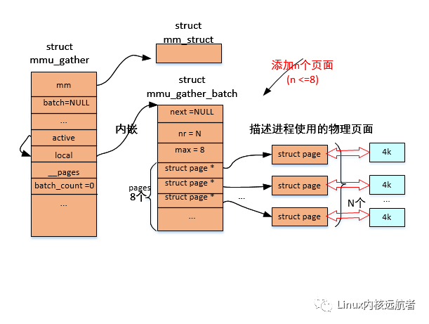
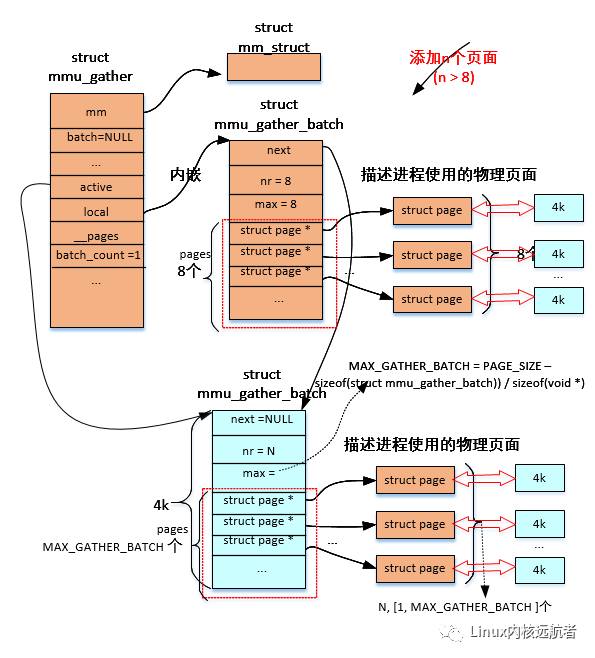
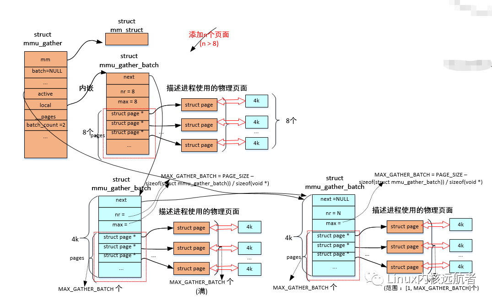
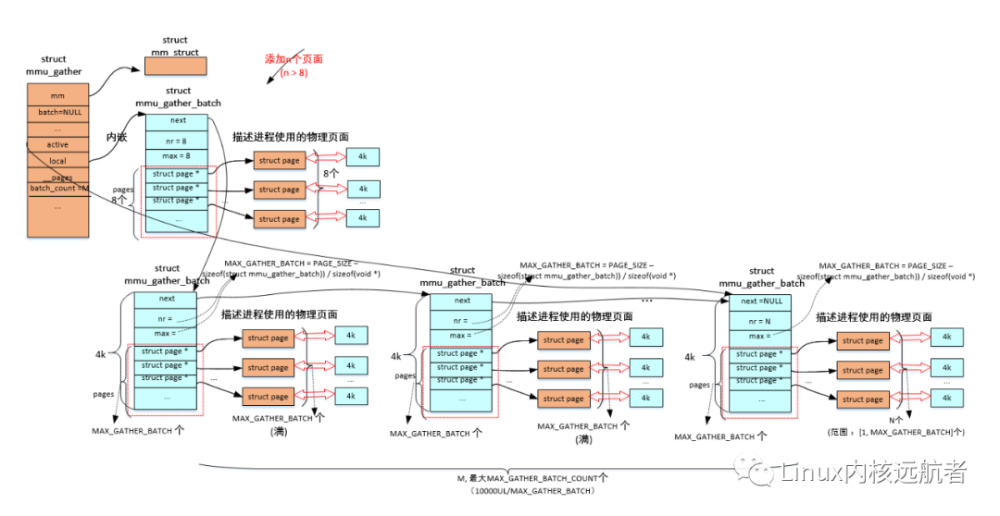
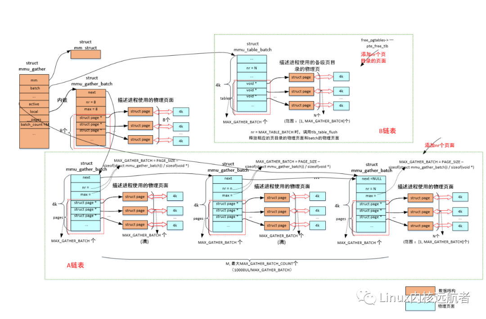

# 1开场白
环境：

处理器架构：arm64
内核源码：linux-5.10.50
ubuntu版本：20.04.1
代码阅读工具：vim+ctags+cscope
本文讲解Linux内核虚拟内存管理中的mmu_gather操作，看看它是如何保证刷tlb和释放物理页的顺序的，又是如何将更多的页面聚集起来统一释放的。

通常在进程退出或者执行munmap的时候，内核会解除相关虚拟内存区域的页表映射，刷/无效tlb，并释放/回收相关的物理页面，这一过程的正确顺序如下：

1）解除页表映射

2）刷相关tlb 

3）释放物理页面

在刷相关虚拟内存区域tlb之前，绝对不能先释放物理页面，否则可能导致不正确的结果，而mmu-gather（mmu 积聚）的作用就是保证这种顺序，并将需要释放的相关的物理页面聚集起来统一释放。

# 2.源代码解读
## 2.1 重要数据结构体
首先我们先介绍一下，与mmu-gather相关的一些重要结构体，对于理解源码很有帮助。

相关的主要数据结构有三个：

struct mmu_gather 

struct mmu_table_batch

struct mmu_gather_batch

1）**mmu_gather**

来表示一次mmu积聚操作，在每次解除相关虚拟内存区域时使用。
```c
struct mmu_gather {
        struct mm_struct        *mm;

#ifdef CONFIG_MMU_GATHER_TABLE_FREE
        struct mmu_table_batch  *batch;
#endif

        unsigned long           start;
        unsigned long           end;
        /*
        ¦* we are in the middle of an operation to clear
        ¦* a full mm and can make some optimizations
        ¦*/
        unsigned int            fullmm : 1;

        /*
        ¦* we have performed an operation which
        ¦* requires a complete flush of the tlb
        ¦*/
        unsigned int            need_flush_all : 1;

        /*
        ¦* we have removed page directories
        ¦*/
        unsigned int            freed_tables : 1;

        /*
        ¦* at which levels have we cleared entries?
        ¦*/
        unsigned int            cleared_ptes : 1;
        unsigned int            cleared_pmds : 1;
        unsigned int            cleared_puds : 1;
        unsigned int            cleared_p4ds : 1;

        /*
        ¦* tracks VM_EXEC | VM_HUGETLB in tlb_start_vma
        ¦*/
        unsigned int            vma_exec : 1;
        unsigned int            vma_huge : 1;
                                                                         
        unsigned int            batch_count;           
        #ifndef CONFIG_MMU_GATHER_NO_GATHER                           
        struct mmu_gather_batch *active;                      
        struct mmu_gather_batch local;                        
        struct page             *__pages[MMU_GATHER_BUNDLE]； 
                          ...                                                    
        #endif
                          
};                                                                   
```
其中， mm 表示操作哪个进程的虚拟内存；batch 用于积聚进程各级页目录的物理页；start和end 表示操作的起始和结束虚拟地址，这两个地址在处理过程中会被相应的赋值；fullmm 表示是否操作整个用户地址空间；freed_tables 表示我们已经释放了相关的页目录；cleared_ptes/pmds/puds/p4ds   表示我们在哪个级别上清除了表项；vma_exec 表示操作的是否为可执行的vma； vma_huge 表示操作的是否为hugetlb的vma；batch_count 表示积聚了多少个“批次”，后面会讲到 ；active、local和__pages 和多批次释放物理页面相关； active表示当前处理的批次，local表示“本地”批次，__pages表示“本地”批次积聚的物理页面。

这里需要说明一点就是，mmu积聚操作会涉及到local批次和多批次操作，local批次操作的物理页面相关的struct page数组内嵌到mmu_gather结构的__pages中，且我们发现这个数组大小为8，也就是local批次最大积聚8 * 4k = 32k的内存大小，这因为mmu_gather结构通常在内核栈中分配，不能占用太多的内核栈空间，而多批次由于动态分配批次积聚结构所以每个批次能积聚更多的页面。

2）mmu_table_batch 

用于积聚进程使用的各级页目录的物理页，在释放进程相关的页目录的物理页时使用（文章中称为**页表批次的积聚结构**）。
```c
struct mmu_table_batch {
#ifdef CONFIG_MMU_GATHER_RCU_TABLE_FREE
        struct rcu_head         rcu;                
#endif  
        unsigned int            nr;                 
        void                    *tables[0];         
};
```
rcu 用于rcu延迟释放页目录的物理页；

nr 表示页目录的物理页的积聚结构的page数组中页面个数；

tables 表示页表积聚结构的page数组。

3）mmu_gather_batch 

表示物理页的积聚批次，用于积聚进程映射到用户空间物理页（文章中称为**批次的积聚结构**）。

```c
 struct mmu_gather_batch {                        
         struct mmu_gather_batch *next;
         unsigned int            nr;              
         unsigned int            max;             
         struct page             *pages[0];       
 };      

```

next 用于多批次积聚物理页时，连接下一个积聚批次结构 ；

nr 表示本次批次的积聚数组的页面个数；

max 表示本次批次的积聚数组最大的页面个数；

pages 表示本次批次积聚结构的page数组。

## 2.2 总体调用

通常mmu-gather操作由一下几部分函数组成：

**tlb_gather_mmu**

**unmap_vmas**

**free_pgtables**

**tlb_finish_mmu**

其中tlb_gather_mmu表示mmu-gather初始化，也就是struct mmu_gather的初始化；

unmap_vmas 表示解除相关虚拟内存区域的页表映射；

free_pgtables 表示释放页表操作 ；

tlb_finish_mmu 表示进行刷tlb和释放物理页操作。
## 2.3 tlb_gather_mmu

这个函数主要是初始化从进程内核栈中传递过来的mmu_gather结构。
```c
void tlb_gather_mmu(struct mmu_gather *tlb, struct mm_struct *mm,                
                        unsigned long start, unsigned long end)                  
{                                                                                
        tlb->mm = mm;          //赋值进程的内存描述符                                                  
                                                                                 
        /* Is it from 0 to ~0? */                                                
        tlb->fullmm     = !(start | (end+1));    //如果是操作进程整个地址空间，则 start=0，   end=-1，这个时候 fullmm会被赋值1                       
                                                                                 
#ifndef CONFIG_MMU_GATHER_NO_GATHER                                              
        tlb->need_flush_all = 0;                  //初始化“本地”积聚相关成员                               
        tlb->local.next = NULL;                                                  
        tlb->local.nr   = 0;                                                     
        tlb->local.max  = ARRAY_SIZE(tlb->__pages);                              
        tlb->active     = &tlb->local;    //active指向本地的积聚结构                                        
        tlb->batch_count = 0;                                                    
#endif                                                                           
                                                                                 
        tlb_table_init(tlb);          //     tlb->batch = NULL   ,来表示先不使用多批次积聚                                   
#ifdef CONFIG_MMU_GATHER_PAGE_SIZE                                               
        tlb->page_size = 0;                                                      
#endif                                                                           
                                                                                 
        __tlb_reset_range(tlb);      //tlb->start/end 和  lb->freed_tables、tlb->cleared_xxx初始化                                        
        inc_tlb_flush_pending(tlb->mm);                                          
}                                                                                

```
下面给出tlb_gather_mmu时的图解：

## 2.4 unmap_vmas
这个函数用于解除相关进程虚拟内存区域的页表映射，还会将相关的物理页面放入积聚结构中，后面统一释放。

下面我们来看下这个函数：
```c
void unmap_vmas(struct mmu_gather *tlb,
                struct vm_area_struct *vma, unsigned long start_addr,
                unsigned long end_addr)
{
        ...
        for ( ; vma && vma->vm_start < end_addr; vma = vma->vm_next)
                unmap_single_vma(tlb, vma, start_addr, end_addr, NULL);
        ...
}

```
函数传递进已经初始化好的mmu积聚结构、操作的起始vma、以及虚拟内存范围[start_addr, end_addr], 然后调用unmap_single_vma来操作这个范围内的每一个vma。
unmap_single_vma的实现相关代码比较多，在此不在赘述，我们会分析关键代码，它主要做的工作为：**通过遍历进程的多级页表，来找到vma中每一个虚拟页对应的物理页（存在的话），然后解除虚拟页到物理页的映射关系，最后将物理页放入积聚结构中**。

总体调用如下：
```c
// mm/memory.c
unmap_vmas
-> unmap_single_vma //处理单个vma
    ->  unmap_page_range
        ->zap_p4d_range //遍历pge页目录中每一个p4d表项
            ->zap_pud_range  //遍历p4d页目录中每一个pud表项
                ->zap_pmd_range //遍历pud页目录中每一个pmd表项
                    ->zap_pte_range  //遍历pmd页目录中每一个pmd表项
```

下面我们省略中间各级页表的遍历过程，重点看下最后一级页表的处理（这段代码相当关键）：
```c
zap_pte_range
->

static unsigned long zap_pte_range(struct mmu_gather *tlb,
                                struct vm_area_struct *vma, pmd_t *pmd,
                                unsigned long addr, unsigned long end,
                                struct zap_details *details)
{
            ...
again:
        init_rss_vec(rss);
        start_pte = pte_offset_map_lock(mm, pmd, addr, &ptl);    //根据addr从pmd指向的页表中获得页表项指针，并申请页表的自旋锁                                        
        pte = start_pte;
        flush_tlb_batched_pending(mm);
        arch_enter_lazy_mmu_mode();
        do {
                pte_t ptent = *pte;   //获得页表项                                                                   
                if (pte_none(ptent))  //页表项的内容 为空表示没有映射过，继续下一个虚拟页
                        continue;

                 ...
                
                if (pte_present(ptent)) {  //虚拟页相关的物理页在内存中（如没有被换出到swap）
                        struct page *page;

                        page = vm_normal_page(vma, addr, ptent);    //获得虚拟页相关的物理页                                      
                        ...
                        
                         ptent = ptep_get_and_clear_full(mm, addr, pte,                            
                                                         tlb->fullmm);  //将页表项清空（即是解除了映射关系），并返回原来的页表项的内容                          
                         tlb_remove_tlb_entry(tlb, pte, addr);                                     
                         if (unlikely(!page))                                                      
                                 continue;                                                         
                                                                                                   
                         if (!PageAnon(page)) {    //如果是文件页                                                
                                 if (pte_dirty(ptent)) {  //是脏页                                         
                                         force_flush = 1;     //强制刷tlb                                     
                                         set_page_dirty(page);  //脏标志传递到page结构                                   
                                 }                                                                 
                                 if (pte_young(ptent) &&                                           
                                 ¦   likely(!(vma->vm_flags & VM_SEQ_READ)))       //如果页表项访问标志置位，且是随机访问的vma，则标记页面被访问                
                                         mark_page_accessed(page);                                 
                         }                                                                         
                         rss[mm_counter(page)]--;  //进程的相关rss 做减1记账                                                
                         page_remove_rmap(page, false);   //  page->_mapcount--
                         if (unlikely(page_mapcount(page) < 0))                                    
                                 print_bad_pte(vma, addr, ptent, page);                            
                         if (unlikely(__tlb_remove_page(tlb, page))) {  //将物理页记录到积聚结构中，   如果分配不到mmu_gather_batch结构或不支持返回true                        
                                 force_flush = 1;     //强制刷tlb                                             

                              addr += PAGE_SIZE;     //操作下一个虚拟页                           
                              break;     //退出循环                                                  
                      }                                                                    
                      continue;   //正常情况下，处理下一个虚拟页                                                         
              }                                                                            
                                        
               //下面处理虚拟页相关的物理页“不在”内存中的情况，可能是交换到swap或者是迁移类型等
              entry = pte_to_swp_entry(ptent);   //页表项得到  swp_entry                                        
              if (is_device_private_entry(entry)) {   //处理设备内存表项                                     
                      struct page *page = device_private_entry_to_page(entry);             
                                                                                           
                      if (unlikely(details && details->check_mapping)) {                   
                              /*                                                           
                              ¦* unmap_shared_mapping_pages() wants to                     
                              ¦* invalidate cache without truncating:                      
                              ¦* unmap shared but keep private pages.                      
                              ¦*/                                                          
                              if (details->check_mapping !=                                
                              ¦   page_rmapping(page))                                     
                                      continue;                                            
                      }                                                                    
                                                                                           
                      pte_clear_not_present_full(mm, addr, pte, tlb->fullmm);              
                      rss[mm_counter(page)]--;                                             
                      page_remove_rmap(page, false);                                       
                      put_page(page);                                                      
                      continue;                                                            
              }                                                                            
                                                                                           
                                                                                     
               ....                                     
                                                                                     
                if (!non_swap_entry(entry))  //非迁移类型的swap_entry                                
                        rss[MM_SWAPENTS]--;      //进程相关的交换条目的rss 减1                                      
                else if (is_migration_entry(entry)) {   //迁移类型的表项                              
                        struct page *page;                                           
                                                                                     
                        page = migration_entry_to_page(entry);         //得到对应的物理页              
                        rss[mm_counter(page)]--;     //进程相关的物理页类型的rss 减1
                }                                                                    
                if (unlikely(!free_swap_and_cache(entry)))   //释放swap条目
                        print_bad_pte(vma, addr, ptent, NULL);                       
                pte_clear_not_present_full(mm, addr, pte, tlb->fullmm);     //清除虚拟页相关的物理页的页表映射          
        } while (pte++, addr += PAGE_SIZE, addr != end);     //遍历pmd表项管辖范围内的每一个虚拟页                        
                                                                                     
        add_mm_rss_vec(mm, rss);    //记录到进程的相关rss结构中                                                 
        arch_leave_lazy_mmu_mode();                                                  
                                                                                     
        /* Do the actual TLB flush before dropping ptl */                            
        if (force_flush)                                                             
                tlb_flush_mmu_tlbonly(tlb);   //如果是强制刷tlb，则刷tlb                                       
        pte_unmap_unlock(start_pte, ptl);     //释放进程的页表自旋锁                                       
                                                                                     
                                                                                           
       /*                                                                                  
       ¦* If we forced a TLB flush (either due to running out of                           
       ¦* batch buffers or because we needed to flush dirty TLB                            
       ¦* entries before releasing the ptl), free the batched                              
       ¦* memory too. Restart if we didn't do everything.                                  
       ¦*/                                                                                 
       if (force_flush) {        //如果是强制刷tlb，则释放掉本次聚集的物理页                                                
               force_flush = 0;                                                            
               tlb_flush_mmu(tlb);   //释放本次聚集的物理页                                                         
       }                                                                                   
                                                                                           
   ...                                                     
                                                                                           
       return addr;          
       
  }
                                                                    
```

以上函数，遍历进程相关页表（一个pmd表项指向一个页表）所描述的范围的每一个虚拟页，如果之前已经建立过映射，就将相关的页表项清除，对于在内存中物理页来说，需要调用__tlb_remove_page将其加入到mmu的积聚结构中，下面重点看下这个函数：

```c
__tlb_remove_page
->__tlb_remove_page_size  //mm/mmu_gather.c
    ->
    bool __tlb_remove_page_size(struct mmu_gather *tlb, struct page *page, int page_size)              
{                                                                                                  
        struct mmu_gather_batch *batch;                                                            
                                                                                                   
        ...                           
                                                                                                   
        batch = tlb->active;  //获得当前批次的积聚结构                                                                    
        /*                                                                                         
        ¦* Add the page and check if we are full. If so                                            
        ¦* force a flush.                                                                          
        ¦*/                                                                                        
        batch->pages[batch->nr++] = page;  //将页面加入到   批次的积聚结构的pages数组中，并增加 batch->nr计数                                                    
        if (batch->nr == batch->max) {  //如果当前批次的 积聚结构的pages数组中积聚的页面个数到达最大个数                                                          
                if (!tlb_next_batch(tlb))  //获得下一个批次积聚结构                                                        
                        return true;    //获得不成功返回true                                                           
                batch = tlb->active;                                                               
        }                                                                                          
        VM_BUG_ON_PAGE(batch->nr > batch->max, page);                                              
                                                                                                   
        return false;   //获得   下一个批次  批次积聚结构成功，返回  false;                                                                       
}                                                                                                  
```
我们再来看下tlb_next_batch的实现：
```c
static bool tlb_next_batch(struct mmu_gather *tlb)                           
{
        struct mmu_gather_batch *batch;
        
        batch = tlb->active;                                                 
        if (batch->next) {  //下一个批次积聚结构存在
                tlb->active = batch->next; //当前的批次积聚结构指向这个批次结构
                return true;
        }

        if (tlb->batch_count == MAX_GATHER_BATCH_COUNT)  //如果批次数量达到最大值 则返回false
                return false;

        //批次还没有到达最大值，则分配并初始化批次的积聚结构
        batch = (void *)__get_free_pages(GFP_NOWAIT | __GFP_NOWARN, 0);      //申请一个物理页面由于存放mmu_gather_batch和page数组
        if (!batch)
                return false;

        tlb->batch_count++;   //批次计数加1
        batch->next = NULL;
        batch->nr   = 0;
        batch->max  = MAX_GATHER_BATCH;   //批次积聚结构的 page数组最大个数赋值为MAX_GATHER_BATCH
        
        //插入到mmu 积聚结构的批次链表中
        tlb->active->next = batch;                                           
        tlb->active = batch;
        
        return true;                                                         
}       

```
这里有几个地方需要注意：MAX_GATHER_BATCH_COUNT 表示的是mmu积聚操作最多可以有多少个批次积聚结构，他的值为10000UL/MAX_GATHER_BATCH （考虑到非抢占式内核的soft lockups的影响）。MAX_GATHER_BATCH 表示一个批次的积聚结构的 page数组的最多元素个数，他的值为((PAGE_SIZE - sizeof(struct mmu_gather_batch)) / sizeof(void *))，也就是物理页面大小去除掉struct mmu_gather_batch结构大小。
下面给出相关图解：

解除页表过程：

添加的到积聚结构page数组页面小于等于8个的情况：

添加的到积聚结构page数组页面大于8个的情况：

1个批次积聚结构->

2个批次积聚结构->

更多批次积聚结构加入->

## 2.5 free_pgtables
unmap_vmas函数主要是积聚了一些相关的虚拟页面对应的物理页面，但是我们还需要释放各级页表对应的物理页等。下面看下free_pgtables的实现：

首先看下它的主要脉络：
```c
// mm/memory.c
void free_pgtables(struct mmu_gather *tlb, struct vm_area_struct *vma,                             
                unsigned long floor, unsigned long ceiling)                                        
{                                                                                                  
        while (vma) {      //从起始的vma开始遍历每个vma                                 
                struct vm_area_struct *next = vma->vm_next;    //获得下一个vma                
                unsigned long addr = vma->vm_start;     //获得vma的起始地址                
                                                                                                   
                /*                                                                                 
                ¦* Hide vma from rmap and truncate_pagecache before freeing                        
                ¦* pgtables                                                                        
                ¦*/                                                                                
                unlink_anon_vmas(vma);   //解除匿名vma的反向映射关系                       
                unlink_file_vma(vma);      //解除文件vma反向映射关系                                                                        
                                                                                                   
                if (is_vm_hugetlb_page(vma)) {                                                      
                        hugetlb_free_pgd_range(tlb, addr, vma->vm_end,                             
                                floor, next ? next->vm_start : ceiling);                           
                } else {                                                                           
                        /*                                                                         
                        ¦* Optimization: gather nearby vmas into one call down                     
                        ¦*/                                                                        
                        while (next && next->vm_start <= vma->vm_end + PMD_SIZE                    
                        ¦      && !is_vm_hugetlb_page(next)) {                                     
                                vma = next;                                                        
                                next = vma->vm_next;                                               
                                unlink_anon_vmas(vma);                                             
                                unlink_file_vma(vma);                                              
                        }                                                                          
                        free_pgd_range(tlb, addr, vma->vm_end,                                     
                                floor, next ? next->vm_start : ceiling);    //遍历各级页表                        
                }                                                                                  
                vma = next;                                                                        
        }                                                                                          
}  
```
我们主要看free_pgd_range的实现：
```c

free_pgd_range
->free_p4d_range 
    ->free_pud_range 
        ->free_pmd_range  
            ->free_pte_range  
                -> ....
            -> pud_clear(pud);  ////清除pud页目录中的对应的pud表项
                pmd_free_tlb(tlb, pmd, start); //pmd页目录的物理页放入 页表的积聚结构中
                mm_dec_nr_pmds(tlb->mm) //进程使用的页表的物理页统计减1
        ->p4d_clear(p4d);  //清除p4d页目录中的对应的p4d表项
           pud_free_tlb(tlb, pud, start)  //pud页目录的物理页放入 页表的积聚结构中
    -> pgd_clear(pgd);  //清除pgd页目录中的对应的pgd表项
        p4d_free_tlb(tlb, p4d, start); //p4d页目录的物理页放入 页表的积聚结构中（存在p4d页目录的话）

```
我们以最后一级页表（pmd表项指向）为例说明：
```c
static void free_pte_range(struct mmu_gather *tlb, pmd_t *pmd,
                        ¦  unsigned long addr)
{
        pgtable_t token = pmd_pgtable(*pmd);  //从相关的pmd表项指针中获得页表
        pmd_clear(pmd);   //清除pmd页目录中的对应的pmd表项,即是页表指针
        pte_free_tlb(tlb, token, addr); //存放页表的物理页放入 页表的积聚结构中
        mm_dec_nr_ptes(tlb->mm); //进程使用的页表的物理页统计减1
}

```
看下pte_free_tlb函数：
```c
// include/asm-generic/tlb.h
#ifndef pte_free_tlb
#define pte_free_tlb(tlb, ptep, address)                        \
        do {                                                    \
                tlb_flush_pmd_range(tlb, address, PAGE_SIZE);   \  //更新tlb->start和tlb->end， tlb->cleared_pmds = 1
                tlb->freed_tables = 1;                          \ 
                __pte_free_tlb(tlb, ptep, address);             \ //存放页表的物理页放入页表的积聚结构中
        } while (0)
#endif

```
再看看__pte_free_tlb：
```c
// arch/arm64/include/asm/tlb.h
__pte_free_tlb
->pgtable_pte_page_dtor(pte); //执行释放页表的时候的构造函数，如释放ptlock内存，zone的页表页面统计减1等
    tlb_remove_table(tlb, pte);  //mm/mmu_gather.c
    ->  struct mmu_table_batch **batch = &tlb->batch; //获得 页表的积聚结构

      if (*batch == NULL) {  //如何为空，则分配一个物理页，存放积聚结构和积聚数组
              *batch = (struct mmu_table_batch *)__get_free_page(GFP_NOWAIT | __GFP_NOWARN);
              if (*batch == NULL) {
                      tlb_table_invalidate(tlb);
                      tlb_remove_table_one(table);
                      return;
              }
              (*batch)->nr = 0;
      }

      (*batch)->tables[(*batch)->nr++] = table;   //相关的页目录对应的物理页放入 积聚数组中
      if ((*batch)->nr == MAX_TABLE_BATCH) //加入的物理页达到最大值
              tlb_table_flush(tlb);  //做一次刷tlb和释放当前已经积聚的页目录的物理页

```
需要说明的是：对于存放各级页目录的物理页的释放，每当一个页表积聚结构填满了就会释放，不会构建批次链表。
## 2.6 tlb_finish_mmu
通过上面的unmap_vmas和free_pgtables之后，我们积聚了大量的物理页以及存放各级页目录的物理页，现在需要将这些页面进行释放。

下面我们来看下tlb_finish_mmu做的mmu-gather的收尾动作：
```c
void tlb_finish_mmu(struct mmu_gather *tlb,
                unsigned long start, unsigned long end)
{
      ...

        tlb_flush_mmu(tlb);  //刷tlb和释放所有积聚的物理页

#ifndef CONFIG_MMU_GATHER_NO_GATHER
        tlb_batch_list_free(tlb); //释放各批次结构对应的物理页
#endif
     ...
}


```

首先看下tlb_flush_mmu：
```c
mm/mmu_gather.c

 void tlb_flush_mmu(struct mmu_gather *tlb)
 {
         tlb_flush_mmu_tlbonly(tlb);  //刷tlb
         tlb_flush_mmu_free(tlb); //释放各个批次积聚结构的物理页
 }


```
tlb_flush_mmu_tlbonly的实现：
```c
 static inline void tlb_flush_mmu_tlbonly(struct mmu_gather *tlb)
 {
         /*
         ¦* Anything calling __tlb_adjust_range() also sets at least one of
         ¦* these bits.
         ¦*/
         if (!(tlb->freed_tables || tlb->cleared_ptes || tlb->cleared_pmds ||
         ¦     tlb->cleared_puds || tlb->cleared_p4ds))  //有一个为0 即返回
                 return;
 
         tlb_flush(tlb);  //刷tlb，和处理器架构相关
       ...
         __tlb_reset_range(tlb); //将tlb->start 和tlb->end以及tlb->freed_tables，tlb->cleared_xxx复位
 }

```
我们来看下tlb_flush：
```c
arch/arm64/include/asm/tlb.h
static inline void tlb_flush(struct mmu_gather *tlb)
{
        struct vm_area_struct vma = TLB_FLUSH_VMA(tlb->mm, 0);
        bool last_level = !tlb->freed_tables;
        unsigned long stride = tlb_get_unmap_size(tlb);
        int tlb_level = tlb_get_level(tlb); //得到刷tlb的级别，如只刷pte级别

        /*
        ¦* If we're tearing down the address space then we only care about
        ¦* invalidating the walk-cache, since the ASID allocator won't
        ¦* reallocate our ASID without invalidating the entire TLB.
        ¦*/
        if (tlb->fullmm) {  //刷整个mm的tlb
                if (!last_level)
                        flush_tlb_mm(tlb->mm);
                return;
        }
    
        //刷一个虚拟内存范围的tlb
        __flush_tlb_range(&vma, tlb->start, tlb->end, stride,
                        ¦ last_level, tlb_level);
}

```
最后我们看tlb_flush_mmu_free：
```c
static void tlb_flush_mmu_free(struct mmu_gather *tlb)
{
        tlb_table_flush(tlb);  //释放之前积聚的存放各级页目录的物理页
#ifndef CONFIG_MMU_GATHER_NO_GATHER
        tlb_batch_pages_flush(tlb); //释放各个批次积聚结构积聚的物理页
#endif
}

```
tlb_table_flush的实现：
```c
 static void tlb_table_flush(struct mmu_gather *tlb)
 {
         struct mmu_table_batch **batch = &tlb->batch; //获得当前的 页表批次 积聚结构
         
         if (*batch) {
                 tlb_table_invalidate(tlb); //刷tlb
                 tlb_remove_table_free(*batch); //释放页目录物理页
                 *batch = NULL;
         }
 }

static void tlb_remove_table_free(struct mmu_table_batch *batch)
{
        call_rcu(&batch->rcu, tlb_remove_table_rcu); //rsu延迟调用
        -> __tlb_remove_table_free(container_of(head, struct mmu_table_batch, rcu));
            -> static void __tlb_remove_table_free(struct mmu_table_batch *batch)
             {
                     int i;

                     for (i = 0; i < batch->nr; i++) //释放页表批次 积聚结构中的page数组中每一个物理页
                             __tlb_remove_table(batch->tables[i]);

                     free_page((unsigned long)batch); //释放这个 表批次 积聚结构对应的物理页
             }       

}       
 
```

tlb_batch_pages_flush的实现：

```c
static void tlb_batch_pages_flush(struct mmu_gather *tlb)
{
        struct mmu_gather_batch *batch;

        for (batch = &tlb->local; batch && batch->nr; batch = batch->next) {  //遍历积聚批次链表的每一个 批次积聚结构
                free_pages_and_swap_cache(batch->pages, batch->nr); //释放积聚结构的page数组的每一个物理页
                batch->nr = 0;
        }       
        tlb->active = &tlb->local;
}

```
最终是：**调用free_pages_and_swap_cache将物理页的引用计数减1 ，引用计数为0时就将这个物理页释放，还给伙伴系统**。

虽然上面已经释放了相关的各级页表的物理页和映射到进程地址空间的物理页，但是存放积聚结构和page数组的物理页还没有释放，所以调用tlb_batch_list_free来做这个事情：
```c
tlb_batch_list_free
-> static void tlb_batch_list_free(struct mmu_gather *tlb)
 {
         struct mmu_gather_batch *batch, *next;
 
         for (batch = tlb->local.next; batch; batch = next) {  //释放积聚结构的物理页从tlb->local.next开始的，遍历所有批次的积聚结构
                 next = batch->next;
                 free_pages((unsigned long)batch, 0);  //释放这个批次积聚结构的物理页
         }       
         tlb->local.next = NULL;
 }

```
于是相关的所有物理页面都被释放了（包括相关地址范围内进程各级页目录对应的物理页，映射到进程地址空间的物理页，和各个积聚结构所在的物理页）。

最后给出整体的图解

tlb_flush_mmu函数的tlb_table_flush会将B链表中的相关物理页面释放（包括之前保存的各级页表的页面和mmu_table_batch结构所在页面），tlb_batch_pages_flush会将A链表的所有除了积聚结构以外的所有物理页面释放，而tlb_batch_list_free会将A链表的所有批次积聚结构（mmu_gather_batch）的物理页面释放。

# 3.应用场景
使用mmu-gather的应用场景主要是进程退出，执行execv和调用munmap等。

下面我们主要来看下他们的调用链：

##  3.1 进程退出时
进程退出时会释放它的所有的相关联的系统资源，其中就包括内存资源：
```c
kernel/exit.c
do_exit
->exit_mm
    ->mmput  //kernel/fork.c
        ->if (atomic_dec_and_test(&mm->mm_users))  //如果mm->mm_users减1为0时，也就是当前进程是最后一个mm的使用者
        __mmput(mm); //释放mm
        ->exit_mmap  //mm/mmap.c
            ->tlb_gather_mmu(&tlb, mm, 0, -1); //初始化mmu_gather结构，start=0，end=-1 表示释放整个mm
            ->unmap_vmas(&tlb, vma, 0, -1); //解除页表映射，相关的物理页放入积聚结构中
            >free_pgtables(&tlb, vma, FIRST_USER_ADDRESS, USER_PGTABLES_CEILING); //释放各级页表，页表相关物理页放入页表积聚结构，满则释放
            >tlb_finish_mmu(&tlb, 0, -1); //刷mm的tlb，释放所有积聚物理页，释放所有积聚结构相关物理页

```
## 3.2 执行execv时
执行execv时进程会将所有的mm释放掉：
```c
fs/exec.c

...
do_execveat_common
->bprm_execve
    ->exec_binprm
        ->search_binary_handler
            ...
            ->load_elf_binary // fs/binfmt_elf.c
                ->begin_new_exec
                    ->exec_mmap
                        ->mmput(old_mm)
                            ->if (atomic_dec_and_test(&mm->mm_users))  //如果mm->mm_users减1为0时，也就是当前进程是最后一个mm的使用者
                               __mmput(mm); //释放mm
                                ->exit_mmap  //mm/mmap.c
                                     ->tlb_gather_mmu(&tlb, mm, 0, -1); //初始化mmu_gather结构，start=0，end=-1标识释放整个mm
                                    ->unmap_vmas(&tlb, vma, 0, -1); //解除页表映射，相关的物理页放入积聚结构中
                                    ->free_pgtables(&tlb, vma, FIRST_USER_ADDRESS, USER_PGTABLES_CEILING); //释放各级页表，页表相关物理页放入页表积聚结构，满则释放
                                     ->tlb_finish_mmu(&tlb, 0, -1); //刷mm的tlb，释放所有积聚物理页，释放所有积聚结构相关物理页

```
## 3.3 调用munmap时
执行munmap时，会将一个地址范围的页表解除并释放相关的物理页面：
```c
mm/mmap.c

...
__do_munmap
->unmap_region(mm, vma, prev, start, end);  
    -> tlb_gather_mmu(&tlb, mm, start, end); //初始化mmu_gather结构
     unmap_vmas(&tlb, vma, start, end); //解除页表映射，相关的物理页放入积聚结构中
     free_pgtables(&tlb, vma, prev ? prev->vm_end : FIRST_USER_ADDRESS,
                             ¦next ? next->vm_start : USER_PGTABLES_CEILING); //释放各级页表，页表相关物理页放入页表积聚结构，满则释放
     tlb_finish_mmu(&tlb, start, end); //刷mm的tlb，释放所有积聚物理页，释放所有积聚结构相关物理页

```
# 4.总结
Linux内核mmu-gather用于积聚解除映射的相关物理页面，并保证了刷tlb和释放物理页面的顺序。首先解除掉相关虚拟页面对应物理页面（如果有的话）的页表映射关系，然后将相关的物理页面保存在积聚结构的数组中，接着将相关的各级页目录表项清除，并放入页表相关的积聚结构的数组中，最后刷对应内存范围的tlb，释放掉所有放在积聚结构数组中的物理页面。