1 低内存时整合碎片

从buddy申请内存页，如果找不到合适的页，则会进行两步调整内存的工作，compact和reclaim。前者是为了整合碎片，以得到更大的连续内存；后者是回收不一定必须占用内存的缓冲内存。这里重点了解comact，整个流程大致如下：

```c
__alloc_pages_nodemask
    -> __alloc_pages_slowpath
        -> __alloc_pages_direct_compact
            -> try_to_compact_pages
                -> compact_zone_order
                    -> compact_zone
                        -> isolate_migratepages
                        -> migrate_pages
                        -> release_freepages
```
并不是所有申请不到内存的场景都会compact，首先要满足order大于0，并且gfp_mask携带__GFP_FS和__GFP_IO；另外，需要zone的剩余内存情况满足一定条件，kernel称之为“碎片指数”（fragmentation index），这个值在0~1000之间，默认碎片指数大于500时才能进行compact，可以通过proc文件extfrag_threshold来调整这个默认值。fragmentation index通过fragmentation_index函数来计算：


```c
/*
  * Index is between 0 and 1000
  *
  * 0 => allocation would fail due to lack of memory
  * 1000 => allocation would fail due to fragmentation
  */
return 1000 - div_u64( (1000+(div_u64(info->free_pages * 1000ULL, requested))), info->free_blocks_total)
```
在整合内存碎片的过程中，碎片页只会在本zone的内部移动，将位于zone低地址的页尽量移到zone的末端。申请新的页面位置通过compaction_alloc函数实现。

移动过程又分为同步和异步，内存申请失败后第一次compact将会使用异步，后续reclaim之后将会使用同步。同步过程只移动当面未被使用的页，异步过程将遍历并等待所有MOVABLE的页使用完成后进行移动。


## 问题一：
在申请页面时进行内存规整（被动规整）和`echo 1 > /proc/sys/vm/compact_memory`（主动规整）的区别？


1. 主动规整会对所有zone进行规整，而被动规整只会规整申请页面时选定的zone
2. 二者结束条件不同，被动回收检测到水位满足特定条件即可结束，或者两个扫描指针（migrate_pfn、free_pfn）相遇。而主动规整需要两个扫描指针相遇才会结束

## 问题二
unmovable的页面是否可以被compact？

slab申请的页不会挂到lru链表上，也不会作为ksm的目标，因而也就是不会被规整（或者说页不会被迁移），所以不用担心slab会乱套；此外，不可移动页确实也是能迁移的，但是有特殊的要求，就是lru链表上的页，而lru链表上的不可移动页，我理解就只有文件页和被mlock住的匿名页了，而文件页并没有做什么映射动作，只是挂在文件address_space的radix树里面，所以，只需要把old page取下来，替换成newpage上去即可


# 万字详解Linux内核内存规整！超详细！

## 1.前言
伙伴系统作为内核最基础的物理页内存分配器，具有高效、实现逻辑简介等优点，其原理页也尽可能降低内存外部碎片产生，但依然无法杜绝碎片问题。外部碎片带来的最大影响就是内存足够，但是却无法满足内存分配需求，如下图所示：

内存外部碎片导致实际占用物理页不多，但是已无法申请>=4个页连续内存，理想当中我们希望内存没有外部碎片，如下图所示：

内核并未为此目标设计新的内存分配算法（伙伴系统足够简单和高效），其选择在伙伴系统基础上根据内存使用需求进行内存分配，将不可移动内存和可移动内存归类，在内存碎片问题出现时，尝试进行内存规整（compact），移动可移动的页面，腾出更多连续内存，如下图简述：
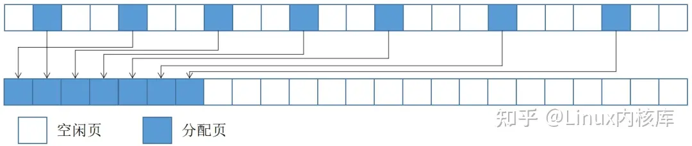
上图中将一个页移动到另一个页的过程叫页迁移，这并不是一件轻松的事情，数据的拷贝、进程映射信息更改等等都很耗时并且也是个复杂逻辑，这注定内存规整的过程是一个重负载的过程。事实上，页迁移是内存管理的独立逻辑，内核对此单独封装接口migrate_pages，内存规整只是其中一个应用场景，类似场景还有NUMA Balance、Memory hotplug及CMA内存等等。本文聚焦内存规整，不描述内存迁移逻辑。

站在开发者角度有了内存迁移基础能力，那么就有实现内存规整基础，但依然有值得思考的问题，比如内存规整的范围，何时进行内存规整等等。

对于内存规整范围问题，内核通常选择以zone为单位进行规整（实际范围受到参数影响可能为zone一部分），并为此封装compact_zone接口，作为内存规整核心接口（alloc_contig_range例外）。

对于何时触发问题，属于触发策略和场景问题，内核当前引入直接内存规整、被动内存规整、预应性内存规整及主动内存规整四种策略场景，这些场景最终都会通过compact_zone进行内存规整，但是他们触发的时机不同、目标不同、规整范围不同、规整退出条件不同，规整强度不同等等。基础能力和策略分离设计是内核的基础设计理念。
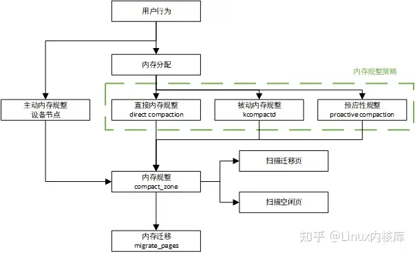
如上图所示，内存规整是基于内存迁移实现的功能，内核根据策略在不同实际触发内存规整，用于缓解内存外部碎片问题，可以分层分析看待内存规整。
## 2.内存规整场景
前言中已说明内核当前触发内存规整的策略有四种，为便于查看和直观理解，优先罗列四种场景特点，见下表：
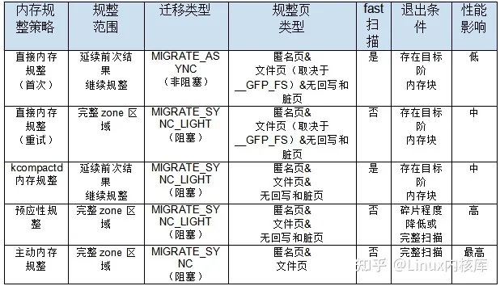
上述表格中各规整策略详见2.1~2.4节描述，compact_control各种含义，详见3.1节描述。

FAQ：

（1）直接内存规整较为特殊，内存分配过程中如果触发直接内存规整依然无法分配内存，那么有可能循环调用并且提高内存规整的级别，因此出现首次和重试之分。

（2）规整页类型中不包含不可回收页，除非通过sysctl_compact_unevictable_allowed进行设置。

（3）内存规整中有一个特例就是alloc_contig_range函数，该函数用于分配指定地址区域内存，若这部分内存被占用，会尝试对这段内存进行规整迁移，其并非针对zone的规整，而是针对指定内存区域的规整，它的规整类型与主动内存规整类似，其实现核心是内存规整机制，本文不对此逻辑进行说明。
### 2.1 直接内存规整（direct compaction）
#### 2.1.1 直接内存规整触发条件
伙伴系统分配内存时，会先以low水线为基准调用get_page_from_freelist函数尝试进行内存分配，如果失败则会进入慢速内存分配流程，即__alloc_pages_slowpath函数，我们对此函数逻辑稍作删减，内容如下：
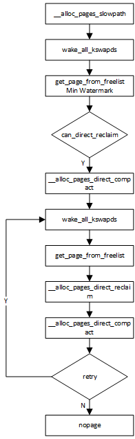
慢速内存分配，会尝试唤醒kswapd进行内存回收，但并不会等待内存回收的结果，而是直接先调用get_page_from_freelist函数尝试内存分配，但这次不同的是使用min水线进行尝试，如果依然失败，那么将会根据gfp标识确认当前分配是否支持直接内存回收，若支持，将会调用__alloc_pages_direct_compact尝试第一次直接内存规整以及内存分配。如果依然失败，则进入唤醒kswapd、get_page_from_freelist、__alloc_pages_direct_reclaim及__alloc_pages_direct_compact循环调用流程里面来，当然这之中存在众多条件判断随时可能返回页分配失败、页分配成功、重试甚至是触发OOM。值得注意的是在慢速内存分配逻辑中，首次调用直接内存规整时其优先级设置为INIT_COMPACT_PRIORITY，这将影响内存规整触发页迁移的类型，比如INIT_COMPACT_PRIORITY对应的就是MIGRATE_ASYNC即异步迁移类型代表页迁移时不会阻塞，当然这样带来的效果就是规整或迁移的能力较弱。慢速内存分配逻辑中后续直接内存规整调用其规整优先级可能会逐步降低（越低对应规整强度越高）从而提升内存规整效用，但是内存规整可能变为阻塞规整，这是相互对应逻辑。

通过上述描述，可以初步了解直接内存规整起到的作用，也可以感受到内核内存分配进入到慢速分配逻辑后性能的代价。

另一方面，直接内存规整实际是由于伙伴系统无法分配内存时触发，因此直接内存规整目标并也并非消除整个zone的外部碎片，而只是通过内存规整迁移出目标阶连续内存。
#### 2.1.2 直接内存规整逻辑说明
__alloc_pages_direct_compact函数是直接内存规整运行入口，该函数核心内容如下：
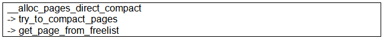
try_to_compact_pages函数将会进一步调用compact相关流程进行规整，规整完成后调用get_page_from_freelist进行内存分配。try_to_compact_pages核心代码逻辑如下：
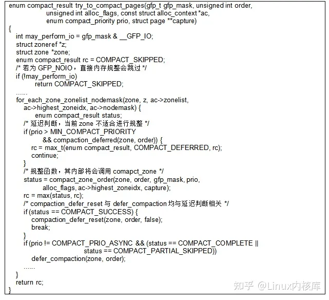
try_to_compact_pages函数核心，遍历规定范围内zone，针对每个zone调用compaction_deferred确认其是否合适进行规整，若合适进一步调用compact_zone_order函数进行规整，规整成功则直接内存规整将会直接返回。在try_to_compact_pages函数中我们重点说明一下zone延迟判断逻辑，这部分逻辑同样适用于后续kcompactd对于zone的判断。
##### 2.1.2.1 延迟规整
compaction_deferred函数用于判断当前zone是否需要进行延迟处理，延迟的目的是避免频繁或无效的内存规整，其引入两个机制用于延迟，一个是内存规整失败阶判断，另一个是内存规整延迟次数判断（这更像一种计时器）。
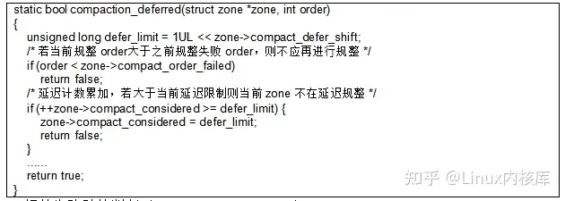
1. 规整失败阶的判断（compact_order_failed）

如果当前规整阶大于等于zone的最大规整失败阶，那么代表当前再去规整失败的可能性很高，建议延迟对当前zone规整。

2. 内存规整延迟次数超阈值判断

如果失败阶判断满足，那么会对延迟次数进行判断，compact_considered记录了当前zone延迟次数，compaction_deferred每次调用时compact_considered都会累加，如果其小于阈值，那么建议zone不进行规整，标识近期可能已经进行过规整。
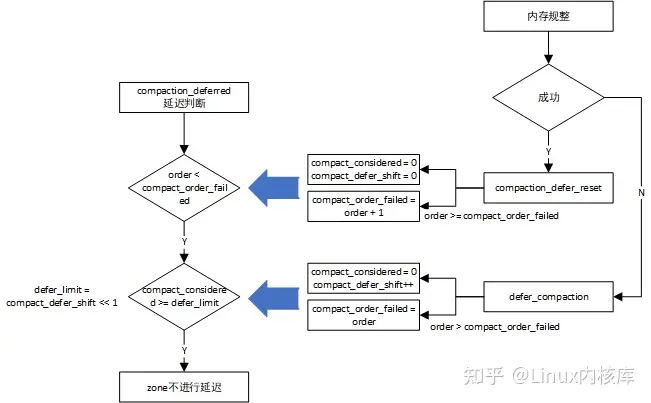
可以想象到，延迟判断的这些参数会动态变化，实际如上图所示。

1. 当内存规整成功时，调用compaction_defer_reset函数清空compact_considered延迟计数，清空compact_defer_shift延迟计数阈值（defer_limit = compact_defer_shift << 1），同时如果当前order大于等于compact_defer_shift ，则更新compact_order_failed最大规整失败阶。

总结，当规整成功时，会降低此zone延迟标准，让后续对zone规整判断变得更为容易。

2. 当内存规整失败时，依然会将compact_considered清零，若order大于更新更新compact_order_failed最大规整失败阶，增大compact_defer_shift延迟计数阈值。

总结，当规整失败时，会增大此zone延迟标准，让后续对zone规整将会延迟更多次。

通过上述延迟方案，确保对于某个zone不做重复规整、不做成功率低的规整，当一次对zone规整失败时，内核将会尽量给与zone足够时间然后再进行尝试。zone延迟判断机制适用于直接内存规整以及kcompactd内存规整机制，这两种机制对于耗时较为敏感，其它场景内存规整通常不需要此机制。
##### 2.1.2.2 capture_control说明

再次回到try_to_compact_pages函数，一个zone在通过延迟判断后，将会调用compact_zone_order函数，该函数核心是定义compact_control并调用compact_zone完成规整。但是这里引入了一个很有意思的机制capture_control，因此需要额外进行说明，这笔修改可见如下内容：

通常的逻辑通过内存规整迁移出目标阶内存块，再进行内存分配，而为了提效capture_control的思路则是在内存规整的过程中就将内存分配出来，只不过这个分配更像是截胡，在直接内存规整的过程中，若发生内存释放，则在伙伴系统内存释放逻辑中截胡合适的内存，下面详细说明这个过程。
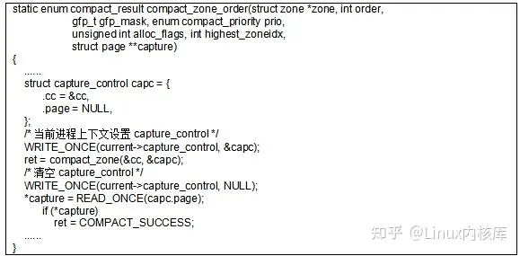
在compact_zone_order函数会填充capture_control变量，并将其赋值给当前进程上下文，标志着当前进程进入到直接规整逻辑里面。可以想象在内存规整过程中涉及内存释放，此时capture开始行动，代码如下：
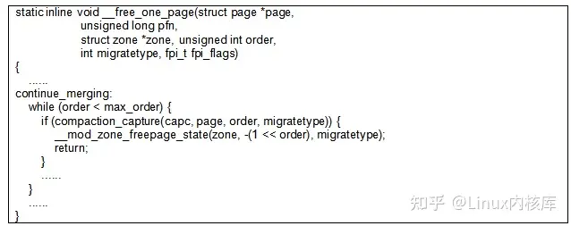
内存释放流程中通过compaction_capture尝试捕获已释放的内存，compaction_capture函数代码实现如下：
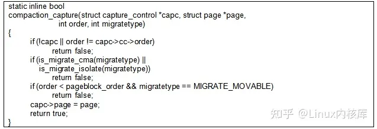
释放内存阶必须与直接内存规整阶相等才有可能捕获，同时需要强调如果当前释放的是MIGRATE_MOVABLE类型页尽量不去捕获，避免污染可移动页面，因为触发直接规整的有可能是不可移动的内存请求。
#### 2.1.3 直接内存规整特点
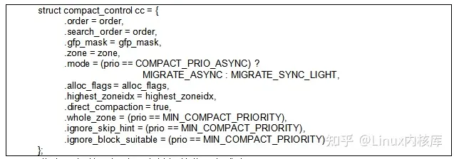
（1）指定了规整目标阶，降低规整范围和难度；

（2）迁移页扫描器和空闲页扫描器，使用快速扫描能力；

（3）其指定highest_zoneidx和目标阶，因此存在水线判断。

（4）direct_compaction设置直接规整标识；

直接内存规整优先级COMPACT_PRIO_ASYNC逐步升高，内存规整强度将会增强，内容如下：

（5）随着规整失败，规整模式MIGRATE_ASYNC变为MIGRATE_SYNC_LIGHT，即直接内存规整可能是不阻塞也可能是阻塞模式；

（6）随着规整失败，规整范围从根据上次规整结果制定范围变为完整zone地址范围；

（7）随着规整失败，pageblock将会被重新扫描，不会根据标记skip，逐步加强规整强度；

（8）随着规整失败，空闲页扫描器将变得严格，空闲页必须来自于MIGRATE_MOVABLE和MIGRATE_CMA可移动的页面；

上述compact_control结构体参数含义见3.1节；
### 2.2 被动内存规整（kcompactd）
内核在启动过程中会调kcompactd_init函数，为每个node启动一个kcompactd内核线程，并且kcompactd线程会运行在与node相对应的CPU核上，在合适的时机kcompactd将会被唤醒进行内存规整，这就是被动内存规整逻辑。一个特殊场景是若开启proactive compaction功能，那么kcompactd会被周期性唤醒。

本节主要从三个方面说明，分别是kcompactd唤醒条件、kcompactd运行条件、以及kcompactd内存规整特点（kcompactd被唤醒不一定会进行内存规整）。
#### 2.2.1 kcompactd唤醒条件
内存规整模块向内核提供wakeup_kcompactd口用于唤醒node对应的kcompactd线程，内核中kcompactd唤醒与kswapd强相关，总结如下场景会被被动唤醒：
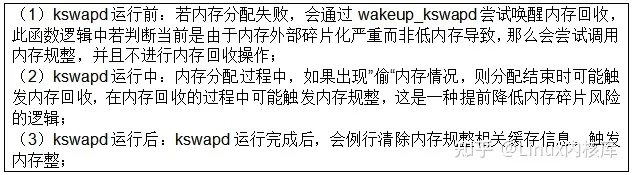
FAQ：这里指的触发内存规整，指的是调用wakeup_kcompactd函数，未必真的进行内存规整，wakeup_kcompactd还存在诸多判断；
##### 2.2.1.1 kswapd运行前触发内存规整
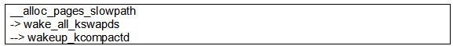
当内存分配失败时经各种判断后，会进⼊内存慢速分配过程，此时伙伴系统将尝试唤醒内存回收，在这个过程中，有如下关键代码：
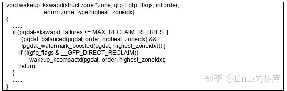
上述代码为未唤醒kswapd前进行内存规整的条件判断，其意图如下：

（1）kswapd内存回收失败多次；

（2）根据pgdat_balanced函数判断当前水位安全，即存在⾜够可⽤内存并且未出现”偷“内存情况；本质在于，当前内存无法分配的原因并非低内存，此时内存回收可能已经无法解决此问题时，wakeup_kswapd函数将会提前进行内存规整。这里还需要说明的是，内存分配指定不支持直接内存回收时上述逻辑才能生效，这是因为若支持直接内存规整，则可以借助直接内存回收来进行改善并且通常直接内存规整有更好的性能表现。
###### 2.2.1.2 kswapd运行中触发内存规整
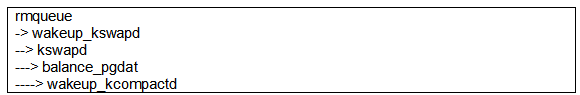
watermark_boost_factor导致的内存规整，归类为kswapd运行中触发内存规整稍有牵强，不过其确实是在kswapd内存规整核心逻辑中触发。这里简单介绍⼀下watermark_boost_factor特性，当分配内存时如果在对应migrate type上没有分配到内存，那么系统将会从fall_back的migrate type进行内存分配，有时将其叫做”偷“，由于分配了不匹配迁移类型的内存，内核会认为这可能存在外部碎片的风险，所以当出现这种”偷“时内核会提前进行内存回收及规整，从而降低后续”偷“行为的发生，避免内存碎片问题，提升内存分配的效率，这就是watermark_boost_factor特性。
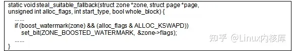
steal_suitable_fallback函数是从其它迁移类型上分配内存的核心逻辑，此函数中会设置⼀个ZONE_BOOSTED_WATERMARK标志位，这个标志位只能被kswapd清除，伙伴系统在内存分配成功后，如果发现ZONE_BOOSTED_WATERMARK被置位，将会唤醒kswapd线程。
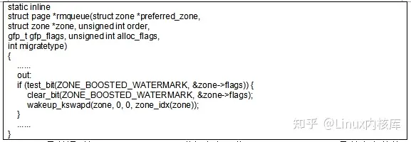
kswapd函数通过调用balance_pgdat进行内存回收，而balance_pgdat函数会在整体内存回收结束后，尝试唤醒kcompactd线程，当然前提是本次内存回收是boosted属性的内存回收。
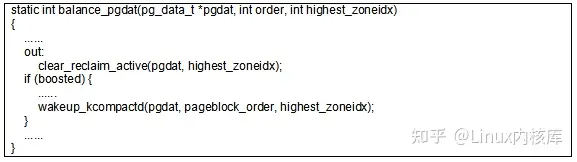
boost特性引起内存规整，其规整阶为pageblock对应阶，在后续compact_zone函数介绍中将会说明其影响。上述仅仅简单描述watermark_boost_factor特性，其还涉及到内存回收时boost导致水线提升等特性，由于其与内存回收关系较大，本文不深入分析，大家可通过如下合入记录进⼀步了解：
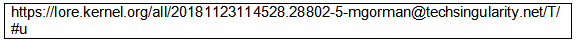
##### 2.2.1.3 kswapd运行后触发内存规整
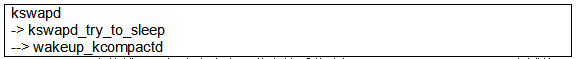
kswapd内核线程，每次在内存回收完毕后将会调⽤kswapd_try_to_sleep尝试休眠，此函数会在休眠前调用reset_isolation_suitable函数清空迁移扫描器和空闲页扫描器扫描过程中产生的缓存数据（比如某个pageblock是否需要跳过信息等等），随后调用wakeup_kcompactd函数尝试进行内存规整。

简单说，每次kswapd运行完成后都会尝试唤醒内存规整线程，但是内存规整线程是否真的需要运行，其有复杂的判断逻辑。
#### 2.2.2 kcompactd运行条件
当kcompactd线程运行时，若当前是非预应性规整（详见2.3节），那么将会调用

kcompactd_do_work函数进行被动内存规整。kcompactd_do_work函数会遍历当前node的所有zone进行合法性判断，若符合条件，则调用compact_zone针对zone进⾏内存规整，其对zone的判断逻辑如下：
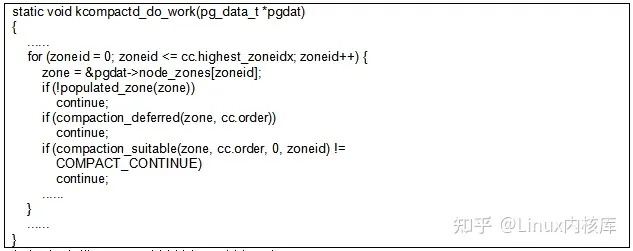
根据上述代码，可以总结如下判断逻辑：

A. zone是否包含有效物理页，若不包含，不需要规整；

B. 当前规整目标阶是否大于等于之前规整失败的最小阶，若大于不需要规整；

C. 是否需要延迟规整，若延迟次数超过阈值则须规整，否则不规整，避免无效规整；

D. 当前内存水线是否满足内存申请，若满足则不规整；

E. 若当前order大于3同时不满足内存分配，则评估其内存碎片程度，若小于阈值，则不规整；其中，populated_zone函数仅仅判断当前zone是否存在有效物理页，其它逻辑在compaction_deferred和compaction_suitable函数中实现。
##### 2.2.2.1 延迟规整
在直接内存规整中已经介绍了延迟判断的逻辑，对于kcompactd同样使用，下述代码可以看到其对延迟参数的更新逻辑。
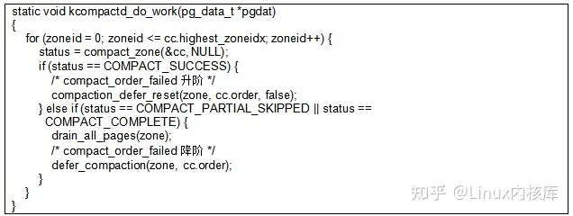
如果comapct_zone返回值是由于扫描器相遇导致（一轮扫描结束），而非规整目标达成导致，代表规整并未达成目标，同样按照失败处理。
##### 2.2.2.2 水线判断
compaction_suitable函数一方面通过__compaction_suitable判断水线是否满足当前order阶内存分配要求，若满足则当前zone不需要规整；另一方面，通过fragmentation_index函数获取当前zone对于order阶内存块碎片程度评估，如果认为碎片程度不高，则不进行规整。先来分析__compaction_suitable函数，此函数用于评估当前水线是否满足内存分配，若不满足，则评估水线是否满足内存规整过程中内存占用需求，关键实现如下：
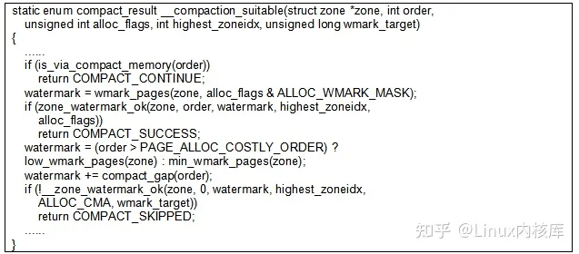
此函数中，调用两次__zone_watermark_ok进行水线判断，__zone_watermark_ok函数功能是判断当前zone在分配order阶内存块后水线是否达标。第一次水线检查成功，代表当前zone可以满足内存分配诉求，因此当前zone不用规整。若第一次调用失败，则尝试第二次判断，第二次水线判断的目的是确认内存规整过程中是否可能存在水线问题，因为内存规整过程中需要order阶空闲页用于内存迁移。因此第二次水线的判断，仅对0阶内存判断，因为迁移过程中申请空闲页都是单页，另一方面watermark增加order阶内存块代表迁移内存占用，但是需要注意的是理论上迁移只需要order阶大小的内存，但是实际watermark增加了2倍order阶大小的内存（compact_gap函数），这是由于实际内存规整过程中由于迁移页扫描器可能扫描出大于order阶待迁移内存，因此空闲页扫描器也会占用大于order阶空闲页，为了确保评估的安全性，改为2倍order阶内存，这部分说明在compact_gap函数内部注释中有所描述。
##### 2.2.2.3 各阶碎片评分判断
fragmentation_index函数用于获取目标阶碎片程度评价，从而评估当前内存无法分配的原因是由于低内存还是外部碎片导致。
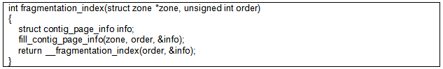
其中fill_contig_page_info会遍历zone内存，统计当前空闲页以及对应order阶空闲区域数量，此函数下文将会详细介绍，最后通过__fragmentation_index函数和上述遍历空闲页获得的相关信息进行计算评估。代码中计算公式如下：
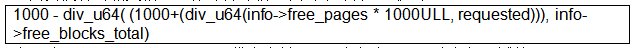
先明确info->free_blocks_total代表当前zone中各个order阶内存区域数量，info->free_pages代表当前zone中空闲页的数量，requested代表order阶对应页数量。我们命名info->free_pages/requested为target_order_blocks，在当前空闲页状态下若不存在内存碎片问题这种理想状态下拥有多少个order阶内存块，现在重新简化公式，即可获得如下描述：
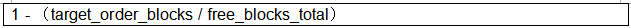
极限状态info->free_blocks_total非常大时，意味着严重的内存碎片问题，上述值趋近于1，反之0代表内存不足问题。__fragmentation_index函数引入1000这个数值参与运算是为了避免小数，导致返回值不易判断，现在引入此值后，使函数返回值落入-1000，0~1000范围中，其中-1000场景较为特殊，其代表当前zone满足内存分配需求，但是在此之前却通过了上文中__compaction_suitable函数的判断，当前-1000返回值实际在代码中似乎并未被使用。重点还是回到0~1000返回值，那么数值越大代表对于当前order阶内存块而言碎片程度越高，难以分配。

再回到compaction_suitable函数，有两个关注点，一个是对于内存分配阶大于3的申请才会利用fragmentation_index进行额外判断（对于较小内存需求评估其内存碎片程度意义降低，例如单页内存分配，伙伴系统基本分配单元，就不涉及内存外部碎片问题）；另一个是，fragmentation_index返回值需要和sysctl_extfrag_threshold阈值进行比较，如果小于阈值，则不进行规整，此值通过/proc/sys/vm/extfrag_threshold进行设置。

FAQ：基于上述逻辑，内核中可以通过/sys/kernel/debug/extfrag/extfrag_index文件节点查看各个阶外部碎片评估数据，其数值对1000取余为小数，越趋近于1，代表当前order阶内存碎片程度高，相关代码如下：
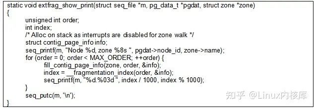
#### 2.2.3 kcompactd规整特点
内存规整的特点还是需要从其配置compact_control来进行说明，下述代码为kcompactd规整CC设置。
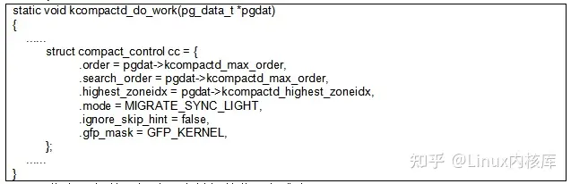
（1）指定了规整目标阶，降低规整范围和难度；

（2）迁移页扫描器和空闲页扫描器，使用快速扫描能力；

（3）其指定highest_zoneidx和目标阶，因此存在水线判断。

（4）规整模式为MIGRATE_SYNC_LIGHT，轻度同步模式，会阻塞；

（5）规整范围从根据上次规整结果继续规整；

（6）pageblock将会根据标记选择跳过，避免频繁扫描；

上述compact_control结构体参数含义见3.1节；
### 2.3 预应性内存规整（proactive compaction）

这属于新增内存规整特性，其最初目的是降低大页分配延迟，通过大页内存块碎片程度决策当前是否启动内存规整，提前减少内存碎片，提升大页分配性能。以下链接对此特性做了原理性说明：
https://lwn.net/Articles/817905/
实际最终代码与上文的最初设想已不相同，下文将依据代码说明，代码合⼊记录如下：
https://lore.kernel.org/all/20200616204527.19185-1-nigupta@nvidia.com/T/#u
#### 2.3.1 触发预应行规整
预应性规整并非独立存在，其融⼊kcompactd内核线程，但又与kcompactd原有功能互斥。关键代码如下：
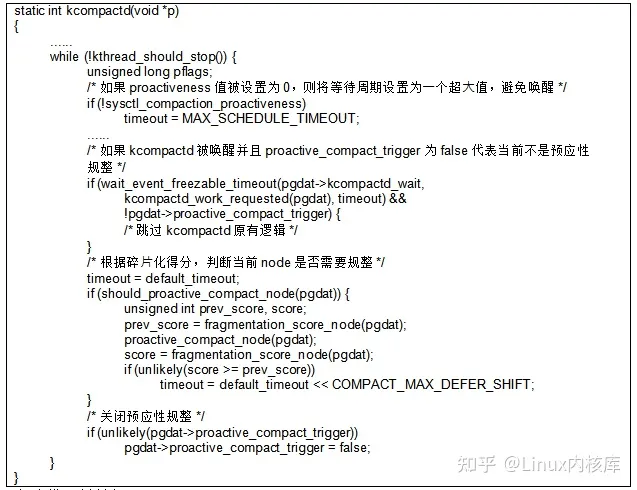
上述代码总结如下：

（1）若设置预应性规整，kcompactd将会每500ms（HPAGE_FRAG_CHECK_INTERVAL_MSEC宏设置）唤醒判断当前是否需要进行规整；

（2）若设置预应性规整，则会跳过kcompactd原有逻辑，调用预应性规整判断及规整逻辑；

（3）预应性规整触发的依据是根据整个node的碎片化程度决策；

（4）预应性规整会在规整前后统计碎片得分，若得分增加，达标碎片问题未解决，那么会增加kcompactd唤醒周期，避免频繁无效的预应性规整；

（5）每轮循环后，均会关闭预应性规整，这是考虑到在某些嵌入式场景下并不需要频繁的唤醒并判断，将启动预应性规整策略交给用户层，如下合入增加了这个功能：
https://lore.kernel.org/all/1627653207-12317-1-git-send-emailcharante@
http://codeaurora.org/T/#u
预应性规整在内核中引入vm.compaction_proactiveness文件节点，可以向其写入0~100数值，其用于指定预应性规整的积极性，数值越大积极性越高（见2.3节），如果设置为0相当于关闭，设置此数值时，pgdat->proactive_compact_trigger将会被设置为true，预应性内存规整功能打开，此节点实现不过多描述。
#### 2.3.2 碎片程度评估
预应性内存规整的碎片化评价，实际是对大页碎片程度的评价，其本身也是为了解决大页分配延迟而产生，与上文各order阶内存碎片评估方式不同，目前也并不针对其它order阶内存，通过如下代码进⾏定义：
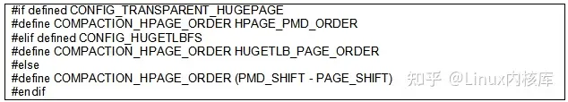
即便未开启大页功能，COMPACTION_HPAGE_ORDER通常也会被设置为9，代表要预应性内存规整主要是针对2MB内存碎片程度进行评估，下面从最顶层代码进行说明。

##### 2.3.2.1 should_proactive_compact_node

should_proactive_compact_node 函数计算当前node碎片程度，当然是针对

COMPACTION_HPAGE_ORDER阶内存块，其将会对每个zone进行评估得分，并将所有zone所得分数累加，获得最后得分。此得分如果高于预应性规整水线线，代表碎片化程度较高，需要进行预应性规整。之前通过vm.compaction_proactiveness节点设置积极性，将会影响预应性规水线，其值越高，预应性水线值越低，将越容易触发规整。预应性水线判断逻辑如下：
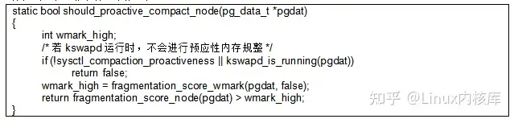
注意，预应性规整是⼀种预操作，应尽可能降低对系统性能影响，因此当kswapd运行时，预应性规整不会启动。

##### 2.3.2.2 fragmentation_score_wmark

fragmentation_score_wmark 函数将会获取当前水线值，当low入参设置为true时，获取的是低水线，否则获取高水线。
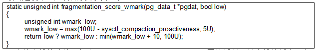
预应性水线的计算不复杂，compaction_proactiveness设置的越低，低水线值越高，高水线通常比低水线高10，但是高低水线都在100数值以内。

##### 2.3.2.3 fragmentation_score_node

fragmentation_score_node函数实现清晰，即针对每⼀个zone计算一个得分，并进行累加，即为node的最后得分。
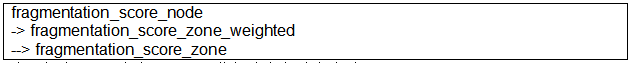
由于每个zone大小不同，因此得分应有对应比重，fragmentation_score_zone_weighted函数完成这个计算，实现方式较为直接。
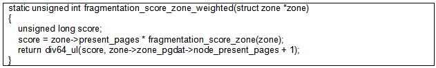
zone碎片评分乘以zone的有效内存页数量，再除以整个node有效内存数量，即为zone碎片程度得分的比重值。(zone有效页数量 / node有效页数量) * zone当前得分简单来说就是按照内存大小重进⾏计算。

fragmentation_score_zone函数用于计算每个zone碎片得分，其实现原理是统计当前zone中⼤于等于COMPACTION_HPAGE_ORDER阶空闲区域的个数，并计算除此之外空闲内存内存与当前zone空闲内存百分比，这个占比可以说明碎片程度，此值越高，说明符合COMPACTION_HPAGE_ORDER阶内存块越少。
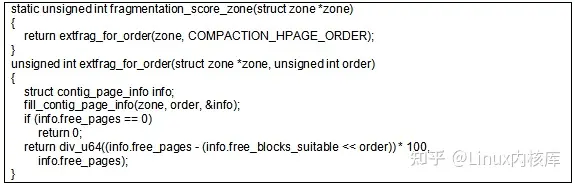
fill_contig_page_info函数用于获取当前zone空闲页、多少个COMPACTION_HPAGE_ORDER阶内存块等等，此函数将会遍历当前zone上所有order的空闲链表进行累加计算，对于order等于COMPACTION_HPAGE_ORDER的阶内存块个数累加，对于order大于COMPACTION_HPAGE_ORDER阶内存块会拆分累加（因为包含多个COMPACTION_HPAGE_ORDER阶空闲内存区），此函数实现并不复杂，不展开描述。

#### 2.3.3 预应性规整特点

经过上述的判断，终于可以开始预应性内存规整，proactive_compact_node函数实现此功能，代码如下：
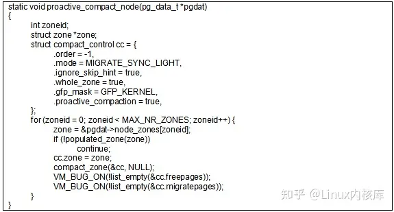
从compact_control结构体的设置可以看出，预应性规整与下文主动规整类似，其指定参数有如下特点：

（1）不指定目标阶，规整持续进行，待扫描结束；

（2）迁移页扫描器和空闲页扫描器，不使用快速扫描能力；

（3）规整模式为MIGRATE_SYNC_LIGHT，轻度同步模式，会阻塞；

（4）规整范围为完整zone地址空间；

（5）pageblock将会不会根据标记选择跳过；

上述compact_control结构体参数含义见3.1节；

### 2.4 主动内存规整

主动内存规整主要是指用户通过设备节点触发完整内存规整或针对node内存规整。内核提供两个设备节点用于触发内存规整。
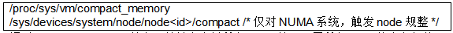
通过compact_memory节点可以触发当前所有node以及下属所有zone的内存规整，这个操作的成本非常高。另一个compact节点只有在NUMA系统上存在，可以仅触发某一个node进行规整。无论如何主动内存规整触发逻辑是简单明了。
#### 2.4.1 主动内存规整特点
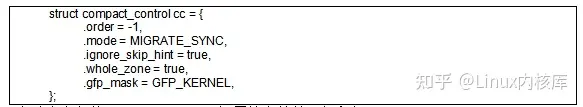
主动内存规整compact_control设置较为简单，解释如下：

（1）不指定目标阶，规整持续进行，待扫描结束；

（2）迁移页扫描器和空闲页扫描器，不使用快速扫描能力；

（3）规整模式为MIGRATE_SYNC，同步模式，会阻塞；

（4）规整范围为完整zone地址空间；

（5）pageblock将会不会根据标记选择跳过；

上述compact_control结构体参数含义见3.1节；

主动内存规整，是内存规整最全面的方法，当然其带来的性能影响也会最大，默认情况下内核并不会触发这类内存规整。

## 3.内存规整
前言中已经简述规整的大致思路，将一些页迁移聚拢，腾出更多连续空间。那么在真正实现时实际需要解决的问题是内存规整范围是什么，如何找到需要迁移的页，什么页适合迁移，规整何时结束等问题。上述的问题最终都在compact_zone函数中被解决。

compact_zone函数针对单个zone内存区进行内存规整，这是内存规整的最小单元。其通过迁移页扫描器从低地址到高地址寻找迁移页，通过空闲页扫描器从高地址到低地址寻找空闲页，最终将扫描出的迁移页迁移至扫描出的空闲页，完成内存规整，如下图所示：

更细节一些来说，内存规整开始后，先通过迁移页扫描器扫描，并且扫描的单位为一个pageblock，将当前pageblock中可迁移的页隔离后放入到待迁移的链表。随后调用空闲页扫描器扫描，空闲页扫描器依然以pageblock为步长，但不再限制扫描一个pageblock，其扫描的目标是找到大于等于当前迁移页数量的空闲页，上述中绿色和黄色箭头长度不同即想表达这个逻辑。上述扫描过程将会产生迁移页和空闲页，用于后续内存迁移，这样就完成了内存规整的一轮操作，可能与大家理解不同，内存规整并非一次性扫描zone然后再迁移，而是以这种一步一步的方式进行迁移，这能平摊内存规整对性能带来的风险，并且每轮处理后都有机会判断当前内存规整是否可以退出。上文描述已经非常清晰勾画了compact_zone函数的核心逻辑，但是实际上实现可能更加复杂，比如什么条件下规整可以提前结束、迁移页扫描器和空闲页扫描器是否可以加速等等，这些都属于更高层面优化的话题，下文将会简述。

再次回到compact_zone函数，将复杂的代码剥离可以很容易得到如下核心代码逻辑：
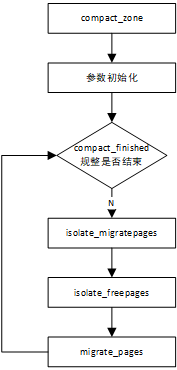
（1）compact_finished函数用于判断当前规整是否结束

（2）isolate_migratepages是迁移页扫描器实现，用于查找需要移动的页；

（3）isolate_freepages是空闲页扫描器实现，用于查找用于页迁移的空闲页；

（4）migrate_pages是页迁移函数，将上述两个扫描器扫描结果进行页迁移处理，完成规整；

至此，compact_zone大体逻辑已经完成说明，下文将会对（1）~（3）函数进行细致描述。

### 3.1 内存规整参数说明

compact_control控制了compact_zone的诸多行为，不同场景触发内存规整诉求不同，因此参数也不同，这里初步罗列常用参数含义，有助于理解不同场景下内存规整的差异。
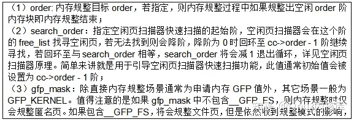
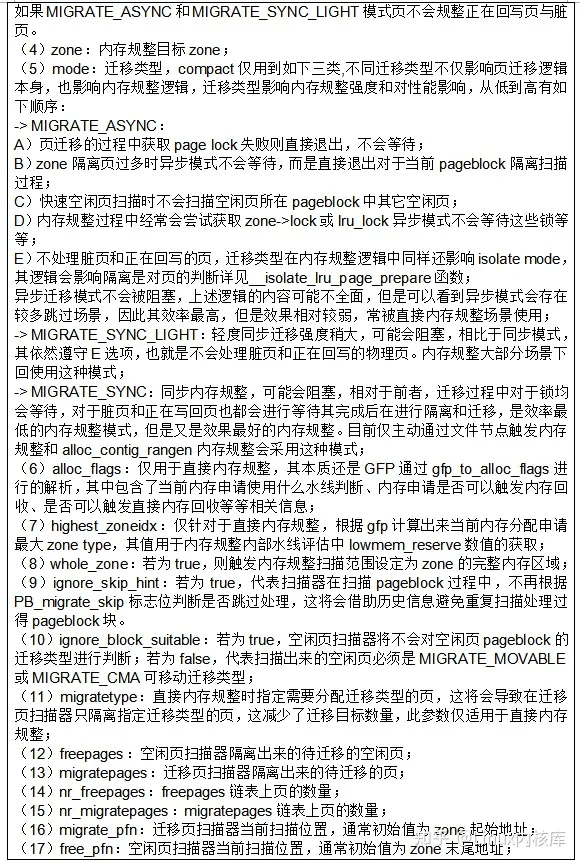
### 3.2 迁移页扫描器（migrate scanner）

isolate_migratepages函数实际就是迁移页扫描器的代码实现，其通常会从低地址到高地址完整或部分扫描zone区域，以pageblock为步长选择一个合适pageblock调用isolate_migratepages_block函数进行内存隔离，需要注意的是isolate_migratepages函数在处理完一个pageblock后就会退出，换句话说此函数一次调用只处理一个合适的pageblock。核心代码如下所示：
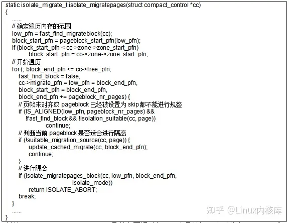
总结一下，isolate_migratepages函数主要通过如下三个函数调用完成整个isolate工作：
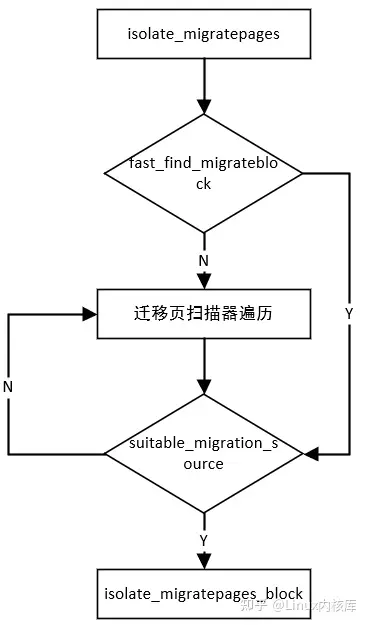
A）快速寻找合适pageblock或返回而迁移扫描起始位置（fast_find_migrateblock）

B）判断pageblock是否合适进行隔离（suitable_migration_source）

C）实际对一个pageblock进行隔离页搜索操作（isolate_migratepages_block）

FAQ：注意若未找到合适pageblock，那么会持续进行线性遍历查找，直到地址超过cc->free_pfn（最开始时此值应为zone地址区域结尾处）。

下面将会对上述三个函数进行解析，完整描述isolate_migratepages函数功能细节。

isolate_migratepages函数会返回三个返回值，内容如下：
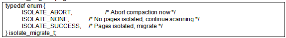
这些返回值将会影响compact_zone函数的返回值。

#### 3.2.1 迁移页扫描器快速扫描

（fast_find_migrateblock）

fast_find_migrateblock函数会尝试快速寻找一个pageblock来进行规整，如果无法找到则返回cc->migrate_pfn（注：此值初始应为zone的起始地址，后续应记录上一次迁移扫描器扫描结束位置避免后续重复扫描）作为起始地址开始遍历，通常考虑不就是从zone内存区域的起始地址寻找一个么，但这样可能并不高效，在之前版本中，迁移页扫描器每次循环确实是基于zone的某个地址开始进行线性遍历，这是一种线性搜索的过程，但是随后引入了如下补丁，改变了这一现状：
https://patchwork.kernel.org/project/linux-mm/patch/20181214230531.GC29005@techsingularity.net/
其目的是尽量选择一个充斥着可移动空闲页pageblock块，这样通过较少页迁移，就可以满足高阶order内存申请需求。通过查找freelist空闲内存块反向查找对应pageblock，这样效率非常高，另一方面，由于pageblock选择不是简单的顺序查找，为了避免后续扫描重复pageblock还需要将其进行单独标识，通过set_pageblock_skip函数完成设置，确保再次进行扫描时会跳过这个pageblock内存块。以上就是主要思路，但是具体在实现上有很多细节比如：

（a）如果规整目标order太小，那么完全没必要去寻找，依然使用cc->migrate_pfn作为起始地址；

（b）由于对于cc->order有要求，因此仅适用于直接内存回收和异步内存回收（仅这两种场景会指定cc->order，其它场景cc->order为-1）；

（c）寻找空闲页所在pageblock必须是在内存搜索范围的前1/2或1/8，这部分是最有可能被迁移页扫描到得区域，避免影响到空闲页扫描；

（d）空闲页扫描会改变free_list布局，尽量保证下次扫描free_list不重复扫描空闲内存块；

（e）若这只cc->ignore_skip_hint，则迁移页扫描器不采用迁移页的fast机制；

（f）仅搜索可移动空闲页，并且搜索范围从order - 1阶开始；

fast_find_migrateblock函数若无法找到合适pageblock，那么将会返回cc->migrate_pages退化为正常线性扫描，请注意的是fast_find_migrateblock函数每次也只找到一个pageblock并设置其为skip，通过上述方式确实在一定程度上能够加速针对目标阶内存规整，能够更快整理出目标阶内存需求，但是对于完整内存规整并无实质效果，因此fast加速查找仅适用于直接内存规整和kcompactd被动内存规整，因为这些场景下通常会指定规整目标阶。核心代码如下：
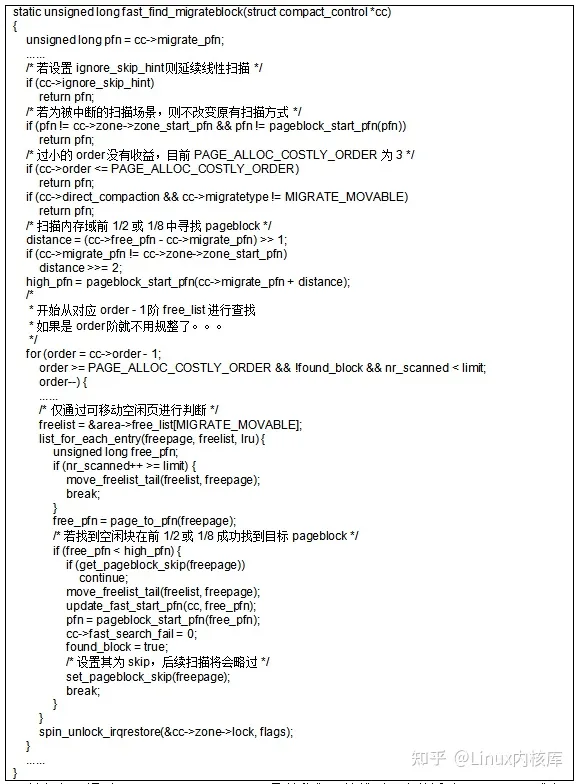
无论如何，通过fast_find_migrateblock函数我们可以找到一个待迁移pageblock或者返回一个迁移页扫描起始地址（cc->migrate_pfn），用于后续针对pageblock内存迁移页扫描使用。

#### 3.2.2 suitable_migration_source函数解析

suitable_migration_source函数用于判断当前pageblock是否可以进行隔离及迁移，这部分逻辑相对简单。
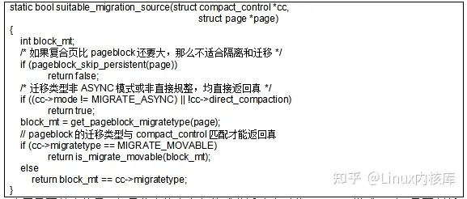
这里需要关注的是，如果非直接内存规整或非迁移类型非ASYNC模式，则不需要判断pageblock迁移类型与compact_control迁移类型是否匹配，尽可能进行内存规整。

#### 3.2.3 pageblock内存隔离（isolate_migratepages_block）

isolate_migratepages_block函数会在单个pageblock内进行遍历，尝试将符合规整要求的页放入对应compact_control所指向的migratepages链表，进行隔离，用于后续页迁移操作。函数整体结构大致如下：
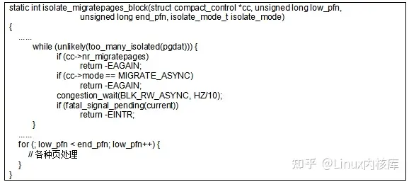
起始会通过too_many_isolated函数检查当前内存节点上是否存在过多isolated页，如果数量过大（isolated > (inactive + active) / 2）那么根据MIGRATE模式选择处理方法，比如对于异步模式就是直接退出，对于同步模式函数将会在这里进行等待一段时间，再循环检查是否合适继续向下执行。随后就是通过for循环开始遍历这个pageblock里面所有页，并对每一个页进行判断，决定其处理方法，这是一个复杂的过程，下文拆分代码进行说明。

##### 3.2.3.1 大页处理

对于大页处理，一般情况下内存规整是会选择略过，不进行整理。处理代码如下：
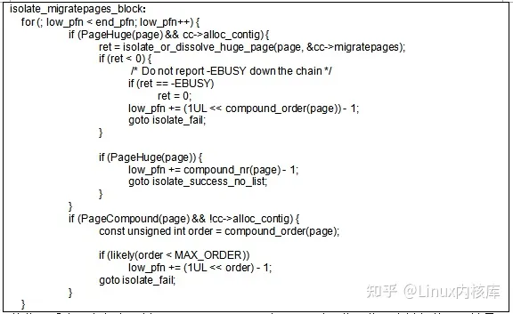
从代码看当页为复合页并且cc->alloc_contig为false时，此页将不会被规整。无论是hugetlbfs和THP大页都属于复合页，那么问题的关键来到cc->alloc_contig是什么？

从代码进一步推进可以看到，通过alloc_contig_range函数进行内存分配时，此函数会指定申请内存地址范围并尽力实现，如果指定范围已经被占用，会尝试触发直接规整进行页迁移，如下代码所示：
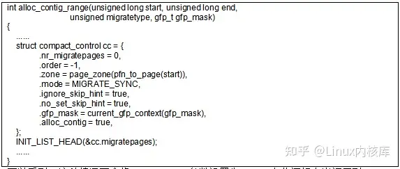
可以看到，这种情况下会将alloc_contig参数设置为true，在此逻辑中当调用到isolate_migratepages_block函数是会尝试规整大页，其实际的做法是通过isolate_or_dissolve_huge_page函数实现大页溶解，这部分涉及大页逻辑不再发散。

总结，只有当页是hugetlbfs大页并且通过alloc_contig_range函数调用下来触发内存规整时才会进行处理，其它场景下大页处理策略都是略过。

##### 3.2.3.2 空闲物理页处理

空闲页的处理为直接跳过，这无可厚非，唯一需要注意的时，空闲页跳过时并非单页跳过，而是根据页的order阶进行跳过，代码如下：

##### 3.2.3.3 non-LRU物理页

这个很有意思，上文谈到大部分可移动页应该都是用户态的匿名页，这里怎么还会有不再LRU上的物理页呢，实际这涉及到页迁移特性的一种功能，有兴趣的朋友可以阅读一下"Documentation/vm/page_migration.rst"文章中"Non-LRU page migration"这一小节。内核中申请的内存通常都是non-LRU上并且不可移动，但是内核提供了定制能力，开发者可以在内核驱动中将自己申请的内存标记为可移动，为此内核为page添加了两个新的flag即PG_movable和PG_isolated用于标识这种non-LRU并且可迁移的页。开发者通常使用__SetPageMovable接口主动设置这些内存页PG_movable标记，而PG_isolated标识此页已经被隔离，开发者不需要主动设置此标记。

现在我们应该可以理解上述代码中对于__PageMovable(page)判断，如果一个non-LRU页被设置了PG_movable并且PG_isolated还未被设置，那么代表这个页也是可以进行迁移，随后将会调用isolate_movable_page函数进行隔离操作。

问题还没有结束，实际想要让这些在内核中直接申请的页变为可迁移，光设置标记还不行，开发人员需要自定义这些页如何隔离以及如何迁移，因此内核要求，开发者需要在address_space_operations结构体里面实现isolate_page、migratepage及putback_page函数。现在回到isolate_movable_page函数，此函数将会调用开发人员注册的isolate_page函数完成这些页隔离操作，代码如下：

##### 3.2.3.4 pinned匿名页

如果匿名页已经被mlock等接口pin住，那么将会略过。

一方面，通过page_mapping判断当前页是否为文件页；另一方面，通过page_count(page) > page_mapcount(page)判断是否被pin住，匿名页被pin住时会增加_refcount数值。

##### 3.2.3.5 GFP_NOFS配置下仅处理匿名页

__GFP_FS表示内存分配过程中可以触发文件操作，如果compact_control中gfp_mask不带__GFP_FS则结果依赖page_mapping返回值，对于匿名页而言page_mapping返回NULL，因此上述代码判断实际的含义是当分配上下文为无__GFP_FS并且是文件页时将会略过，另一方面也可以解释为GFP_NOFS时仅处理匿名页。

那么什么时候compact_control中gfp_mask不带__GFP_FS，前文说明了触发内存回收的场景，在内存分配失败时有可能导致直接触发内存规整，此时内存分配GFP标记将会被赋值到compact_control中用于配置内存规整行为。

##### 3.2.3.6 不同isolate模式会影响页的处理策略

__isolate_lru_page_prepare完成此任务，关键代码如下：

此处逻辑是根据隔离类型筛选可迁移的物理页，隔离类型来源于cc-mode也就是迁移类型，代码如下：

通常，仅当MIGRATE_ASYNC和MIGRATE_SYNC_LIGHT模式时，其隔离模式为ISOLATE_ASYNC_MIGRATE异步模式，在这种模式下其会尽可能避免隔离可能会阻塞页，比如代码中正在回写的页或者是脏页，这里注意如果页为脏页，但是其并非文件页（swap匿名页）或拥有自己migratepage函数那么页被认为迁移过程不会被阻塞，否则都无法隔离。如果isolate_mode为ISOLATE_UNEVICTABLE，代表本次隔离可以处理不可回收页，这个主要是针对那些被lock住的unevictable页，这些页不能够被回收但是支持迁移。

##### 3.2.3.7 修改LRU即真正意义isolate（隔离）

在完成（1）~（6）的判断后，剩下页将能够被隔离，隔离的含义就是将其从LRU链表去除（这个LRU有可能是来自于pglist_data也可能来自于页对应memcg），随后将这些页添加至cc->migratepages，用于后续页迁移。

###### 3.2.3.8 总结

isolate_migratepages_block函数是内存规整过程中页隔离的重要函数，其确定哪些页应该被隔离，哪些页应该被略过，其基本策略如下：

（1）大页不应被隔离，但是alloc_contig_range场景下有可能触发hugetlbfs大页溶解，但这已不属于内存规整场景；

（2）空闲物理页，不会被隔离；

（3）non-LRU物理页，作为在内核分配内存，如果开发者为其实现isolate_page、migratepage及putback_page函数，则可以被隔离或迁移；

（4）被Pin住的匿名页，不会被隔离；

（5）GFP_NOFS分配上下文仅隔离匿名页；

（6）不同isolate模式会影响页的处理策略，比如ISOLATE_ASYNC_MIGRATE不会隔离正在回写的页或脏页；

### 3.3 空闲页扫描器（free scanner）

isolate_freepages函数是空闲页扫描器的核心逻辑，但是compact_zone中对于空闲页扫描器调用并不直接，而是通过migrate_pages间接调用。

migrate_pages是内存迁移的基础接口，其核心功能是将from链表中的页迁移至空闲页，空闲页如何获取则在get_new_page中实现，这是一个函数指针，在compact_zone函数中，此接口的实际调用形态如下：

cc->migratepages就是之前通过isolate_migratepages隔离出来页，compaction_alloc则实现如何获取空闲页，可以想象isolate_freepages函数会在此调用，也是本节分析的重点。compaction_alloc函数并不复杂，其用于为内存规整页迁移时申请迁移的目的内存，代码如下:

cc->migratepages保存了需要进行规整迁移的页，也就是迁移扫描器扫描的结果。

cc->freepages保存了页迁移的目的空闲页，也就是空闲页扫描器扫描的结果。

当cc->freepages为空时，尝试调用空闲页扫描器isolate_freepages函数尝试扫描隔离更多空闲页用于页迁移，为什么要隔离呢？隔离的本质是将其从伙伴分配系统中取出不再参与系统内存分配，仅用于内存规整迁移使用。

isolate_freepages与上文isolate_migratepages函数相对应，用于隔离空闲页，用于页迁移。此函数也是free scanner（空闲页扫描器的核心逻辑）。其实现逻辑也与isolate_migratepages函数相似，核心逻辑大致如下：

isolate_freepages函数，会根据cc->free_pfn开始反向以pageblock为单位进行遍历，如果遇到合适pageblock，则会进一步对pageblock中的页进行遍历，将其中合适的空闲页进行隔离，放入cc->freepages链表中用于后续页迁移使用，当收集的空闲页足够迁移时将会退出。上图仅描述核心逻辑与实际实现有一些出入，比如fast_isolate_freepages机制引入，就会导致上述反向线性遍历的过程改变，但是上图已经比较简要说明了空闲页扫描器的工作原理。

上文从函数调用角度描述isolate_freepages函数逻辑，下文对部分重要函数调用做详细分析。

#### 3.3.1 空闲页扫描器快速扫描（fast_isolate_freepages）

常规情况下，系统通过从cc->free_pfn开始反向遍历寻找一个合适pageblock，随后针对这个pageblock隔离其空闲页。但是这有可能低效，比如第一个pageblock里面并没有多少空闲页，那么针对这个pageblock进行大部分操作都是无效，fast_isolate_freepages就是为改善这个问题，其并不从cc->free_pfn开始进行线性查找，而是借助伙伴系统中free_list快速找到一块合适空闲区域进行隔离，从某种角度看这已经不是基于pageblock的处理了。这与fast_find_migrateblock函数目标类似均为提升扫描器效率。详细代码功能描述如下：

（1）首先选取合适order即cc->search_order，通常开始此值为cc->order - 1；

FAQ：此功能也是应用在直接内存回收和kcompactd场景下，因为其快速搜索的前提是cc->order和cc->search_order。其它场景下触发的内存规整，cc->order为-1，其直接返回cc->free_pfn，也就蜕变为线性搜索的模式；

（2）在order的free_list中进行空闲页的遍历查找；

（3）查找到合适空闲页后，如果空闲页落入图中下图中绿色区域，那么此空闲区域就会被优先隔离，这里注意并非以pageblock为单位进行了（min_pfn为1/2处，low_pfn为3/4处）；

这个逻辑并不复杂，内存规整期望内存向后方迁移，如果空闲页太靠前，极端点，如果空闲页落入红色区域，内存规整扫描器容易快速相遇导致无法解决内存碎片的问题；

那么，如果空闲页落入min_pfn和low_pfn之间，那么系统会降低在当前阶freelist遍历机会，倾向于降阶在新search_order阶的freelist中寻找绿色区域的空闲页；除此以外这种场景下，系统还会记录当前search_order对应freelist搜索记录（这会改变freelist内存块顺序），后续可避免额外搜索，代码如下：

（4）对于（3）已经找到search_order次的空闲区域，将直接调用__isolate_free_page（接口分析详见3.3.2.1节）函数完成隔离，随后将这些页放入cc->freepages链表，完成整个操作；

（5）到这里，已经成功隔离了search_order阶空闲页，这并不针对pageblock，并且对于是否已经满足迁移需求数量也并没有约束，所以在函数末尾调用了fast_isolate_around函数，此函数本质是根据当前需求，确认是否需要针对当前空闲区域所在pageblock再额外进行隔离，代码如下：

简单总结，代码逻辑如下：
如果当前已隔离的绿色区域已经满足诉求，那么此函数将会直接退出，如果不满足，将会尝试将这个空闲区域对应pageblock左侧和右侧区域通过isolate_freepages_block函数进行空闲页隔离。

无论如何，fast_isolate_freepages接口都尝试以更快速的方式获取空闲页，有可能这个空闲页并不是紧贴着cc->free_pfn，但是它一定在后1/4范围内，并且它会改变freelist的结构避免重复判断相同空闲页，这是一个优化功能。对于内存规整若想简单理解，可以忽略此处细节直接理解为从zone末尾开始线性查找。

#### 3.3.2 空闲页隔离（isolate_freepages_block）

isolate_freepages_block函数，即在指定内存范围内正向遍历，将合适的空闲页进行隔离加入到cc->freepages链表，用于后续页迁移，这是isolate_freepages函数得核心函数调用，通常isolate_freepages每次调用会传递一个pageblock范围进行空闲页隔离。关键代码如下：

函数关键逻辑说明：

（1）函数在pageblock内遍历并不一定按照页为单位，参数stride作为步长存在；

（2）复合页将会略过；

（3）非空闲页将会略过；

（4）符合上述要求空闲页通过__isolate_free_page进行隔离操作，随后将这些加入到cc->freepages链表；

（5）如果当前收集空闲页已经大于当前已经收集迁移页则退出循环；

上述即isolate_freepages_block函数的逻辑，这里面需要关注一个strict参数，如果该参数为true，那么isolate_freepages_block函数将会以页为遍历单位进行遍历及隔离，并且不会再根据上述（5）条件提前退出，而是完整隔离整个pageblock中合适的空闲页。

##### 3.3.2.1 伙伴系统处理（__isolate_free_page）

空闲页隔离与迁移页的隔离不太相同，由于空闲页还属于伙伴系统管辖范围内，伙伴体统提供专用隔离接口，即__isolate_free_page函数。

此结构逻辑清晰，不过多赘述。

### 3.4 内存规整退出判断（compact_finished）

compact_finished用于判断当前规整是否结束，有多种不同条件导致规整结束，并且返回值不同，由于compact_finished函数较长并且对于理解内存规整较为重要，因此代码拆分说明。

#### 3.4.1 扫描器相遇

上文说明migrate scanner从正向扫描，free scanner反向扫描，当两者相遇，代表扫描和迁移操作结束，因此规整结束，这是最为正常的一种退出方式，代码如下：

扫描器相遇场景退出，上述代码注释完整标记其逻辑，对于如何判断扫描器相遇，实际根据cc->free_pfn和cc->migrate_pfn的大小容易判断，不进行函数代码说明。

#### 3.4.2 预应性规整退出条件

这里预应性规整除了扫描器相遇退出条件外，拥有额外退出条件。

fragmentation_score_zone和fragmentation_score_wmark均为预应性规整碎片评估函数，简单说当前如果对于大页阶碎片评估分数低于预应性碎片水线时，则停止规整，返回成功。关于预应性规整碎片评估逻辑详见2.3.2节。

#### 3.4.3 direct规整模式额外退出条件

直接内存规整在识别是否成功时，如果判断当前申请需求已满足，并且分配迁移类型也满足一定要求即可退出直接规整逻辑。为何在申请可以满足的情况下还要满足一定要求才能退出呢，主要考虑是即便满足分配，但也不能引入潜在扩大内存碎片化的情况，否则将会频繁进入直接内存规整。

#### 3.4.4 返回值总结

1.COMPACT_CONTINUE：代表内存规整未结束，继续规整；

2.COMPACT_COMPLETE：在cc->whole_zone为true场景下，完成全区域扫描和规整，将返回此值；

3.COMPACT_PARTIAL_SKIPPED：多种场景下均会返回此值，例如：

（1）cc->whole_zone为false场景下，扫描和规整完成，将会范围此值；

（2）在proactive_compaction模式下，如果此时kswapd运行，规整也将会停止，返回此值；

4.COMPACT_SUCCESS：代表规整成功，此值也是多种场景下均会返回：

（1）proactive规整模式下，碎片化得分达标，主动退出规整，即返回成功；

（2）direct规整模式下，需求order阶及迁移类型链表上，已有足量内存，即返回成功；

（3）direct规整模式下，需求order阶上如果有足量CMA内存，前提是本身需求也是可迁移页（否则CMA内存申请时无法迁移），即返回成功；

（4）direct规整模式下，可以从其它迁移类型偷到内存，在满足一定条件下也会范围成功；

5.COMPACT_CONTENDED：若当前进程被强制退出或依然持有zone lock，则规整逻辑返回此值，属于一种异常退出状态；

## 4.内存规整总结
代码分析基本完成，再对内存规整统计信息及可调文件节点进行简要说明。

### 4.1 内存规整统计信息

在上文的代码描述中忽略内存规整相关信息统计逻辑，统计信息可以通过/proc/vmstat文件节点进查询，相关信息含义说明如下：

### 4.2 内存规整文件节点

### 4.3 总结

内存规整是一个较重内存碎片优化措施，在使用时内核较为谨慎，当前有直接内存规整、kcompactd内存规整、预应性内存规整及主动内存规整四种场景，这些场景涵盖在内存分配、内存回收等上下文，由于规整的诉求和紧迫程度不同，其通过compact_control结构体参数控制compact_zone内存规整行为包括但不限于内存扫描范围、页迁移的能力、迁移页是否适合规整及是否可以阻塞等等。

另一方面，内存规整的核心逻辑在于迁移页扫描器（migrate scanner）和空闲页扫描器（free scanner）运作原理，包括哪些页可以作为迁移页或空闲页，何时内存规整结束等等这些直接影响对内存规整理解。


