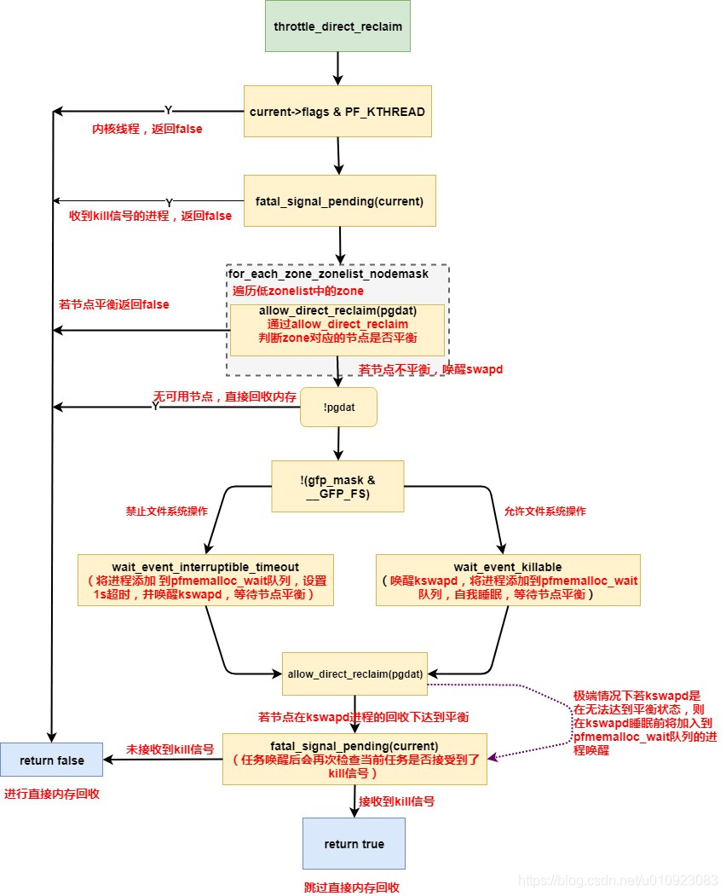

`try_to_free_pages->throttle_direct_reclaim`



**返回False:**

触发条件：

- 当前进程是内核进程或当前进程收到了kill信号

- 内存分配任务对应的最优节点平衡

- 当前进程对应的最优节点不平衡,然后kswapd进程被唤醒用于平衡最优节点,于此同时当前进程被加入到最优节点的pfmemalloc_wait等待队列等待节点达到平衡状态。当kswapd将节点调节到平衡状态后会唤醒被加入到队列中的进程。进程唤醒后继续执行，并再次检查进程是否收到kill信号，若未收到kill信号函数返回False

产生结果：函数退出后进程后续会继续向下执行直接内存回收相关的操作

**返回True:**

触发条件：当前进程对应的最优节点不平衡，同上kswapd被唤醒，进程被加入到等待对列。在进程被唤醒后，若检查到进程收到了kill信号，收到则返回True

产生结果： 函数退出后进程后续不进行直接内存回收，try_to_free_pages函数直接退出并返回1。

```c
/*
 * Throttle direct reclaimers if backing storage is backed by the network
 * and the PFMEMALLOC reserve for the preferred node is getting dangerously
 * depleted. kswapd will continue to make progress and wake the processes
 * when the low watermark is reached.
 *
 * Returns true if a fatal signal was delivered during throttling. If this
 * happens, the page allocator should not consider triggering the OOM killer.
 */
static bool throttle_direct_reclaim(gfp_t gfp_mask, struct zonelist *zonelist,
                    nodemask_t *nodemask)
{
    struct zoneref *z;
    struct zone *zone;
    pg_data_t *pgdat = NULL;

    /*
     * Kernel threads should not be throttled as they may be indirectly
     * responsible for cleaning pages necessary for reclaim to make forward
     * progress. kjournald for example may enter direct reclaim while
     * committing a transaction where throttling it could forcing other
     * processes to block on log_wait_commit().
    内核线程不应被限制，有的内核线程申请到内存后会直接进入内存回收流程
     */
    if (current->flags & PF_KTHREAD)
        goto out;

    /*
     * If a fatal signal is pending, this process should not throttle.
     * It should return quickly so it can exit and free its memory
    进程收到kill信号，进程应快速返回以便释放内存
     */
    if (fatal_signal_pending(current))
        goto out;

    /*pfmemalloc_reserve内存等于每个zone的MIN水位相加，见allow_direct_reclaim
     * Check if the pfmemalloc reserves are ok by finding the first node
     * with a usable ZONE_NORMAL or lower zone. The expectation is that
     * GFP_KERNEL will be required for allocating network buffers when
     * swapping over the network so ZONE_HIGHMEM is unusable.
     *
     * Throttling is based on the first usable node and throttled processes
     * wait on a queue until kswapd makes progress and wakes them. There
     * is an affinity then between processes waking up and where reclaim
     * progress has been made assuming the process wakes on the same node.
     * More importantly, processes running on remote nodes will not compete
     * for remote pfmemalloc reserves and processes on different nodes
     * should make reasonable progress.
     */
    for_each_zone_zonelist_nodemask(zone, z, zonelist,
                    gfp_zone(gfp_mask), nodemask) {
        if (zone_idx(zone) > ZONE_NORMAL)
            continue;

        /* Throttle based on the first usable node */
        pgdat = zone->zone_pgdat;
        if (allow_direct_reclaim(pgdat))
            goto out;
        break;
    }

    /* If no zone was usable by the allocation flags then do not throttle */
    if (!pgdat)    //根据分配flag，若没有可用的zone，则不要节流
        goto out;

    /* Account for the throttling */
    count_vm_event(PGSCAN_DIRECT_THROTTLE);

    /*
     * If the caller cannot enter the filesystem, it's possible that it
     * is due to the caller holding an FS lock or performing a journal
     * transaction in the case of a filesystem like ext[3|4]. In this case,
     * it is not safe to block on pfmemalloc_wait as kswapd could be
     * blocked waiting on the same lock. Instead, throttle for up to a
     * second before continuing.
    调用者不可以进入文件系统，可能是因为调用者持有FS锁，或在EXT3中记录日志，这时在pfmemalloc_wait阻塞是不安全的
    因为kswapd可能因为相同的锁被阻塞，因此阻塞1S
    到这里进程会在zone_pgdat->pfmemalloc_wait上睡眠，等待kswap唤醒（见balance_pgdat），若被唤醒后allow_direct_reclaim判断数位仍然不满足条件
    则会再次唤醒kswap进行内存回收，调用者依然会阻塞
     */
    if (!(gfp_mask & __GFP_FS))
        wait_event_interruptible_timeout(pgdat->pfmemalloc_wait,
            allow_direct_reclaim(pgdat), HZ);
    else
        /* Throttle until kswapd wakes the process */
        wait_event_killable(zone->zone_pgdat->pfmemalloc_wait,
            allow_direct_reclaim(pgdat));

    //到这里说明水位满足条件，若收到kill信号，则会跳过direct_reclaim，否则进行direct_reclaim
    if (fatal_signal_pending(current))
        return true;

out:
    return false;
}
```

`try_to_free_pages->do_try_to_free_pages->shrink_zones->consider_reclaim_throttle`

分析consider_reclaim_throttle

**<mark>pgdat->reclaim_wait作用</mark>**

**kswapd进程第一次扫描**

- shrink_inactive_list中isolate_lru_folios返回nr_taken，表示有多少page被剥离到临时列表

- shrink_folio_list中扫描这个临时页表的页面，遇到有页面正在回写（且这个回写操作不是内存回收引起的），记录nr_writeback并赋值给sc->nr.writeback

- shrink_folio_list返回后shrink_node中 if (sc->nr.writeback && sc->nr.writeback == sc->nr.taken)成立，表明有大量的页在回写，set_bit(PGDAT_WRITEBACK, &pgdat->flags);设置PGDAT_WRITEBACK

**kswapd进程第二次扫描**

- shrink_folio_list中test_bit(PGDAT_WRITEBACK, &pgdat->flags)成立stat->nr_immediate += nr_pages;

- shrink_folio_list返回后shrink_node中if (sc->nr.immediate)成立reclaim_throttle(pgdat, VMSCAN_THROTTLE_WRITEBACK);让kswapd等待一下回写完成

**总结**

一旦pgdat->flags被设置了PGDAT_WRITEBACK，kswap将会计算被标记为立即回收页的数量（记录在sc->nr.immediate中），一旦这个值不为0，则kswapd睡眠等待回写完成
