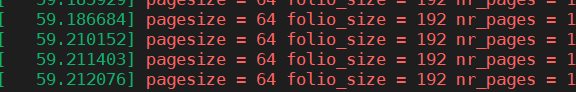
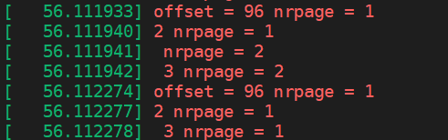
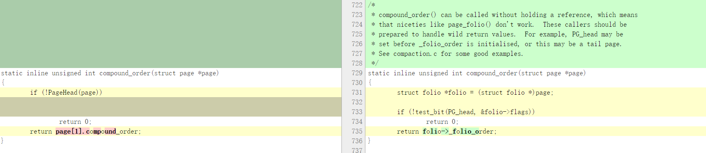
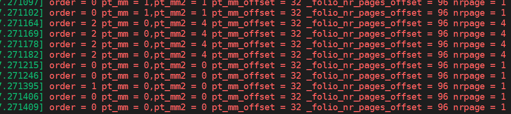
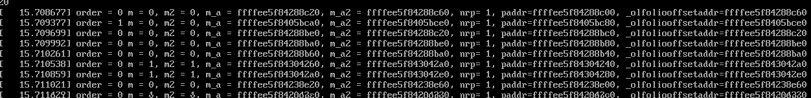
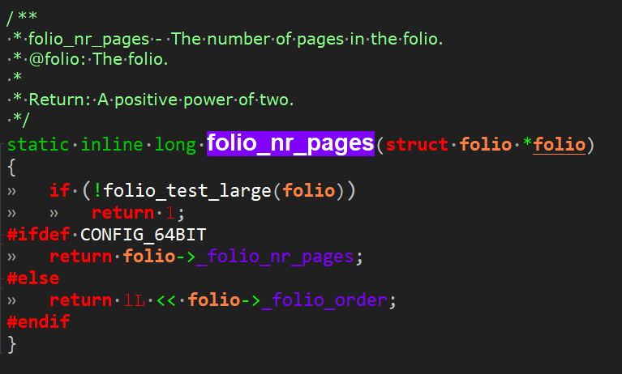

`Makefile:98:obj-$(CONFIG_TRANSPARENT_HUGEPAGE) += huge_memory.o khugepaged.o`

查询 mm/rmap.c Lock ordering in mm:？？？

```c
/**
 * struct folio - Represents a contiguous set of bytes.
 * @flags: Identical to the page flags.
 * @lru: Least Recently Used list; tracks how recently this folio was used.
 * @mlock_count: Number of times this folio has been pinned by mlock().
 * @mapping: The file this page belongs to, or refers to the anon_vma for
 *    anonymous memory.
 * @index: Offset within the file, in units of pages.  For anonymous memory,
 *    this is the index from the beginning of the mmap.
 * @private: Filesystem per-folio data (see folio_attach_private()).
 *    Used for swp_entry_t if folio_test_swapcache().
 * @_mapcount: Do not access this member directly.  Use folio_mapcount() to
 *    find out how many times this folio is mapped by userspace.
 * @_refcount: Do not access this member directly.  Use folio_ref_count()
 *    to find how many references there are to this folio.
 * @memcg_data: Memory Control Group data.
 * @_folio_dtor: Which destructor to use for this folio.
 * @_folio_order: Do not use directly, call folio_order().
 * @_entire_mapcount: Do not use directly, call folio_entire_mapcount().
 * @_nr_pages_mapped: Do not use directly, call folio_mapcount().
 * @_pincount: Do not use directly, call folio_maybe_dma_pinned().
 * @_folio_nr_pages: Do not use directly, call folio_nr_pages().
 * @_hugetlb_subpool: Do not use directly, use accessor in hugetlb.h.
 * @_hugetlb_cgroup: Do not use directly, use accessor in hugetlb_cgroup.h.
 * @_hugetlb_cgroup_rsvd: Do not use directly, use accessor in hugetlb_cgroup.h.
 * @_hugetlb_hwpoison: Do not use directly, call raw_hwp_list_head().
 * @_deferred_list: Folios to be split under memory pressure.
 *
 * A folio is a physically, virtually and logically contiguous set
 * of bytes.  It is a power-of-two in size, and it is aligned to that
 * same power-of-two.  It is at least as large as %PAGE_SIZE.  If it is
 * in the page cache, it is at a file offset which is a multiple of that
 * power-of-two.  It may be mapped into userspace at an address which is
 * at an arbitrary page offset, but its kernel virtual address is aligned
 * to its size.
 */
struct folio {
    /* private: don't document the anon union */
    union {
        struct {
    /* public: */
            unsigned long flags;
            union {
                struct list_head lru;
    /* private: avoid cluttering the output */
                struct {
                    void *__filler;
    /* public: */
                    unsigned int mlock_count;
    /* private: */
                };
    /* public: */
            };
            struct address_space *mapping;
            pgoff_t index;
            void *private;
            atomic_t _mapcount;
            atomic_t _refcount;
#ifdef CONFIG_MEMCG
            unsigned long memcg_data;
#endif
    /* private: the union with struct page is transitional */
        };
        struct page page;
    };
    union {
        struct {
            unsigned long _flags_1;
            unsigned long _head_1;
    /* public: */
            unsigned char _folio_dtor;
            unsigned char _folio_order;
            atomic_t _entire_mapcount;
            atomic_t _nr_pages_mapped;
            atomic_t _pincount;
#ifdef CONFIG_64BIT
            unsigned int _folio_nr_pages;
#endif
    /* private: the union with struct page is transitional */
        };
        struct page __page_1;
    };
    union {
        struct {
            unsigned long _flags_2;
            unsigned long _head_2;
    /* public: */
            void *_hugetlb_subpool;
            void *_hugetlb_cgroup;
            void *_hugetlb_cgroup_rsvd;
            void *_hugetlb_hwpoison;
    /* private: the union with struct page is transitional */
        };
        struct {
            unsigned long _flags_2a;
            unsigned long _head_2a;
    /* public: */
            struct list_head _deferred_list;
    /* private: the union with struct page is transitional */
        };
        struct page __page_2;
    };
};


/**
 * struct folio_batch - A collection of folios.
 *用于分摊检索和操作一组folio的成本
 * The folio_batch is used to amortise the cost of retrieving and
 * operating on a set of folios.  The order of folios in the batch may be
 * significant (eg delete_from_page_cache_batch()).  Some users of the
 * folio_batch store "exceptional" entries in it which can be removed
 * by calling folio_batch_remove_exceptionals().
 */
struct folio_batch {
    unsigned char nr;
    bool percpu_pvec_drained;
    struct folio *folios[PAGEVEC_SIZE];
};
```

**问题1：每个folio包含的page数量是否一样？？？**

```c
/*
Pull memory folios from Matthew Wilcox:
 "Add memory folios, a new type to represent either order-0 pages or the
  head page of a compound page. This should be enough infrastructure to
  support filesystems converting from pages to folios.

  The point of all this churn is to allow filesystems and the page cache
  to manage memory in larger chunks than PAGE_SIZE. The original plan
  was to use compound pages like THP does, but I ran into problems with
  some functions expecting only a head page while others expect the
  precise page containing a particular byte.

  The folio type allows a function to declare that it's expecting only a
  head page. Almost incidentally, this allows us to remove various calls
  to VM_BUG_ON(PageTail(page)) and compound_head().

  This converts just parts of the core MM and the page cache. For 5.17,
  we intend to convert various filesystems (XFS and AFS are ready; other
  filesystems may make it) and also convert more of the MM and page
  cache to folios. For 5.18, multi-page folios should be ready.

  The multi-page folios offer some improvement to some workloads. The
  80% win is real, but appears to be an artificial benchmark (postgres
  startup, which isn't a serious workload). Real workloads (eg building
  the kernel, running postgres in a steady state, etc) seem to benefit
  between 0-10%. I haven't heard of any performance losses as a result
  of this series. Nobody has done any serious performance tuning; I
  imagine that tweaking the readahead algorithm could provide some more
  interesting wins. There are also other places where we could choose to
  create large folios and currently do not, such as writes that are
  larger than PAGE_SIZE.

  I'd like to thank all my reviewers who've offered review/ack tags:
  Christoph Hellwig, David Howells, Jan Kara, Jeff Layton, Johannes
  Weiner, Kirill A. Shutemov, Michal Hocko, Mike Rapoport, Vlastimil
  Babka, William Kucharski, Yu Zhao and Zi Yan.

  I'd also like to thank those who gave feedback I incorporated but
  haven't offered up review tags for this part of the series: Nick
  Piggin, Mel Gorman, Ming Lei, Darrick Wong, Ted Ts'o, John Hubbard,
  Hugh Dickins, and probably a few others who I forget"
*/
```












