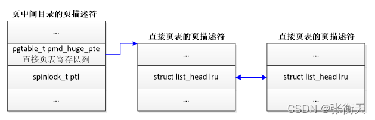
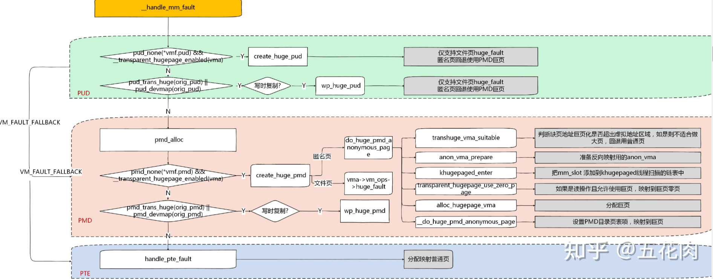
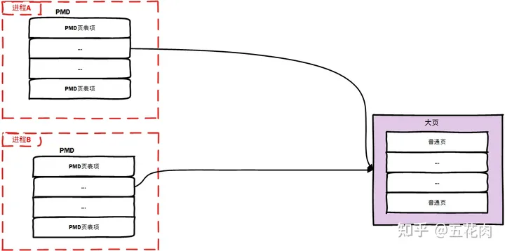
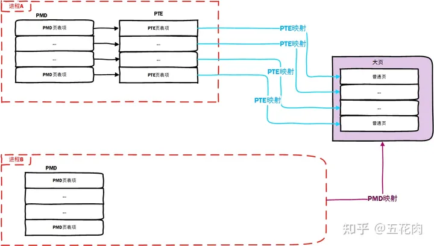
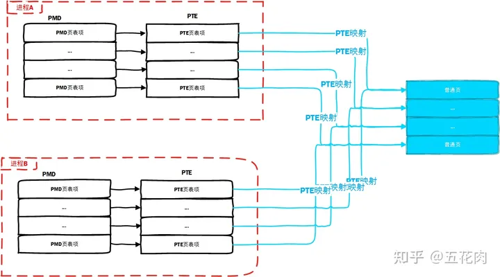
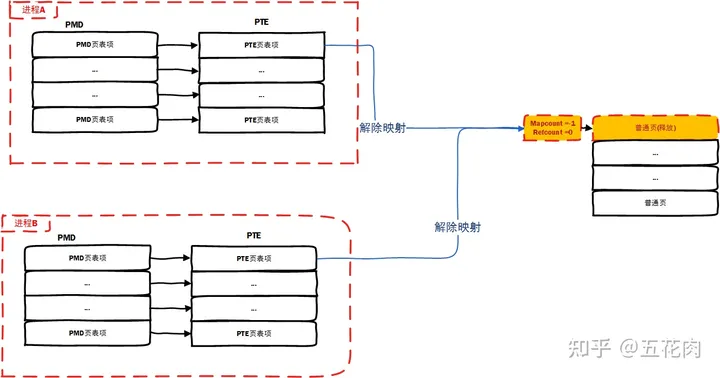
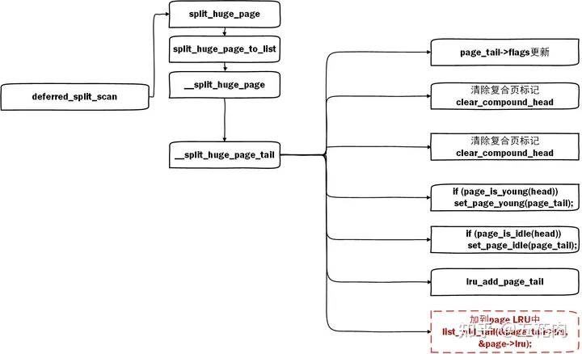
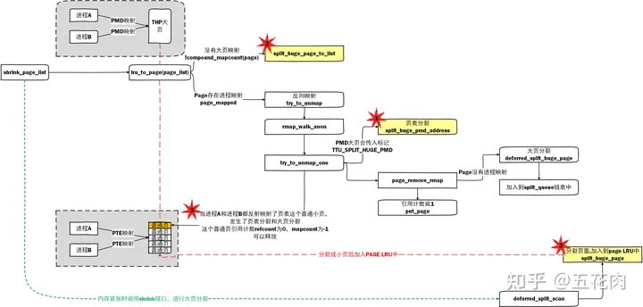

**hugepage_vma_check**

虚拟内存区域vm_area_struct的成员vm_flags增加了以下两个标志：

（1）VM_HUGEPAGE表示允许虚拟内存区域使用透明巨型页，进程使用madvise (MADV_HUGEPAGE)给虚拟内存区域设置这个标志。

（2）VM_NOHUGEPAGE表示不允许虚拟内存区域使用透明巨型页，进程使用madvise(MADV_NOHUGEPAGE)给虚拟内存区域设置这个标志。

注意：标志VM_HUGETLB表示允许使用标准巨型页。

**虚拟内存区域满足以下条件才允许使用透明巨型页。**

（1）以下条件二选一。

1）总是使用透明巨型页。

2）只在进程使用madvise(MADV_HUGEPAGE)指定的虚拟地址范围内使用透明巨型页，并且虚拟内存区域设置了允许使用透明巨型页的标志。

（2）虚拟内存区域没有设置不允许使用透明巨型页的标志。

**问题1：什么样的页会被合并成透明巨页**

（1），如果PMD表项指向PTE，至少一个页有写权限，并且至少一个页刚刚被访问过，那么调用函数collapse_huge_page，把普通页合并成巨型页。如果全部是只读页，或者最近都没有访问过，<u>那么不会合并成巨型页</u>

**问题2：PTE寄存队列**

分配巨型页的时候，会分配PTE页表，把PTE页表添加到pmd_pgtable_page(pmd)->pmd_huge_pte中。当释放巨型页的一部分时，巨型页分裂成普通页，需要从pmd_pgtable_page(pmd)->pmd_huge_pte取一个直接页表。每个PMD页表，包含好多个页表项，每次建立PMD透明巨页时候，都会申请一个PTE页表加入寄存队列，split时候取出来用，

pgtable_trans_huge_withdraw与pgtable_trans_huge_deposit

<mark>**透明大页分裂过程**</mark>

split_huge_pmd这个函数就是只切分一个进程里大页的映射,其他进程里同样的内存空间还可能是大页映射,其他进程是仍然可以享受大页带来的收益

分裂前：

分裂后

拆分页表最终的目的也是为了拆分大页，这样在系统内存不够时可以回收大页中没有使用的部分。最终通过split_huge_page_to_list函数实现拆分大页

进程页表分裂后，其实还是没能进行内存回收。当进程B也发生的页表分裂，那么由于THP大页没有大页映射，会在内存回收时拆分大页。如下所示：

当反向映射时，映射的进程都对某个普通页解除映射后，page的mapcount等于-1，refcount等于0，就可以进行释放了。

