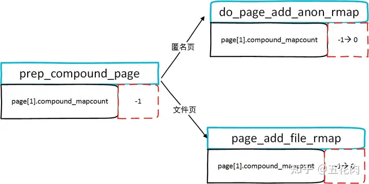
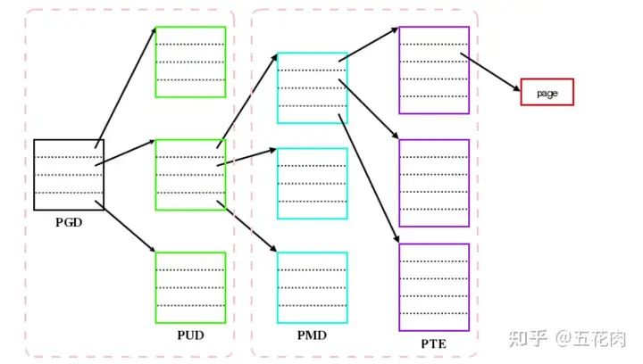
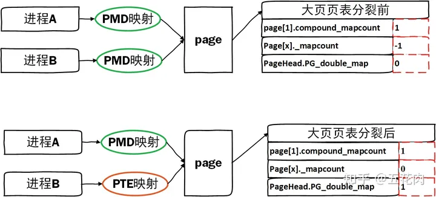
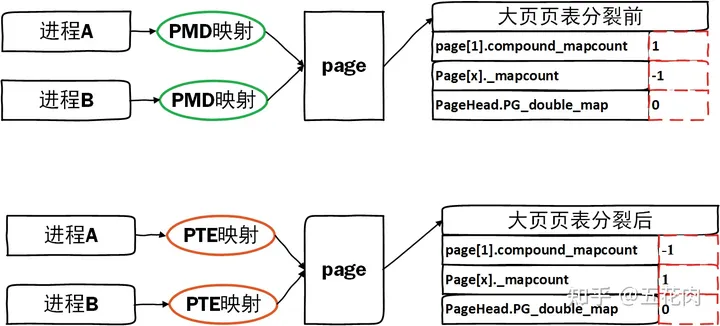
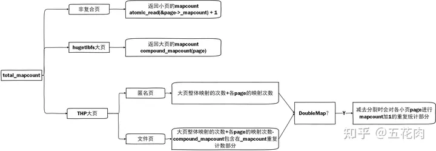

1. 概述
在page结构体中，有_mapcount和_refcount两个成员。_refcount是页面拥有的引用总数，而_mapcount是引用页面的页表数。页表映射也是一个引用， 因此_mapcount中的计数也是_refcount的子集，即_refcount应该大于或等于_mapcount。

_refcount可以超过_mapcount的情况包括：

DMA 映射的页面和使用get_user_pages()之类的函数映射到内核地址空间的页面
使用mlock()将页面锁定到内存中 也会增加_refcount
这两个计数器的相对值很重要；如果_refcount等于_mapcount，则可以对页面进行回收。但如果 _refcount大于_mapcount，则页面被pin住，暂时无法回收。

含义非常简单清晰，但透明大页（THP）功能出现，统计变得错综复杂了。
```c
int total_mapcount(struct page *page)
{
	int i, compound, nr, ret;

	VM_BUG_ON_PAGE(PageTail(page), page);

	if (likely(!PageCompound(page)))
		return atomic_read(&page->_mapcount) + 1;

	compound = compound_mapcount(page);
	nr = compound_nr(page);
	if (PageHuge(page))
		return compound;
	ret = compound;
	for (i = 0; i < nr; i++)
		ret += atomic_read(&page[i]._mapcount) + 1;
	/* File pages has compound_mapcount included in _mapcount */
	if (!PageAnon(page))
		return ret - compound * nr;
	if (PageDoubleMap(page))
		ret -= nr;
	return ret;
}
```
total_mapcount函数统计page总的mapcount， 实现变得如此复杂，就是因为透明大页的加入。本文以此函数为入口理清THP和mapcount错综复杂的关系。

2. compound_mapcount
上面的函数实现， 我们可以看到compound_mapcount。那么这个与THP的关系是什么呢？

```c
static inline atomic_t *compound_mapcount_ptr(struct page *page)
{
	return &page[1].compound_mapcount;
}

static inline int head_compound_mapcount(struct page *head)
{
	return atomic_read(compound_mapcount_ptr(head)) + 1;
}

static inline int compound_mapcount(struct page *page)
{
	VM_BUG_ON_PAGE(!PageCompound(page), page);
	page = compound_head(page);
	return head_compound_mapcount(page);
}
```
compound_mapcount调用compound_head获得复合页的head页，然后获取复合页存在page[1]的compound_mapcount。这个页用于跟踪整个大页的映射状态，即被以整体大页方式映射的进程数。
在复合页初始化的时候，这个值为-1。
```c
void prep_compound_page(struct page *page, unsigned int order)
{
	int i;
	int nr_pages = 1 << order;

	__SetPageHead(page);
	for (i = 1; i < nr_pages; i++) {
		struct page *p = page + i;
		set_page_count(p, 0);
		p->mapping = TAIL_MAPPING;
		set_compound_head(p, page);
	}

	set_compound_page_dtor(page, COMPOUND_PAGE_DTOR);
	set_compound_order(page, order);
	atomic_set(compound_mapcount_ptr(page), -1); //初始值为-1
	if (hpage_pincount_available(page))
		atomic_set(compound_pincount_ptr(page), 0);
}
```
在do_page_add_anon_rmap 中加入反向映射统计时会加1。
```c
void do_page_add_anon_rmap(struct page *page,
	struct vm_area_struct *vma, unsigned long address, int flags)
{
	bool compound = flags & RMAP_COMPOUND;
	bool first;

	if (unlikely(PageKsm(page)))
		lock_page_memcg(page);
	else
		VM_BUG_ON_PAGE(!PageLocked(page), page);

	if (compound) {
		atomic_t *mapcount;
		VM_BUG_ON_PAGE(!PageLocked(page), page);
		VM_BUG_ON_PAGE(!PageTransHuge(page), page);
		mapcount = compound_mapcount_ptr(page);
		first = atomic_inc_and_test(mapcount); //THP大页走到这里，加1
	} else {
		first = atomic_inc_and_test(&page->_mapcount);
	}
。。。
}
```
文件页加到反向映射统计时也会进行加1。
```c
void page_add_file_rmap(struct page *page, bool compound)
{
	int i, nr = 1;

	VM_BUG_ON_PAGE(compound && !PageTransHuge(page), page);
	lock_page_memcg(page);
	if (compound && PageTransHuge(page)) {
		for (i = 0, nr = 0; i < thp_nr_pages(page); i++) {
			if (atomic_inc_and_test(&page[i]._mapcount)) //文件页THP对各page的_mapcount加1
				nr++;
		}
		if (!atomic_inc_and_test(compound_mapcount_ptr(page))) //THP会走到这里+1
			goto out;
		if (PageSwapBacked(page))
			__inc_node_page_state(page, NR_SHMEM_PMDMAPPED);
		else
			__inc_node_page_state(page, NR_FILE_PMDMAPPED);
	} else {
		if (PageTransCompound(page) && page_mapping(page)) {
			VM_WARN_ON_ONCE(!PageLocked(page));

			SetPageDoubleMap(compound_head(page));
			if (PageMlocked(page))
				clear_page_mlock(compound_head(page));
		}
		if (!atomic_inc_and_test(&page->_mapcount))
			goto out;
	}
	__mod_lruvec_page_state(page, NR_FILE_MAPPED, nr);
out:
	unlock_page_memcg(page);
}
```
总结一下， 无论是文件页还是匿名页，只要是以THP大页方式映射到进程空间时，compound_mapcount就会进行计数，可以表示多少以大页整体进行映射进程数。
变化简化如下图：



3. PageDoubleMap
total_mapcount统计中会针对PageDoubleMap进行特殊处理，那么什么是DoubleMap的page呢？
大页在进程的页面中间目录 (PMD) 级别具有单个条目。相反，各个页面在底部页表条目 (PTE) 级别具有条目，如图所示。但是并没有说必须在所有进程中以相同的方式映射相同的内存；一个进程将 2MB 范围视为单个大页面而另一个进程将其映射为 512 个单独的 PTE 是完全合法的。如果支持这种类型的不同映射，一个进程可以调用mprotect()来更改大页面一部分的保护（导致映射在该进程的地址空间中被拆分），同时不会干扰其他进程中的大页面映射，不受保护变化的影响。

PageDoubleMap表示page在有些进程中以PMD级别映射，也在其它进程中以PTE级别映射了。
单独使用PG_double_map位来表示。
```c
static inline int PageDoubleMap(struct page *page)
{
    return PageHead(page) && test_bit(PG_double_map, &page[1].flags);
}
```
__split_huge_pmd_locked函数只会拆分单个进程对大页面的映射，同时保留大页面对其他进程的好处。在拆分进程对大页映射时，如果仍然有其它以大页方式映射的引用计数，即同时存在PMD和PTE级别的映射，就会设置PG_double_map。
```c
static void __split_huge_pmd_locked(struct vm_area_struct *vma, pmd_t *pmd,
		unsigned long haddr, bool freeze)
{
。。。
    //分裂页表时，对引用计数refcount加HPAGE_PMD_NR – 1。释放时以大页释放使用
	page_ref_add(page, HPAGE_PMD_NR - 1);
。。。
	if (!pmd_migration) {
        /*如果compound_mapcount大于1，即还有以大页THP方式映射
        *如果没有设置PageDoubleMap标记，就设置标记
        *同时每个sub page的_mapcount也加1
        */
		if (compound_mapcount(page) > 1 &&
		    !TestSetPageDoubleMap(page)) {
			for (i = 0; i < HPAGE_PMD_NR; i++)
				atomic_inc(&page[i]._mapcount);
		}

		lock_page_memcg(page);
        /* 因为此次分裂大页了，减少了大页方式映射计数，compound_mapcoun减1
* 如果compound_mapcoun减1后是负数，表示没有以大页映射的进程了，就
* 对NR_ANON_THPS的统计进行减少， 如果原来设置了PageDoubleMap，就会
* 清除此标记。因为全都变为PTE小页映射了。同时对sub page进行mapcount
*减1，因为上面进行了+1
*/
		if (atomic_add_negative(-1, compound_mapcount_ptr(page))) {
			/* Last compound_mapcount is gone. */
			__dec_lruvec_page_state(page, NR_ANON_THPS);
			if (TestClearPageDoubleMap(page)) {
				/* No need in mapcount reference anymore */
				for (i = 0; i < HPAGE_PMD_NR; i++)
					atomic_dec(&page[i]._mapcount);
			}
		}
		unlock_page_memcg(page);
	}
。。。
}
```
总结一下： PageDoubleMap表示page同时存在大页PMD映射和小页PTE映射，在PMD页表分裂时如果还有大页映射时会设置此标记。
我们用实例推演一下变化过程。
**实例一：映射page的只有2个进程，使用PMD进行THP映射，其中1个进程发生了页表分裂**

**实例二：映射page的只有2个进程，使用PMD进行THP映射，2个进程都发生了页表分裂**

4. THP的mapcount
回到THP的mapcount计数，我们再次理一下。还是开篇时的total_mapcount。
```c
int total_mapcount(struct page *page)
{
	int i, compound, nr, ret;

	VM_BUG_ON_PAGE(PageTail(page), page);
    //如果不是THP，就直接返回page的_mapcount统计
	if (likely(!PageCompound(page)))
		return atomic_read(&page->_mapcount) + 1;

    //获取page被以THP大页映射的进程数
	compound = compound_mapcount(page);
    //获取THP大页组成的小页数量
	nr = compound_nr(page);
    //如果是hugetlbfs类型的page，由于只存在大页映射的情况，直接返回compound
	if (PageHuge(page))
		return compound;
	ret = compound;
    //大页整体映射的次数加上各page的映射次数
	for (i = 0; i < nr; i++)
		ret += atomic_read(&page[i]._mapcount) + 1;
	/* File pages has compound_mapcount included in _mapcount */
    //文件页的compound_mapcount包含在_mapcount中,减去重复计算部分
	if (!PageAnon(page))
		return ret - compound * nr;
    //如果是DoubleMap的页，由于在分裂时会对各小页page进行mapcount加1， 这里需要减回去
	if (PageDoubleMap(page))
		ret -= nr;
	return ret;
}
```
总结一下,THP的mapcount统计复杂的关系简化如下:



==注意： compound_mapcount与_mapcount在struct page中的偏移不一样，因此互不影响==