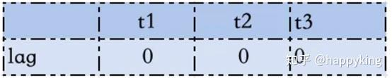

我们都知道Earliest Virtual Deadline First (EEVDF) 已经完全取代 Completely Fair Scheduler (CFS) ，EEVDF总是调度虚拟截止时间最近的任务，而不是虚拟运行时间最小的任务，它考虑了任务对延迟的诉求。

EEVDF是Earliest Eligible Virtual Deadline First的缩写，它同时追求CFS追求的fairness(公平性)，但是也强调 interactivity（交互性）。

EEVDF仍然强调公平，比如5个nice值相同的各跑20%的CPU。但是公平其实可以被另外一种方式来实现，CFS的算法是谁的虚拟运行时间最小，就跑谁（欠谁的钱多，先还谁）；而EEVDF则优先跑虚拟截止时间最小的任务（谁催债催地最急，先还谁。理论上讲，欠的最多的也大抵是催地最急的）。

EEVDF引入的一个新概念叫做“lag”(滞后)，所谓滞后，就是任务还没有收到它理应的配额（比如20%还只跑了15%），只有lag值为正数的任务才是“eligible”（有资格）可以跑的，lag为负数证明那个任务已经跑超过配额了。

lag = 理想情况下应该跑的时间 - 实际跑的时间

假设现在某CPU上面有3个任务在跑CPU-bound的工作，在t0时刻，最开始它们的lag都是0:


现在假设先让t1跑30ms的timeslice，在30ms这个时刻，3个任务的lag将变成：


现在假设我们挑选t2跑30ms的timeslice，在60ms这个时刻，3个任务的lag将变为：


这样看起来，接下来系统会跑lag=20ms的t3。在30ms时刻，t1的lag是-20ms，而在60ms的时刻，t1的lag decay（衰减）到了-10ms，其实再衰减一段时间，它的lag会变成0，t1会再次eligible。

Linux在6.6内核就引入了EEVDF，但是到6.12才宣布“Complete the EEVDF task scheduler”。在6.12的complete patchset[10]中，最主要的一个工作是完善睡眠任务的lag。

EEVDF需要维护lag，来判定一个任务是否eligible。在一个任务进入睡眠后，再次醒来，它前面的lag还在吗？这个时候我们有2个选择：

1. 直接在醒来时候忘记之前的lag，让lag归0，但是这会导致一个前面比如lag为负的任务，通过极其短暂的睡眠再醒来，lag就归0了，于是它可能过度运行；

2. 直接在醒来时候完全采用睡眠之前的lag，但是一个任务睡了一整天，就因为它昨天的lag是负数，今天还要继续惩罚它，似乎也不合理。

我们都知道，当一个任务变成睡眠态的时候，应该执行sched_class的dequeue。而对于EEVDF，Peter采用的渠道是，如果任务的lag为负（它跑超额了，显然也是不eligible），让进入睡眠的任务不直接dequeue；而是进入一个deferred dequeue的状态，在deferred dequeue状态的任务的lag还是会decay(衰减)的。


随着时间的推移，一个lag为负的任务的lag会decay到0，才真正执行dequeue。理论上lag退化0的点就需要dequeue，但是这在实现上比较困难，所以Peter的实现逻辑是workaround的，在deferred dequeue的任务下一次被pick出来的时候dequeue。


/kernel/sched/fair.c

Compute virtual time from the per-task service numbers:
根据任务服务数计算虚拟时间
Fair schedulers conserve lag:
根公平调度器守恒标记为0
  \Sum lag_i = 0      （所有任务服务数相加结果为0）

Where lag_i is given by:每个任务服务数为：

  lag_i = S - s_i = w_i * (V - v_i)
         理想时间 - 实际时间 = 权重 * （理想虚拟时间 - 实际虚拟时间） 
Where S is the ideal service time and V is it's virtual time counterpart.（S是理想服务时间，V是对应的虚拟时间）
Therefore:

  \Sum lag_i = 0
  \Sum w_i * (V - v_i) = 0
  \Sum w_i * V - w_i * v_i = 0

From which we can solve an expression for V in v_i (which we have in se->vruntime):解得虚拟时间V的表达式
```
      \Sum v_i * w_i   \Sum v_i * w_i
  V = -------------- = --------------
         \Sum w_i            W

w1*V - w1*v1 + w2*V - w2*v2 = 0
w1*V + w2*V = w1*v1 + w2*v2
V = (w1*v1 + w2*v2) / (w1 + w2) = (w1*v1 + w2*v2) / (W)
```

Specifically, this is the weighted average of all entity virtual runtimes.
（这是所有实体虚拟运行时间的加权平均值）

[[ NOTE: this is only equal to the ideal scheduler under the condition that join/leave operations happen at lag_i = 0, otherwise the virtual time has non-contiguous motion equivalent to:
只有在任务的加入/离开操作发生时其滞后量 lag_i = 0 的条件下，此时虚拟时间才与理想调度器的情况等同；否则虚拟时间将出现不连续的跳跃运动，具体表现为

	      V ±= lag_i / W

Also see the comment in place_entity() that deals with this. ]]

However, since v_i is u64, and the multiplication could easily overflow transform it into a relative form that uses smaller quantities:
为避免u64类型的v_i在乘法运算时溢出，采用相对值形式
```
Substitute: v_i == (v_i - v0) + v0

    \Sum ((v_i - v0) + v0) * w_i   \Sum (v_i - v0) * w_i
V = ---------------------------- = --------------------- + v0
                 W                            W
```

Which we track using:
```
                   v0 := cfs_rq->min_vruntime
\Sum (v_i - v0) * w_i := cfs_rq->avg_vruntime
             \Sum w_i := cfs_rq->avg_load

V = (cfs_rq->avg_vruntime / cfs_rq->avg_load) +  cfs_rq->min_vruntime
```
```c
/*
 * Specifically: avg_runtime() + 0 must result in entity_eligible() := true
 * For this to be so, the result of this function must have a left bias.
 V（理想vruntime）的计算函数
 */
u64 avg_vruntime(struct cfs_rq *cfs_rq)
{
	struct sched_entity *curr = cfs_rq->curr;
	s64 avg = cfs_rq->avg_vruntime;
	long load = cfs_rq->avg_load;

	if (curr && curr->on_rq) {//若当前有进程在运行，需将当前进程计算在内
		unsigned long weight = scale_load_down(curr->load.weight);

		avg += entity_key(cfs_rq, curr) * weight;
		load += weight;
	}

	if (load) {
		/* sign flips effective floor / ceiling */
		if (avg < 0)
			avg -= (load - 1);
		avg = div_s64(avg, load);
	}

	return cfs_rq->min_vruntime + avg;
}

```

Since min_vruntime is a monotonic increasing variable that closely tracks the per-task service, these deltas: (v_i - v), will be in the order of the maximal (virtual) lag induced in the system due to quantisation.
min_vruntime是单调递增变量，跟踪每个任务服务状态，差值(v_i - v)反映系统量化导致的最大虚拟滞后

Also, we use scale_load_down() to reduce the size.
使用scale_load_down()减小数值规模

As measured, the max (key * weight) value was ~44 bits for a kernel build.
实测内核构建时最大(key * weight)值约44位

```c
 *                    v0 := cfs_rq->min_vruntime   //虚拟时间基点
 * \Sum (v_i - v0) * w_i := cfs_rq->avg_vruntime 	//加权平均虚拟运行时间  //带avg字样的都是虚拟时间与权重的乘积（加权虚拟时间）
 *              \Sum w_i := cfs_rq->avg_load		//总权重
					 v_i := se->vruntime			//虚拟时间（实际时间通过w_i权重缩放后所得）
  /*
se->vruntime 计算在update_curr()中
curr->vruntime += calc_delta_fair(delta_exec, curr);
curr->vruntime += (now - exec_start) * se->load;
  */
V = (cfs_rq->avg_vruntime / cfs_rq->avg_load) +  cfs_rq->min_vruntime	//理想运行时间
				 V - v_i := se->vlag = 		(cfs_rq->avg_vruntime / cfs_rq->avg_load) +  cfs_rq->min_vruntime -	se->vruntime	//理想运行时间与单个任务虚拟运行时间的差值

cfs_rq->avg_vruntime = (V - cfs_rq->min_vruntime) * cfs_rq->avg_load

```
