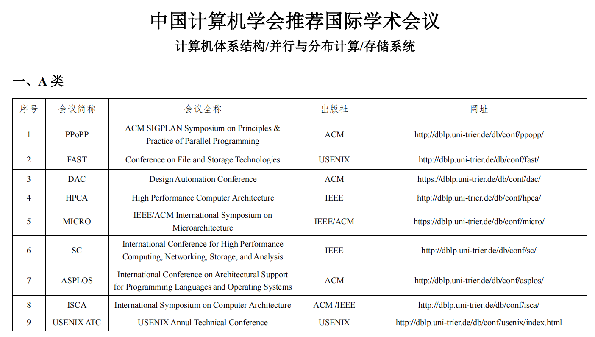

# 计算机体系结构四大顶会

（1）ISCA
ISCA — International Symposium on Computer Architecture 计算机体系架构

体系结构领域的顶级会议，由ACM SIGARCH(计算机系统结构特殊兴趣组)和IEEE TCCA(计算机架构技术委员会)联合举办。ISCA创办于1973 年，历史悠久的老牌体系结构顶会，在计算机领域的各种应用和人才遍地开花、大数据与深度学习引发新的发展浪潮的当代，其规模也有所扩大 。

ISCA是CCF 推荐A类会议，Core Conference Ranking推荐A*类会议，H5 index为56。ISCA是计算机系统结构领域最顶级的会议之一，包括谷歌、英特尔、英伟达等企业在ISCA上发表的多项研究成果都已在半导体行业广泛应用。

官网：Welcome to Iscaconf.org

（2）HPCA
HPCA — International Symposium on High-Performance Computer Architecture 高性能计算机架构

是体系结构/高性能计算领域最重要的学术会议之一，基本上都是最顶尖的研究小组在上面发文章。HPCA为CCF A类，Core Conference Ranking A*类会议，H-5指数53，Impace Score 6.93，录取率常年在20%左右。该会议历史悠久，几十年的举办历史中，国内只13年在深圳举办一次，绝大多数举办地在美国。

官网：IEEE Symposium on High Performance Computer Architecture (hpca-conf.org)

（3）MICRO
MICRO — IEEE/ACM International Symposium on Microarchitecture 微架构

介绍和讨论微体系结构、编译器、硬件/软件接口以及高级计算和通信系统设计的主要论坛。MICRO是CCF A类会议，H5指数45，Impact Score高达6.76，在体系结构领域具有极高的评价。MICRO的目标是将微体系结构、编译器和系统领域的研究人员聚集在一起进行技术交流。

官网：MICRO: Home (microarch.org)

（4）ASPLOS
ASPLOS — International Conference on Architectural Support for Programming Languages and OperatingSystems 编程语言和操作系统的体系结构支持国际会议

ASPLOS是计算机系统领域的顶级国际会议，涉及体系结构、编程语言和操作系统等多个方向，尤其重视不同方向之间的交叉，该会议曾推动了多核处理器、虚拟化、RAID、RISC、深度学习处理器等计算机系统领域的核心创新，在学术和工业界都有巨大的影响力。从1982年创办至今的三十多年里，ASPLOS推动了多项计算机系统技术的发展，包括（但不限于）RISC、RAID、大规模多处理器、Cluster架构和网络存储等。 

官网：ASPLOS 2023 – Vancouver, Canada — March 25-29, 2023 (asplos-conference.org)

 

