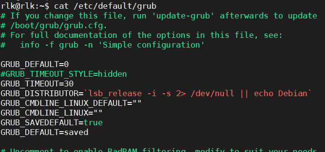

- **卸载内核**

删除`/boot`下的内核相关文件后`sudo grub-mkconfig -o /boot/grub/grub.cfg`重新生成grub引导菜单

- **解决内核编译后initrd过大导致引导时加载时间过长的问题**

编辑/etc/initramfs-tools/initramfs.conf文件，将"MODULES=most"改为"MODULES=dep"，然后执行"sudo update-initramfs -u"更新initrd文件。

MODULES选项默认是most，在生成initramfs时会把所有驱动都加载进去，这样会导致initrd文件过大，引导时花费很多时间。将其改为dep后，生成initrd时将只加载需要的驱动，这样生成的initrd会小很多。

- **编译时提示证书问题**

编译时提示：

make[1]: *** No rule to make target debian/canonical-certs.pem, needed by certs/x509_certificate_list. Stop.

解决方法：

将.config文件中的

CONFIG_SYSTEM_TRUSTED_KEYS="debian/canonical-certs.pem"

给注释掉。

- **ubuntu选择启动内核版本**

sudo vim /etc/default/grub

