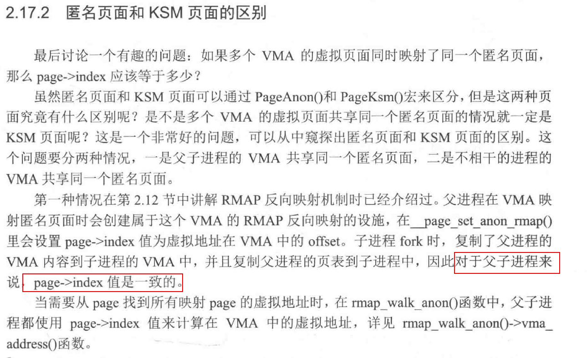
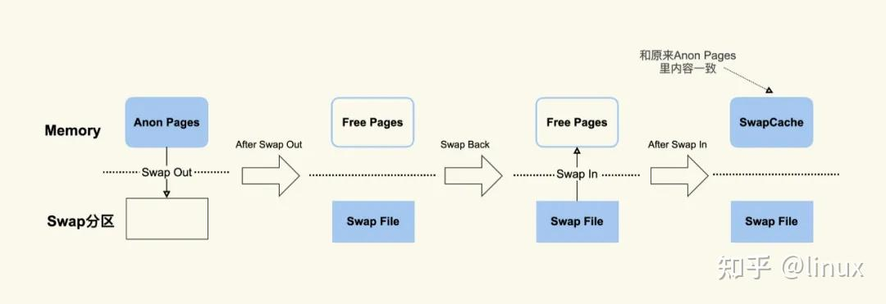

1KB = 1 << 10 = 2^10

4KB = 1 << 12 = 2 ^12

1MB = 1 << 20 = 2^20

1GB = 1 << 30 = 2^30

- WRITE_ONCE

为什么要用READ_ONCE()和WRITE_ONCE()这两个宏呢？ 这里起到关键作用的就是 volatile ，它主要告诉编译器：

1、声明这个变量很重要，不要把它当成一个普通的变量，做出错误的优化。

2、保证 CPU 每次都从内存重新读取变量的值，而不是用寄存器中暂存的值。

因为在 多线程/多核 环境中，不会被当前线程修改的变量，可能会被其他的线程修改，从内存读才可靠。

还有一部分原因是，这两个宏可以作为标记，提醒编程人员这里面是一个多核/多线程共享的变量，必要的时候应该加互斥锁来保护。

- VM_WARN_ON_ONCE     WARN_ON

判读指针是否为NULL   不为空输出告警打印  只打印一次警告再次触发不打印

- container_of(ptr, type, member)  

type结构体里包含member成员，现在知道member成员的地址为ptr，返回结构体type的地址

- static_branch_likely

减小分支预测失败的损耗，相当于if（true），  if（false）

- lockdep_assert_held(&mm_list->lock);

```c
lockdep_assert(lockdep_is_held(&mm_list->lock) != LOCK_STATE_NOT_HELD)
lockdep_assert(lock_is_held(&(&mm_list->lock)->dep_map) != LOCK_STATE_NOT_HELD)
static inline int lock_is_held(const struct lockdep_map *lock)
{
 return lock_is_held_type(lock, -1);
 两种种返回值 LOCK_STATE_HELD
 LOCK_STATE_NOT_HELD
}
lockdep_assert(返回值 != LOCK_STATE_NOT_HELD)
do { WARN_ON(debug_locks && !(返回值 != LOCK_STATE_NOT_HELD)); } while (0)
debug_locks使能，并且返回值 == LOCK_STATE_NOT_HELD （WARN_ON（1））输出警告
当mm_list->lock没有被持有时，输出警告
```

- pud_leaf  

测试pud是否为块类型的也表项，测试该表项bit0和bit1，返回1表示该表项直接指向物理地址  返回0表示该表项指向下一级页表

- cmpxchg(void *ptr, unsigned long old, unsigned long new);

函数完成的功能是：将old和ptr指向的内容比较，如果相等，则将new写入到ptr中，返回old，如果不相等，则返回ptr指向的内容。

- try_to_unmap和remove_mapping

try_to_unmap是解除PTE与page的映射关系

remove_mapping：page->mapping成员指向adress_space（文件映射）或者anon_vma（匿名映射），remove_mapping找到对应结构体，修改里边的page节点

- vma_address

通过struct page和VMA获取该page的虚拟地址



- kmap_atomic与kumap_atomic

遍历PTE时候会调用这俩个函数，似乎是在申请highr_mem内存，临时存放PTE

GFP_ATOMIC

我们都知道，在中断、软中断、spinlock 等原子上下文里面，申请内存，应该使用 GFP_ATOMIC 标记与GFP_KERNEL相比，

GFP_ATOMIC 不会进入睡眠，而GFP_KERNEL在内存紧张时可能会进入慢速路径触发页回收，有可能睡眠

- page_cache和swap_cache

page_cache是读取1K文件时，系统实际会读取出更多，缓存下来，系统通过文件系统读取出来的文件数据叫pagecache

swap_cache是匿名页面交换到swap分区，又被再次读取回来后，叫swapcache（以文件形式存在？？？）

Buffers + Cached + SwapCached = Active(file) + Inactive(file) + Shmem + SwapCached 两边都是pagecache

Page Cache = Buffers + Cached + SwapCached



- PG_ GFP_ PF_三种开头的标志

PG_ 是page的属性，page->flag用

GFP_ 是内存分配或回收的动作标志，内存分配的接口用

PF_ 是进程标记 task_struct->flags用

- cgroup的default hierarchy 和 subsystem之间的关系

- cond_resched

在可抢占内核中，在内核态有很多抢占点，在有高优先级的进程需要运行时，就会在抢占点到来时执行抢占；

而在内核不可抢占系统中(如centos系统)，在内核态运行的程序可调用cond_resched主动让出cpu，防止其在内核态执行时间过长导致可能发生的soft lockup或者造成较大的调度延迟

- spin_lock_irqsave

spin_lock比spin_lock_irq速度快，但是它并不是任何情况下都是安全的。在使用spin_lock时要明确知道该锁不会在中断处理程序中使用。

spin_lock_irq在自旋的时候，不会保存当前的中断标志寄存器，只会在自旋结束后，将之前的中断打开。

spin_lock_irqsave在锁返回时，之前开的中断，之后也是开的；之前关，之后也是关。但是spin_lock_irq则不管之前的开还是关，返回时都是开的。

spin_lock_irq 和 spin_unlock_irq, 如果你确定在获取锁之前本地中断是开启的，那么就不需要保存中断状态，解锁的时候直接将本地中断启用就可以了。

spin_lock和spin_lock_irq在特殊情况下会导致死锁，spin_lock_irqsave是最安全的

- 系统hibernate与suspend

hibernate 将 全部的内容放到了swap交换分区里面，然后断电关机，原来的工作会保留，但开机会很慢，因为占用了swap 可用 swapoff -a 还原否则会很卡，这个过程会很慢，因为他要将全部放到swap里面，然后恢复直接 电源键，指示灯不会亮，不会耗电

suspend 暂停 将内容放到了 内存中，恢复会很快，直接按键space即可恢复，会在后台一直耗电，所以得一直插着电，电脑指示灯会一直亮着

power off直接关机，不会保留原来的工作

- 内核线程不响应信号

内核进程是不响应信号的，除非它刻意的去查询。所以通常情况下无法通过kill命令去杀死一个内核进程

- 查看进程使用的内存

cat /proc/pid/status其中VMRSS为进程使用内存（包含共享内存）

top -P pid，其中RSS为进程当前使用的内存

- vmalloc与kmap的区别

1，vmalloc首先申请物理页面（页面可能来自HIGHMEM），然后将物理页面映射到内核临时映射区（malloc区），kmap不会申请物理页面，而是将给定的物理页面(来自HIGHMEM的物理页面)，

映射到固定映射区（kmap区，也叫pkmap区）

2，调用vmalloc是用户无法对给定的物理页面建立映射，

3，kmap应用场景，在软件遍历页表是，PMD里存储着PTE页表的物理地址，但内核无法直接访问物理地址，使用kmap对这个给定的page做映射，返回虚拟地址

- 判断VMA是匿名映射，共享匿名映射

```c
bool vma_is_anon_shmem(struct vm_area_struct *vma)
{
    return vma->vm_ops == &shmem_anon_vm_ops;
}

bool vma_is_shmem(struct vm_area_struct *vma)
{
    return vma_is_anon_shmem(vma) || vma->vm_ops == &shmem_vm_ops;
}
static inline bool vma_is_anonymous(struct vm_area_struct *vma)
{
    return !vma->vm_ops;
}
```

- 内核访问用户空间页面

1，copy_from_user

2，获取页面的struct page， kmap_atomic映射一个内核地址， 访问完后kunmap_atomic释放掉

- 内核vmalloc区虚拟地址用完

vmalloc虚拟地址用完后，即使物理内存充足，也无法分配成功

- MAP_SHARED和MAP_PRIVATE区别

1,这两个是mmap系统调用的参数

2，MAP_SHARED向映射后的地址写数据会被其他进程观察到，而MAP_PRIVATE会建立一个写时复制的映射，向映射后的地址写数据不会被其他进程观察到

3，MAP_SHARED修改后的内容会同步到磁盘文件， MAP_PRIVATE修改后也不会同步到磁盘中。

- 为什么剩余内存在low水位之上就发生了OOM

1，/proc/sys/vm/watermark_boost_factor会临时提高水位

2，同理理解/proc/sys/vm/watermark_scale_factor的作用

- mTHP与复合页相比，优化点在哪？

1，减少TLBmiss，部分硬件支持 contiguous PTE 映射，比如 ARM64 可以让 16 个连续的 page 通过 CONT-PTE 只占一个 TLB entry

2，减少page fault，在缺页中断中直接申请一个mTHP的页，而不是只申请1个页

3，降低 LRU 的规模和内存 reclamation 的成本，以 large folio 为单位进行回收，整个 large folio 在 folio_referenced() 等的反向映射成本低于多个 small folio 单独进行 rmap 的成本；try_to_unmap_one() 理论上也如此

4，以mTHP整体swapout 和swapin，或整体zram压缩，不再split成小页

- ACPI是什么
ACPI（高级配置与电源管理接口Advanced Configuration and Power Management Interface），是一种用于操作系统中的电源管理和硬件配置的标准。ACPI是操作系统用来获取系统硬件信息的和配置信息的一种数据结构。